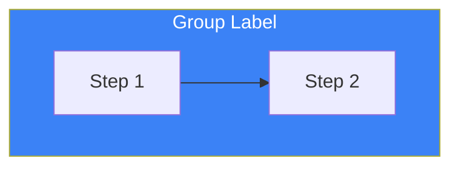
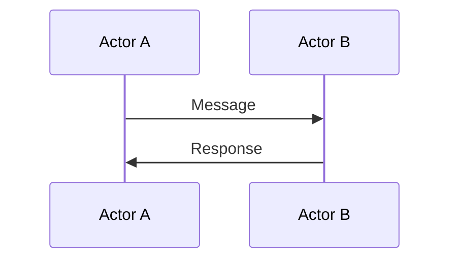

# shunku.net Project Guidelines

## Overview

shunku.net is a multilingual personal blog and book publishing site built with Next.js 15.

## Blog Article Creation Process

### 1. Research Phase

Before writing articles, research the topic thoroughly:

**Web Search**
```
WebSearch for "[topic] documentation 2025" or "[topic] best practices"
```

**O'Reilly Books**
```bash
# Search for relevant books
oreilly search "topic keywords"

# Get table of contents
oreilly toc ISBN --show-href

# Read specific chapters
oreilly page ISBN chapter.html
```

### 2. Article Planning

When planning multiple articles:
- Create a numbered list of article topics
- Let the user choose which articles to write
- Use TodoWrite to track progress across articles

### 3. Article Structure

**File Location**
```
content/blog/en/[slug].md  # English version
content/blog/ja/[slug].md  # Japanese version
```

**Frontmatter Format**
```yaml
---
title: "Article Title Here"
date: "YYYY-MM-DD"
excerpt: "A concise description of the article content for previews."
tags: ["Tag1", "Tag2", "Tag3"]
author: "Shunku"
---
```

**Content Guidelines**
- Start with an introduction explaining the problem/context
- Use clear section headers (##, ###)
- Include code examples with proper syntax highlighting
- Add Mermaid diagrams where visual explanation helps
- End with a summary table and key principles
- Include references/sources at the bottom

### 4. Mermaid Diagrams

Use Mermaid for visual explanations:

**Flowchart**


**Sequence Diagram**


**Color Palette**
- Blue: `#3b82f6`
- Purple: `#8b5cf6`
- Green: `#22c55e`
- Orange: `#f59e0b`
- Red: `#ef4444`

### 5. Writing Style

- **Conceptual focus**: Explain the "why" before the "how"
- **Practical examples**: Include real-world use cases
- **Tables for comparison**: Use tables to summarize key points
- **Avoid over-documentation**: Keep content focused and actionable

### 6. Language Versions

Always create both English and Japanese versions:
- Write the Japanese version first (if user communicates in Japanese)
- Content should be equivalent but natural in each language
- Don't translate literally - adapt to each language's conventions

### 7. Commit and Deploy

After writing articles:

```bash
# Stage and commit
git add content/blog/en/*.md content/blog/ja/*.md
git commit -m "Add [N] [topic] blog articles"

# Push to remote
git push origin main

# Verify Vercel deployment
vercel ls --yes
```

**Commit Message Format**
- English only
- No "Generated with..." or "Claude" references
- Descriptive of content added

## Code Style

- Comments in English only
- Use TypeScript strict mode
- Follow existing patterns in the codebase

## Development Commands

```bash
npm run dev          # Start development server
npm run build        # Production build
npm run test         # Run tests
npm run lint         # Run ESLint
```
