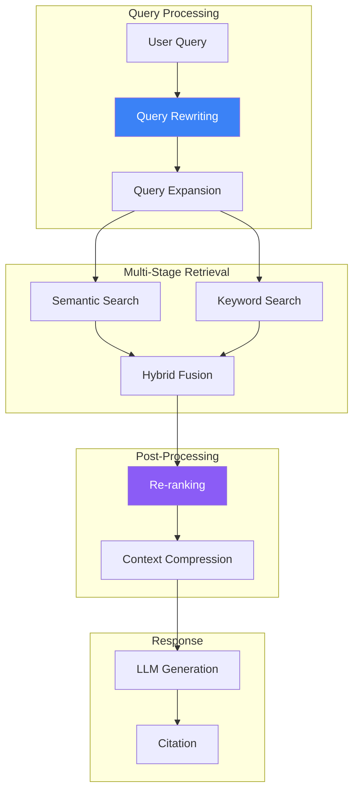

Advanced RAG (Retrieval-Augmented Generation) patterns go beyond simple vector search to improve retrieval quality, relevance, and response accuracy. This article covers techniques to build production-grade RAG systems with Amazon Bedrock.

## Advanced RAG Architecture



## Query Rewriting

### HyDE (Hypothetical Document Embeddings)

```python
import boto3
import json

runtime = boto3.client('bedrock-runtime')
bedrock_agent = boto3.client('bedrock-agent-runtime')

def generate_hypothetical_document(query: str) -> str:
    """Generate a hypothetical answer to use for retrieval."""
    response = runtime.converse(
        modelId='anthropic.claude-3-haiku-20240307-v1:0',
        messages=[{
            'role': 'user',
            'content': [{
                'text': f"""Write a detailed paragraph that would be a perfect answer to this question: {query}

Write as if this is from a technical document. Do not include any preamble."""
            }]
        }],
        inferenceConfig={'maxTokens': 300}
    )
    return response['output']['message']['content'][0]['text']

def hyde_retrieval(query: str, knowledge_base_id: str) -> list:
    # Generate hypothetical document
    hypothetical_doc = generate_hypothetical_document(query)

    # Use hypothetical document for retrieval
    response = bedrock_agent.retrieve(
        knowledgeBaseId=knowledge_base_id,
        retrievalQuery={'text': hypothetical_doc},
        retrievalConfiguration={
            'vectorSearchConfiguration': {
                'numberOfResults': 5
            }
        }
    )

    return response['retrievalResults']
```

### Query Expansion

```python
def expand_query(query: str) -> list:
    """Generate multiple query variations."""
    response = runtime.converse(
        modelId='anthropic.claude-3-haiku-20240307-v1:0',
        messages=[{
            'role': 'user',
            'content': [{
                'text': f"""Generate 3 alternative phrasings for this search query. Return only the queries, one per line.

Original query: {query}"""
            }]
        }],
        inferenceConfig={'maxTokens': 200}
    )

    variations = response['output']['message']['content'][0]['text'].strip().split('\n')
    return [query] + [v.strip() for v in variations if v.strip()]

def multi_query_retrieval(query: str, knowledge_base_id: str) -> list:
    queries = expand_query(query)
    all_results = []
    seen_ids = set()

    for q in queries:
        response = bedrock_agent.retrieve(
            knowledgeBaseId=knowledge_base_id,
            retrievalQuery={'text': q},
            retrievalConfiguration={
                'vectorSearchConfiguration': {'numberOfResults': 3}
            }
        )

        for result in response['retrievalResults']:
            result_id = result['location']['s3Location']['uri']
            if result_id not in seen_ids:
                seen_ids.add(result_id)
                all_results.append(result)

    return all_results
```

## Hybrid Search

### Combining Semantic and Keyword Search

```python
from opensearchpy import OpenSearch

class HybridSearchRetriever:
    def __init__(self, opensearch_host: str, index_name: str, knowledge_base_id: str):
        self.os_client = OpenSearch(
            hosts=[opensearch_host],
            use_ssl=True
        )
        self.index_name = index_name
        self.knowledge_base_id = knowledge_base_id
        self.bedrock_agent = boto3.client('bedrock-agent-runtime')

    def keyword_search(self, query: str, k: int = 5) -> list:
        """BM25 keyword search."""
        response = self.os_client.search(
            index=self.index_name,
            body={
                'query': {
                    'multi_match': {
                        'query': query,
                        'fields': ['content', 'title^2'],
                        'type': 'best_fields'
                    }
                },
                'size': k
            }
        )
        return [hit['_source'] for hit in response['hits']['hits']]

    def semantic_search(self, query: str, k: int = 5) -> list:
        """Vector semantic search via Knowledge Bases."""
        response = self.bedrock_agent.retrieve(
            knowledgeBaseId=self.knowledge_base_id,
            retrievalQuery={'text': query},
            retrievalConfiguration={
                'vectorSearchConfiguration': {'numberOfResults': k}
            }
        )
        return response['retrievalResults']

    def hybrid_search(self, query: str, k: int = 5,
                     semantic_weight: float = 0.7) -> list:
        """Combine keyword and semantic search with RRF."""
        keyword_results = self.keyword_search(query, k * 2)
        semantic_results = self.semantic_search(query, k * 2)

        # Reciprocal Rank Fusion
        rrf_scores = {}
        rrf_k = 60  # RRF constant

        for rank, result in enumerate(keyword_results):
            doc_id = result.get('id', str(result))
            rrf_scores[doc_id] = rrf_scores.get(doc_id, 0) + (1 - semantic_weight) / (rrf_k + rank + 1)

        for rank, result in enumerate(semantic_results):
            doc_id = result['location']['s3Location']['uri']
            rrf_scores[doc_id] = rrf_scores.get(doc_id, 0) + semantic_weight / (rrf_k + rank + 1)

        # Sort by RRF score and return top k
        sorted_docs = sorted(rrf_scores.items(), key=lambda x: x[1], reverse=True)
        return sorted_docs[:k]
```

## Re-ranking

### LLM-based Re-ranking

```python
def rerank_with_llm(query: str, documents: list, top_k: int = 3) -> list:
    """Re-rank documents using LLM scoring."""

    # Format documents for scoring
    doc_list = "\n".join([
        f"[{i+1}] {doc['content']['text'][:500]}"
        for i, doc in enumerate(documents)
    ])

    response = runtime.converse(
        modelId='anthropic.claude-3-haiku-20240307-v1:0',
        messages=[{
            'role': 'user',
            'content': [{
                'text': f"""Given the query and documents below, rank the documents by relevance to the query.
Return only the document numbers in order of relevance, comma-separated.

Query: {query}

Documents:
{doc_list}

Most relevant to least relevant (numbers only):"""
            }]
        }],
        inferenceConfig={'maxTokens': 50}
    )

    # Parse ranking
    ranking_text = response['output']['message']['content'][0]['text']
    rankings = [int(x.strip()) - 1 for x in ranking_text.split(',') if x.strip().isdigit()]

    # Reorder documents
    reranked = [documents[i] for i in rankings if i < len(documents)]
    return reranked[:top_k]
```

### Cross-Encoder Re-ranking

```python
def cross_encoder_rerank(query: str, documents: list, top_k: int = 3) -> list:
    """Score each query-document pair independently."""
    scored_docs = []

    for doc in documents:
        response = runtime.converse(
            modelId='anthropic.claude-3-haiku-20240307-v1:0',
            messages=[{
                'role': 'user',
                'content': [{
                    'text': f"""Rate the relevance of this document to the query on a scale of 0-10.
Return only the number.

Query: {query}
Document: {doc['content']['text'][:1000]}

Relevance score:"""
                }]
            }],
            inferenceConfig={'maxTokens': 10}
        )

        try:
            score = float(response['output']['message']['content'][0]['text'].strip())
        except ValueError:
            score = 0

        scored_docs.append((doc, score))

    # Sort by score
    scored_docs.sort(key=lambda x: x[1], reverse=True)
    return [doc for doc, _ in scored_docs[:top_k]]
```

## Context Compression

### Extractive Compression

```python
def compress_context(query: str, documents: list, max_tokens: int = 2000) -> str:
    """Extract only relevant portions of documents."""

    combined_text = "\n\n---\n\n".join([
        doc['content']['text'] for doc in documents
    ])

    response = runtime.converse(
        modelId='anthropic.claude-3-sonnet-20240229-v1:0',
        messages=[{
            'role': 'user',
            'content': [{
                'text': f"""Extract only the sentences and paragraphs from the following documents that are directly relevant to answering this question: {query}

Preserve exact wording. Do not summarize or paraphrase. Include source markers.

Documents:
{combined_text}

Relevant excerpts:"""
            }]
        }],
        inferenceConfig={'maxTokens': max_tokens}
    )

    return response['output']['message']['content'][0]['text']
```

## Multi-Step Retrieval

### Iterative Retrieval

```python
def iterative_retrieval(query: str, knowledge_base_id: str, max_iterations: int = 3) -> dict:
    """Iteratively retrieve and refine based on gaps."""

    all_context = []
    current_query = query

    for iteration in range(max_iterations):
        # Retrieve
        response = bedrock_agent.retrieve(
            knowledgeBaseId=knowledge_base_id,
            retrievalQuery={'text': current_query},
            retrievalConfiguration={
                'vectorSearchConfiguration': {'numberOfResults': 3}
            }
        )

        new_context = [r['content']['text'] for r in response['retrievalResults']]
        all_context.extend(new_context)

        # Check if we have enough information
        check_response = runtime.converse(
            modelId='anthropic.claude-3-haiku-20240307-v1:0',
            messages=[{
                'role': 'user',
                'content': [{
                    'text': f"""Given this context, can you fully answer the question: {query}

Context: {' '.join(all_context)}

If yes, respond "SUFFICIENT". If no, respond with what additional information is needed."""
                }]
            }],
            inferenceConfig={'maxTokens': 100}
        )

        check_text = check_response['output']['message']['content'][0]['text']

        if 'SUFFICIENT' in check_text.upper():
            break

        # Refine query for next iteration
        current_query = f"{query} Additional context needed: {check_text}"

    return {
        'context': all_context,
        'iterations': iteration + 1
    }
```

## Complete Advanced RAG Pipeline

```python
class AdvancedRAGPipeline:
    def __init__(self, knowledge_base_id: str):
        self.knowledge_base_id = knowledge_base_id
        self.runtime = boto3.client('bedrock-runtime')
        self.bedrock_agent = boto3.client('bedrock-agent-runtime')

    def process_query(self, query: str) -> str:
        # Step 1: Query expansion
        expanded_queries = self._expand_query(query)

        # Step 2: Multi-query retrieval
        all_results = []
        for q in expanded_queries:
            results = self._retrieve(q)
            all_results.extend(results)

        # Step 3: Deduplicate
        unique_results = self._deduplicate(all_results)

        # Step 4: Re-rank
        reranked = self._rerank(query, unique_results)

        # Step 5: Compress context
        compressed = self._compress(query, reranked)

        # Step 6: Generate response
        response = self._generate(query, compressed)

        return response

    def _expand_query(self, query: str) -> list:
        response = self.runtime.converse(
            modelId='anthropic.claude-3-haiku-20240307-v1:0',
            messages=[{
                'role': 'user',
                'content': [{'text': f"Generate 2 alternative search queries for: {query}\nReturn only queries, one per line."}]
            }],
            inferenceConfig={'maxTokens': 100}
        )
        variations = response['output']['message']['content'][0]['text'].strip().split('\n')
        return [query] + [v.strip() for v in variations[:2]]

    def _retrieve(self, query: str) -> list:
        response = self.bedrock_agent.retrieve(
            knowledgeBaseId=self.knowledge_base_id,
            retrievalQuery={'text': query},
            retrievalConfiguration={'vectorSearchConfiguration': {'numberOfResults': 5}}
        )
        return response['retrievalResults']

    def _deduplicate(self, results: list) -> list:
        seen = set()
        unique = []
        for r in results:
            uri = r['location']['s3Location']['uri']
            if uri not in seen:
                seen.add(uri)
                unique.append(r)
        return unique

    def _rerank(self, query: str, results: list) -> list:
        if len(results) <= 3:
            return results

        doc_list = "\n".join([f"[{i+1}] {r['content']['text'][:300]}" for i, r in enumerate(results[:10])])

        response = self.runtime.converse(
            modelId='anthropic.claude-3-haiku-20240307-v1:0',
            messages=[{'role': 'user', 'content': [{'text': f"Rank by relevance to '{query}':\n{doc_list}\nReturn numbers only, comma-separated:"}]}],
            inferenceConfig={'maxTokens': 30}
        )

        rankings = [int(x.strip())-1 for x in response['output']['message']['content'][0]['text'].split(',') if x.strip().isdigit()]
        return [results[i] for i in rankings[:5] if i < len(results)]

    def _compress(self, query: str, results: list) -> str:
        context = "\n\n".join([r['content']['text'] for r in results])
        if len(context) < 3000:
            return context

        response = self.runtime.converse(
            modelId='anthropic.claude-3-haiku-20240307-v1:0',
            messages=[{'role': 'user', 'content': [{'text': f"Extract relevant parts for '{query}':\n{context}"}]}],
            inferenceConfig={'maxTokens': 1500}
        )
        return response['output']['message']['content'][0]['text']

    def _generate(self, query: str, context: str) -> str:
        response = self.runtime.converse(
            modelId='anthropic.claude-3-sonnet-20240229-v1:0',
            messages=[{'role': 'user', 'content': [{'text': f"Context:\n{context}\n\nQuestion: {query}\n\nAnswer based on the context:"}]}],
            inferenceConfig={'maxTokens': 1024}
        )
        return response['output']['message']['content'][0]['text']

# Usage
pipeline = AdvancedRAGPipeline('your-knowledge-base-id')
answer = pipeline.process_query("What are the best practices for error handling?")
```

## Best Practices

| Technique | When to Use |
|-----------|-------------|
| Query expansion | Ambiguous or short queries |
| HyDE | Technical/domain-specific queries |
| Hybrid search | Mixed keyword/semantic needs |
| Re-ranking | Large result sets |
| Context compression | Token limit constraints |

## Key Takeaways

1. **Query preprocessing** - Expand and rewrite queries for better retrieval
2. **Hybrid search** - Combine semantic and keyword search
3. **Re-ranking** - Use LLM to improve result ordering
4. **Context optimization** - Compress to fit token limits
5. **Iterative retrieval** - Refine based on information gaps

## References

- [Knowledge Bases](https://docs.aws.amazon.com/bedrock/latest/userguide/knowledge-base.html)
- [Advanced RAG Patterns](https://docs.aws.amazon.com/bedrock/latest/userguide/kb-chunking-parsing.html)
