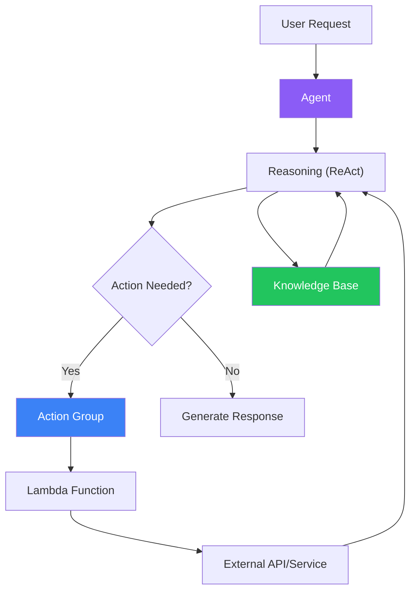
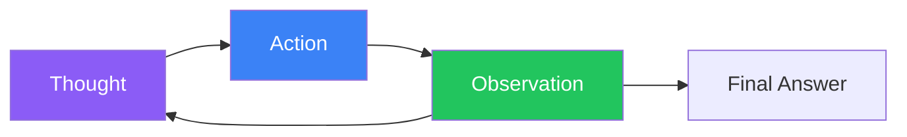

Amazon Bedrock Agents enable you to build AI applications that can reason, plan, and take actions. Agents orchestrate between foundation models, knowledge bases, and external APIs to complete complex tasks.

## How Agents Work



## Agent Components

| Component | Description |
|-----------|-------------|
| Foundation Model | Brain of the agent (Claude, Titan) |
| Instructions | System prompt defining behavior |
| Action Groups | Tools the agent can use |
| Knowledge Bases | Data sources for RAG |

## Creating an Agent

### Console Setup

1. Amazon Bedrock → Agents → Create agent
2. Configure agent details:
   - Name and description
   - Foundation model
   - Instructions

### Using SDK

```python
import boto3

client = boto3.client('bedrock-agent')

# Create agent
response = client.create_agent(
    agentName='customer-service-agent',
    foundationModel='anthropic.claude-3-sonnet-20240229-v1:0',
    instruction="""You are a helpful customer service agent.
You can:
- Look up order status
- Process returns
- Answer product questions

Always be polite and helpful. If you cannot help, escalate to a human agent.""",
    idleSessionTTLInSeconds=1800
)

agent_id = response['agent']['agentId']
```

## Action Groups

Action groups define tools the agent can use to interact with external systems.

### Creating an Action Group

```python
# Create action group with Lambda
response = client.create_agent_action_group(
    agentId=agent_id,
    agentVersion='DRAFT',
    actionGroupName='order-management',
    actionGroupExecutor={
        'lambda': 'arn:aws:lambda:us-east-1:123456789012:function:order-handler'
    },
    apiSchema={
        'payload': '''
openapi: 3.0.0
info:
  title: Order Management API
  version: 1.0.0
paths:
  /orders/{orderId}:
    get:
      operationId: getOrderStatus
      summary: Get order status
      parameters:
        - name: orderId
          in: path
          required: true
          schema:
            type: string
      responses:
        200:
          description: Order details
  /returns:
    post:
      operationId: createReturn
      summary: Create a return request
      requestBody:
        required: true
        content:
          application/json:
            schema:
              type: object
              properties:
                orderId:
                  type: string
                reason:
                  type: string
      responses:
        200:
          description: Return created
'''
    }
)
```

### Lambda Function for Action Group

```python
import json

def lambda_handler(event, context):
    agent = event['agent']
    action_group = event['actionGroup']
    api_path = event['apiPath']
    http_method = event['httpMethod']
    parameters = event.get('parameters', [])
    request_body = event.get('requestBody', {})

    # Route to appropriate handler
    if api_path == '/orders/{orderId}' and http_method == 'GET':
        order_id = next(p['value'] for p in parameters if p['name'] == 'orderId')
        result = get_order_status(order_id)
    elif api_path == '/returns' and http_method == 'POST':
        body = request_body.get('content', {}).get('application/json', {})
        result = create_return(body.get('properties', {}))
    else:
        result = {'error': 'Unknown action'}

    return {
        'messageVersion': '1.0',
        'response': {
            'actionGroup': action_group,
            'apiPath': api_path,
            'httpMethod': http_method,
            'httpStatusCode': 200,
            'responseBody': {
                'application/json': {
                    'body': json.dumps(result)
                }
            }
        }
    }

def get_order_status(order_id):
    # Implement order lookup
    return {
        'orderId': order_id,
        'status': 'shipped',
        'estimatedDelivery': '2025-01-20'
    }

def create_return(properties):
    # Implement return creation
    return {
        'returnId': 'RET-123',
        'status': 'pending'
    }
```

## Connecting Knowledge Bases

```python
# Associate knowledge base with agent
response = client.associate_agent_knowledge_base(
    agentId=agent_id,
    agentVersion='DRAFT',
    knowledgeBaseId='KB_ID',
    description='Product documentation and FAQ'
)
```

## Preparing and Invoking Agents

### Prepare Agent

```python
# Prepare agent for use
client.prepare_agent(agentId=agent_id)

# Create alias for production
response = client.create_agent_alias(
    agentId=agent_id,
    agentAliasName='production'
)
alias_id = response['agentAlias']['agentAliasId']
```

### Invoke Agent

```python
runtime_client = boto3.client('bedrock-agent-runtime')

def invoke_agent(session_id: str, prompt: str):
    response = runtime_client.invoke_agent(
        agentId=agent_id,
        agentAliasId=alias_id,
        sessionId=session_id,
        inputText=prompt
    )

    # Process streaming response
    result = ""
    for event in response['completion']:
        if 'chunk' in event:
            result += event['chunk']['bytes'].decode()

    return result

# Use the agent
session_id = "user-123-session"
response = invoke_agent(session_id, "What's the status of order ORD-456?")
print(response)
```

## ReAct Framework

Agents use ReAct (Reasoning + Acting) to solve problems:



### Example ReAct Trace

```
User: What's my order status for ORD-789?

Thought: I need to look up the order status for ORD-789.
Action: getOrderStatus(orderId="ORD-789")
Observation: {"orderId": "ORD-789", "status": "shipped", "estimatedDelivery": "2025-01-20"}

Thought: I have the order information. The order has shipped.
Final Answer: Your order ORD-789 has shipped and is estimated to arrive on January 20, 2025.
```

## Advanced Configuration

### Session Attributes

```python
response = runtime_client.invoke_agent(
    agentId=agent_id,
    agentAliasId=alias_id,
    sessionId=session_id,
    inputText=prompt,
    sessionState={
        'sessionAttributes': {
            'customerId': 'CUST-123',
            'membershipLevel': 'gold'
        },
        'promptSessionAttributes': {
            'currentDate': '2025-01-18'
        }
    }
)
```

### Return Control

For human-in-the-loop scenarios:

```python
response = runtime_client.invoke_agent(
    agentId=agent_id,
    agentAliasId=alias_id,
    sessionId=session_id,
    inputText="Process a refund for order ORD-123",
    enableTrace=True
)

# Check if agent requests confirmation
for event in response['completion']:
    if 'returnControl' in event:
        invocation = event['returnControl']['invocationInputs'][0]
        print(f"Agent wants to: {invocation['apiInvocationInput']['actionGroup']}")
        print(f"Confirm? (y/n)")
        # Handle confirmation...
```

## Complete Agent Example

```python
import boto3
import uuid
from typing import Optional

class CustomerServiceAgent:
    def __init__(self, agent_id: str, alias_id: str):
        self.runtime = boto3.client('bedrock-agent-runtime')
        self.agent_id = agent_id
        self.alias_id = alias_id
        self.sessions = {}

    def get_session(self, user_id: str) -> str:
        if user_id not in self.sessions:
            self.sessions[user_id] = str(uuid.uuid4())
        return self.sessions[user_id]

    def chat(self, user_id: str, message: str, customer_id: Optional[str] = None) -> str:
        session_id = self.get_session(user_id)

        kwargs = {
            'agentId': self.agent_id,
            'agentAliasId': self.alias_id,
            'sessionId': session_id,
            'inputText': message
        }

        if customer_id:
            kwargs['sessionState'] = {
                'sessionAttributes': {'customerId': customer_id}
            }

        response = self.runtime.invoke_agent(**kwargs)

        result = ""
        for event in response['completion']:
            if 'chunk' in event:
                result += event['chunk']['bytes'].decode()

        return result

    def end_session(self, user_id: str):
        if user_id in self.sessions:
            del self.sessions[user_id]

# Usage
agent = CustomerServiceAgent(
    agent_id='YOUR_AGENT_ID',
    alias_id='YOUR_ALIAS_ID'
)

# Conversation
print(agent.chat("user1", "Hi, I need help with my order", customer_id="CUST-456"))
print(agent.chat("user1", "What's the status of order ORD-789?"))
print(agent.chat("user1", "Can I return it?"))
```

## Best Practices

| Practice | Recommendation |
|----------|----------------|
| Clear instructions | Be specific about agent capabilities |
| Error handling | Handle Lambda failures gracefully |
| Session management | Use meaningful session IDs |
| Testing | Test each action group independently |
| Monitoring | Enable tracing for debugging |

## Key Takeaways

1. **Agents reason and act** - Using ReAct framework
2. **Action groups are tools** - Connect to external systems via Lambda
3. **Knowledge bases provide context** - RAG for domain knowledge
4. **Sessions maintain state** - Multi-turn conversations
5. **Prepare before deploy** - Validate configuration

## References

- [Amazon Bedrock Agents](https://docs.aws.amazon.com/bedrock/latest/userguide/agents.html)
- [Action Groups](https://docs.aws.amazon.com/bedrock/latest/userguide/agents-action-group.html)
- [Agent APIs](https://docs.aws.amazon.com/bedrock/latest/APIReference/API_agent-runtime_InvokeAgent.html)
