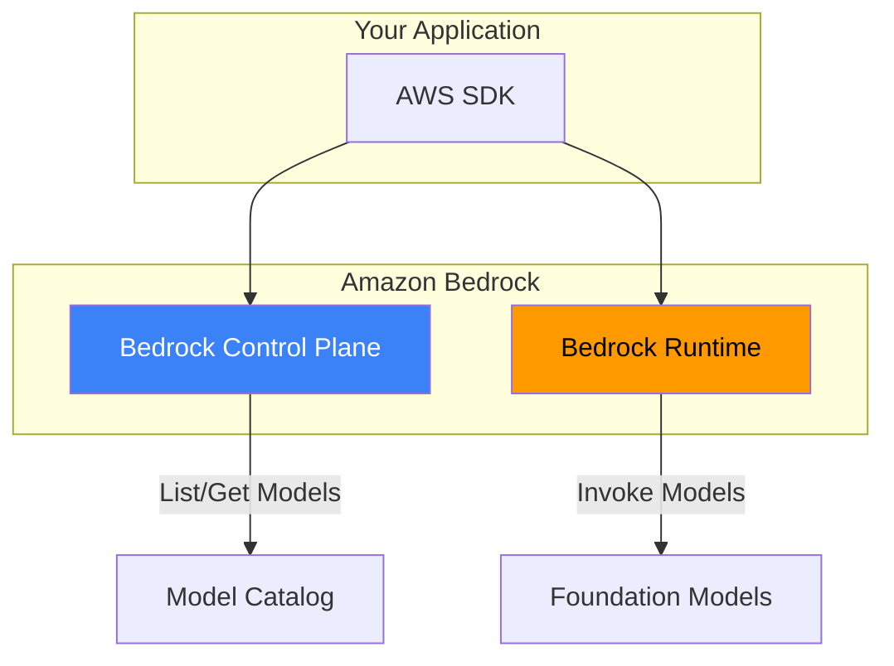
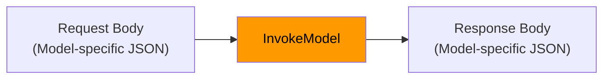
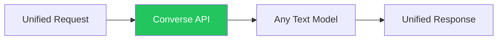

Amazon Bedrock provides multiple APIs for interacting with foundation models. This guide covers the essential APIs, SDK setup, and best practices for building production applications.

## Bedrock Service Architecture



## Two Bedrock Clients

| Client | Service | Purpose |
|--------|---------|---------|
| `bedrock` | Control Plane | List models, manage custom models, guardrails |
| `bedrock-runtime` | Runtime | Invoke models, generate responses |

## SDK Setup

### Python (boto3)

```python
import boto3

# Control plane client
bedrock = boto3.client('bedrock', region_name='us-east-1')

# Runtime client (for model invocation)
bedrock_runtime = boto3.client('bedrock-runtime', region_name='us-east-1')
```

### JavaScript/TypeScript

```typescript
import {
  BedrockClient,
  ListFoundationModelsCommand
} from '@aws-sdk/client-bedrock';
import {
  BedrockRuntimeClient,
  InvokeModelCommand,
  ConverseCommand
} from '@aws-sdk/client-bedrock-runtime';

const bedrockClient = new BedrockClient({ region: 'us-east-1' });
const runtimeClient = new BedrockRuntimeClient({ region: 'us-east-1' });
```

## Control Plane APIs

### List Available Models

```python
import boto3

bedrock = boto3.client('bedrock', region_name='us-east-1')

# List all foundation models
response = bedrock.list_foundation_models()

for model in response['modelSummaries']:
    print(f"{model['modelId']}: {model['modelName']}")
    print(f"  Provider: {model['providerName']}")
    print(f"  Input: {model['inputModalities']}")
    print(f"  Output: {model['outputModalities']}")
```

### Get Model Details

```python
response = bedrock.get_foundation_model(
    modelIdentifier='anthropic.claude-3-sonnet-20240229-v1:0'
)

model = response['modelDetails']
print(f"Model: {model['modelName']}")
print(f"Context Window: {model.get('responseStreamingSupported')}")
```

## Runtime APIs

### InvokeModel API

The basic API for model invocation. Request/response format varies by model.



#### Claude Example

```python
import boto3
import json

client = boto3.client('bedrock-runtime', region_name='us-east-1')

response = client.invoke_model(
    modelId='anthropic.claude-3-sonnet-20240229-v1:0',
    contentType='application/json',
    accept='application/json',
    body=json.dumps({
        "anthropic_version": "bedrock-2023-05-31",
        "max_tokens": 1024,
        "temperature": 0.7,
        "messages": [
            {
                "role": "user",
                "content": "Explain quantum computing in simple terms."
            }
        ]
    })
)

result = json.loads(response['body'].read())
print(result['content'][0]['text'])
```

#### Titan Example

```python
response = client.invoke_model(
    modelId='amazon.titan-text-express-v1',
    body=json.dumps({
        "inputText": "Explain quantum computing in simple terms.",
        "textGenerationConfig": {
            "maxTokenCount": 1024,
            "temperature": 0.7,
            "topP": 0.9
        }
    })
)

result = json.loads(response['body'].read())
print(result['results'][0]['outputText'])
```

#### Llama Example

```python
response = client.invoke_model(
    modelId='meta.llama3-1-70b-instruct-v1:0',
    body=json.dumps({
        "prompt": "<|begin_of_text|><|start_header_id|>user<|end_header_id|>\n\nExplain quantum computing.<|eot_id|><|start_header_id|>assistant<|end_header_id|>\n\n",
        "max_gen_len": 1024,
        "temperature": 0.7
    })
)

result = json.loads(response['body'].read())
print(result['generation'])
```

### Converse API (Recommended)

Unified API that works across all text models with consistent request/response format.



#### Basic Usage

```python
response = client.converse(
    modelId='anthropic.claude-3-sonnet-20240229-v1:0',
    messages=[
        {
            "role": "user",
            "content": [{"text": "Explain quantum computing in simple terms."}]
        }
    ],
    inferenceConfig={
        "maxTokens": 1024,
        "temperature": 0.7,
        "topP": 0.9
    }
)

print(response['output']['message']['content'][0]['text'])
print(f"Input tokens: {response['usage']['inputTokens']}")
print(f"Output tokens: {response['usage']['outputTokens']}")
```

#### Multi-turn Conversation

```python
messages = []

def chat(user_message):
    messages.append({
        "role": "user",
        "content": [{"text": user_message}]
    })

    response = client.converse(
        modelId='anthropic.claude-3-sonnet-20240229-v1:0',
        messages=messages,
        inferenceConfig={"maxTokens": 1024}
    )

    assistant_message = response['output']['message']
    messages.append(assistant_message)

    return assistant_message['content'][0]['text']

# Conversation
print(chat("What is Python?"))
print(chat("What are its main uses?"))
print(chat("Show me a simple example."))
```

#### System Prompt

```python
response = client.converse(
    modelId='anthropic.claude-3-sonnet-20240229-v1:0',
    system=[
        {"text": "You are a helpful coding assistant. Provide concise answers with code examples."}
    ],
    messages=[
        {
            "role": "user",
            "content": [{"text": "How do I read a JSON file in Python?"}]
        }
    ],
    inferenceConfig={"maxTokens": 1024}
)
```

### Streaming Responses

For real-time output display.

#### InvokeModelWithResponseStream

```python
response = client.invoke_model_with_response_stream(
    modelId='anthropic.claude-3-sonnet-20240229-v1:0',
    body=json.dumps({
        "anthropic_version": "bedrock-2023-05-31",
        "max_tokens": 1024,
        "messages": [
            {"role": "user", "content": "Write a short story about AI."}
        ]
    })
)

for event in response['body']:
    chunk = json.loads(event['chunk']['bytes'])
    if chunk['type'] == 'content_block_delta':
        print(chunk['delta']['text'], end='', flush=True)
```

#### ConverseStream

```python
response = client.converse_stream(
    modelId='anthropic.claude-3-sonnet-20240229-v1:0',
    messages=[
        {
            "role": "user",
            "content": [{"text": "Write a short story about AI."}]
        }
    ],
    inferenceConfig={"maxTokens": 1024}
)

for event in response['stream']:
    if 'contentBlockDelta' in event:
        text = event['contentBlockDelta']['delta'].get('text', '')
        print(text, end='', flush=True)
    elif 'metadata' in event:
        usage = event['metadata']['usage']
        print(f"\n\nTokens: {usage['inputTokens']} in, {usage['outputTokens']} out")
```

## Inference Parameters

| Parameter | Description | Typical Range |
|-----------|-------------|---------------|
| maxTokens | Maximum output length | 1-4096+ |
| temperature | Randomness (0=deterministic) | 0.0-1.0 |
| topP | Nucleus sampling | 0.0-1.0 |
| stopSequences | Stop generation triggers | ["\\n\\n"] |

```python
inferenceConfig = {
    "maxTokens": 2048,
    "temperature": 0.5,      # More focused
    "topP": 0.9,
    "stopSequences": ["\n\nHuman:"]
}
```

## Error Handling

```python
from botocore.exceptions import ClientError

def invoke_with_retry(prompt, max_retries=3):
    for attempt in range(max_retries):
        try:
            response = client.converse(
                modelId='anthropic.claude-3-sonnet-20240229-v1:0',
                messages=[{"role": "user", "content": [{"text": prompt}]}],
                inferenceConfig={"maxTokens": 1024}
            )
            return response['output']['message']['content'][0]['text']

        except ClientError as e:
            error_code = e.response['Error']['Code']

            if error_code == 'ThrottlingException':
                wait_time = 2 ** attempt
                print(f"Throttled. Waiting {wait_time}s...")
                time.sleep(wait_time)
            elif error_code == 'ModelTimeoutException':
                print("Model timeout. Retrying...")
            elif error_code == 'ValidationException':
                print(f"Validation error: {e}")
                raise
            else:
                raise

    raise Exception("Max retries exceeded")
```

### Common Errors

| Error | Cause | Solution |
|-------|-------|----------|
| AccessDeniedException | Model not enabled | Enable in Bedrock console |
| ThrottlingException | Rate limit exceeded | Implement exponential backoff |
| ValidationException | Invalid request | Check request format |
| ModelTimeoutException | Model took too long | Retry or reduce input |

## Best Practices

### 1. Use Converse API

```python
# Preferred - works with any model
response = client.converse(
    modelId=model_id,
    messages=messages,
    inferenceConfig=config
)

# Avoid - model-specific format required
response = client.invoke_model(
    modelId=model_id,
    body=json.dumps(model_specific_body)
)
```

### 2. Implement Timeouts

```python
from botocore.config import Config

config = Config(
    read_timeout=120,
    connect_timeout=10,
    retries={'max_attempts': 3}
)

client = boto3.client('bedrock-runtime', config=config)
```

### 3. Track Token Usage

```python
def track_usage(response):
    usage = response.get('usage', {})
    return {
        'input_tokens': usage.get('inputTokens', 0),
        'output_tokens': usage.get('outputTokens', 0),
        'total_tokens': usage.get('inputTokens', 0) + usage.get('outputTokens', 0)
    }
```

### 4. Use Environment Variables for Region

```python
import os

region = os.environ.get('AWS_REGION', 'us-east-1')
client = boto3.client('bedrock-runtime', region_name=region)
```

## Complete Example: Chat Application

```python
import boto3
from typing import List, Dict

class BedrockChat:
    def __init__(self, model_id: str = 'anthropic.claude-3-sonnet-20240229-v1:0'):
        self.client = boto3.client('bedrock-runtime')
        self.model_id = model_id
        self.messages: List[Dict] = []
        self.system_prompt = None

    def set_system_prompt(self, prompt: str):
        self.system_prompt = [{"text": prompt}]

    def chat(self, user_input: str) -> str:
        self.messages.append({
            "role": "user",
            "content": [{"text": user_input}]
        })

        kwargs = {
            "modelId": self.model_id,
            "messages": self.messages,
            "inferenceConfig": {"maxTokens": 2048, "temperature": 0.7}
        }

        if self.system_prompt:
            kwargs["system"] = self.system_prompt

        response = self.client.converse(**kwargs)

        assistant_message = response['output']['message']
        self.messages.append(assistant_message)

        return assistant_message['content'][0]['text']

    def clear_history(self):
        self.messages = []

# Usage
chat = BedrockChat()
chat.set_system_prompt("You are a helpful assistant.")
print(chat.chat("Hello!"))
print(chat.chat("Tell me a joke."))
```

## Key Takeaways

1. **Two clients** - `bedrock` for management, `bedrock-runtime` for inference
2. **Prefer Converse API** - Unified interface across models
3. **Handle errors gracefully** - Implement retries with backoff
4. **Stream for UX** - Better user experience for long responses
5. **Track usage** - Monitor tokens for cost management

## References

- [Amazon Bedrock API Reference](https://docs.aws.amazon.com/bedrock/latest/APIReference/)
- [Converse API Documentation](https://docs.aws.amazon.com/bedrock/latest/userguide/conversation-inference.html)
- [AWS SDK for Python (Boto3)](https://boto3.amazonaws.com/v1/documentation/api/latest/reference/services/bedrock-runtime.html)
