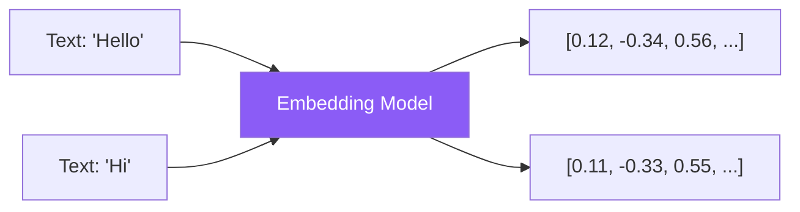

Embeddings convert text into numerical vectors that capture semantic meaning. Combined with vector stores, they enable powerful semantic search and form the foundation of RAG applications.

## What Are Embeddings?

Embeddings transform text into dense vectors where similar meanings are close in vector space.



### Key Properties

| Property | Description |
|----------|-------------|
| Dimensionality | Vector size (e.g., 1024, 1536) |
| Semantic similarity | Similar text → similar vectors |
| Distance metrics | Cosine similarity, Euclidean distance |

## Titan Embeddings

Amazon Titan provides embedding models optimized for search and RAG.

### Available Models

| Model | Dimensions | Max Tokens | Use Case |
|-------|------------|------------|----------|
| Titan Embeddings G1 - Text | 1536 | 8192 | General text |
| Titan Multimodal Embeddings G1 | 1024/384/256 | 128 | Text + images |

### Generate Text Embeddings

```python
import boto3
import json

client = boto3.client('bedrock-runtime', region_name='us-east-1')

def get_embedding(text: str) -> list:
    response = client.invoke_model(
        modelId='amazon.titan-embed-text-v1',
        body=json.dumps({
            "inputText": text
        })
    )
    result = json.loads(response['body'].read())
    return result['embedding']

# Generate embedding
embedding = get_embedding("What is cloud computing?")
print(f"Dimensions: {len(embedding)}")  # 1536
```

### Batch Embeddings

```python
def get_embeddings_batch(texts: list) -> list:
    embeddings = []
    for text in texts:
        embedding = get_embedding(text)
        embeddings.append(embedding)
    return embeddings

documents = [
    "Cloud computing delivers IT resources over the internet.",
    "Machine learning enables computers to learn from data.",
    "Kubernetes orchestrates containerized applications."
]

embeddings = get_embeddings_batch(documents)
```

### Multimodal Embeddings

```python
import base64

def get_multimodal_embedding(text: str = None, image_path: str = None):
    body = {}

    if text:
        body["inputText"] = text

    if image_path:
        with open(image_path, "rb") as f:
            body["inputImage"] = base64.b64encode(f.read()).decode()

    response = client.invoke_model(
        modelId='amazon.titan-embed-image-v1',
        body=json.dumps(body)
    )

    result = json.loads(response['body'].read())
    return result['embedding']

# Text embedding
text_emb = get_multimodal_embedding(text="A cat sitting on a couch")

# Image embedding
image_emb = get_multimodal_embedding(image_path="cat.jpg")

# Combined embedding
combined_emb = get_multimodal_embedding(
    text="A cat sitting on a couch",
    image_path="cat.jpg"
)
```

## Vector Similarity

### Cosine Similarity

```python
import numpy as np

def cosine_similarity(a: list, b: list) -> float:
    a = np.array(a)
    b = np.array(b)
    return np.dot(a, b) / (np.linalg.norm(a) * np.linalg.norm(b))

# Compare embeddings
emb1 = get_embedding("What is machine learning?")
emb2 = get_embedding("Explain ML algorithms")
emb3 = get_embedding("How to cook pasta")

print(f"ML questions: {cosine_similarity(emb1, emb2):.4f}")  # ~0.85
print(f"ML vs cooking: {cosine_similarity(emb1, emb3):.4f}")  # ~0.30
```

## Vector Stores on AWS

### Amazon OpenSearch Serverless

Fully managed vector search service.

```python
from opensearchpy import OpenSearch, RequestsHttpConnection
from requests_aws4auth import AWS4Auth
import boto3

# Setup client
credentials = boto3.Session().get_credentials()
awsauth = AWS4Auth(
    credentials.access_key,
    credentials.secret_key,
    'us-east-1',
    'aoss',
    session_token=credentials.token
)

client = OpenSearch(
    hosts=[{'host': 'your-collection.us-east-1.aoss.amazonaws.com', 'port': 443}],
    http_auth=awsauth,
    use_ssl=True,
    connection_class=RequestsHttpConnection
)

# Create index with vector field
index_body = {
    "settings": {
        "index": {
            "knn": True
        }
    },
    "mappings": {
        "properties": {
            "embedding": {
                "type": "knn_vector",
                "dimension": 1536,
                "method": {
                    "name": "hnsw",
                    "space_type": "cosinesimil",
                    "engine": "nmslib"
                }
            },
            "text": {"type": "text"},
            "metadata": {"type": "object"}
        }
    }
}

client.indices.create(index="documents", body=index_body)
```

### Index Documents

```python
def index_document(doc_id: str, text: str, metadata: dict = None):
    embedding = get_embedding(text)

    document = {
        "embedding": embedding,
        "text": text,
        "metadata": metadata or {}
    }

    client.index(
        index="documents",
        id=doc_id,
        body=document
    )

# Index documents
index_document("doc1", "Cloud computing overview", {"category": "cloud"})
index_document("doc2", "Machine learning basics", {"category": "ml"})
```

### Vector Search

```python
def search_similar(query: str, k: int = 5) -> list:
    query_embedding = get_embedding(query)

    search_body = {
        "size": k,
        "query": {
            "knn": {
                "embedding": {
                    "vector": query_embedding,
                    "k": k
                }
            }
        }
    }

    response = client.search(
        index="documents",
        body=search_body
    )

    return [
        {
            "text": hit["_source"]["text"],
            "score": hit["_score"],
            "metadata": hit["_source"].get("metadata", {})
        }
        for hit in response["hits"]["hits"]
    ]

# Search
results = search_similar("What is AWS?")
for result in results:
    print(f"{result['score']:.4f}: {result['text']}")
```

### Amazon Aurora PostgreSQL (pgvector)

```python
import psycopg2

conn = psycopg2.connect(
    host="your-aurora-cluster.region.rds.amazonaws.com",
    database="vectordb",
    user="admin",
    password="password"
)

cur = conn.cursor()

# Enable pgvector extension
cur.execute("CREATE EXTENSION IF NOT EXISTS vector")

# Create table with vector column
cur.execute("""
    CREATE TABLE IF NOT EXISTS documents (
        id SERIAL PRIMARY KEY,
        content TEXT,
        embedding vector(1536),
        metadata JSONB
    )
""")

# Create index for fast similarity search
cur.execute("""
    CREATE INDEX ON documents
    USING ivfflat (embedding vector_cosine_ops)
    WITH (lists = 100)
""")

conn.commit()
```

### Insert and Query with pgvector

```python
def insert_document(content: str, metadata: dict = None):
    embedding = get_embedding(content)

    cur.execute(
        """INSERT INTO documents (content, embedding, metadata)
           VALUES (%s, %s, %s)""",
        (content, embedding, json.dumps(metadata or {}))
    )
    conn.commit()

def search_documents(query: str, limit: int = 5):
    query_embedding = get_embedding(query)

    cur.execute(
        """SELECT content, metadata,
                  1 - (embedding <=> %s::vector) as similarity
           FROM documents
           ORDER BY embedding <=> %s::vector
           LIMIT %s""",
        (query_embedding, query_embedding, limit)
    )

    return cur.fetchall()
```

## Vector Store Comparison

| Feature | OpenSearch Serverless | Aurora pgvector | Neptune Analytics |
|---------|----------------------|-----------------|-------------------|
| Managed | Fully | Partially | Fully |
| Scale | Auto | Manual | Auto |
| Hybrid search | Yes | Limited | Graph + Vector |
| Best for | General search | Existing PostgreSQL | Graph relationships |

## Complete Search Application

```python
import boto3
import json
from typing import List, Dict

class SemanticSearch:
    def __init__(self, opensearch_client, index_name: str):
        self.bedrock = boto3.client('bedrock-runtime')
        self.opensearch = opensearch_client
        self.index_name = index_name

    def get_embedding(self, text: str) -> List[float]:
        response = self.bedrock.invoke_model(
            modelId='amazon.titan-embed-text-v1',
            body=json.dumps({"inputText": text})
        )
        return json.loads(response['body'].read())['embedding']

    def index(self, doc_id: str, text: str, metadata: Dict = None):
        self.opensearch.index(
            index=self.index_name,
            id=doc_id,
            body={
                "embedding": self.get_embedding(text),
                "text": text,
                "metadata": metadata or {}
            }
        )

    def search(self, query: str, k: int = 5) -> List[Dict]:
        response = self.opensearch.search(
            index=self.index_name,
            body={
                "size": k,
                "query": {
                    "knn": {
                        "embedding": {
                            "vector": self.get_embedding(query),
                            "k": k
                        }
                    }
                }
            }
        )

        return [
            {
                "text": hit["_source"]["text"],
                "score": hit["_score"],
                "metadata": hit["_source"].get("metadata", {})
            }
            for hit in response["hits"]["hits"]
        ]

# Usage
search = SemanticSearch(opensearch_client, "documents")
search.index("1", "AWS provides cloud computing services")
results = search.search("What cloud services does Amazon offer?")
```

## Best Practices

| Practice | Recommendation |
|----------|----------------|
| Chunk documents | Split large docs into smaller pieces |
| Normalize embeddings | Ensures consistent similarity scores |
| Use metadata filters | Combine vector search with filters |
| Monitor latency | Track embedding generation time |
| Cache embeddings | Store computed embeddings |

## Key Takeaways

1. **Embeddings capture meaning** - Similar text has similar vectors
2. **Titan provides text and multimodal** - Choose based on use case
3. **Multiple vector store options** - OpenSearch, Aurora, Neptune
4. **Cosine similarity is standard** - For comparing embeddings
5. **Foundation for RAG** - Embeddings power retrieval systems

## References

- [Amazon Titan Embeddings](https://docs.aws.amazon.com/bedrock/latest/userguide/titan-embedding-models.html)
- [OpenSearch Vector Search](https://docs.aws.amazon.com/opensearch-service/latest/developerguide/knn.html)
- [pgvector Documentation](https://github.com/pgvector/pgvector)
