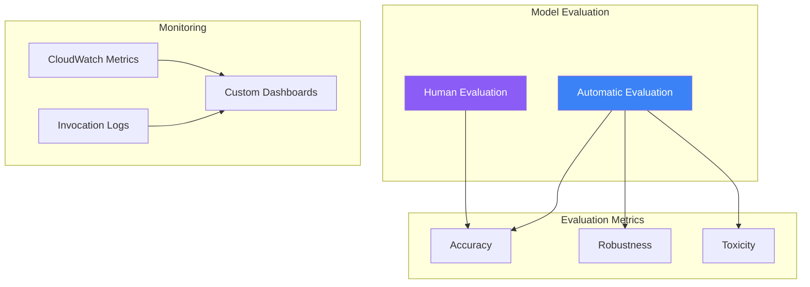

Evaluating and monitoring generative AI models is essential for ensuring quality, maintaining performance, and identifying issues in production. Amazon Bedrock provides built-in evaluation capabilities and integrates with AWS monitoring services.

## Evaluation Overview



## Model Evaluation Jobs

### Create Evaluation Job

```python
import boto3
import json

bedrock = boto3.client('bedrock')

response = bedrock.create_evaluation_job(
    jobName='claude-evaluation-001',
    jobDescription='Evaluate Claude Sonnet for customer support',
    roleArn='arn:aws:iam::123456789012:role/BedrockEvaluationRole',
    evaluationConfig={
        'automated': {
            'datasetMetricConfigs': [
                {
                    'taskType': 'QuestionAndAnswer',
                    'dataset': {
                        'name': 'qa-dataset',
                        'datasetLocation': {
                            's3Uri': 's3://my-bucket/evaluation/qa-dataset.jsonl'
                        }
                    },
                    'metricNames': ['Accuracy', 'Robustness']
                }
            ]
        }
    },
    inferenceConfig={
        'models': [
            {
                'bedrockModel': {
                    'modelIdentifier': 'anthropic.claude-3-sonnet-20240229-v1:0',
                    'inferenceParams': json.dumps({
                        'temperature': 0.7,
                        'max_tokens': 1024
                    })
                }
            }
        ]
    },
    outputDataConfig={
        's3Uri': 's3://my-bucket/evaluation/output/'
    }
)

job_arn = response['jobArn']
```

### Dataset Format (JSONL)

```jsonl
{"prompt": "What is the return policy?", "referenceResponse": "Our return policy allows returns within 30 days of purchase."}
{"prompt": "How do I track my order?", "referenceResponse": "You can track your order using the tracking link in your confirmation email."}
{"prompt": "What payment methods are accepted?", "referenceResponse": "We accept credit cards, PayPal, and bank transfers."}
```

### Evaluation Metrics

| Metric | Description | Task Types |
|--------|-------------|------------|
| Accuracy | Correctness of responses | QA, Summarization |
| Robustness | Consistency across variations | All |
| Toxicity | Harmful content detection | All |
| Relevance | Topic adherence | QA, Classification |
| Fluency | Language quality | All |

## Human Evaluation

### Create Human Evaluation Job

```python
response = bedrock.create_evaluation_job(
    jobName='human-evaluation-001',
    jobDescription='Human evaluation of response quality',
    roleArn='arn:aws:iam::123456789012:role/BedrockEvaluationRole',
    evaluationConfig={
        'human': {
            'humanWorkflowConfig': {
                'flowDefinitionArn': 'arn:aws:sagemaker:us-east-1:123456789012:flow-definition/bedrock-eval',
                'instructions': 'Rate the quality of the AI response from 1-5'
            },
            'customMetrics': [
                {
                    'name': 'Helpfulness',
                    'description': 'How helpful is the response?',
                    'ratingMethod': 'ThumbsUpDown'
                },
                {
                    'name': 'Accuracy',
                    'description': 'Is the information accurate?',
                    'ratingMethod': 'IndividualLikertScale'
                }
            ],
            'datasetMetricConfigs': [
                {
                    'taskType': 'QuestionAndAnswer',
                    'dataset': {
                        'name': 'human-eval-dataset',
                        'datasetLocation': {
                            's3Uri': 's3://my-bucket/evaluation/human-dataset.jsonl'
                        }
                    }
                }
            ]
        }
    },
    inferenceConfig={
        'models': [
            {
                'bedrockModel': {
                    'modelIdentifier': 'anthropic.claude-3-sonnet-20240229-v1:0'
                }
            }
        ]
    },
    outputDataConfig={
        's3Uri': 's3://my-bucket/evaluation/human-output/'
    }
)
```

## Model Comparison

### Compare Multiple Models

```python
response = bedrock.create_evaluation_job(
    jobName='model-comparison-001',
    jobDescription='Compare Claude Sonnet vs Haiku',
    roleArn='arn:aws:iam::123456789012:role/BedrockEvaluationRole',
    evaluationConfig={
        'automated': {
            'datasetMetricConfigs': [
                {
                    'taskType': 'QuestionAndAnswer',
                    'dataset': {
                        'name': 'comparison-dataset',
                        'datasetLocation': {
                            's3Uri': 's3://my-bucket/evaluation/comparison.jsonl'
                        }
                    },
                    'metricNames': ['Accuracy', 'Robustness', 'Toxicity']
                }
            ]
        }
    },
    inferenceConfig={
        'models': [
            {
                'bedrockModel': {
                    'modelIdentifier': 'anthropic.claude-3-sonnet-20240229-v1:0',
                    'inferenceParams': json.dumps({'temperature': 0.5})
                }
            },
            {
                'bedrockModel': {
                    'modelIdentifier': 'anthropic.claude-3-haiku-20240307-v1:0',
                    'inferenceParams': json.dumps({'temperature': 0.5})
                }
            }
        ]
    },
    outputDataConfig={
        's3Uri': 's3://my-bucket/evaluation/comparison-output/'
    }
)
```

## CloudWatch Monitoring

### Key Metrics

| Metric | Description |
|--------|-------------|
| InvocationCount | Number of model invocations |
| InvocationLatency | Response time |
| InvocationClientErrors | 4xx errors |
| InvocationServerErrors | 5xx errors |
| InputTokenCount | Tokens in requests |
| OutputTokenCount | Tokens in responses |

### Create CloudWatch Dashboard

```python
cloudwatch = boto3.client('cloudwatch')

dashboard_body = {
    'widgets': [
        {
            'type': 'metric',
            'x': 0, 'y': 0,
            'width': 12, 'height': 6,
            'properties': {
                'metrics': [
                    ['AWS/Bedrock', 'InvocationCount', 'ModelId', 'anthropic.claude-3-sonnet-20240229-v1:0'],
                    ['.', 'InvocationLatency', '.', '.', {'stat': 'Average'}]
                ],
                'title': 'Model Invocations',
                'region': 'us-east-1',
                'period': 300
            }
        },
        {
            'type': 'metric',
            'x': 12, 'y': 0,
            'width': 12, 'height': 6,
            'properties': {
                'metrics': [
                    ['AWS/Bedrock', 'InvocationClientErrors', 'ModelId', 'anthropic.claude-3-sonnet-20240229-v1:0'],
                    ['.', 'InvocationServerErrors', '.', '.']
                ],
                'title': 'Error Rates',
                'region': 'us-east-1',
                'period': 300
            }
        },
        {
            'type': 'metric',
            'x': 0, 'y': 6,
            'width': 24, 'height': 6,
            'properties': {
                'metrics': [
                    ['AWS/Bedrock', 'InputTokenCount', 'ModelId', 'anthropic.claude-3-sonnet-20240229-v1:0', {'stat': 'Sum'}],
                    ['.', 'OutputTokenCount', '.', '.', {'stat': 'Sum'}]
                ],
                'title': 'Token Usage',
                'region': 'us-east-1',
                'period': 3600
            }
        }
    ]
}

cloudwatch.put_dashboard(
    DashboardName='BedrockMonitoring',
    DashboardBody=json.dumps(dashboard_body)
)
```

### CloudWatch Alarms

```python
# Alarm for high latency
cloudwatch.put_metric_alarm(
    AlarmName='BedrockHighLatency',
    AlarmDescription='Bedrock model latency is high',
    MetricName='InvocationLatency',
    Namespace='AWS/Bedrock',
    Dimensions=[
        {'Name': 'ModelId', 'Value': 'anthropic.claude-3-sonnet-20240229-v1:0'}
    ],
    Statistic='Average',
    Period=300,
    EvaluationPeriods=2,
    Threshold=5000,  # 5 seconds
    ComparisonOperator='GreaterThanThreshold',
    AlarmActions=['arn:aws:sns:us-east-1:123456789012:alerts']
)

# Alarm for high error rate
cloudwatch.put_metric_alarm(
    AlarmName='BedrockHighErrorRate',
    AlarmDescription='Bedrock error rate is high',
    MetricName='InvocationServerErrors',
    Namespace='AWS/Bedrock',
    Dimensions=[
        {'Name': 'ModelId', 'Value': 'anthropic.claude-3-sonnet-20240229-v1:0'}
    ],
    Statistic='Sum',
    Period=300,
    EvaluationPeriods=1,
    Threshold=10,
    ComparisonOperator='GreaterThanThreshold',
    AlarmActions=['arn:aws:sns:us-east-1:123456789012:alerts']
)
```

## Custom Evaluation

### Implement Custom Metrics

```python
import boto3
from datetime import datetime

class BedrockEvaluator:
    def __init__(self, model_id: str):
        self.runtime = boto3.client('bedrock-runtime')
        self.cloudwatch = boto3.client('cloudwatch')
        self.model_id = model_id

    def evaluate_response(self, prompt: str, response: str,
                         expected: str = None) -> dict:
        metrics = {}

        # Response length
        metrics['response_length'] = len(response)

        # Latency (would be measured during actual invocation)
        # metrics['latency_ms'] = latency

        # Relevance score (simple keyword matching)
        if expected:
            expected_words = set(expected.lower().split())
            response_words = set(response.lower().split())
            overlap = len(expected_words & response_words)
            metrics['relevance_score'] = overlap / len(expected_words) if expected_words else 0

        return metrics

    def publish_custom_metrics(self, metrics: dict):
        metric_data = []
        timestamp = datetime.utcnow()

        for name, value in metrics.items():
            metric_data.append({
                'MetricName': name,
                'Dimensions': [
                    {'Name': 'ModelId', 'Value': self.model_id},
                    {'Name': 'Application', 'Value': 'CustomerSupport'}
                ],
                'Timestamp': timestamp,
                'Value': value,
                'Unit': 'None'
            })

        self.cloudwatch.put_metric_data(
            Namespace='Custom/Bedrock',
            MetricData=metric_data
        )

    def run_evaluation_batch(self, test_cases: list) -> dict:
        results = []

        for case in test_cases:
            response = self.runtime.converse(
                modelId=self.model_id,
                messages=[{'role': 'user', 'content': [{'text': case['prompt']}]}]
            )

            answer = response['output']['message']['content'][0]['text']
            metrics = self.evaluate_response(
                case['prompt'],
                answer,
                case.get('expected')
            )

            results.append({
                'prompt': case['prompt'],
                'response': answer,
                'metrics': metrics
            })

            self.publish_custom_metrics(metrics)

        # Aggregate results
        avg_relevance = sum(r['metrics'].get('relevance_score', 0) for r in results) / len(results)

        return {
            'total_cases': len(results),
            'average_relevance': avg_relevance,
            'results': results
        }

# Usage
evaluator = BedrockEvaluator('anthropic.claude-3-sonnet-20240229-v1:0')
test_cases = [
    {'prompt': 'What is the return policy?', 'expected': 'Returns are accepted within 30 days'},
    {'prompt': 'How do I contact support?', 'expected': 'Email support@example.com or call 1-800-XXX'}
]
results = evaluator.run_evaluation_batch(test_cases)
```

## Invocation Logging Analysis

### Query Logs with CloudWatch Insights

```python
logs = boto3.client('logs')

# Query for slow invocations
query = """
fields @timestamp, @message
| filter modelId = 'anthropic.claude-3-sonnet-20240229-v1:0'
| filter latencyMs > 3000
| sort @timestamp desc
| limit 100
"""

response = logs.start_query(
    logGroupName='/aws/bedrock/model-invocations',
    startTime=int((datetime.now() - timedelta(hours=24)).timestamp()),
    endTime=int(datetime.now().timestamp()),
    queryString=query
)

query_id = response['queryId']

# Wait for results
import time
while True:
    result = logs.get_query_results(queryId=query_id)
    if result['status'] == 'Complete':
        break
    time.sleep(1)

for record in result['results']:
    print(record)
```

## Best Practices

| Practice | Recommendation |
|----------|----------------|
| Regular evaluation | Run weekly evaluation jobs |
| A/B testing | Compare model versions |
| Alert thresholds | Set based on baseline metrics |
| Cost monitoring | Track token usage |
| Log retention | Keep logs for analysis |

## Key Takeaways

1. **Built-in evaluation** - Use automatic and human evaluation jobs
2. **CloudWatch integration** - Monitor invocations, latency, errors
3. **Custom metrics** - Publish application-specific metrics
4. **Proactive alerting** - Set alarms for anomalies
5. **Continuous improvement** - Iterate based on evaluation results

## References

- [Model Evaluation](https://docs.aws.amazon.com/bedrock/latest/userguide/model-evaluation.html)
- [CloudWatch Metrics](https://docs.aws.amazon.com/bedrock/latest/userguide/monitoring-cw.html)
- [Invocation Logging](https://docs.aws.amazon.com/bedrock/latest/userguide/model-invocation-logging.html)
