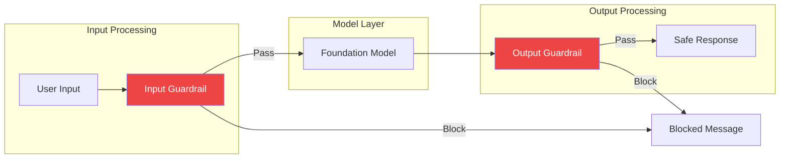

Amazon Bedrock Guardrails help you implement responsible AI by providing configurable safeguards to control model inputs and outputs, ensuring your applications meet safety and compliance requirements.

## Guardrails Overview



## Guardrail Components

| Component | Purpose | Example |
|-----------|---------|---------|
| Content Filters | Block harmful content | Violence, hate speech |
| Denied Topics | Restrict specific subjects | Competitors, politics |
| Word Filters | Block specific terms | Profanity, slurs |
| PII Detection | Protect personal data | SSN, credit cards |
| Contextual Grounding | Prevent hallucinations | Factual accuracy |

## Creating a Guardrail

### Basic Guardrail

```python
import boto3

client = boto3.client('bedrock')

response = client.create_guardrail(
    name='content-safety-guardrail',
    description='Guardrail for content safety and compliance',
    blockedInputMessaging='Your request contains content that is not allowed.',
    blockedOutputsMessaging='The response was blocked due to safety concerns.',
    contentPolicyConfig={
        'filtersConfig': [
            {
                'type': 'SEXUAL',
                'inputStrength': 'HIGH',
                'outputStrength': 'HIGH'
            },
            {
                'type': 'VIOLENCE',
                'inputStrength': 'HIGH',
                'outputStrength': 'HIGH'
            },
            {
                'type': 'HATE',
                'inputStrength': 'HIGH',
                'outputStrength': 'HIGH'
            },
            {
                'type': 'INSULTS',
                'inputStrength': 'MEDIUM',
                'outputStrength': 'MEDIUM'
            },
            {
                'type': 'MISCONDUCT',
                'inputStrength': 'HIGH',
                'outputStrength': 'HIGH'
            },
            {
                'type': 'PROMPT_ATTACK',
                'inputStrength': 'HIGH',
                'outputStrength': 'NONE'
            }
        ]
    }
)

guardrail_id = response['guardrailId']
guardrail_version = response['version']
```

### Content Filter Strengths

| Strength | Behavior |
|----------|----------|
| NONE | No filtering |
| LOW | Block only severe violations |
| MEDIUM | Block moderate violations |
| HIGH | Block even mild violations |

## Topic Denial

### Configuring Denied Topics

```python
response = client.create_guardrail(
    name='business-guardrail',
    description='Guardrail for business compliance',
    blockedInputMessaging='This topic is not supported.',
    blockedOutputsMessaging='Cannot provide information on this topic.',
    topicPolicyConfig={
        'topicsConfig': [
            {
                'name': 'Competitor Information',
                'definition': 'Questions about competitor products, pricing, or strategies',
                'examples': [
                    'What are the features of CompetitorX product?',
                    'How does CompetitorY pricing compare?',
                    'Tell me about CompetitorZ strategy'
                ],
                'type': 'DENY'
            },
            {
                'name': 'Investment Advice',
                'definition': 'Financial or investment recommendations',
                'examples': [
                    'Should I buy stocks?',
                    'What cryptocurrency should I invest in?',
                    'Is this a good time to invest?'
                ],
                'type': 'DENY'
            },
            {
                'name': 'Political Topics',
                'definition': 'Political opinions, candidates, or elections',
                'examples': [
                    'Who should I vote for?',
                    'What is your opinion on this policy?'
                ],
                'type': 'DENY'
            }
        ]
    },
    contentPolicyConfig={
        'filtersConfig': [
            {'type': 'HATE', 'inputStrength': 'HIGH', 'outputStrength': 'HIGH'},
            {'type': 'VIOLENCE', 'inputStrength': 'HIGH', 'outputStrength': 'HIGH'}
        ]
    }
)
```

## Word Filters

### Custom Word Blocking

```python
response = client.create_guardrail(
    name='word-filter-guardrail',
    description='Block specific words and phrases',
    blockedInputMessaging='Your message contains blocked content.',
    blockedOutputsMessaging='Response blocked due to content policy.',
    wordPolicyConfig={
        'wordsConfig': [
            {'text': 'profanity1'},
            {'text': 'profanity2'},
            {'text': 'slur1'}
        ],
        'managedWordListsConfig': [
            {'type': 'PROFANITY'}  # AWS managed profanity list
        ]
    }
)
```

## PII Detection and Handling

### Configure PII Filtering

```python
response = client.create_guardrail(
    name='pii-guardrail',
    description='Protect personally identifiable information',
    blockedInputMessaging='Please do not share personal information.',
    blockedOutputsMessaging='Response contains PII and was blocked.',
    sensitiveInformationPolicyConfig={
        'piiEntitiesConfig': [
            {'type': 'EMAIL', 'action': 'ANONYMIZE'},
            {'type': 'PHONE', 'action': 'ANONYMIZE'},
            {'type': 'NAME', 'action': 'ANONYMIZE'},
            {'type': 'US_SOCIAL_SECURITY_NUMBER', 'action': 'BLOCK'},
            {'type': 'CREDIT_DEBIT_CARD_NUMBER', 'action': 'BLOCK'},
            {'type': 'US_BANK_ACCOUNT_NUMBER', 'action': 'BLOCK'},
            {'type': 'ADDRESS', 'action': 'ANONYMIZE'}
        ],
        'regexesConfig': [
            {
                'name': 'CustomAccountNumber',
                'description': 'Internal account number format',
                'pattern': 'ACC-[0-9]{8}',
                'action': 'ANONYMIZE'
            }
        ]
    }
)
```

### PII Actions

| Action | Behavior |
|--------|----------|
| BLOCK | Block the entire request/response |
| ANONYMIZE | Replace PII with placeholder |

## Contextual Grounding

### Prevent Hallucinations

```python
response = client.create_guardrail(
    name='grounding-guardrail',
    description='Ensure factual accuracy',
    blockedInputMessaging='Input validation failed.',
    blockedOutputsMessaging='Response may not be factually grounded.',
    contextualGroundingPolicyConfig={
        'filtersConfig': [
            {
                'type': 'GROUNDING',
                'threshold': 0.7  # 0.0 to 1.0
            },
            {
                'type': 'RELEVANCE',
                'threshold': 0.7
            }
        ]
    }
)
```

## Using Guardrails with Models

### Apply Guardrail to Converse API

```python
runtime = boto3.client('bedrock-runtime')

response = runtime.converse(
    modelId='anthropic.claude-3-sonnet-20240229-v1:0',
    messages=[
        {
            'role': 'user',
            'content': [{'text': 'Tell me about competitor products'}]
        }
    ],
    guardrailConfig={
        'guardrailIdentifier': guardrail_id,
        'guardrailVersion': guardrail_version,
        'trace': 'enabled'  # Enable trace for debugging
    }
)

# Check if guardrail intervened
if response.get('stopReason') == 'guardrail_intervened':
    print('Request was blocked by guardrail')
    # Access trace information
    trace = response.get('trace', {})
    print(f"Guardrail trace: {trace}")
else:
    print(response['output']['message']['content'][0]['text'])
```

### Apply Guardrail with InvokeModel

```python
import json

response = runtime.invoke_model(
    modelId='anthropic.claude-3-sonnet-20240229-v1:0',
    body=json.dumps({
        'anthropic_version': 'bedrock-2023-05-31',
        'max_tokens': 1024,
        'messages': [{'role': 'user', 'content': 'User query here'}]
    }),
    guardrailIdentifier=guardrail_id,
    guardrailVersion=guardrail_version
)
```

### Streaming with Guardrails

```python
response = runtime.converse_stream(
    modelId='anthropic.claude-3-sonnet-20240229-v1:0',
    messages=[{'role': 'user', 'content': [{'text': 'Query here'}]}],
    guardrailConfig={
        'guardrailIdentifier': guardrail_id,
        'guardrailVersion': guardrail_version,
        'streamProcessingMode': 'sync'  # or 'async'
    }
)

for event in response['stream']:
    if 'contentBlockDelta' in event:
        print(event['contentBlockDelta']['delta'].get('text', ''), end='')
    elif 'guardrailResult' in event:
        print(f"\nGuardrail result: {event['guardrailResult']}")
```

## ApplyGuardrail API

### Direct Guardrail Application

```python
response = runtime.apply_guardrail(
    guardrailIdentifier=guardrail_id,
    guardrailVersion=guardrail_version,
    source='INPUT',  # or 'OUTPUT'
    content=[
        {
            'text': {
                'text': 'Text to check against guardrail'
            }
        }
    ]
)

if response['action'] == 'GUARDRAIL_INTERVENED':
    print('Content was blocked')
    for output in response['outputs']:
        print(f"Blocked message: {output['text']}")
else:
    print('Content passed guardrail checks')
```

## Guardrail Management

### List Guardrails

```python
response = client.list_guardrails()
for guardrail in response['guardrails']:
    print(f"{guardrail['name']}: {guardrail['id']} (v{guardrail['version']})")
```

### Update Guardrail

```python
response = client.update_guardrail(
    guardrailIdentifier=guardrail_id,
    name='updated-guardrail',
    description='Updated description',
    blockedInputMessaging='Updated blocked input message',
    blockedOutputsMessaging='Updated blocked output message',
    contentPolicyConfig={
        'filtersConfig': [
            {'type': 'HATE', 'inputStrength': 'HIGH', 'outputStrength': 'HIGH'},
            {'type': 'VIOLENCE', 'inputStrength': 'MEDIUM', 'outputStrength': 'MEDIUM'}
        ]
    }
)
```

### Create Guardrail Version

```python
response = client.create_guardrail_version(
    guardrailIdentifier=guardrail_id,
    description='Production version 1.0'
)
print(f"Created version: {response['version']}")
```

## Complete Guardrail Example

```python
import boto3
import json

class SafeAIAssistant:
    def __init__(self, guardrail_id: str, guardrail_version: str):
        self.runtime = boto3.client('bedrock-runtime')
        self.guardrail_id = guardrail_id
        self.guardrail_version = guardrail_version

    def chat(self, message: str, system_prompt: str = None) -> dict:
        messages = [{'role': 'user', 'content': [{'text': message}]}]

        try:
            response = self.runtime.converse(
                modelId='anthropic.claude-3-sonnet-20240229-v1:0',
                messages=messages,
                system=[{'text': system_prompt}] if system_prompt else None,
                guardrailConfig={
                    'guardrailIdentifier': self.guardrail_id,
                    'guardrailVersion': self.guardrail_version,
                    'trace': 'enabled'
                }
            )

            if response.get('stopReason') == 'guardrail_intervened':
                return {
                    'blocked': True,
                    'message': 'Your request was blocked by safety controls.',
                    'trace': response.get('trace', {})
                }

            return {
                'blocked': False,
                'message': response['output']['message']['content'][0]['text'],
                'usage': response.get('usage', {})
            }

        except Exception as e:
            return {
                'blocked': True,
                'message': f'Error: {str(e)}',
                'trace': {}
            }

# Usage
assistant = SafeAIAssistant(guardrail_id, guardrail_version)
result = assistant.chat("Tell me about your products")
if result['blocked']:
    print(f"Blocked: {result['message']}")
else:
    print(f"Response: {result['message']}")
```

## Best Practices

| Practice | Recommendation |
|----------|----------------|
| Start strict | Begin with high filter strengths, relax as needed |
| Test thoroughly | Test with adversarial inputs |
| Version control | Use guardrail versions for production |
| Monitor | Track guardrail interventions |
| Customize messages | Provide helpful blocked messages |

## Key Takeaways

1. **Multiple safety layers** - Content filters, topic denial, word filters, PII
2. **Configurable thresholds** - Adjust strictness per use case
3. **PII protection** - Block or anonymize sensitive data
4. **Contextual grounding** - Reduce hallucinations
5. **Easy integration** - Works with Converse and InvokeModel APIs

## References

- [Bedrock Guardrails](https://docs.aws.amazon.com/bedrock/latest/userguide/guardrails.html)
- [Responsible AI](https://aws.amazon.com/machine-learning/responsible-ai/)
- [Content Filtering](https://docs.aws.amazon.com/bedrock/latest/userguide/guardrails-content-filters.html)
