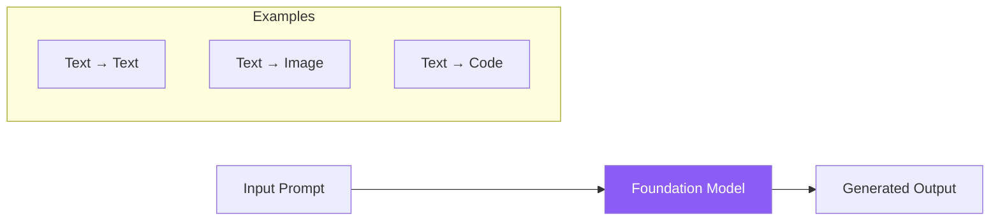
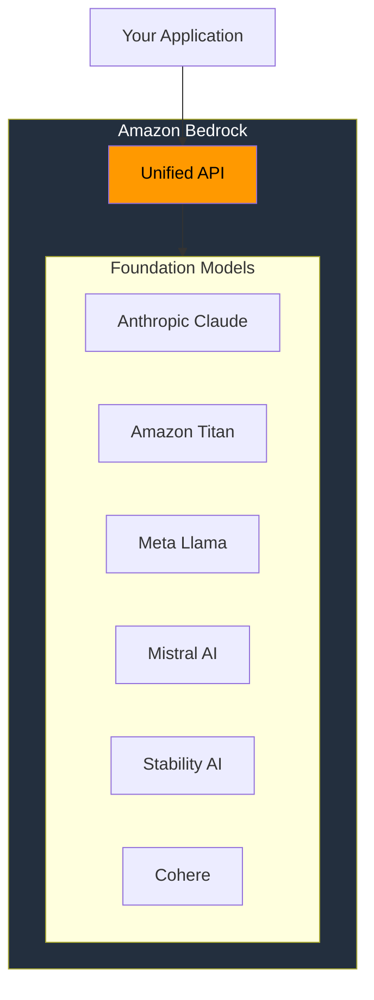
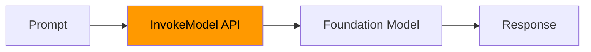
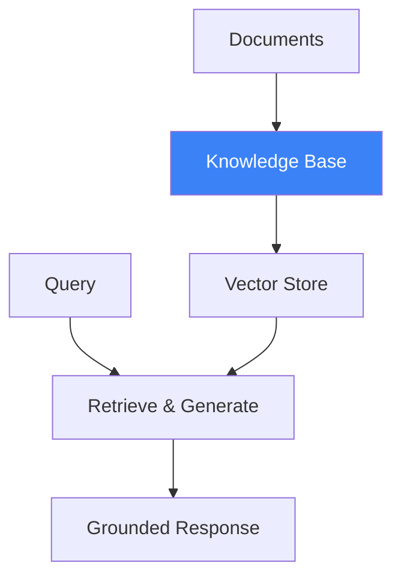
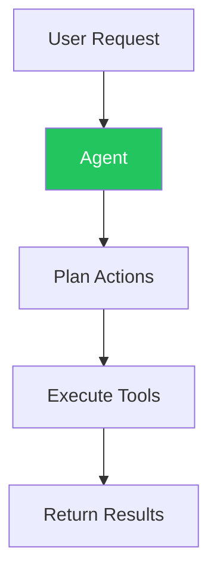
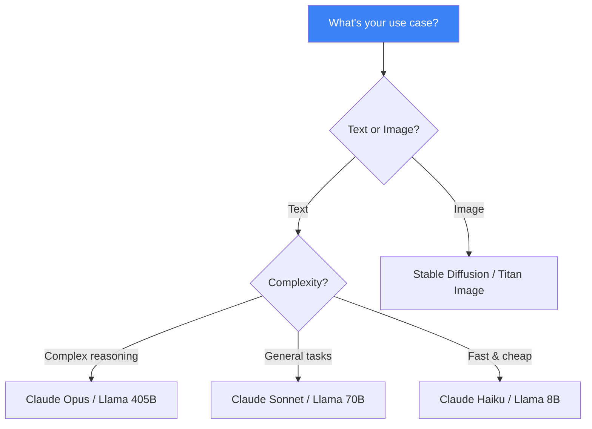

Amazon Bedrock is a fully managed service that provides access to high-performing foundation models (FMs) from leading AI companies through a unified API. This article covers the fundamentals of generative AI and how Bedrock enables you to build AI-powered applications.

## What is Generative AI?

Generative AI refers to AI systems that can create new content—text, images, code, audio, and video—based on patterns learned from training data.



### Key Characteristics

| Characteristic | Description |
|---------------|-------------|
| Creative | Generates novel content, not just retrieves |
| Contextual | Understands and responds to natural language |
| Versatile | Handles multiple tasks without task-specific training |
| Probabilistic | Outputs may vary for the same input |

## What is Amazon Bedrock?

Amazon Bedrock provides a single API to access multiple foundation models, enabling you to build generative AI applications without managing infrastructure.



### Key Benefits

| Benefit | Description |
|---------|-------------|
| Fully Managed | No infrastructure to provision or manage |
| Model Choice | Access multiple FMs through one API |
| Security | Data stays within your AWS account |
| Customization | Fine-tune models with your data |
| Integration | Native AWS service integrations |

## Foundation Models in Bedrock

### Amazon Titan

Amazon's own family of foundation models.

| Model | Capability | Use Case |
|-------|------------|----------|
| Titan Text | Text generation | Summarization, Q&A, chat |
| Titan Embeddings | Vector embeddings | Semantic search, RAG |
| Titan Image Generator | Image generation | Creative content |
| Titan Multimodal Embeddings | Text + image embeddings | Multimodal search |

### Anthropic Claude

Known for safety and helpfulness.

| Model | Context Window | Best For |
|-------|---------------|----------|
| Claude 3.5 Sonnet | 200K tokens | Balanced performance |
| Claude 3 Opus | 200K tokens | Complex reasoning |
| Claude 3 Haiku | 200K tokens | Fast, cost-effective |

### Meta Llama

Open-weight models with strong performance.

| Model | Parameters | Characteristics |
|-------|-----------|-----------------|
| Llama 3.1 8B | 8 billion | Fast inference |
| Llama 3.1 70B | 70 billion | High quality |
| Llama 3.1 405B | 405 billion | State-of-the-art |

### Mistral AI

Efficient European models.

| Model | Use Case |
|-------|----------|
| Mistral 7B | General purpose |
| Mixtral 8x7B | Expert mixture |
| Mistral Large | Complex tasks |

### Stability AI

Image generation specialists.

| Model | Capability |
|-------|------------|
| Stable Diffusion XL | High-quality image generation |
| Stable Image Core | Fast image generation |
| Stable Image Ultra | Photorealistic images |

## Core Bedrock Capabilities

### 1. Model Inference



### 2. Knowledge Bases (RAG)

Connect FMs to your private data sources.



### 3. Agents

Build autonomous AI agents that can take actions.



### 4. Guardrails

Implement responsible AI safeguards.

| Guardrail | Function |
|-----------|----------|
| Content Filters | Block harmful content |
| Denied Topics | Restrict specific subjects |
| PII Filters | Redact sensitive information |
| Word Filters | Block specific words |

### 5. Model Customization

Fine-tune models with your data.

| Method | Description |
|--------|-------------|
| Continued Pre-training | Adapt to domain-specific language |
| Fine-tuning | Train on task-specific examples |

## Pricing Model

Bedrock offers flexible pricing options.

| Option | Description | Best For |
|--------|-------------|----------|
| On-Demand | Pay per token | Variable workloads |
| Batch | Discounted batch processing | Large offline jobs |
| Provisioned Throughput | Reserved capacity | Consistent workloads |

## Getting Started

### 1. Enable Model Access

```
AWS Console → Amazon Bedrock → Model Access → Enable Models
```

### 2. First API Call (Python)

```python
import boto3
import json

# Create Bedrock Runtime client
client = boto3.client('bedrock-runtime', region_name='us-east-1')

# Invoke Claude model
response = client.invoke_model(
    modelId='anthropic.claude-3-sonnet-20240229-v1:0',
    body=json.dumps({
        "anthropic_version": "bedrock-2023-05-31",
        "max_tokens": 1024,
        "messages": [
            {"role": "user", "content": "Hello, Claude!"}
        ]
    })
)

# Parse response
result = json.loads(response['body'].read())
print(result['content'][0]['text'])
```

### 3. Using Converse API (Unified Interface)

```python
response = client.converse(
    modelId='anthropic.claude-3-sonnet-20240229-v1:0',
    messages=[
        {"role": "user", "content": [{"text": "Hello!"}]}
    ],
    inferenceConfig={
        "maxTokens": 1024,
        "temperature": 0.7
    }
)

print(response['output']['message']['content'][0]['text'])
```

## Model Selection Guide



## Best Practices

| Practice | Recommendation |
|----------|----------------|
| Start simple | Begin with on-demand pricing |
| Test models | Evaluate multiple models for your task |
| Use Converse API | Unified interface across models |
| Enable logging | Track usage and debug issues |
| Implement guardrails | Add safety measures from the start |

## Key Takeaways

1. **Bedrock provides unified access** to multiple foundation models via single API
2. **No infrastructure management** - fully managed service
3. **Multiple capabilities** - inference, RAG, agents, guardrails
4. **Data stays private** - models don't train on your data
5. **Choose the right model** - balance quality, speed, and cost

## Next Steps

- Set up model access in your AWS account
- Try the Bedrock playground for interactive testing
- Learn model-specific prompting techniques
- Explore Knowledge Bases for RAG applications

## References

- [Amazon Bedrock Documentation](https://docs.aws.amazon.com/bedrock/)
- [Amazon Bedrock User Guide](https://docs.aws.amazon.com/bedrock/latest/userguide/)
- [Foundation Models in Bedrock](https://docs.aws.amazon.com/bedrock/latest/userguide/models-supported.html)
