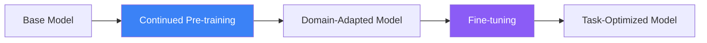

Amazon Bedrock allows you to customize foundation models with your own data, improving performance for domain-specific tasks without building models from scratch.

## Customization Methods

| Method | Purpose | Data Needed |
|--------|---------|-------------|
| Continued Pre-training | Adapt to domain language | Unlabeled text |
| Fine-tuning | Improve task performance | Labeled examples |



## Supported Models

| Model | Fine-tuning | Continued Pre-training |
|-------|-------------|----------------------|
| Amazon Titan Text | Yes | Yes |
| Cohere Command | Yes | No |
| Meta Llama 2/3 | Yes | No |

## Data Preparation

### Fine-tuning Format (JSONL)

```json
{"prompt": "Summarize this document:", "completion": "The document discusses..."}
{"prompt": "Translate to French:", "completion": "Bonjour, comment allez-vous?"}
{"prompt": "Classify sentiment:", "completion": "positive"}
```

### Continued Pre-training Format

```json
{"input": "Domain-specific text content goes here. This helps the model learn domain terminology and patterns."}
{"input": "Another document with domain knowledge..."}
```

### Data Requirements

| Aspect | Fine-tuning | Continued Pre-training |
|--------|-------------|----------------------|
| Min samples | 1000+ | 100,000+ tokens |
| Format | Prompt-completion pairs | Raw text |
| Quality | Clean, diverse | Representative |

## Creating a Fine-tuning Job

### Prepare S3 Data

```python
import boto3
import json

s3 = boto3.client('s3')

# Upload training data
training_data = [
    {"prompt": "Customer: Product is broken\nAgent:", "completion": "I'm sorry to hear that. Let me help you with a replacement."},
    {"prompt": "Customer: When will my order arrive?\nAgent:", "completion": "Let me check your order status. Could you provide your order number?"},
    # Add more examples...
]

with open('/tmp/training.jsonl', 'w') as f:
    for item in training_data:
        f.write(json.dumps(item) + '\n')

s3.upload_file('/tmp/training.jsonl', 'my-bucket', 'training/train.jsonl')
```

### Create Customization Job

```python
client = boto3.client('bedrock')

response = client.create_model_customization_job(
    jobName='customer-service-ft',
    customModelName='customer-service-titan',
    roleArn='arn:aws:iam::123456789012:role/BedrockCustomizationRole',
    baseModelIdentifier='amazon.titan-text-express-v1',
    customizationType='FINE_TUNING',
    trainingDataConfig={
        's3Uri': 's3://my-bucket/training/train.jsonl'
    },
    validationDataConfig={
        's3Uri': 's3://my-bucket/training/validation.jsonl'
    },
    outputDataConfig={
        's3Uri': 's3://my-bucket/output/'
    },
    hyperParameters={
        'epochCount': '3',
        'batchSize': '8',
        'learningRate': '0.00001'
    }
)

job_arn = response['jobArn']
```

### Monitor Job Status

```python
response = client.get_model_customization_job(jobIdentifier=job_arn)
print(f"Status: {response['status']}")
print(f"Training metrics: {response.get('trainingMetrics', {})}")
```

## Hyperparameters

| Parameter | Description | Typical Range |
|-----------|-------------|---------------|
| epochCount | Training passes | 1-5 |
| batchSize | Samples per batch | 4-32 |
| learningRate | Update step size | 1e-6 to 1e-4 |
| learningRateWarmupSteps | Warmup period | 0-100 |

## Using Custom Models

### Create Provisioned Throughput

Custom models require provisioned throughput:

```python
response = client.create_provisioned_model_throughput(
    modelUnits=1,
    provisionedModelName='customer-service-pt',
    modelId='arn:aws:bedrock:us-east-1:123456789012:custom-model/customer-service-titan'
)

provisioned_arn = response['provisionedModelArn']
```

### Invoke Custom Model

```python
runtime = boto3.client('bedrock-runtime')

response = runtime.invoke_model(
    modelId=provisioned_arn,
    body=json.dumps({
        "inputText": "Customer: My package is damaged\nAgent:",
        "textGenerationConfig": {
            "maxTokenCount": 256,
            "temperature": 0.7
        }
    })
)

result = json.loads(response['body'].read())
print(result['results'][0]['outputText'])
```

## Evaluation

### Built-in Metrics

| Metric | Description |
|--------|-------------|
| Training Loss | Model fit to training data |
| Validation Loss | Generalization ability |
| Perplexity | Prediction confidence |

### Custom Evaluation

```python
def evaluate_model(model_id, test_data):
    runtime = boto3.client('bedrock-runtime')
    results = []

    for item in test_data:
        response = runtime.invoke_model(
            modelId=model_id,
            body=json.dumps({
                "inputText": item['prompt'],
                "textGenerationConfig": {"maxTokenCount": 256}
            })
        )
        output = json.loads(response['body'].read())
        predicted = output['results'][0]['outputText']

        results.append({
            'expected': item['completion'],
            'predicted': predicted,
            'match': item['completion'].lower() in predicted.lower()
        })

    accuracy = sum(1 for r in results if r['match']) / len(results)
    return accuracy, results
```

## Best Practices

| Practice | Recommendation |
|----------|----------------|
| Data quality | Clean, diverse, representative |
| Start small | Test with subset first |
| Monitor loss | Watch for overfitting |
| Validate | Use held-out test set |
| Version control | Track data and model versions |

## Cost Considerations

| Component | Pricing Factor |
|-----------|---------------|
| Training | Per token processed |
| Storage | Custom model storage |
| Inference | Provisioned throughput |

## Key Takeaways

1. **Two customization types** - Pre-training for domain, fine-tuning for tasks
2. **Data quality matters** - Clean, diverse examples improve results
3. **Provisioned throughput required** - For custom model inference
4. **Monitor training metrics** - Prevent overfitting
5. **Start with baseline** - Compare against base model

## References

- [Model Customization](https://docs.aws.amazon.com/bedrock/latest/userguide/custom-models.html)
- [Fine-tuning Guide](https://docs.aws.amazon.com/bedrock/latest/userguide/model-customization-prepare.html)
