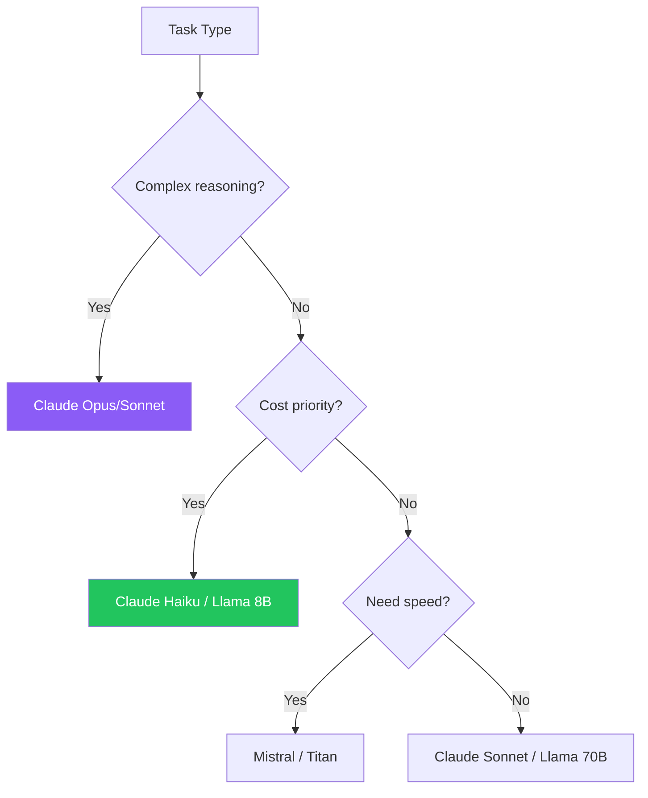

Each foundation model in Amazon Bedrock has its own prompting format and best practices. This guide covers model-specific techniques to get optimal results from Claude, Titan, Llama, and Mistral.

## Why Model-Specific Prompting Matters

Each model was trained differently and responds best to specific formats. Using the right format can significantly improve output quality.

## Anthropic Claude

Claude excels with structured prompts using XML tags and clear instructions.

### System Prompt Usage

```python
response = client.converse(
    modelId='anthropic.claude-3-sonnet-20240229-v1:0',
    system=[{
        "text": "You are an expert Python developer. Write clean code with type hints."
    }],
    messages=[
        {"role": "user", "content": [{"text": "Write a JSON parser function."}]}
    ]
)
```

### XML Tags for Structure

```text
Analyze this feedback:

<feedback>
The product arrived late but quality was excellent.
</feedback>

Respond in this format:
<analysis>
<sentiment>positive/negative/mixed</sentiment>
<summary>Brief summary</summary>
</analysis>
```

### Prefilled Assistant Response

```python
messages = [
    {"role": "user", "content": [{"text": "List three benefits:"}]},
    {"role": "assistant", "content": [{"text": "1."}]}  # Guides format
]
```

### Claude Parameters

| Parameter | Range | Recommended |
|-----------|-------|-------------|
| temperature | 0-1 | 0.3-0.7 |
| top_p | 0-1 | 0.9 |
| max_tokens | 1-4096+ | Task-dependent |

## Amazon Titan

Titan uses straightforward instruction-based prompts.

### Basic Format

```python
response = client.invoke_model(
    modelId='amazon.titan-text-express-v1',
    body=json.dumps({
        "inputText": "Explain machine learning simply.",
        "textGenerationConfig": {
            "maxTokenCount": 1024,
            "temperature": 0.7
        }
    })
)
```

### Structured Instructions

```text
Task: Summarize the following text in 3 bullet points.

Text: [Your content here]

Summary:
```

### Titan Parameters

| Parameter | Range | Notes |
|-----------|-------|-------|
| temperature | 0-1 | Lower = more deterministic |
| topP | 0-1 | Nucleus sampling |
| maxTokenCount | 1-8192 | Output limit |

## Meta Llama

Llama 3 uses special tokens for instruction formatting.

### Llama 3 Format

```python
prompt = """<|begin_of_text|><|start_header_id|>system<|end_header_id|>

You are a helpful coding assistant.<|eot_id|><|start_header_id|>user<|end_header_id|}

Write a Python hello world program.<|eot_id|><|start_header_id|>assistant<|end_header_id|>

"""

response = client.invoke_model(
    modelId='meta.llama3-1-70b-instruct-v1:0',
    body=json.dumps({
        "prompt": prompt,
        "max_gen_len": 1024,
        "temperature": 0.7
    })
)
```

### Llama Special Tokens

| Token | Purpose |
|-------|---------|
| `<\|begin_of_text\|>` | Start of prompt |
| `<\|start_header_id\|>` | Role header start |
| `<\|end_header_id\|>` | Role header end |
| `<\|eot_id\|>` | End of turn |

### Llama Parameters

| Parameter | Range | Notes |
|-----------|-------|-------|
| temperature | 0-1 | Creativity control |
| top_p | 0-1 | Nucleus sampling |
| max_gen_len | 1-2048 | Output length |

## Mistral AI

Mistral uses instruction tags for structured prompts.

### Mistral Format

```python
prompt = """<s>[INST] You are a helpful assistant. [/INST]</s>
[INST] Explain cloud computing. [/INST]"""

response = client.invoke_model(
    modelId='mistral.mistral-large-2402-v1:0',
    body=json.dumps({
        "prompt": prompt,
        "max_tokens": 1024,
        "temperature": 0.7
    })
)
```

### Mistral Tokens

| Token | Purpose |
|-------|---------|
| `<s>` | Start of sequence |
| `[INST]` | Instruction start |
| `[/INST]` | Instruction end |
| `</s>` | End of sequence |

## Using Converse API (Unified)

The Converse API abstracts model-specific formats:

```python
# Works with ANY text model
response = client.converse(
    modelId='anthropic.claude-3-sonnet-20240229-v1:0',  # or titan, llama, mistral
    system=[{"text": "You are a helpful assistant."}],
    messages=[
        {"role": "user", "content": [{"text": "Hello!"}]}
    ],
    inferenceConfig={"maxTokens": 1024, "temperature": 0.7}
)
```

## Model Comparison

| Feature | Claude | Titan | Llama | Mistral |
|---------|--------|-------|-------|---------|
| System prompt | Yes | Limited | Yes | Yes |
| XML tags | Excellent | Basic | Basic | Basic |
| Multi-turn | Native | Native | Token-based | Token-based |
| Best for | Complex tasks | General | Code, reasoning | Efficiency |

## Best Practices Summary

| Model | Key Practice |
|-------|-------------|
| Claude | Use XML tags for structure |
| Titan | Keep instructions clear and simple |
| Llama | Use correct special tokens |
| Mistral | Use [INST] tags properly |

## Choosing the Right Model



## Key Takeaways

1. **Each model has optimal formats** - Use model-specific prompting
2. **Claude loves XML tags** - Structure improves output quality
3. **Llama/Mistral need special tokens** - Format correctly for best results
4. **Converse API simplifies** - Use when model-agnostic prompting is acceptable
5. **Test across models** - Same prompt may perform differently

## References

- [Claude Prompting Guide](https://docs.anthropic.com/claude/docs/introduction-to-prompting)
- [Amazon Titan Documentation](https://docs.aws.amazon.com/bedrock/latest/userguide/titan-text-models.html)
- [Llama 3 Prompt Format](https://llama.meta.com/docs/model-cards-and-prompt-formats/meta-llama-3/)
- [Mistral Documentation](https://docs.mistral.ai/)
