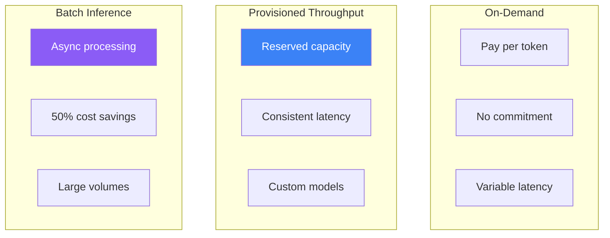

Optimizing inference performance is crucial for production generative AI applications. Amazon Bedrock offers various options to balance cost, latency, and throughput based on your workload requirements.

## Inference Options



## Comparison of Options

| Feature | On-Demand | Provisioned | Batch |
|---------|-----------|-------------|-------|
| Pricing | Per token | Per model unit/hour | Per token (50% off) |
| Latency | Variable | Consistent | N/A (async) |
| Throughput | Shared limits | Dedicated | High volume |
| Use case | Development, variable | Production, consistent | Bulk processing |

## Provisioned Throughput

### Create Provisioned Throughput

```python
import boto3

bedrock = boto3.client('bedrock')

# Create provisioned throughput for a foundation model
response = bedrock.create_provisioned_model_throughput(
    modelUnits=1,
    provisionedModelName='claude-sonnet-production',
    modelId='anthropic.claude-3-sonnet-20240229-v1:0',
    commitmentDuration='OneMonth',  # or 'SixMonths'
    tags=[
        {'key': 'Environment', 'value': 'Production'},
        {'key': 'Team', 'value': 'AI-Platform'}
    ]
)

provisioned_model_arn = response['provisionedModelArn']
print(f"Provisioned model ARN: {provisioned_model_arn}")
```

### Model Units

| Model | Tokens per Model Unit |
|-------|----------------------|
| Claude 3 Sonnet | ~180,000 input + 36,000 output per minute |
| Claude 3 Haiku | ~400,000 input + 80,000 output per minute |
| Titan Text | ~300,000 tokens per minute |

### Use Provisioned Throughput

```python
runtime = boto3.client('bedrock-runtime')

response = runtime.converse(
    modelId=provisioned_model_arn,  # Use provisioned ARN
    messages=[
        {'role': 'user', 'content': [{'text': 'Hello, how are you?'}]}
    ],
    inferenceConfig={'maxTokens': 1024}
)

print(response['output']['message']['content'][0]['text'])
```

### Manage Provisioned Throughput

```python
# List provisioned throughputs
response = bedrock.list_provisioned_model_throughputs()
for pt in response['provisionedModelSummaries']:
    print(f"{pt['provisionedModelName']}: {pt['status']}")

# Get details
response = bedrock.get_provisioned_model_throughput(
    provisionedModelId=provisioned_model_arn
)
print(f"Model units: {response['modelUnits']}")
print(f"Status: {response['status']}")

# Update (increase capacity)
bedrock.update_provisioned_model_throughput(
    provisionedModelId=provisioned_model_arn,
    desiredModelUnits=2
)

# Delete (after commitment ends)
bedrock.delete_provisioned_model_throughput(
    provisionedModelId=provisioned_model_arn
)
```

## Batch Inference

### Create Batch Job

```python
import json

# Prepare input data in JSONL format
input_data = [
    {"recordId": "1", "modelInput": {"messages": [{"role": "user", "content": "Summarize cloud computing"}]}},
    {"recordId": "2", "modelInput": {"messages": [{"role": "user", "content": "Explain machine learning"}]}},
    {"recordId": "3", "modelInput": {"messages": [{"role": "user", "content": "What is serverless?"}]}}
]

# Upload to S3
s3 = boto3.client('s3')
input_content = '\n'.join([json.dumps(item) for item in input_data])
s3.put_object(
    Bucket='my-batch-bucket',
    Key='batch-input/input.jsonl',
    Body=input_content
)

# Create batch inference job
response = bedrock.create_model_invocation_job(
    jobName='batch-summarization-001',
    modelId='anthropic.claude-3-haiku-20240307-v1:0',
    roleArn='arn:aws:iam::123456789012:role/BedrockBatchRole',
    inputDataConfig={
        's3InputDataConfig': {
            's3Uri': 's3://my-batch-bucket/batch-input/',
            's3InputFormat': 'JSONL'
        }
    },
    outputDataConfig={
        's3OutputDataConfig': {
            's3Uri': 's3://my-batch-bucket/batch-output/'
        }
    }
)

job_arn = response['jobArn']
```

### Monitor Batch Job

```python
import time

while True:
    response = bedrock.get_model_invocation_job(jobIdentifier=job_arn)
    status = response['status']
    print(f"Status: {status}")

    if status in ['Completed', 'Failed', 'Stopped']:
        break

    time.sleep(30)

# Get results
if status == 'Completed':
    output_uri = response['outputDataConfig']['s3OutputDataConfig']['s3Uri']
    print(f"Results available at: {output_uri}")
```

## Latency Optimization

### Streaming Responses

```python
def stream_response(prompt: str) -> str:
    """Stream response for faster time-to-first-token."""
    response = runtime.converse_stream(
        modelId='anthropic.claude-3-sonnet-20240229-v1:0',
        messages=[{'role': 'user', 'content': [{'text': prompt}]}],
        inferenceConfig={'maxTokens': 1024}
    )

    full_response = []
    for event in response['stream']:
        if 'contentBlockDelta' in event:
            text = event['contentBlockDelta']['delta'].get('text', '')
            print(text, end='', flush=True)
            full_response.append(text)

    return ''.join(full_response)
```

### Model Selection for Latency

| Model | Average Latency | Use Case |
|-------|-----------------|----------|
| Claude 3 Haiku | ~0.5s TTFT | Real-time chat |
| Claude 3 Sonnet | ~1s TTFT | Balanced tasks |
| Claude 3 Opus | ~2s TTFT | Complex reasoning |

### Prompt Optimization

```python
def optimize_prompt(prompt: str) -> str:
    """Optimize prompt for faster inference."""
    # Remove unnecessary whitespace
    prompt = ' '.join(prompt.split())

    # Be concise in instructions
    # Instead of: "Please provide a detailed response..."
    # Use: "Respond concisely..."

    return prompt

def limit_context(context: str, max_chars: int = 4000) -> str:
    """Limit context to reduce input tokens."""
    if len(context) <= max_chars:
        return context

    # Truncate intelligently
    return context[:max_chars] + "...[truncated]"
```

### Connection Optimization

```python
from botocore.config import Config

# Configure for low latency
config = Config(
    connect_timeout=5,
    read_timeout=60,
    retries={'max_attempts': 2, 'mode': 'adaptive'},
    tcp_keepalive=True
)

runtime = boto3.client('bedrock-runtime', config=config)
```

## Cost Optimization

### Token Usage Monitoring

```python
def track_usage(response: dict) -> dict:
    """Extract and track token usage."""
    usage = response.get('usage', {})
    return {
        'input_tokens': usage.get('inputTokens', 0),
        'output_tokens': usage.get('outputTokens', 0),
        'total_tokens': usage.get('inputTokens', 0) + usage.get('outputTokens', 0)
    }

# Calculate cost (example rates)
def estimate_cost(usage: dict, model: str = 'claude-3-sonnet') -> float:
    rates = {
        'claude-3-sonnet': {'input': 0.003, 'output': 0.015},  # per 1K tokens
        'claude-3-haiku': {'input': 0.00025, 'output': 0.00125}
    }
    rate = rates.get(model, rates['claude-3-sonnet'])
    return (usage['input_tokens'] * rate['input'] + usage['output_tokens'] * rate['output']) / 1000
```

### Caching Strategies

```python
import hashlib
import json
from functools import lru_cache

class BedrockCache:
    def __init__(self, dynamodb_table: str):
        self.dynamodb = boto3.resource('dynamodb')
        self.table = self.dynamodb.Table(dynamodb_table)
        self.runtime = boto3.client('bedrock-runtime')

    def _cache_key(self, model_id: str, messages: list) -> str:
        content = json.dumps({'model': model_id, 'messages': messages}, sort_keys=True)
        return hashlib.sha256(content.encode()).hexdigest()

    def get_response(self, model_id: str, messages: list,
                    use_cache: bool = True) -> str:
        cache_key = self._cache_key(model_id, messages)

        # Check cache
        if use_cache:
            try:
                item = self.table.get_item(Key={'cache_key': cache_key})
                if 'Item' in item:
                    return item['Item']['response']
            except Exception:
                pass

        # Call Bedrock
        response = self.runtime.converse(
            modelId=model_id,
            messages=messages
        )
        result = response['output']['message']['content'][0]['text']

        # Cache result
        if use_cache:
            self.table.put_item(Item={
                'cache_key': cache_key,
                'response': result,
                'ttl': int(time.time()) + 3600  # 1 hour TTL
            })

        return result
```

### Model Selection by Task

```python
class ModelSelector:
    MODELS = {
        'simple': 'anthropic.claude-3-haiku-20240307-v1:0',
        'moderate': 'anthropic.claude-3-sonnet-20240229-v1:0',
        'complex': 'anthropic.claude-3-opus-20240229-v1:0'
    }

    def __init__(self):
        self.runtime = boto3.client('bedrock-runtime')

    def classify_complexity(self, prompt: str) -> str:
        """Classify task complexity to select appropriate model."""
        # Simple heuristics
        word_count = len(prompt.split())

        if word_count < 50 and not any(kw in prompt.lower() for kw in ['analyze', 'compare', 'explain in detail']):
            return 'simple'
        elif word_count < 200:
            return 'moderate'
        else:
            return 'complex'

    def invoke(self, prompt: str, force_model: str = None) -> str:
        complexity = force_model or self.classify_complexity(prompt)
        model_id = self.MODELS[complexity]

        response = self.runtime.converse(
            modelId=model_id,
            messages=[{'role': 'user', 'content': [{'text': prompt}]}]
        )

        return response['output']['message']['content'][0]['text']
```

## Performance Monitoring

```python
import time
from dataclasses import dataclass

@dataclass
class InferenceMetrics:
    latency_ms: float
    input_tokens: int
    output_tokens: int
    model_id: str

class PerformanceMonitor:
    def __init__(self):
        self.runtime = boto3.client('bedrock-runtime')
        self.cloudwatch = boto3.client('cloudwatch')

    def invoke_with_metrics(self, model_id: str, messages: list) -> tuple:
        start = time.time()

        response = self.runtime.converse(
            modelId=model_id,
            messages=messages
        )

        latency = (time.time() - start) * 1000  # ms

        metrics = InferenceMetrics(
            latency_ms=latency,
            input_tokens=response['usage']['inputTokens'],
            output_tokens=response['usage']['outputTokens'],
            model_id=model_id
        )

        self._publish_metrics(metrics)

        return response['output']['message']['content'][0]['text'], metrics

    def _publish_metrics(self, metrics: InferenceMetrics):
        self.cloudwatch.put_metric_data(
            Namespace='Custom/Bedrock',
            MetricData=[
                {
                    'MetricName': 'InferenceLatency',
                    'Value': metrics.latency_ms,
                    'Unit': 'Milliseconds',
                    'Dimensions': [{'Name': 'ModelId', 'Value': metrics.model_id}]
                },
                {
                    'MetricName': 'TokensProcessed',
                    'Value': metrics.input_tokens + metrics.output_tokens,
                    'Unit': 'Count',
                    'Dimensions': [{'Name': 'ModelId', 'Value': metrics.model_id}]
                }
            ]
        )
```

## Best Practices

| Optimization | Implementation |
|--------------|----------------|
| Use Haiku for simple tasks | Classify and route requests |
| Stream responses | Reduce perceived latency |
| Cache frequent queries | DynamoDB or ElastiCache |
| Batch non-urgent tasks | 50% cost savings |
| Provisioned for production | Consistent latency |

## Key Takeaways

1. **Provisioned Throughput** - Dedicated capacity for consistent latency
2. **Batch inference** - 50% cost savings for bulk processing
3. **Model selection** - Match model to task complexity
4. **Streaming** - Improve user experience with faster first token
5. **Caching** - Reduce costs and latency for repeated queries

## References

- [Provisioned Throughput](https://docs.aws.amazon.com/bedrock/latest/userguide/prov-throughput.html)
- [Batch Inference](https://docs.aws.amazon.com/bedrock/latest/userguide/batch-inference.html)
- [Pricing](https://aws.amazon.com/bedrock/pricing/)
