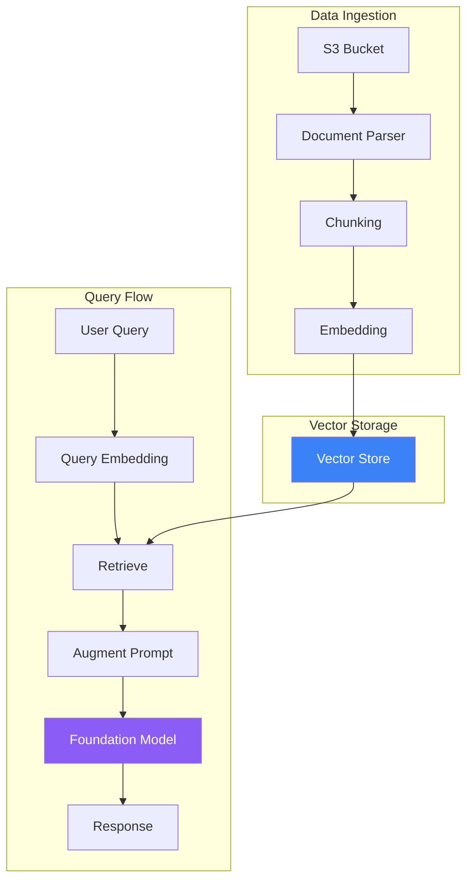

Amazon Bedrock Knowledge Bases provides a fully managed RAG solution. It handles document ingestion, embedding generation, vector storage, and retrieval—letting you focus on your application.

## Knowledge Bases Architecture



## Creating a Knowledge Base

### Console Setup

1. Navigate to Amazon Bedrock → Knowledge Bases
2. Click "Create knowledge base"
3. Configure:
   - Name and description
   - IAM role (auto-created or existing)
   - Data source (S3)
   - Embedding model
   - Vector store

### Using AWS CLI

```bash
# Create knowledge base
aws bedrock-agent create-knowledge-base \
    --name "product-docs-kb" \
    --role-arn "arn:aws:iam::123456789012:role/BedrockKBRole" \
    --knowledge-base-configuration '{
        "type": "VECTOR",
        "vectorKnowledgeBaseConfiguration": {
            "embeddingModelArn": "arn:aws:bedrock:us-east-1::foundation-model/amazon.titan-embed-text-v1"
        }
    }' \
    --storage-configuration '{
        "type": "OPENSEARCH_SERVERLESS",
        "opensearchServerlessConfiguration": {
            "collectionArn": "arn:aws:aoss:us-east-1:123456789012:collection/abc123",
            "vectorIndexName": "bedrock-kb-index",
            "fieldMapping": {
                "vectorField": "embedding",
                "textField": "text",
                "metadataField": "metadata"
            }
        }
    }'
```

## Data Sources

### S3 Data Source

```python
import boto3

client = boto3.client('bedrock-agent')

# Create data source
response = client.create_data_source(
    knowledgeBaseId='KB_ID',
    name='product-docs',
    dataSourceConfiguration={
        'type': 'S3',
        's3Configuration': {
            'bucketArn': 'arn:aws:s3:::my-docs-bucket',
            'inclusionPrefixes': ['docs/']
        }
    },
    vectorIngestionConfiguration={
        'chunkingConfiguration': {
            'chunkingStrategy': 'FIXED_SIZE',
            'fixedSizeChunkingConfiguration': {
                'maxTokens': 512,
                'overlapPercentage': 20
            }
        }
    }
)
```

### Supported File Types

| Format | Extension |
|--------|-----------|
| Text | .txt |
| PDF | .pdf |
| HTML | .html |
| Markdown | .md |
| Word | .doc, .docx |
| CSV | .csv |
| Excel | .xls, .xlsx |

## Chunking Strategies

### Fixed Size Chunking

```python
'chunkingConfiguration': {
    'chunkingStrategy': 'FIXED_SIZE',
    'fixedSizeChunkingConfiguration': {
        'maxTokens': 512,
        'overlapPercentage': 20
    }
}
```

### Semantic Chunking

```python
'chunkingConfiguration': {
    'chunkingStrategy': 'SEMANTIC',
    'semanticChunkingConfiguration': {
        'maxTokens': 512,
        'bufferSize': 0,
        'breakpointPercentileThreshold': 95
    }
}
```

### Hierarchical Chunking

```python
'chunkingConfiguration': {
    'chunkingStrategy': 'HIERARCHICAL',
    'hierarchicalChunkingConfiguration': {
        'levelConfigurations': [
            {'maxTokens': 1500},  # Parent chunks
            {'maxTokens': 300}    # Child chunks
        ],
        'overlapTokens': 60
    }
}
```

### Chunking Strategy Comparison

| Strategy | Best For | Characteristics |
|----------|----------|-----------------|
| Fixed Size | General use | Predictable, simple |
| Semantic | Natural boundaries | Better context preservation |
| Hierarchical | Long documents | Multi-level retrieval |

## Syncing Data

```python
# Start ingestion job
response = client.start_ingestion_job(
    knowledgeBaseId='KB_ID',
    dataSourceId='DS_ID'
)

job_id = response['ingestionJob']['ingestionJobId']

# Check status
status_response = client.get_ingestion_job(
    knowledgeBaseId='KB_ID',
    dataSourceId='DS_ID',
    ingestionJobId=job_id
)

print(f"Status: {status_response['ingestionJob']['status']}")
```

## Querying Knowledge Bases

### Retrieve API

Get relevant documents without generation:

```python
client = boto3.client('bedrock-agent-runtime')

response = client.retrieve(
    knowledgeBaseId='KB_ID',
    retrievalQuery={
        'text': 'What is the return policy?'
    },
    retrievalConfiguration={
        'vectorSearchConfiguration': {
            'numberOfResults': 5
        }
    }
)

for result in response['retrievalResults']:
    print(f"Score: {result['score']}")
    print(f"Content: {result['content']['text']}")
    print(f"Source: {result['location']['s3Location']['uri']}")
    print("---")
```

### RetrieveAndGenerate API

Retrieve and generate response in one call:

```python
response = client.retrieve_and_generate(
    input={
        'text': 'What is the return policy?'
    },
    retrieveAndGenerateConfiguration={
        'type': 'KNOWLEDGE_BASE',
        'knowledgeBaseConfiguration': {
            'knowledgeBaseId': 'KB_ID',
            'modelArn': 'arn:aws:bedrock:us-east-1::foundation-model/anthropic.claude-3-sonnet-20240229-v1:0',
            'retrievalConfiguration': {
                'vectorSearchConfiguration': {
                    'numberOfResults': 5
                }
            }
        }
    }
)

print(response['output']['text'])

# Show citations
for citation in response.get('citations', []):
    for ref in citation.get('retrievedReferences', []):
        print(f"Source: {ref['location']['s3Location']['uri']}")
```

### Session Management

Maintain conversation context:

```python
# First query
response = client.retrieve_and_generate(
    input={'text': 'What products do you offer?'},
    retrieveAndGenerateConfiguration={
        'type': 'KNOWLEDGE_BASE',
        'knowledgeBaseConfiguration': {
            'knowledgeBaseId': 'KB_ID',
            'modelArn': 'model-arn'
        }
    }
)

session_id = response['sessionId']

# Follow-up query with session
response = client.retrieve_and_generate(
    sessionId=session_id,
    input={'text': 'What are their prices?'},
    retrieveAndGenerateConfiguration={
        'type': 'KNOWLEDGE_BASE',
        'knowledgeBaseConfiguration': {
            'knowledgeBaseId': 'KB_ID',
            'modelArn': 'model-arn'
        }
    }
)
```

## Advanced Configuration

### Metadata Filtering

```python
response = client.retrieve(
    knowledgeBaseId='KB_ID',
    retrievalQuery={'text': 'pricing information'},
    retrievalConfiguration={
        'vectorSearchConfiguration': {
            'numberOfResults': 5,
            'filter': {
                'equals': {
                    'key': 'category',
                    'value': 'pricing'
                }
            }
        }
    }
)
```

### Hybrid Search

```python
'vectorSearchConfiguration': {
    'numberOfResults': 5,
    'overrideSearchType': 'HYBRID'  # Combines vector + keyword
}
```

## Vector Store Options

| Store | Setup | Best For |
|-------|-------|----------|
| OpenSearch Serverless | Auto-managed | Most use cases |
| Aurora PostgreSQL | Self-managed | Existing PostgreSQL |
| Pinecone | External | Existing Pinecone |
| Redis Enterprise | External | Low latency |
| MongoDB Atlas | External | Existing MongoDB |

## Complete RAG Application

```python
import boto3
from typing import Optional

class KnowledgeBaseRAG:
    def __init__(self, kb_id: str, model_arn: str):
        self.client = boto3.client('bedrock-agent-runtime')
        self.kb_id = kb_id
        self.model_arn = model_arn
        self.session_id: Optional[str] = None

    def query(self, question: str, new_session: bool = False) -> dict:
        if new_session:
            self.session_id = None

        kwargs = {
            'input': {'text': question},
            'retrieveAndGenerateConfiguration': {
                'type': 'KNOWLEDGE_BASE',
                'knowledgeBaseConfiguration': {
                    'knowledgeBaseId': self.kb_id,
                    'modelArn': self.model_arn,
                    'retrievalConfiguration': {
                        'vectorSearchConfiguration': {
                            'numberOfResults': 5
                        }
                    }
                }
            }
        }

        if self.session_id:
            kwargs['sessionId'] = self.session_id

        response = self.client.retrieve_and_generate(**kwargs)
        self.session_id = response.get('sessionId')

        return {
            'answer': response['output']['text'],
            'citations': [
                ref['location']['s3Location']['uri']
                for citation in response.get('citations', [])
                for ref in citation.get('retrievedReferences', [])
            ],
            'session_id': self.session_id
        }

# Usage
rag = KnowledgeBaseRAG(
    kb_id='YOUR_KB_ID',
    model_arn='arn:aws:bedrock:us-east-1::foundation-model/anthropic.claude-3-sonnet-20240229-v1:0'
)

result = rag.query("What is your return policy?")
print(f"Answer: {result['answer']}")
print(f"Sources: {result['citations']}")
```

## Best Practices

| Practice | Recommendation |
|----------|----------------|
| Chunk size | 256-512 tokens for most cases |
| Overlap | 10-20% to preserve context |
| Update frequency | Sync when source data changes |
| Model selection | Match model to query complexity |
| Metadata | Add filters for better relevance |

## Key Takeaways

1. **Fully managed RAG** - No infrastructure to manage
2. **Multiple chunking strategies** - Choose based on document type
3. **Built-in citations** - Track source documents
4. **Session support** - Multi-turn conversations
5. **Flexible storage** - Multiple vector store options

## References

- [Amazon Bedrock Knowledge Bases](https://docs.aws.amazon.com/bedrock/latest/userguide/knowledge-base.html)
- [Knowledge Base APIs](https://docs.aws.amazon.com/bedrock/latest/APIReference/API_agent-runtime_RetrieveAndGenerate.html)
