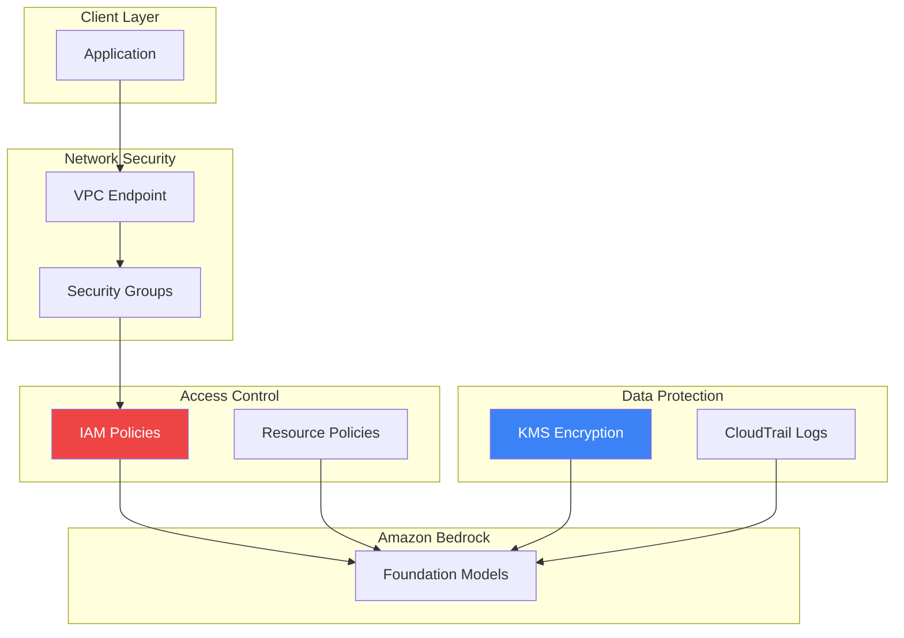

Security is a shared responsibility when building generative AI applications. Amazon Bedrock provides multiple security controls to protect your data and ensure compliance with regulatory requirements.

## Security Architecture



## IAM Policies

### Basic Bedrock Access

```json
{
    "Version": "2012-10-17",
    "Statement": [
        {
            "Sid": "BedrockInvoke",
            "Effect": "Allow",
            "Action": [
                "bedrock:InvokeModel",
                "bedrock:InvokeModelWithResponseStream"
            ],
            "Resource": "arn:aws:bedrock:*::foundation-model/*"
        }
    ]
}
```

### Restrict to Specific Models

```json
{
    "Version": "2012-10-17",
    "Statement": [
        {
            "Sid": "AllowClaudeOnly",
            "Effect": "Allow",
            "Action": [
                "bedrock:InvokeModel",
                "bedrock:InvokeModelWithResponseStream"
            ],
            "Resource": [
                "arn:aws:bedrock:us-east-1::foundation-model/anthropic.claude-3-sonnet-20240229-v1:0",
                "arn:aws:bedrock:us-east-1::foundation-model/anthropic.claude-3-haiku-20240307-v1:0"
            ]
        }
    ]
}
```

### Knowledge Bases Access

```json
{
    "Version": "2012-10-17",
    "Statement": [
        {
            "Sid": "KnowledgeBaseAccess",
            "Effect": "Allow",
            "Action": [
                "bedrock:Retrieve",
                "bedrock:RetrieveAndGenerate"
            ],
            "Resource": "arn:aws:bedrock:us-east-1:123456789012:knowledge-base/*"
        },
        {
            "Sid": "S3Access",
            "Effect": "Allow",
            "Action": [
                "s3:GetObject",
                "s3:ListBucket"
            ],
            "Resource": [
                "arn:aws:s3:::my-knowledge-bucket",
                "arn:aws:s3:::my-knowledge-bucket/*"
            ]
        }
    ]
}
```

### Agents Access

```json
{
    "Version": "2012-10-17",
    "Statement": [
        {
            "Sid": "AgentInvoke",
            "Effect": "Allow",
            "Action": [
                "bedrock:InvokeAgent"
            ],
            "Resource": "arn:aws:bedrock:us-east-1:123456789012:agent-alias/*/*"
        }
    ]
}
```

### Guardrails Management

```json
{
    "Version": "2012-10-17",
    "Statement": [
        {
            "Sid": "GuardrailsReadOnly",
            "Effect": "Allow",
            "Action": [
                "bedrock:GetGuardrail",
                "bedrock:ListGuardrails",
                "bedrock:ApplyGuardrail"
            ],
            "Resource": "*"
        },
        {
            "Sid": "GuardrailsAdmin",
            "Effect": "Allow",
            "Action": [
                "bedrock:CreateGuardrail",
                "bedrock:UpdateGuardrail",
                "bedrock:DeleteGuardrail",
                "bedrock:CreateGuardrailVersion"
            ],
            "Resource": "*",
            "Condition": {
                "StringEquals": {
                    "aws:PrincipalTag/Role": "SecurityAdmin"
                }
            }
        }
    ]
}
```

## VPC Endpoints

### Create VPC Endpoint

```python
import boto3

ec2 = boto3.client('ec2')

response = ec2.create_vpc_endpoint(
    VpcId='vpc-12345678',
    ServiceName='com.amazonaws.us-east-1.bedrock-runtime',
    VpcEndpointType='Interface',
    SubnetIds=['subnet-12345678', 'subnet-87654321'],
    SecurityGroupIds=['sg-12345678'],
    PrivateDnsEnabled=True
)

endpoint_id = response['VpcEndpoint']['VpcEndpointId']
```

### VPC Endpoint Policy

```json
{
    "Version": "2012-10-17",
    "Statement": [
        {
            "Sid": "AllowBedrockAccess",
            "Effect": "Allow",
            "Principal": {
                "AWS": "arn:aws:iam::123456789012:role/BedrockRole"
            },
            "Action": [
                "bedrock:InvokeModel",
                "bedrock:InvokeModelWithResponseStream"
            ],
            "Resource": "arn:aws:bedrock:us-east-1::foundation-model/*"
        }
    ]
}
```

### Security Group for Endpoint

```python
response = ec2.create_security_group(
    GroupName='bedrock-endpoint-sg',
    Description='Security group for Bedrock VPC endpoint',
    VpcId='vpc-12345678'
)

sg_id = response['GroupId']

ec2.authorize_security_group_ingress(
    GroupId=sg_id,
    IpPermissions=[
        {
            'IpProtocol': 'tcp',
            'FromPort': 443,
            'ToPort': 443,
            'IpRanges': [{'CidrIp': '10.0.0.0/16'}]
        }
    ]
)
```

## Encryption

### Data Encryption

| Data State | Encryption |
|------------|------------|
| In transit | TLS 1.2+ |
| At rest | AWS managed or customer KMS |
| Model inputs/outputs | Not stored by default |

### KMS Key for Custom Models

```python
import boto3

kms = boto3.client('kms')

# Create KMS key
response = kms.create_key(
    Description='Bedrock custom model encryption key',
    KeyUsage='ENCRYPT_DECRYPT',
    KeySpec='SYMMETRIC_DEFAULT',
    Tags=[
        {'TagKey': 'Purpose', 'TagValue': 'Bedrock'}
    ]
)

key_id = response['KeyMetadata']['KeyId']

# Key policy
key_policy = {
    "Version": "2012-10-17",
    "Statement": [
        {
            "Sid": "Enable IAM policies",
            "Effect": "Allow",
            "Principal": {"AWS": f"arn:aws:iam::123456789012:root"},
            "Action": "kms:*",
            "Resource": "*"
        },
        {
            "Sid": "Allow Bedrock",
            "Effect": "Allow",
            "Principal": {"Service": "bedrock.amazonaws.com"},
            "Action": [
                "kms:Encrypt",
                "kms:Decrypt",
                "kms:GenerateDataKey*"
            ],
            "Resource": "*"
        }
    ]
}

kms.put_key_policy(
    KeyId=key_id,
    PolicyName='default',
    Policy=json.dumps(key_policy)
)
```

### S3 Encryption for Knowledge Bases

```python
s3 = boto3.client('s3')

# Enable server-side encryption
s3.put_bucket_encryption(
    Bucket='my-knowledge-bucket',
    ServerSideEncryptionConfiguration={
        'Rules': [
            {
                'ApplyServerSideEncryptionByDefault': {
                    'SSEAlgorithm': 'aws:kms',
                    'KMSMasterKeyID': key_id
                },
                'BucketKeyEnabled': True
            }
        ]
    }
)
```

## CloudTrail Logging

### Enable Bedrock Logging

```python
cloudtrail = boto3.client('cloudtrail')

response = cloudtrail.put_event_selectors(
    TrailName='my-trail',
    EventSelectors=[
        {
            'ReadWriteType': 'All',
            'IncludeManagementEvents': True,
            'DataResources': [
                {
                    'Type': 'AWS::Bedrock::Guardrail',
                    'Values': ['arn:aws:bedrock:*:*:guardrail/*']
                }
            ]
        }
    ]
)
```

### CloudWatch Log Group

```python
logs = boto3.client('logs')

# Create log group for Bedrock invocations
logs.create_log_group(
    logGroupName='/aws/bedrock/model-invocations',
    kmsKeyId=key_id,
    tags={
        'Purpose': 'Bedrock audit logging'
    }
)

# Set retention
logs.put_retention_policy(
    logGroupName='/aws/bedrock/model-invocations',
    retentionInDays=365
)
```

### Model Invocation Logging

```python
bedrock = boto3.client('bedrock')

response = bedrock.put_model_invocation_logging_configuration(
    loggingConfig={
        'cloudWatchConfig': {
            'logGroupName': '/aws/bedrock/model-invocations',
            'roleArn': 'arn:aws:iam::123456789012:role/BedrockLoggingRole',
            'largeDataDeliveryS3Config': {
                's3BucketName': 'bedrock-logs-bucket',
                's3KeyPrefix': 'large-data/'
            }
        },
        's3Config': {
            'bucketName': 'bedrock-logs-bucket',
            'keyPrefix': 'invocation-logs/'
        },
        'textDataDeliveryEnabled': True,
        'imageDataDeliveryEnabled': False,
        'embeddingDataDeliveryEnabled': False
    }
)
```

## Service Control Policies

### Restrict Regions

```json
{
    "Version": "2012-10-17",
    "Statement": [
        {
            "Sid": "DenyBedrockOutsideAllowedRegions",
            "Effect": "Deny",
            "Action": "bedrock:*",
            "Resource": "*",
            "Condition": {
                "StringNotEquals": {
                    "aws:RequestedRegion": ["us-east-1", "us-west-2"]
                }
            }
        }
    ]
}
```

### Require Guardrails

```json
{
    "Version": "2012-10-17",
    "Statement": [
        {
            "Sid": "RequireGuardrail",
            "Effect": "Deny",
            "Action": [
                "bedrock:InvokeModel",
                "bedrock:InvokeModelWithResponseStream"
            ],
            "Resource": "*",
            "Condition": {
                "Null": {
                    "bedrock:GuardrailArn": "true"
                }
            }
        }
    ]
}
```

## Compliance

### Supported Compliance Programs

| Program | Status |
|---------|--------|
| SOC 1, 2, 3 | Supported |
| ISO 27001 | Supported |
| HIPAA | Eligible |
| PCI DSS | Eligible |
| FedRAMP | In progress |
| GDPR | Compliant |

### Data Residency

```python
# Specify region for data processing
bedrock_us = boto3.client('bedrock-runtime', region_name='us-east-1')
bedrock_eu = boto3.client('bedrock-runtime', region_name='eu-west-1')

# Model availability varies by region
# Check documentation for region-specific model availability
```

## Security Best Practices

```python
import boto3
from botocore.config import Config

class SecureBedrockClient:
    def __init__(self, region: str, role_arn: str = None):
        config = Config(
            retries={'max_attempts': 3, 'mode': 'adaptive'},
            connect_timeout=5,
            read_timeout=60
        )

        if role_arn:
            sts = boto3.client('sts')
            credentials = sts.assume_role(
                RoleArn=role_arn,
                RoleSessionName='BedrockSession'
            )['Credentials']

            self.client = boto3.client(
                'bedrock-runtime',
                region_name=region,
                config=config,
                aws_access_key_id=credentials['AccessKeyId'],
                aws_secret_access_key=credentials['SecretAccessKey'],
                aws_session_token=credentials['SessionToken']
            )
        else:
            self.client = boto3.client(
                'bedrock-runtime',
                region_name=region,
                config=config
            )

    def invoke_model_safely(self, model_id: str, messages: list,
                           guardrail_id: str = None) -> dict:
        params = {
            'modelId': model_id,
            'messages': messages,
            'inferenceConfig': {'maxTokens': 1024}
        }

        if guardrail_id:
            params['guardrailConfig'] = {
                'guardrailIdentifier': guardrail_id,
                'guardrailVersion': 'DRAFT'
            }

        response = self.client.converse(**params)
        return response

# Usage
client = SecureBedrockClient(
    region='us-east-1',
    role_arn='arn:aws:iam::123456789012:role/BedrockRole'
)
```

## Security Checklist

| Category | Check |
|----------|-------|
| IAM | Least privilege policies |
| Network | VPC endpoints enabled |
| Encryption | KMS keys configured |
| Logging | CloudTrail and invocation logging |
| Guardrails | Content filtering enabled |
| Monitoring | CloudWatch alarms set |

## Key Takeaways

1. **Least privilege** - Restrict IAM to specific models and actions
2. **VPC endpoints** - Keep traffic within AWS network
3. **Encryption** - Use KMS for sensitive data
4. **Logging** - Enable CloudTrail and model invocation logging
5. **Guardrails** - Apply content filtering for safety

## References

- [Bedrock Security](https://docs.aws.amazon.com/bedrock/latest/userguide/security.html)
- [IAM for Bedrock](https://docs.aws.amazon.com/bedrock/latest/userguide/security-iam.html)
- [Compliance](https://aws.amazon.com/compliance/)
