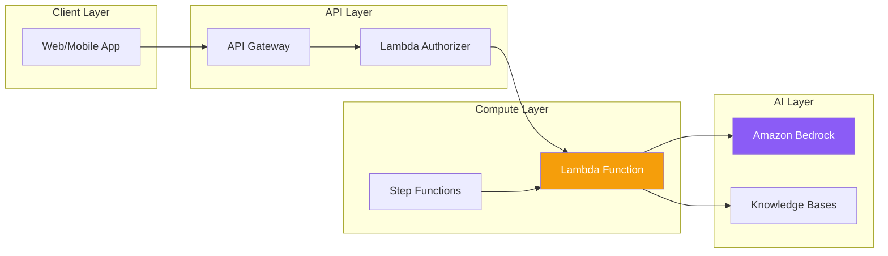

Building serverless generative AI applications allows you to scale automatically, pay only for what you use, and focus on business logic rather than infrastructure management.

## Serverless Architecture for GenAI



## Lambda Integration with Bedrock

### Basic Lambda Function

```python
import json
import boto3

bedrock = boto3.client('bedrock-runtime')

def lambda_handler(event, context):
    body = json.loads(event.get('body', '{}'))
    prompt = body.get('prompt', '')

    if not prompt:
        return {
            'statusCode': 400,
            'body': json.dumps({'error': 'Prompt is required'})
        }

    response = bedrock.converse(
        modelId='anthropic.claude-3-sonnet-20240229-v1:0',
        messages=[{'role': 'user', 'content': [{'text': prompt}]}],
        inferenceConfig={'maxTokens': 1024, 'temperature': 0.7}
    )

    result = response['output']['message']['content'][0]['text']

    return {
        'statusCode': 200,
        'headers': {'Content-Type': 'application/json'},
        'body': json.dumps({'response': result})
    }
```

### Lambda Configuration

| Setting | Recommended Value | Reason |
|---------|-------------------|--------|
| Memory | 512-1024 MB | Sufficient for API calls |
| Timeout | 30-60 seconds | Allow for model inference |
| Runtime | Python 3.12 | Latest boto3 support |

### IAM Policy for Lambda

```json
{
    "Version": "2012-10-17",
    "Statement": [
        {
            "Effect": "Allow",
            "Action": [
                "bedrock:InvokeModel",
                "bedrock:InvokeModelWithResponseStream"
            ],
            "Resource": "arn:aws:bedrock:*::foundation-model/*"
        },
        {
            "Effect": "Allow",
            "Action": [
                "bedrock:Retrieve",
                "bedrock:RetrieveAndGenerate"
            ],
            "Resource": "arn:aws:bedrock:*:*:knowledge-base/*"
        }
    ]
}
```

## API Gateway Integration

### REST API Setup

```yaml
# SAM Template
AWSTemplateFormatVersion: '2010-09-09'
Transform: AWS::Serverless-2016-10-31

Resources:
  GenAIApi:
    Type: AWS::Serverless::Api
    Properties:
      StageName: prod
      Auth:
        ApiKeyRequired: true

  ChatFunction:
    Type: AWS::Serverless::Function
    Properties:
      Handler: app.lambda_handler
      Runtime: python3.12
      MemorySize: 1024
      Timeout: 60
      Policies:
        - Statement:
            - Effect: Allow
              Action:
                - bedrock:InvokeModel
              Resource: '*'
      Events:
        ChatApi:
          Type: Api
          Properties:
            RestApiId: !Ref GenAIApi
            Path: /chat
            Method: post
```

### Streaming with Lambda Function URLs

```python
import json
import boto3

bedrock = boto3.client('bedrock-runtime')

def lambda_handler(event, context):
    body = json.loads(event.get('body', '{}'))
    prompt = body.get('prompt', '')

    response = bedrock.converse_stream(
        modelId='anthropic.claude-3-sonnet-20240229-v1:0',
        messages=[{'role': 'user', 'content': [{'text': prompt}]}],
        inferenceConfig={'maxTokens': 1024}
    )

    def generate():
        for event in response['stream']:
            if 'contentBlockDelta' in event:
                text = event['contentBlockDelta']['delta'].get('text', '')
                yield f"data: {json.dumps({'text': text})}\n\n"
        yield "data: [DONE]\n\n"

    return {
        'statusCode': 200,
        'headers': {
            'Content-Type': 'text/event-stream',
            'Cache-Control': 'no-cache'
        },
        'body': ''.join(generate()),
        'isBase64Encoded': False
    }
```

## Step Functions for Complex Workflows

### Document Processing Pipeline

```json
{
  "Comment": "Document processing with GenAI",
  "StartAt": "ExtractText",
  "States": {
    "ExtractText": {
      "Type": "Task",
      "Resource": "arn:aws:lambda:REGION:ACCOUNT:function:ExtractText",
      "Next": "AnalyzeContent"
    },
    "AnalyzeContent": {
      "Type": "Task",
      "Resource": "arn:aws:states:::bedrock:invokeModel",
      "Parameters": {
        "ModelId": "anthropic.claude-3-sonnet-20240229-v1:0",
        "Body": {
          "anthropic_version": "bedrock-2023-05-31",
          "max_tokens": 2048,
          "messages": [
            {
              "role": "user",
              "content.$": "States.Format('Analyze this document: {}', $.extractedText)"
            }
          ]
        }
      },
      "ResultPath": "$.analysis",
      "Next": "GenerateSummary"
    },
    "GenerateSummary": {
      "Type": "Task",
      "Resource": "arn:aws:states:::bedrock:invokeModel",
      "Parameters": {
        "ModelId": "anthropic.claude-3-haiku-20240307-v1:0",
        "Body": {
          "anthropic_version": "bedrock-2023-05-31",
          "max_tokens": 512,
          "messages": [
            {
              "role": "user",
              "content.$": "States.Format('Summarize: {}', $.analysis.Body.content[0].text)"
            }
          ]
        }
      },
      "End": true
    }
  }
}
```

### Parallel Processing

```json
{
  "StartAt": "ParallelAnalysis",
  "States": {
    "ParallelAnalysis": {
      "Type": "Parallel",
      "Branches": [
        {
          "StartAt": "SentimentAnalysis",
          "States": {
            "SentimentAnalysis": {
              "Type": "Task",
              "Resource": "arn:aws:states:::bedrock:invokeModel",
              "Parameters": {
                "ModelId": "anthropic.claude-3-haiku-20240307-v1:0",
                "Body": {
                  "anthropic_version": "bedrock-2023-05-31",
                  "max_tokens": 100,
                  "messages": [{"role": "user", "content.$": "States.Format('Sentiment of: {}', $.text)"}]
                }
              },
              "End": true
            }
          }
        },
        {
          "StartAt": "KeywordExtraction",
          "States": {
            "KeywordExtraction": {
              "Type": "Task",
              "Resource": "arn:aws:states:::bedrock:invokeModel",
              "Parameters": {
                "ModelId": "anthropic.claude-3-haiku-20240307-v1:0",
                "Body": {
                  "anthropic_version": "bedrock-2023-05-31",
                  "max_tokens": 200,
                  "messages": [{"role": "user", "content.$": "States.Format('Extract keywords: {}', $.text)"}]
                }
              },
              "End": true
            }
          }
        }
      ],
      "Next": "CombineResults"
    },
    "CombineResults": {
      "Type": "Task",
      "Resource": "arn:aws:lambda:REGION:ACCOUNT:function:CombineResults",
      "End": true
    }
  }
}
```

## DynamoDB for Conversation History

```python
import boto3
import uuid
from datetime import datetime

dynamodb = boto3.resource('dynamodb')
table = dynamodb.Table('ConversationHistory')
bedrock = boto3.client('bedrock-runtime')

def lambda_handler(event, context):
    body = json.loads(event.get('body', '{}'))
    conversation_id = body.get('conversation_id', str(uuid.uuid4()))
    user_message = body.get('message', '')

    # Get conversation history
    response = table.query(
        KeyConditionExpression='conversation_id = :cid',
        ExpressionAttributeValues={':cid': conversation_id},
        ScanIndexForward=True
    )

    # Build messages from history
    messages = []
    for item in response.get('Items', []):
        messages.append({'role': item['role'], 'content': [{'text': item['content']}]})

    # Add current message
    messages.append({'role': 'user', 'content': [{'text': user_message}]})

    # Call Bedrock
    ai_response = bedrock.converse(
        modelId='anthropic.claude-3-sonnet-20240229-v1:0',
        messages=messages,
        inferenceConfig={'maxTokens': 1024}
    )

    assistant_message = ai_response['output']['message']['content'][0]['text']

    # Store messages in DynamoDB
    timestamp = datetime.utcnow().isoformat()
    table.put_item(Item={
        'conversation_id': conversation_id,
        'timestamp': f"{timestamp}_user",
        'role': 'user',
        'content': user_message
    })
    table.put_item(Item={
        'conversation_id': conversation_id,
        'timestamp': f"{timestamp}_assistant",
        'role': 'assistant',
        'content': assistant_message
    })

    return {
        'statusCode': 200,
        'body': json.dumps({
            'conversation_id': conversation_id,
            'response': assistant_message
        })
    }
```

## SQS for Async Processing

```python
import boto3
import json

sqs = boto3.client('sqs')
bedrock = boto3.client('bedrock-runtime')

def submit_handler(event, context):
    """Submit task to queue"""
    body = json.loads(event.get('body', '{}'))
    task_id = str(uuid.uuid4())

    sqs.send_message(
        QueueUrl='https://sqs.REGION.amazonaws.com/ACCOUNT/genai-tasks',
        MessageBody=json.dumps({
            'task_id': task_id,
            'prompt': body.get('prompt'),
            'callback_url': body.get('callback_url')
        })
    )

    return {
        'statusCode': 202,
        'body': json.dumps({'task_id': task_id, 'status': 'queued'})
    }

def process_handler(event, context):
    """Process tasks from queue"""
    for record in event['Records']:
        task = json.loads(record['body'])

        response = bedrock.converse(
            modelId='anthropic.claude-3-sonnet-20240229-v1:0',
            messages=[{'role': 'user', 'content': [{'text': task['prompt']}]}]
        )

        result = response['output']['message']['content'][0]['text']

        # Store result or send callback
        if task.get('callback_url'):
            requests.post(task['callback_url'], json={
                'task_id': task['task_id'],
                'result': result
            })
```

## Complete Serverless Architecture

```yaml
# serverless.yml
service: genai-app

provider:
  name: aws
  runtime: python3.12
  region: us-east-1
  iam:
    role:
      statements:
        - Effect: Allow
          Action:
            - bedrock:InvokeModel
            - bedrock:InvokeModelWithResponseStream
          Resource: '*'
        - Effect: Allow
          Action:
            - dynamodb:PutItem
            - dynamodb:Query
          Resource: !GetAtt ConversationTable.Arn

functions:
  chat:
    handler: handlers/chat.handler
    memorySize: 1024
    timeout: 60
    events:
      - http:
          path: /chat
          method: post
          cors: true

  stream:
    handler: handlers/stream.handler
    memorySize: 1024
    timeout: 60
    url:
      invokeMode: RESPONSE_STREAM

resources:
  Resources:
    ConversationTable:
      Type: AWS::DynamoDB::Table
      Properties:
        TableName: ${self:service}-conversations
        BillingMode: PAY_PER_REQUEST
        AttributeDefinitions:
          - AttributeName: conversation_id
            AttributeType: S
          - AttributeName: timestamp
            AttributeType: S
        KeySchema:
          - AttributeName: conversation_id
            KeyType: HASH
          - AttributeName: timestamp
            KeyType: RANGE
```

## Cost Optimization

| Strategy | Implementation |
|----------|----------------|
| Model selection | Use Haiku for simple tasks, Sonnet for complex |
| Caching | Cache frequent responses in ElastiCache |
| Batching | Process multiple requests together |
| Timeouts | Set appropriate Lambda timeouts |
| Reserved concurrency | Limit parallel executions |

## Best Practices

| Practice | Recommendation |
|----------|----------------|
| Error handling | Implement retries with exponential backoff |
| Logging | Use structured logging for debugging |
| Monitoring | Set up CloudWatch alarms |
| Security | Use VPC endpoints for Bedrock |
| Testing | Mock Bedrock responses in tests |

## Key Takeaways

1. **Lambda + Bedrock** - Simple integration with Converse API
2. **API Gateway** - REST or HTTP APIs for client access
3. **Step Functions** - Orchestrate complex GenAI workflows
4. **DynamoDB** - Store conversation history efficiently
5. **Async processing** - Use SQS for long-running tasks

## References

- [Lambda and Bedrock](https://docs.aws.amazon.com/bedrock/latest/userguide/lambda.html)
- [Step Functions Bedrock Integration](https://docs.aws.amazon.com/step-functions/latest/dg/connect-bedrock.html)
- [Serverless Framework](https://www.serverless.com/framework/docs)
