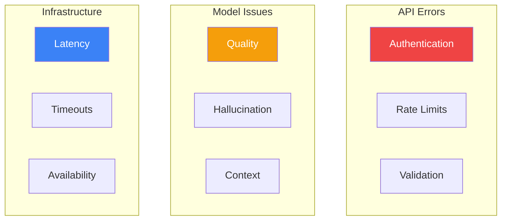

Building production generative AI applications requires understanding common issues and their solutions. This guide covers troubleshooting techniques for Amazon Bedrock.

## Common Error Categories



## API Error Handling

### Common Error Codes

| Error Code | Cause | Solution |
|------------|-------|----------|
| AccessDeniedException | Missing IAM permissions | Update IAM policy |
| ValidationException | Invalid request parameters | Check request format |
| ThrottlingException | Rate limit exceeded | Implement backoff |
| ModelTimeoutException | Request took too long | Reduce input/output size |
| ServiceUnavailableException | Service issue | Retry with backoff |

### Error Handling Implementation

```python
import boto3
from botocore.exceptions import ClientError
import time

class BedrockClient:
    def __init__(self):
        self.runtime = boto3.client('bedrock-runtime')
        self.max_retries = 3
        self.base_delay = 1

    def invoke_with_retry(self, model_id: str, messages: list) -> dict:
        last_exception = None

        for attempt in range(self.max_retries):
            try:
                response = self.runtime.converse(
                    modelId=model_id,
                    messages=messages,
                    inferenceConfig={'maxTokens': 1024}
                )
                return response

            except ClientError as e:
                error_code = e.response['Error']['Code']
                last_exception = e

                if error_code == 'ThrottlingException':
                    # Exponential backoff
                    delay = self.base_delay * (2 ** attempt)
                    print(f"Rate limited. Retrying in {delay}s...")
                    time.sleep(delay)
                    continue

                elif error_code == 'ModelTimeoutException':
                    # Reduce request size or switch model
                    raise Exception("Model timeout. Consider reducing input size.")

                elif error_code == 'ValidationException':
                    # Don't retry validation errors
                    raise Exception(f"Validation error: {e.response['Error']['Message']}")

                elif error_code == 'AccessDeniedException':
                    raise Exception("Access denied. Check IAM permissions.")

                elif error_code in ['ServiceUnavailableException', 'InternalServerException']:
                    delay = self.base_delay * (2 ** attempt)
                    print(f"Service error. Retrying in {delay}s...")
                    time.sleep(delay)
                    continue

                else:
                    raise

        raise last_exception
```

### Rate Limit Management

```python
import threading
from collections import deque

class RateLimiter:
    def __init__(self, requests_per_minute: int):
        self.requests_per_minute = requests_per_minute
        self.request_times = deque()
        self.lock = threading.Lock()

    def wait_if_needed(self):
        with self.lock:
            now = time.time()

            # Remove requests older than 1 minute
            while self.request_times and now - self.request_times[0] > 60:
                self.request_times.popleft()

            if len(self.request_times) >= self.requests_per_minute:
                sleep_time = 60 - (now - self.request_times[0])
                if sleep_time > 0:
                    time.sleep(sleep_time)

            self.request_times.append(time.time())

# Usage
rate_limiter = RateLimiter(requests_per_minute=60)

def call_bedrock(prompt):
    rate_limiter.wait_if_needed()
    # Make API call
```

## Model Quality Issues

### Diagnosing Poor Responses

```python
def diagnose_response_quality(prompt: str, response: str) -> dict:
    """Analyze response quality issues."""
    issues = []

    # Check for empty or very short responses
    if len(response.strip()) < 10:
        issues.append("Response too short - may need more specific prompt")

    # Check for repetition
    words = response.lower().split()
    unique_ratio = len(set(words)) / len(words) if words else 0
    if unique_ratio < 0.5:
        issues.append("High repetition detected - lower temperature or revise prompt")

    # Check for refusal patterns
    refusal_patterns = ["I cannot", "I'm unable", "I don't have", "As an AI"]
    if any(pattern.lower() in response.lower() for pattern in refusal_patterns):
        issues.append("Model may be refusing - check for restricted content")

    # Check prompt length vs response
    if len(prompt) > 4000 and len(response) < 100:
        issues.append("Long prompt with short response - model may be truncating")

    return {
        'issues': issues,
        'word_count': len(words),
        'unique_ratio': unique_ratio,
        'has_issues': len(issues) > 0
    }
```

### Improving Response Quality

```python
def improve_prompt(original_prompt: str, issue_type: str) -> str:
    """Generate improved prompt based on issue type."""
    improvements = {
        'too_short': f"""Please provide a detailed and comprehensive response.

{original_prompt}

Be thorough in your explanation and include relevant examples.""",

        'repetitive': f"""Please provide a varied and diverse response without repetition.

{original_prompt}""",

        'off_topic': f"""Focus specifically on answering this question. Stay on topic.

{original_prompt}

Only discuss information directly relevant to the question.""",

        'hallucination': f"""Answer based only on factual information. If you're uncertain about something, say so.

{original_prompt}

Important: Do not make up information. Only state what you know to be accurate."""
    }

    return improvements.get(issue_type, original_prompt)
```

### Handling Hallucinations

```python
def detect_potential_hallucination(response: str, context: str = None) -> dict:
    """Detect potential hallucinations in response."""
    indicators = []

    # Check for specific claims without context support
    specific_patterns = [
        r'\d{4}',  # Years
        r'\d+%',   # Percentages
        r'\$\d+',  # Dollar amounts
        r'according to',
        r'studies show',
        r'research indicates'
    ]

    import re
    for pattern in specific_patterns:
        if re.search(pattern, response) and context:
            if not re.search(pattern, context):
                indicators.append(f"Specific claim ({pattern}) not found in context")

    # Check confidence language
    high_confidence_phrases = [
        'definitely', 'certainly', 'always', 'never', 'all', 'none'
    ]
    for phrase in high_confidence_phrases:
        if phrase in response.lower():
            indicators.append(f"High confidence phrase: '{phrase}'")

    return {
        'potential_hallucination': len(indicators) > 0,
        'indicators': indicators,
        'recommendation': 'Verify claims against authoritative sources'
    }
```

## Knowledge Bases Troubleshooting

### Common Issues

| Issue | Cause | Solution |
|-------|-------|----------|
| No results | Poor chunking or query | Adjust chunk size, rephrase query |
| Irrelevant results | Embedding mismatch | Improve document quality |
| Missing documents | Sync failure | Check sync status, S3 permissions |
| Slow retrieval | Large index | Optimize vector store |

### Debugging Retrieval

```python
def debug_knowledge_base_retrieval(knowledge_base_id: str, query: str) -> dict:
    """Debug Knowledge Base retrieval issues."""
    bedrock_agent = boto3.client('bedrock-agent-runtime')
    bedrock = boto3.client('bedrock-agent')

    # Check Knowledge Base status
    try:
        kb_response = bedrock.get_knowledge_base(knowledgeBaseId=knowledge_base_id)
        kb_status = kb_response['knowledgeBase']['status']
        print(f"Knowledge Base status: {kb_status}")

        if kb_status != 'ACTIVE':
            return {'error': f'Knowledge Base not active: {kb_status}'}
    except Exception as e:
        return {'error': f'Failed to get Knowledge Base: {str(e)}'}

    # Test retrieval
    try:
        response = bedrock_agent.retrieve(
            knowledgeBaseId=knowledge_base_id,
            retrievalQuery={'text': query},
            retrievalConfiguration={
                'vectorSearchConfiguration': {
                    'numberOfResults': 10
                }
            }
        )

        results = response['retrievalResults']
        print(f"Retrieved {len(results)} results")

        # Analyze results
        analysis = {
            'total_results': len(results),
            'results': []
        }

        for i, result in enumerate(results):
            score = result.get('score', 0)
            content_preview = result['content']['text'][:200]

            analysis['results'].append({
                'rank': i + 1,
                'score': score,
                'preview': content_preview,
                'location': result['location']['s3Location']['uri']
            })

            print(f"Result {i+1}: Score={score:.4f}")
            print(f"  Preview: {content_preview[:100]}...")

        return analysis

    except Exception as e:
        return {'error': f'Retrieval failed: {str(e)}'}
```

### Sync Issues

```python
def check_data_source_sync(knowledge_base_id: str, data_source_id: str) -> dict:
    """Check and debug data source sync status."""
    bedrock = boto3.client('bedrock-agent')

    # Get data source details
    response = bedrock.get_data_source(
        knowledgeBaseId=knowledge_base_id,
        dataSourceId=data_source_id
    )

    data_source = response['dataSource']
    print(f"Data source status: {data_source['status']}")

    # List ingestion jobs
    jobs_response = bedrock.list_ingestion_jobs(
        knowledgeBaseId=knowledge_base_id,
        dataSourceId=data_source_id,
        maxResults=5
    )

    sync_info = {
        'data_source_status': data_source['status'],
        'recent_jobs': []
    }

    for job in jobs_response['ingestionJobSummaries']:
        job_info = {
            'job_id': job['ingestionJobId'],
            'status': job['status'],
            'started': str(job.get('startedAt', 'N/A')),
            'updated': str(job.get('updatedAt', 'N/A'))
        }

        # Get detailed stats if available
        if job['status'] in ['COMPLETE', 'FAILED']:
            detail_response = bedrock.get_ingestion_job(
                knowledgeBaseId=knowledge_base_id,
                dataSourceId=data_source_id,
                ingestionJobId=job['ingestionJobId']
            )
            stats = detail_response['ingestionJob'].get('statistics', {})
            job_info['statistics'] = stats

        sync_info['recent_jobs'].append(job_info)
        print(f"Job {job['ingestionJobId']}: {job['status']}")

    return sync_info
```

## Latency Troubleshooting

### Measuring Latency

```python
import time
from dataclasses import dataclass
from typing import Optional

@dataclass
class LatencyMetrics:
    total_ms: float
    time_to_first_token_ms: Optional[float]
    input_tokens: int
    output_tokens: int
    tokens_per_second: float

def measure_latency(model_id: str, messages: list, stream: bool = False) -> LatencyMetrics:
    """Measure detailed latency metrics."""
    runtime = boto3.client('bedrock-runtime')

    start_time = time.time()
    first_token_time = None
    total_output_tokens = 0

    if stream:
        response = runtime.converse_stream(
            modelId=model_id,
            messages=messages,
            inferenceConfig={'maxTokens': 1024}
        )

        for event in response['stream']:
            if 'contentBlockDelta' in event:
                if first_token_time is None:
                    first_token_time = time.time()
                total_output_tokens += 1  # Approximate

        end_time = time.time()
        ttft = (first_token_time - start_time) * 1000 if first_token_time else None

    else:
        response = runtime.converse(
            modelId=model_id,
            messages=messages,
            inferenceConfig={'maxTokens': 1024}
        )
        end_time = time.time()
        ttft = None
        total_output_tokens = response['usage']['outputTokens']

    total_ms = (end_time - start_time) * 1000
    tokens_per_second = total_output_tokens / (end_time - start_time) if total_output_tokens > 0 else 0

    return LatencyMetrics(
        total_ms=total_ms,
        time_to_first_token_ms=ttft,
        input_tokens=response.get('usage', {}).get('inputTokens', 0),
        output_tokens=total_output_tokens,
        tokens_per_second=tokens_per_second
    )
```

### Latency Optimization Checklist

```python
def latency_optimization_checklist(metrics: LatencyMetrics) -> list:
    """Generate latency optimization recommendations."""
    recommendations = []

    if metrics.total_ms > 5000:
        recommendations.append({
            'issue': 'High total latency',
            'suggestions': [
                'Consider using a faster model (e.g., Haiku instead of Sonnet)',
                'Reduce input prompt size',
                'Use Provisioned Throughput for consistent latency'
            ]
        })

    if metrics.time_to_first_token_ms and metrics.time_to_first_token_ms > 2000:
        recommendations.append({
            'issue': 'Slow time to first token',
            'suggestions': [
                'Reduce system prompt length',
                'Consider streaming for better perceived performance',
                'Check for network latency to Bedrock endpoint'
            ]
        })

    if metrics.tokens_per_second < 20:
        recommendations.append({
            'issue': 'Low throughput',
            'suggestions': [
                'Check if hitting rate limits',
                'Consider Provisioned Throughput',
                'Review concurrent request patterns'
            ]
        })

    if metrics.input_tokens > 10000:
        recommendations.append({
            'issue': 'Large input size',
            'suggestions': [
                'Summarize or compress context',
                'Use RAG to retrieve only relevant content',
                'Split into multiple requests'
            ]
        })

    return recommendations
```

## Debugging Checklist

```python
def comprehensive_debug(model_id: str, prompt: str) -> dict:
    """Run comprehensive debugging checks."""
    results = {
        'checks': [],
        'issues': [],
        'recommendations': []
    }

    runtime = boto3.client('bedrock-runtime')

    # Check 1: Model availability
    try:
        bedrock = boto3.client('bedrock')
        model_info = bedrock.get_foundation_model(modelIdentifier=model_id.split(':')[0])
        results['checks'].append({'model_available': True})
    except Exception as e:
        results['issues'].append(f'Model not available: {str(e)}')
        return results

    # Check 2: Basic invocation
    try:
        start = time.time()
        response = runtime.converse(
            modelId=model_id,
            messages=[{'role': 'user', 'content': [{'text': 'Hello'}]}],
            inferenceConfig={'maxTokens': 10}
        )
        latency = (time.time() - start) * 1000
        results['checks'].append({'basic_invocation': True, 'latency_ms': latency})
    except Exception as e:
        results['issues'].append(f'Basic invocation failed: {str(e)}')
        return results

    # Check 3: Full prompt test
    try:
        start = time.time()
        response = runtime.converse(
            modelId=model_id,
            messages=[{'role': 'user', 'content': [{'text': prompt}]}],
            inferenceConfig={'maxTokens': 1024}
        )
        latency = (time.time() - start) * 1000

        results['checks'].append({
            'full_prompt': True,
            'latency_ms': latency,
            'input_tokens': response['usage']['inputTokens'],
            'output_tokens': response['usage']['outputTokens']
        })

        # Quality check
        output = response['output']['message']['content'][0]['text']
        quality = diagnose_response_quality(prompt, output)
        if quality['has_issues']:
            results['issues'].extend(quality['issues'])

    except Exception as e:
        results['issues'].append(f'Full prompt test failed: {str(e)}')

    return results
```

## Best Practices

| Category | Practice |
|----------|----------|
| Error handling | Always implement retry with backoff |
| Monitoring | Track latency, errors, and token usage |
| Testing | Test with edge cases and long inputs |
| Logging | Log requests and responses for debugging |
| Alerts | Set up CloudWatch alarms for anomalies |

## Key Takeaways

1. **Implement robust error handling** - Retry with exponential backoff
2. **Monitor response quality** - Detect and address hallucinations
3. **Debug Knowledge Bases** - Check sync status and retrieval scores
4. **Measure latency** - Track TTFT and total response time
5. **Use checklists** - Systematic debugging approach

## References

- [Bedrock Troubleshooting](https://docs.aws.amazon.com/bedrock/latest/userguide/troubleshooting.html)
- [Error Handling](https://docs.aws.amazon.com/bedrock/latest/userguide/error-handling.html)
- [CloudWatch Monitoring](https://docs.aws.amazon.com/bedrock/latest/userguide/monitoring-cw.html)
