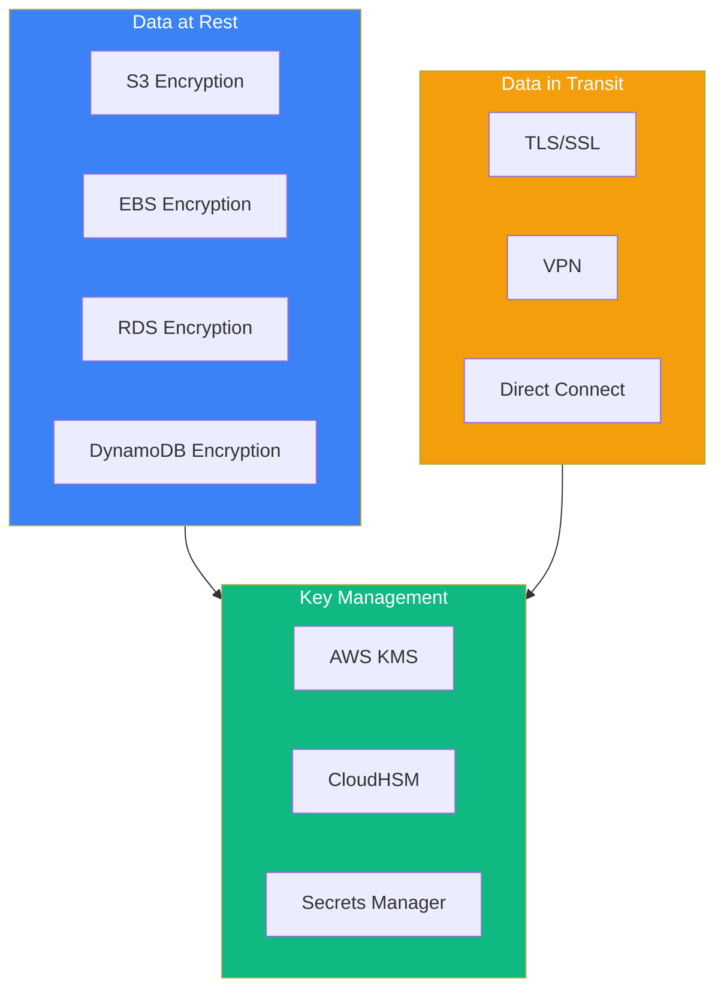
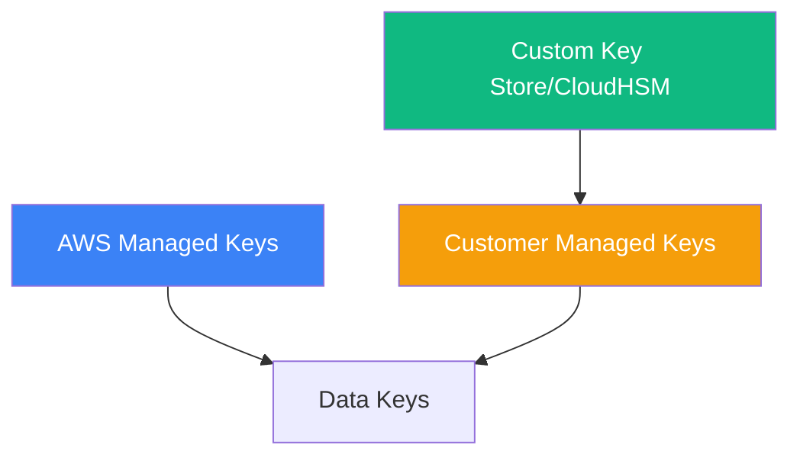
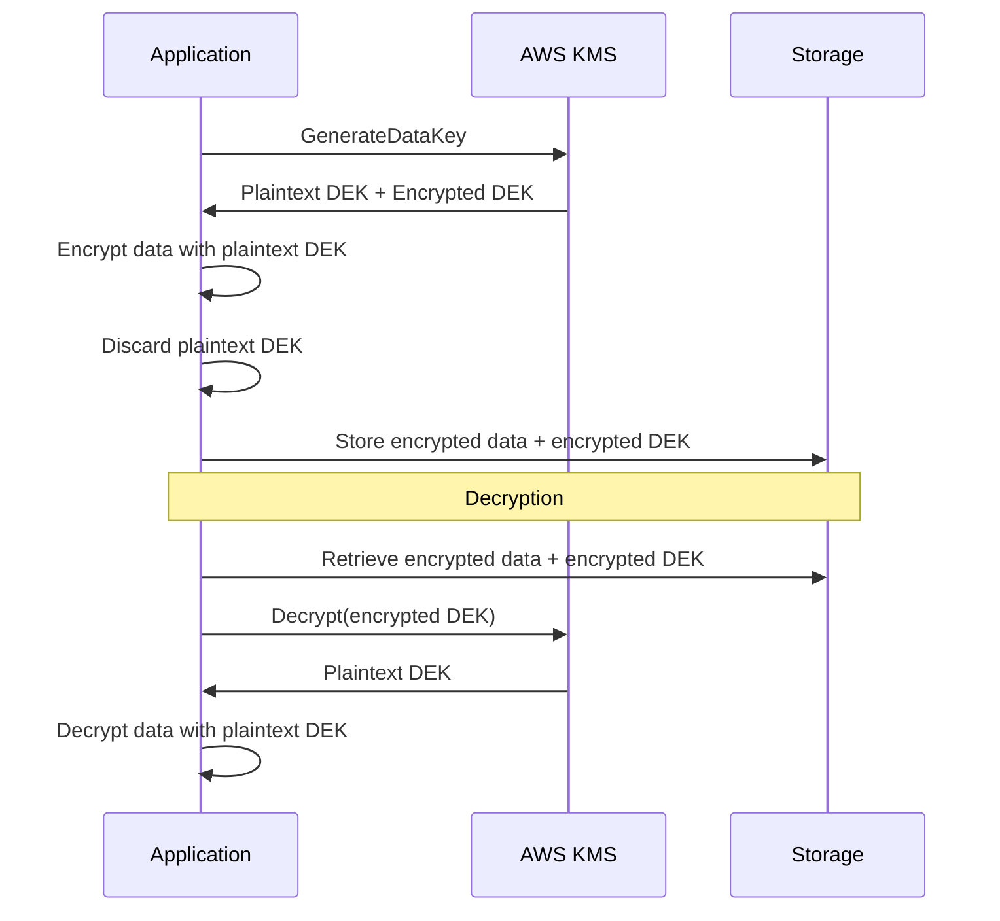
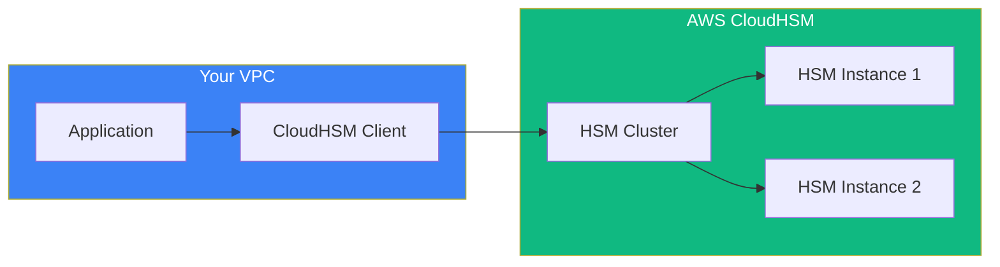

Data protection is a critical domain in the AWS Security Specialty certification. Understanding AWS Key Management Service (KMS) and encryption strategies is essential for securing data at rest and in transit.

## Data Protection Overview



## AWS KMS Key Types

### Key Hierarchy



### Comparison

| Feature | AWS Managed | Customer Managed | Custom Key Store |
|---------|-------------|-----------------|------------------|
| Creation | AWS creates | You create | You create in HSM |
| Rotation | Automatic (yearly) | Optional (yearly) | Manual |
| Key Policy | AWS managed | You manage | You manage |
| Deletion | Cannot delete | 7-30 day waiting | Immediate |
| Cost | Free | $1/month | HSM costs |
| Use Case | Basic encryption | Custom policies | Compliance |

### Creating Customer Managed Keys

```python
import boto3

kms = boto3.client('kms')

# Create symmetric encryption key
response = kms.create_key(
    Description='Application encryption key',
    KeyUsage='ENCRYPT_DECRYPT',
    KeySpec='SYMMETRIC_DEFAULT',
    Origin='AWS_KMS',
    MultiRegion=False,
    Tags=[
        {'TagKey': 'Environment', 'TagValue': 'Production'},
        {'TagKey': 'Application', 'TagValue': 'MyApp'}
    ]
)

key_id = response['KeyMetadata']['KeyId']

# Create alias for easier reference
kms.create_alias(
    AliasName='alias/my-app-key',
    TargetKeyId=key_id
)

# Enable automatic key rotation
kms.enable_key_rotation(KeyId=key_id)
```

## Key Policies

### Default Key Policy

```json
{
  "Version": "2012-10-17",
  "Statement": [
    {
      "Sid": "Enable IAM User Permissions",
      "Effect": "Allow",
      "Principal": {
        "AWS": "arn:aws:iam::123456789012:root"
      },
      "Action": "kms:*",
      "Resource": "*"
    }
  ]
}
```

### Restrictive Key Policy

```json
{
  "Version": "2012-10-17",
  "Statement": [
    {
      "Sid": "Allow Key Administrators",
      "Effect": "Allow",
      "Principal": {
        "AWS": "arn:aws:iam::123456789012:role/KeyAdministrator"
      },
      "Action": [
        "kms:Create*",
        "kms:Describe*",
        "kms:Enable*",
        "kms:List*",
        "kms:Put*",
        "kms:Update*",
        "kms:Revoke*",
        "kms:Disable*",
        "kms:Get*",
        "kms:Delete*",
        "kms:ScheduleKeyDeletion",
        "kms:CancelKeyDeletion"
      ],
      "Resource": "*"
    },
    {
      "Sid": "Allow Key Usage",
      "Effect": "Allow",
      "Principal": {
        "AWS": "arn:aws:iam::123456789012:role/ApplicationRole"
      },
      "Action": [
        "kms:Encrypt",
        "kms:Decrypt",
        "kms:GenerateDataKey*"
      ],
      "Resource": "*",
      "Condition": {
        "StringEquals": {
          "kms:ViaService": "s3.us-east-1.amazonaws.com"
        }
      }
    },
    {
      "Sid": "Allow Grants for AWS Services",
      "Effect": "Allow",
      "Principal": {
        "AWS": "arn:aws:iam::123456789012:role/ApplicationRole"
      },
      "Action": [
        "kms:CreateGrant",
        "kms:ListGrants",
        "kms:RevokeGrant"
      ],
      "Resource": "*",
      "Condition": {
        "Bool": {
          "kms:GrantIsForAWSResource": "true"
        }
      }
    }
  ]
}
```

## Envelope Encryption



### Implementation

```python
import boto3
from cryptography.fernet import Fernet
import base64

kms = boto3.client('kms')

def encrypt_data(key_id: str, plaintext: bytes) -> tuple:
    # Generate data key
    response = kms.generate_data_key(
        KeyId=key_id,
        KeySpec='AES_256'
    )

    plaintext_key = response['Plaintext']
    encrypted_key = response['CiphertextBlob']

    # Encrypt data with plaintext key
    fernet = Fernet(base64.urlsafe_b64encode(plaintext_key))
    encrypted_data = fernet.encrypt(plaintext)

    # Return encrypted data and encrypted key (discard plaintext key)
    return encrypted_data, encrypted_key


def decrypt_data(encrypted_data: bytes, encrypted_key: bytes) -> bytes:
    # Decrypt the data key
    response = kms.decrypt(CiphertextBlob=encrypted_key)
    plaintext_key = response['Plaintext']

    # Decrypt data
    fernet = Fernet(base64.urlsafe_b64encode(plaintext_key))
    return fernet.decrypt(encrypted_data)


# Usage
key_id = 'alias/my-app-key'
data = b'Sensitive information'

encrypted_data, encrypted_key = encrypt_data(key_id, data)
decrypted_data = decrypt_data(encrypted_data, encrypted_key)
```

## S3 Encryption

### Server-Side Encryption Options

| Option | Key Management | Use Case |
|--------|---------------|----------|
| SSE-S3 | AWS manages | Default encryption |
| SSE-KMS | KMS manages | Audit trail, key rotation |
| SSE-C | Customer provides | Full key control |
| Client-side | Application manages | End-to-end encryption |

### SSE-KMS Configuration

```python
import boto3

s3 = boto3.client('s3')

# Enable default encryption on bucket
s3.put_bucket_encryption(
    Bucket='my-secure-bucket',
    ServerSideEncryptionConfiguration={
        'Rules': [
            {
                'ApplyServerSideEncryptionByDefault': {
                    'SSEAlgorithm': 'aws:kms',
                    'KMSMasterKeyID': 'alias/my-bucket-key'
                },
                'BucketKeyEnabled': True  # Reduces KMS costs
            }
        ]
    }
)

# Upload with specific key
s3.put_object(
    Bucket='my-secure-bucket',
    Key='sensitive-file.txt',
    Body=b'Sensitive data',
    ServerSideEncryption='aws:kms',
    SSEKMSKeyId='alias/my-bucket-key'
)
```

### Enforce Encryption with Bucket Policy

```json
{
  "Version": "2012-10-17",
  "Statement": [
    {
      "Sid": "DenyUnencryptedUploads",
      "Effect": "Deny",
      "Principal": "*",
      "Action": "s3:PutObject",
      "Resource": "arn:aws:s3:::my-secure-bucket/*",
      "Condition": {
        "StringNotEquals": {
          "s3:x-amz-server-side-encryption": "aws:kms"
        }
      }
    },
    {
      "Sid": "DenyWrongKMSKey",
      "Effect": "Deny",
      "Principal": "*",
      "Action": "s3:PutObject",
      "Resource": "arn:aws:s3:::my-secure-bucket/*",
      "Condition": {
        "StringNotEquals": {
          "s3:x-amz-server-side-encryption-aws-kms-key-id": "arn:aws:kms:us-east-1:123456789012:key/key-id"
        }
      }
    }
  ]
}
```

## EBS Encryption

```python
import boto3

ec2 = boto3.client('ec2')

# Enable default EBS encryption for the account
ec2.enable_ebs_encryption_by_default()

# Set default KMS key
ec2.modify_ebs_default_kms_key_id(
    KmsKeyId='alias/ebs-default-key'
)

# Create encrypted volume
response = ec2.create_volume(
    AvailabilityZone='us-east-1a',
    Size=100,
    VolumeType='gp3',
    Encrypted=True,
    KmsKeyId='alias/my-ebs-key'
)

# Create encrypted snapshot
ec2.create_snapshot(
    VolumeId='vol-12345678',
    Description='Encrypted snapshot'
)
```

## RDS Encryption

```python
import boto3

rds = boto3.client('rds')

# Create encrypted RDS instance
response = rds.create_db_instance(
    DBInstanceIdentifier='secure-database',
    DBInstanceClass='db.t3.medium',
    Engine='mysql',
    MasterUsername='admin',
    MasterUserPassword='secure-password',
    AllocatedStorage=100,
    StorageEncrypted=True,
    KmsKeyId='alias/rds-encryption-key',
    EnableIAMDatabaseAuthentication=True
)

# Create encrypted snapshot
rds.create_db_snapshot(
    DBSnapshotIdentifier='secure-snapshot',
    DBInstanceIdentifier='secure-database'
)

# Copy snapshot with new KMS key (re-encryption)
rds.copy_db_snapshot(
    SourceDBSnapshotIdentifier='secure-snapshot',
    TargetDBSnapshotIdentifier='re-encrypted-snapshot',
    KmsKeyId='alias/new-rds-key'
)
```

## AWS CloudHSM



### CloudHSM vs KMS

| Feature | AWS KMS | CloudHSM |
|---------|---------|----------|
| Key Storage | AWS managed | Customer controlled HSM |
| Compliance | FIPS 140-2 Level 2 | FIPS 140-2 Level 3 |
| Key Types | Symmetric, RSA, ECC | Symmetric, RSA, ECC, custom |
| Performance | Shared | Dedicated |
| Access | API | Direct HSM access |
| Cost | Per request | Per HSM hour |
| Use Case | Most workloads | Strict compliance |

### CloudHSM Integration with KMS

```python
import boto3

kms = boto3.client('kms')

# Create custom key store backed by CloudHSM
response = kms.create_custom_key_store(
    CustomKeyStoreName='my-hsm-key-store',
    CloudHsmClusterId='cluster-xxx',
    TrustAnchorCertificate=trust_anchor_cert,
    KeyStorePassword='hsm-password'
)

key_store_id = response['CustomKeyStoreId']

# Connect to custom key store
kms.connect_custom_key_store(
    CustomKeyStoreId=key_store_id
)

# Create key in custom key store
key = kms.create_key(
    CustomKeyStoreId=key_store_id,
    Origin='AWS_CLOUDHSM',
    Description='HSM-backed encryption key'
)
```

## AWS Secrets Manager

```python
import boto3
import json

secrets = boto3.client('secretsmanager')

# Create secret
response = secrets.create_secret(
    Name='prod/database/credentials',
    Description='Production database credentials',
    SecretString=json.dumps({
        'username': 'admin',
        'password': 'super-secret-password',
        'host': 'db.example.com',
        'port': 3306
    }),
    KmsKeyId='alias/secrets-key',
    Tags=[
        {'Key': 'Environment', 'Value': 'Production'}
    ]
)

# Enable automatic rotation
secrets.rotate_secret(
    SecretId='prod/database/credentials',
    RotationLambdaARN='arn:aws:lambda:region:account:function:rotate-secret',
    RotationRules={
        'AutomaticallyAfterDays': 30
    }
)

# Retrieve secret
response = secrets.get_secret_value(
    SecretId='prod/database/credentials'
)

credentials = json.loads(response['SecretString'])
```

### Rotation Lambda Function

```python
import boto3
import json

def lambda_handler(event, context):
    secret_id = event['SecretId']
    token = event['ClientRequestToken']
    step = event['Step']

    secrets = boto3.client('secretsmanager')

    if step == 'createSecret':
        # Generate new secret value
        new_password = generate_password()
        secrets.put_secret_value(
            SecretId=secret_id,
            ClientRequestToken=token,
            SecretString=json.dumps({'password': new_password}),
            VersionStages=['AWSPENDING']
        )

    elif step == 'setSecret':
        # Update the database with new credentials
        pending = secrets.get_secret_value(
            SecretId=secret_id,
            VersionStage='AWSPENDING'
        )
        update_database_password(json.loads(pending['SecretString']))

    elif step == 'testSecret':
        # Test the new credentials
        pending = secrets.get_secret_value(
            SecretId=secret_id,
            VersionStage='AWSPENDING'
        )
        test_database_connection(json.loads(pending['SecretString']))

    elif step == 'finishSecret':
        # Move pending to current
        secrets.update_secret_version_stage(
            SecretId=secret_id,
            VersionStage='AWSCURRENT',
            MoveToVersionId=token,
            RemoveFromVersionId=get_current_version(secret_id)
        )
```

## Data Protection Best Practices

### 1. Use KMS for All Encryption

```python
# Enable encryption across services
def enable_encryption():
    # S3
    s3.put_bucket_encryption(
        Bucket='my-bucket',
        ServerSideEncryptionConfiguration={...}
    )

    # EBS
    ec2.enable_ebs_encryption_by_default()

    # RDS - at creation time
    rds.create_db_instance(StorageEncrypted=True, ...)

    # DynamoDB
    dynamodb.update_table(
        TableName='my-table',
        SSESpecification={'Enabled': True, 'SSEType': 'KMS'}
    )
```

### 2. Enforce Encryption in Transit

```python
# S3 bucket policy to enforce HTTPS
{
    "Effect": "Deny",
    "Principal": "*",
    "Action": "s3:*",
    "Resource": ["arn:aws:s3:::bucket/*"],
    "Condition": {
        "Bool": {"aws:SecureTransport": "false"}
    }
}
```

### 3. Implement Key Rotation

```python
# Enable automatic rotation for KMS keys
kms.enable_key_rotation(KeyId='alias/my-key')

# For Secrets Manager
secrets.rotate_secret(
    SecretId='my-secret',
    RotationRules={'AutomaticallyAfterDays': 30}
)
```

### 4. Use Least Privilege for Key Access

```json
{
  "Effect": "Allow",
  "Action": ["kms:Decrypt"],
  "Resource": "arn:aws:kms:region:account:key/key-id",
  "Condition": {
    "StringEquals": {
      "kms:ViaService": "s3.us-east-1.amazonaws.com"
    }
  }
}
```

## Summary

| Service | Purpose | Key Features |
|---------|---------|--------------|
| AWS KMS | Key management | CMK, automatic rotation, key policies |
| CloudHSM | Hardware security | FIPS 140-2 Level 3, dedicated HSM |
| Secrets Manager | Secret storage | Automatic rotation, versioning |
| S3 SSE | Object encryption | SSE-S3, SSE-KMS, SSE-C |
| EBS Encryption | Volume encryption | Default encryption, snapshot encryption |

Key takeaways:

- Use Customer Managed Keys for control and audit
- Implement envelope encryption for large data
- Enable encryption by default for all storage services
- Use CloudHSM for strict compliance requirements
- Rotate secrets automatically with Secrets Manager
- Enforce encryption in transit with TLS
- Apply least privilege to key usage permissions
- Use bucket keys to reduce KMS costs

Data protection is essential for the AWS Security Specialty certification and for building compliant, secure applications.

## References

- [AWS KMS Developer Guide](https://docs.aws.amazon.com/kms/latest/developerguide/)
- [AWS CloudHSM User Guide](https://docs.aws.amazon.com/cloudhsm/latest/userguide/)
- [AWS Secrets Manager User Guide](https://docs.aws.amazon.com/secretsmanager/)
- Muñoz, Mauricio, et al. *AWS Certified Security Study Guide, 2nd Edition*. Wiley, 2025.
- Book, Adam, and Stuart Scott. *AWS Certified Security – Specialty (SCS-C02) Exam Guide*. Packt, 2024.
