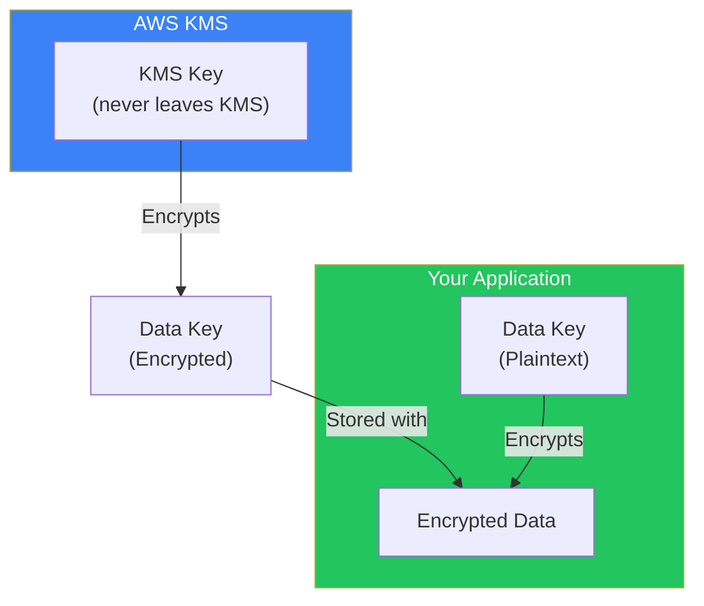
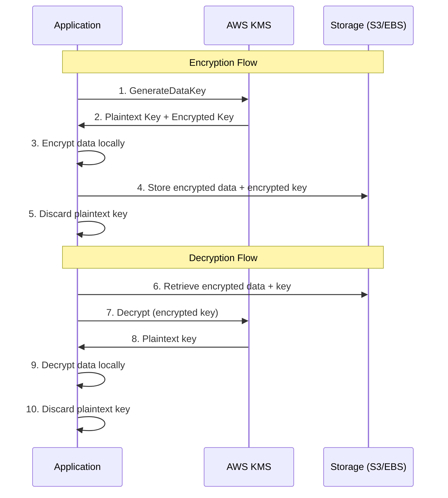

Data is the most valuable asset in most organizations. Customer information, financial records, intellectual property, and operational data—if any of this falls into the wrong hands, the consequences can be devastating. AWS provides multiple layers of data protection, with AWS Key Management Service (KMS) at the center of the encryption strategy.

## Why Data Protection Matters

The goal of data protection is simple: ensure that only authorized parties can read your data, even if the storage medium is compromised.

### The Physical Access Problem

In traditional data centers, physical security provided implicit data protection. If you controlled access to the building, you controlled access to the hard drives. Someone couldn't simply walk out with your database.

In the cloud, this physical barrier doesn't exist in the same way. Your data lives on shared infrastructure managed by AWS. While AWS maintains excellent physical security, you're entrusting your data to systems you don't physically control. Encryption transforms this trust relationship: even if someone gains access to the physical storage, encrypted data is useless without the keys.

### Compliance and Regulatory Requirements

Many regulations mandate encryption:

- **PCI DSS** requires encryption of cardholder data
- **HIPAA** requires encryption of protected health information
- **GDPR** considers encryption a key security measure for personal data
- **SOC 2** evaluates encryption as part of security controls

Without proper encryption and key management, compliance becomes impossible.

### The Insider Threat

Encryption also protects against insider threats. Database administrators can access data in databases. Storage administrators can access raw storage. With proper encryption and key separation, even these privileged users cannot read data without explicit key access permissions.

## Understanding AWS KMS

AWS Key Management Service (KMS) is a managed service for creating and controlling cryptographic keys. Understanding KMS requires understanding several key concepts.

### What KMS Actually Does

KMS has one primary job: protect and manage cryptographic keys. It does not store your data—it stores and protects the keys used to encrypt your data.

When you encrypt data with KMS, you're not sending your data to AWS for encryption (which would be impractical for large datasets). Instead, KMS generates keys that your applications use locally for encryption. This distinction is crucial for understanding how AWS encryption actually works.

### KMS Keys: The Hierarchy

KMS uses a hierarchical key structure:



**KMS Keys (formerly Customer Master Keys)**: These are the top-level keys stored in KMS. They never leave KMS unencrypted. KMS keys can directly encrypt small amounts of data (up to 4 KB) or, more commonly, encrypt data keys.

**Data Keys**: These are the keys actually used to encrypt your data. KMS generates data keys on demand, encrypts them with a KMS key, and gives you both the plaintext key (for immediate use) and the encrypted key (for storage). This pattern is called envelope encryption.

### Types of KMS Keys

AWS offers three types of KMS keys, each with different trade-offs:

**AWS Managed Keys** are created automatically when you enable encryption on AWS services. AWS handles all management—rotation, access policies, lifecycle. You can't manage these keys directly. They're convenient but provide minimal control. Use them for basic encryption where you don't need custom access controls.

**Customer Managed Keys** are keys you create and manage yourself. You control the key policy (who can use the key), rotation schedule, and lifecycle. You can disable or delete these keys. They cost $1/month per key. Use them when you need control over who can decrypt data or when you need to share encrypted data across accounts.

**Custom Key Stores (CloudHSM-backed)** store your keys in dedicated hardware security modules that you control. AWS cannot access these keys. They provide the highest level of control but come with significant operational complexity. Use them for strict regulatory requirements that mandate dedicated key storage.

### Key Policies: Who Can Use Keys

Every KMS key has a key policy that defines who can use it. This is separate from IAM policies, though both are evaluated together.

The default key policy gives the root account full access and allows IAM policies to grant permissions. More restrictive policies can:

- Limit key use to specific roles or services
- Require requests to come through specific AWS services (using `kms:ViaService` condition)
- Enable cross-account access for specific principals
- Separate key administration from key usage

Understanding key policies is essential for implementing least privilege for encryption.

## Envelope Encryption: Why It Exists

Envelope encryption is a pattern where you encrypt data with a data key, then encrypt the data key with a KMS key. This seems like extra complexity—why not just encrypt everything directly with KMS?

### The Performance Problem

KMS is a network service. Every encryption operation requires an API call to AWS. For a few operations, this is fine. For encrypting millions of database records, the latency would be unacceptable.

Envelope encryption solves this by limiting KMS calls. You call KMS once to generate a data key, use that key locally to encrypt any amount of data (fast, no network calls), then store the encrypted data key alongside your data.

### The Size Limit Problem

KMS can only directly encrypt up to 4 KB of data. This is a deliberate design choice—KMS is optimized for key protection, not bulk data encryption. Envelope encryption removes this limitation entirely.

### How It Works in Practice



When encrypting:
1. Call KMS GenerateDataKey to get a plaintext data key and its encrypted form
2. Use the plaintext data key to encrypt your data locally
3. Discard the plaintext data key from memory
4. Store the encrypted data key alongside your encrypted data

When decrypting:
1. Retrieve the encrypted data key from storage
2. Call KMS Decrypt to get the plaintext data key
3. Use the plaintext data key to decrypt your data locally
4. Discard the plaintext data key from memory

The encrypted data key is useless without KMS access. The plaintext key exists only transiently in memory. This provides strong security with good performance.

## Encryption at Rest Across AWS Services

Most AWS storage services integrate with KMS for encryption at rest.

### S3 Encryption Options

S3 offers several encryption options:

**SSE-S3** uses keys managed entirely by S3. You have no visibility into or control over the keys. It's the simplest option but provides the least control.

**SSE-KMS** uses KMS keys. You get CloudTrail logging of key usage, can control access through key policies, and can use customer managed keys for fine-grained control. This is the recommended option for most use cases.

**SSE-C** (customer-provided keys) requires you to provide the encryption key with each request. AWS never stores the key—you're responsible for key management. Use this only if you have specific requirements that prevent using KMS.

**Client-side encryption** means encrypting data before sending it to S3. AWS never sees the plaintext data. Use this when you need end-to-end encryption where even AWS cannot access the data.

A critical feature is **S3 Bucket Keys**, which reduce KMS costs by caching a bucket-level key that S3 uses to encrypt individual object keys. This can reduce KMS request costs by 99% for buckets with many objects.

### EBS Encryption

EBS volumes can be encrypted with KMS keys. When you enable encryption:

- All data at rest on the volume is encrypted
- All snapshots of the volume are encrypted
- All data moving between the instance and volume is encrypted

You can enable default EBS encryption for an account, ensuring all new volumes are automatically encrypted. Unencrypted volumes cannot be directly encrypted—you must create an encrypted snapshot and restore from it.

### RDS Encryption

RDS encryption works at the storage layer:

- All data on disk is encrypted
- Automated backups and snapshots are encrypted
- Read replicas in the same region use the same key

Important limitation: you cannot encrypt an existing unencrypted RDS instance. You must create an encrypted snapshot (by copying with encryption enabled) and restore to a new instance.

### DynamoDB Encryption

DynamoDB supports encryption at rest using either AWS owned keys (default, no cost) or customer managed KMS keys. When using KMS keys, all table data, indexes, and streams are encrypted.

## AWS CloudHSM: When You Need Hardware Control

CloudHSM provides dedicated Hardware Security Modules (HSMs) within your VPC. Unlike KMS where AWS manages the HSM infrastructure, CloudHSM gives you exclusive access to the HSM hardware.

### When to Use CloudHSM

CloudHSM is appropriate when:

**Regulatory requirements mandate dedicated key storage**: Some compliance frameworks (like PCI DSS for certain use cases) require that encryption keys be stored in dedicated hardware that only you control.

**You need FIPS 140-2 Level 3 compliance**: KMS provides Level 2; CloudHSM provides Level 3. Level 3 includes tamper-evidence and tamper-response mechanisms.

**You need specific cryptographic algorithms**: CloudHSM supports a broader range of algorithms than KMS, including custom PKCS#11 operations.

**Performance requirements demand dedicated hardware**: CloudHSM provides predictable latency without the multi-tenant variability of KMS.

### The Operational Reality

CloudHSM comes with significant operational overhead:

- You manage the HSM cluster (though AWS manages the hardware)
- You're responsible for backup and recovery of cryptographic material
- You manage user accounts and keys within the HSM
- If you lose access to your HSM credentials, AWS cannot recover them

For most workloads, KMS provides sufficient security with far less operational burden. Use CloudHSM only when specific requirements demand it.

### Custom Key Stores: The Hybrid Approach

KMS custom key stores let you use CloudHSM-backed keys through the standard KMS API. This provides:

- The control and compliance of CloudHSM
- The simplicity of the KMS API
- Integration with AWS services that use KMS

This hybrid approach is often the best choice when you need CloudHSM compliance but want to use standard AWS service integrations.

## AWS Secrets Manager: Managing Application Secrets

Secrets Manager is purpose-built for managing application secrets—database credentials, API keys, OAuth tokens, and similar sensitive configuration.

### Why Not Just Use KMS Directly?

You could encrypt secrets with KMS and store them in Parameter Store or S3. Secrets Manager adds value through:

**Automatic rotation**: Secrets Manager can automatically rotate database credentials without application downtime. It handles the coordination of creating new credentials, updating the database, and transitioning applications.

**Version management**: Secrets Manager maintains multiple versions of secrets, enabling gradual rollout and rollback of credential changes.

**Native database integration**: For supported databases (RDS, DocumentDB, Redshift), Secrets Manager handles the entire rotation workflow automatically.

**Fine-grained access control**: Combine resource-based policies with IAM for precise control over who can access which secrets.

### The Rotation Challenge

Credential rotation is deceptively difficult. You need to:

1. Generate new credentials
2. Update the database to accept them
3. Transition applications to use them
4. Ensure old credentials remain valid during transition
5. Eventually retire old credentials

Secrets Manager solves this with a four-step rotation process (createSecret, setSecret, testSecret, finishSecret) that handles these challenges systematically.

## Encryption in Transit

Data protection isn't just about data at rest. Data moving across networks needs protection too.

### TLS Everywhere

Modern AWS services default to TLS for data in transit. Your responsibility is ensuring:

- Applications use HTTPS endpoints (not HTTP)
- Older TLS versions are disabled (TLS 1.2+ minimum)
- Certificate validation is not disabled in application code
- Private connectivity (VPC endpoints, PrivateLink) is used when available

### Enforcing Encryption in Transit

S3 bucket policies can deny requests that don't use HTTPS:

```json
{
  "Effect": "Deny",
  "Principal": "*",
  "Action": "s3:*",
  "Resource": "arn:aws:s3:::bucket/*",
  "Condition": {
    "Bool": {"aws:SecureTransport": "false"}
  }
}
```

Similar enforcement is possible for other services through IAM conditions.

## Common Mistakes

### Using AWS Managed Keys When You Need Control

AWS managed keys are convenient but limit your options. You can't:
- See key usage in CloudTrail (the log entries don't show which data was accessed)
- Grant cross-account access
- Disable or delete the key
- Apply custom key policies

If you might need any of these capabilities, use customer managed keys from the start.

### Not Planning for Key Rotation

KMS supports automatic key rotation (annual) for customer managed keys. When rotation happens, KMS keeps old key material to decrypt data encrypted with previous versions. Enable rotation from the beginning—it's transparent to applications.

For secrets, plan how credential rotation will work. Will applications handle credential refresh? How will you coordinate rotation across distributed systems?

### Ignoring Key Deletion Implications

When you schedule a KMS key for deletion, you get a waiting period (7-30 days). Once deleted, any data encrypted with that key is permanently inaccessible. There's no recovery.

Consider using key disabling instead of deletion—disabled keys can be re-enabled. Only delete keys when you're certain all encrypted data has been re-encrypted or is no longer needed.

### Over-Permissioning Key Access

A key policy that allows `kms:*` to many principals defeats the purpose of encryption. If everyone who can access the encrypted data can also access the key, encryption provides minimal protection.

Apply least privilege: separate key administrators (who can manage but not use keys) from key users (who can encrypt/decrypt but not manage). Use conditions to restrict key usage to specific services or contexts.

## Summary

Data protection in AWS centers on encryption with proper key management:

| Service | Purpose | When to Use |
|---------|---------|-------------|
| KMS | Key management and encryption | Most encryption needs |
| CloudHSM | Dedicated hardware key storage | Strict compliance requirements |
| Secrets Manager | Application secret management | Database credentials, API keys |
| S3 SSE-KMS | Object encryption | S3 data with audit requirements |
| EBS/RDS encryption | Volume/database encryption | All production storage |

Key principles:

- **Encrypt by default**: Enable encryption on all storage services
- **Use customer managed keys** when you need control or cross-account access
- **Implement envelope encryption** for application-level encryption
- **Rotate credentials automatically** using Secrets Manager
- **Separate key administration from key usage** for defense in depth
- **Plan for key lifecycle**: rotation, disable, and eventual deletion

Encryption provides the last line of defense—even if other controls fail and an attacker accesses your storage, properly encrypted data remains protected. The complexity of key management is the price of this protection, and AWS services make that complexity manageable.

## References

- [AWS KMS Developer Guide](https://docs.aws.amazon.com/kms/latest/developerguide/)
- [AWS KMS Best Practices](https://docs.aws.amazon.com/kms/latest/developerguide/best-practices.html)
- [AWS CloudHSM User Guide](https://docs.aws.amazon.com/cloudhsm/latest/userguide/)
- [AWS Secrets Manager User Guide](https://docs.aws.amazon.com/secretsmanager/)
- Crane, Dylan. *AWS Security*. Manning Publications, 2022.
- Muñoz, Mauricio, et al. *Mastering AWS Security, 2nd Edition*. Packt, 2024.
