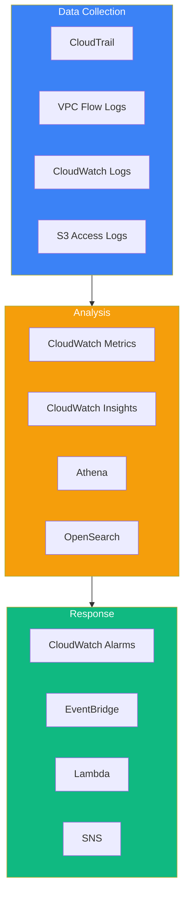

Security logging and monitoring is a critical domain for the AWS Security Specialty certification. Understanding how to collect, analyze, and respond to security events is essential for protecting AWS environments.

## Logging and Monitoring Overview



## AWS CloudTrail

### Trail Configuration

```python
import boto3

cloudtrail = boto3.client('cloudtrail')

# Create multi-region trail with all features
response = cloudtrail.create_trail(
    Name='security-audit-trail',
    S3BucketName='my-cloudtrail-logs',
    S3KeyPrefix='cloudtrail/',
    IncludeGlobalServiceEvents=True,
    IsMultiRegionTrail=True,
    EnableLogFileValidation=True,
    KMSKeyId='arn:aws:kms:us-east-1:123456789012:key/xxx',
    IsOrganizationTrail=True
)

# Start logging
cloudtrail.start_logging(Name='security-audit-trail')

# Enable data events for S3 and Lambda
cloudtrail.put_event_selectors(
    TrailName='security-audit-trail',
    EventSelectors=[
        {
            'ReadWriteType': 'All',
            'IncludeManagementEvents': True,
            'DataResources': [
                {
                    'Type': 'AWS::S3::Object',
                    'Values': ['arn:aws:s3:::sensitive-bucket/']
                },
                {
                    'Type': 'AWS::Lambda::Function',
                    'Values': ['arn:aws:lambda']
                }
            ]
        }
    ]
)
```

### CloudTrail Log Analysis

```python
import boto3
import json
import gzip

s3 = boto3.client('s3')

def analyze_cloudtrail_logs(bucket, prefix):
    """Analyze CloudTrail logs for security events"""

    # List log files
    response = s3.list_objects_v2(Bucket=bucket, Prefix=prefix)

    security_events = []

    for obj in response.get('Contents', []):
        # Download and decompress log file
        log_file = s3.get_object(Bucket=bucket, Key=obj['Key'])
        content = gzip.decompress(log_file['Body'].read())
        logs = json.loads(content)

        for record in logs.get('Records', []):
            # Check for security-relevant events
            if is_security_event(record):
                security_events.append(record)

    return security_events


def is_security_event(record):
    """Identify security-relevant events"""

    high_risk_events = [
        'ConsoleLogin',
        'CreateUser',
        'DeleteUser',
        'CreateAccessKey',
        'PutUserPolicy',
        'AttachUserPolicy',
        'CreateRole',
        'UpdateAssumeRolePolicy',
        'StopLogging',
        'DeleteTrail',
        'PutBucketPolicy',
        'PutBucketAcl'
    ]

    # Check event name
    if record.get('eventName') in high_risk_events:
        return True

    # Check for failed events
    if record.get('errorCode'):
        return True

    # Check for root account usage
    if record.get('userIdentity', {}).get('type') == 'Root':
        return True

    return False
```

### CloudTrail Insights

```python
# Enable CloudTrail Insights for anomaly detection
cloudtrail.put_insight_selectors(
    TrailName='security-audit-trail',
    InsightSelectors=[
        {'InsightType': 'ApiCallRateInsight'},
        {'InsightType': 'ApiErrorRateInsight'}
    ]
)

# Query insights with CloudTrail Lake
cloudtrail_lake = boto3.client('cloudtrail')

# Create event data store
response = cloudtrail_lake.create_event_data_store(
    Name='security-events',
    RetentionPeriod=365,
    TerminationProtectionEnabled=True
)

# Run query
query_response = cloudtrail_lake.start_query(
    QueryStatement='''
        SELECT eventName, COUNT(*) as count
        FROM security-events
        WHERE eventTime > '2025-01-01'
        AND errorCode IS NOT NULL
        GROUP BY eventName
        ORDER BY count DESC
        LIMIT 10
    '''
)
```

## CloudWatch Logs

### Log Group Configuration

```python
import boto3

logs = boto3.client('logs')

# Create log group with encryption and retention
logs.create_log_group(
    logGroupName='/aws/security/application',
    kmsKeyId='arn:aws:kms:us-east-1:123456789012:key/xxx',
    tags={
        'Environment': 'Production',
        'Security': 'High'
    }
)

# Set retention policy
logs.put_retention_policy(
    logGroupName='/aws/security/application',
    retentionInDays=365
)

# Create subscription filter for real-time processing
logs.put_subscription_filter(
    logGroupName='/aws/security/application',
    filterName='security-events',
    filterPattern='[ERROR, WARN, CRITICAL]',
    destinationArn='arn:aws:lambda:us-east-1:123456789012:function:process-logs'
)
```

### Metric Filters

```python
# Create metric filter for failed login attempts
logs.put_metric_filter(
    logGroupName='/aws/security/auth',
    filterName='FailedLogins',
    filterPattern='{ $.status = "FAILED" && $.eventType = "LOGIN" }',
    metricTransformations=[
        {
            'metricName': 'FailedLoginCount',
            'metricNamespace': 'Security/Authentication',
            'metricValue': '1',
            'defaultValue': 0,
            'dimensions': {
                'SourceIP': '$.sourceIP'
            }
        }
    ]
)

# Create alarm for failed logins
cloudwatch = boto3.client('cloudwatch')

cloudwatch.put_metric_alarm(
    AlarmName='HighFailedLogins',
    MetricName='FailedLoginCount',
    Namespace='Security/Authentication',
    Statistic='Sum',
    Period=300,
    EvaluationPeriods=1,
    Threshold=10,
    ComparisonOperator='GreaterThanThreshold',
    AlarmActions=[
        'arn:aws:sns:us-east-1:123456789012:security-alerts'
    ]
)
```

### CloudWatch Logs Insights

```python
# Query logs for security analysis
logs = boto3.client('logs')

response = logs.start_query(
    logGroupName='/aws/cloudtrail/logs',
    startTime=int((datetime.now() - timedelta(days=7)).timestamp()),
    endTime=int(datetime.now().timestamp()),
    queryString='''
        fields @timestamp, eventName, userIdentity.arn, sourceIPAddress
        | filter errorCode like /Unauthorized|AccessDenied/
        | stats count(*) as failedAttempts by userIdentity.arn
        | sort failedAttempts desc
        | limit 10
    '''
)

query_id = response['queryId']

# Wait for results
import time
while True:
    result = logs.get_query_results(queryId=query_id)
    if result['status'] == 'Complete':
        break
    time.sleep(1)

for row in result['results']:
    print(row)
```

## AWS Config

### Config Rules

```python
import boto3

config = boto3.client('config')

# Enable AWS Config
config.put_configuration_recorder(
    ConfigurationRecorder={
        'name': 'default',
        'roleARN': 'arn:aws:iam::123456789012:role/config-role',
        'recordingGroup': {
            'allSupported': True,
            'includeGlobalResourceTypes': True
        }
    }
)

# Start recording
config.start_configuration_recorder(
    ConfigurationRecorderName='default'
)

# Add managed rules
managed_rules = [
    {
        'name': 's3-bucket-server-side-encryption-enabled',
        'source': 'S3_BUCKET_SERVER_SIDE_ENCRYPTION_ENABLED'
    },
    {
        'name': 'ec2-instance-no-public-ip',
        'source': 'EC2_INSTANCE_NO_PUBLIC_IP'
    },
    {
        'name': 'iam-password-policy',
        'source': 'IAM_PASSWORD_POLICY'
    },
    {
        'name': 'root-account-mfa-enabled',
        'source': 'ROOT_ACCOUNT_MFA_ENABLED'
    },
    {
        'name': 'cloudtrail-enabled',
        'source': 'CLOUD_TRAIL_ENABLED'
    }
]

for rule in managed_rules:
    config.put_config_rule(
        ConfigRule={
            'ConfigRuleName': rule['name'],
            'Source': {
                'Owner': 'AWS',
                'SourceIdentifier': rule['source']
            }
        }
    )
```

### Custom Config Rules

```python
# Create custom Config rule with Lambda
config.put_config_rule(
    ConfigRule={
        'ConfigRuleName': 'custom-s3-bucket-policy-check',
        'Description': 'Check S3 bucket policies for public access',
        'Source': {
            'Owner': 'CUSTOM_LAMBDA',
            'SourceIdentifier': 'arn:aws:lambda:us-east-1:123456789012:function:config-rule-s3',
            'SourceDetails': [
                {
                    'EventSource': 'aws.config',
                    'MessageType': 'ConfigurationItemChangeNotification'
                }
            ]
        },
        'Scope': {
            'ComplianceResourceTypes': ['AWS::S3::Bucket']
        }
    }
)
```

### Lambda for Custom Rule

```python
import boto3
import json

def lambda_handler(event, context):
    config = boto3.client('config')

    # Parse the invoking event
    invoking_event = json.loads(event['invokingEvent'])
    configuration_item = invoking_event['configurationItem']

    # Evaluate compliance
    compliance_type = evaluate_compliance(configuration_item)

    # Report compliance
    config.put_evaluations(
        Evaluations=[
            {
                'ComplianceResourceType': configuration_item['resourceType'],
                'ComplianceResourceId': configuration_item['resourceId'],
                'ComplianceType': compliance_type,
                'OrderingTimestamp': configuration_item['configurationItemCaptureTime']
            }
        ],
        ResultToken=event['resultToken']
    )


def evaluate_compliance(configuration_item):
    """Evaluate if S3 bucket policy allows public access"""

    if configuration_item['resourceType'] != 'AWS::S3::Bucket':
        return 'NOT_APPLICABLE'

    bucket_policy = configuration_item.get('supplementaryConfiguration', {}).get('BucketPolicy')

    if not bucket_policy:
        return 'COMPLIANT'

    policy = json.loads(bucket_policy.get('policyText', '{}'))

    for statement in policy.get('Statement', []):
        principal = statement.get('Principal', '')
        if principal == '*' or principal == {'AWS': '*'}:
            if statement.get('Effect') == 'Allow':
                return 'NON_COMPLIANT'

    return 'COMPLIANT'
```

### Remediation Actions

```python
# Add automatic remediation
config.put_remediation_configurations(
    RemediationConfigurations=[
        {
            'ConfigRuleName': 's3-bucket-server-side-encryption-enabled',
            'TargetType': 'SSM_DOCUMENT',
            'TargetId': 'AWS-EnableS3BucketEncryption',
            'Parameters': {
                'BucketName': {
                    'ResourceValue': {
                        'Value': 'RESOURCE_ID'
                    }
                },
                'SSEAlgorithm': {
                    'StaticValue': {
                        'Values': ['AES256']
                    }
                }
            },
            'Automatic': True,
            'MaximumAutomaticAttempts': 3,
            'RetryAttemptSeconds': 60
        }
    ]
)
```

## VPC Flow Logs

### Enable Flow Logs

```python
import boto3

ec2 = boto3.client('ec2')

# Create flow log to CloudWatch
ec2.create_flow_logs(
    ResourceIds=['vpc-12345678'],
    ResourceType='VPC',
    TrafficType='ALL',
    LogDestinationType='cloud-watch-logs',
    LogGroupName='/aws/vpc/flow-logs',
    DeliverLogsPermissionArn='arn:aws:iam::123456789012:role/flow-logs-role',
    LogFormat='${version} ${account-id} ${interface-id} ${srcaddr} ${dstaddr} ${srcport} ${dstport} ${protocol} ${packets} ${bytes} ${start} ${end} ${action} ${log-status}',
    MaxAggregationInterval=60
)

# Create flow log to S3 with custom format
ec2.create_flow_logs(
    ResourceIds=['vpc-12345678'],
    ResourceType='VPC',
    TrafficType='REJECT',
    LogDestinationType='s3',
    LogDestination='arn:aws:s3:::flow-logs-bucket/vpc-logs/',
    LogFormat='${version} ${vpc-id} ${subnet-id} ${instance-id} ${interface-id} ${account-id} ${type} ${srcaddr} ${dstaddr} ${srcport} ${dstport} ${pkt-srcaddr} ${pkt-dstaddr} ${protocol} ${bytes} ${packets} ${start} ${end} ${action} ${tcp-flags} ${log-status}'
)
```

### Analyze Flow Logs with Athena

```sql
-- Create table for VPC Flow Logs
CREATE EXTERNAL TABLE vpc_flow_logs (
    version INT,
    account_id STRING,
    interface_id STRING,
    srcaddr STRING,
    dstaddr STRING,
    srcport INT,
    dstport INT,
    protocol INT,
    packets BIGINT,
    bytes BIGINT,
    start_time BIGINT,
    end_time BIGINT,
    action STRING,
    log_status STRING
)
PARTITIONED BY (dt STRING)
ROW FORMAT DELIMITED FIELDS TERMINATED BY ' '
LOCATION 's3://flow-logs-bucket/vpc-logs/';

-- Find top rejected connections
SELECT srcaddr, dstaddr, dstport, action, COUNT(*) as count
FROM vpc_flow_logs
WHERE action = 'REJECT'
AND dt >= '2025/01/01'
GROUP BY srcaddr, dstaddr, dstport, action
ORDER BY count DESC
LIMIT 20;

-- Identify port scanners
SELECT srcaddr, COUNT(DISTINCT dstport) as ports_scanned
FROM vpc_flow_logs
WHERE action = 'REJECT'
GROUP BY srcaddr
HAVING COUNT(DISTINCT dstport) > 100
ORDER BY ports_scanned DESC;

-- Find unusual outbound traffic
SELECT dstaddr, SUM(bytes) as total_bytes
FROM vpc_flow_logs
WHERE action = 'ACCEPT'
AND srcaddr LIKE '10.%'
AND dstaddr NOT LIKE '10.%'
GROUP BY dstaddr
ORDER BY total_bytes DESC
LIMIT 20;
```

## EventBridge for Security Automation

```python
import boto3
import json

events = boto3.client('events')

# Create rule for IAM changes
events.put_rule(
    Name='iam-changes',
    EventPattern=json.dumps({
        'source': ['aws.iam'],
        'detail-type': ['AWS API Call via CloudTrail'],
        'detail': {
            'eventSource': ['iam.amazonaws.com'],
            'eventName': [
                'CreateUser',
                'DeleteUser',
                'CreateAccessKey',
                'DeleteAccessKey',
                'AttachUserPolicy',
                'PutUserPolicy'
            ]
        }
    }),
    State='ENABLED'
)

# Add Lambda target
events.put_targets(
    Rule='iam-changes',
    Targets=[
        {
            'Id': 'iam-change-handler',
            'Arn': 'arn:aws:lambda:us-east-1:123456789012:function:iam-change-handler'
        }
    ]
)

# Create rule for root account activity
events.put_rule(
    Name='root-account-activity',
    EventPattern=json.dumps({
        'source': ['aws.signin'],
        'detail-type': ['AWS Console Sign In via CloudTrail'],
        'detail': {
            'userIdentity': {
                'type': ['Root']
            }
        }
    }),
    State='ENABLED'
)

# Add SNS target for immediate notification
events.put_targets(
    Rule='root-account-activity',
    Targets=[
        {
            'Id': 'root-activity-alert',
            'Arn': 'arn:aws:sns:us-east-1:123456789012:security-critical'
        }
    ]
)
```

## Security Dashboard

```python
import boto3

cloudwatch = boto3.client('cloudwatch')

# Create dashboard
dashboard_body = {
    'widgets': [
        {
            'type': 'metric',
            'properties': {
                'title': 'Failed Login Attempts',
                'metrics': [
                    ['Security/Authentication', 'FailedLoginCount']
                ],
                'period': 300,
                'stat': 'Sum'
            }
        },
        {
            'type': 'metric',
            'properties': {
                'title': 'API Error Rate',
                'metrics': [
                    ['AWS/CloudTrail', 'APIErrorRate']
                ],
                'period': 300
            }
        },
        {
            'type': 'log',
            'properties': {
                'title': 'Recent Security Events',
                'query': '''
                    SOURCE '/aws/cloudtrail/logs'
                    | fields @timestamp, eventName, userIdentity.arn
                    | filter errorCode like /Unauthorized|AccessDenied/
                    | sort @timestamp desc
                    | limit 20
                ''',
                'region': 'us-east-1'
            }
        }
    ]
}

cloudwatch.put_dashboard(
    DashboardName='SecurityOverview',
    DashboardBody=json.dumps(dashboard_body)
)
```

## Summary

| Service | Purpose | Key Features |
|---------|---------|--------------|
| CloudTrail | API logging | Management/data events, insights |
| CloudWatch Logs | Log aggregation | Retention, encryption, insights |
| AWS Config | Compliance | Rules, remediation, timeline |
| VPC Flow Logs | Network visibility | Traffic analysis, forensics |
| EventBridge | Event routing | Rules, targets, automation |

Key takeaways:

- Enable CloudTrail in all regions with log file validation
- Use CloudWatch Logs Insights for ad-hoc log analysis
- Implement AWS Config rules for continuous compliance
- Enable VPC Flow Logs for network security visibility
- Use EventBridge for real-time security automation
- Create CloudWatch alarms for critical security metrics
- Store logs in S3 with encryption for long-term retention
- Use Athena for cost-effective log analysis at scale

Security logging and monitoring is essential for the AWS Security Specialty certification and for maintaining visibility into your AWS environment.

## References

- [AWS CloudTrail User Guide](https://docs.aws.amazon.com/awscloudtrail/latest/userguide/)
- [Amazon CloudWatch Logs User Guide](https://docs.aws.amazon.com/AmazonCloudWatch/latest/logs/)
- [AWS Config Developer Guide](https://docs.aws.amazon.com/config/latest/developerguide/)
- Muñoz, Mauricio, et al. *AWS Certified Security Study Guide, 2nd Edition*. Wiley, 2025.
- Book, Adam, and Stuart Scott. *AWS Certified Security – Specialty (SCS-C02) Exam Guide*. Packt, 2024.
