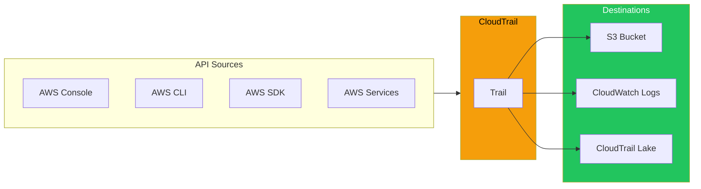
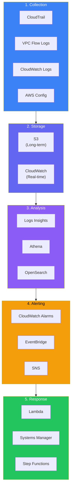

Security without visibility is security theater. You can implement the most sophisticated access controls and encryption, but if you can't see what's happening in your environment, you can't detect breaches, investigate incidents, or prove compliance. AWS provides comprehensive logging and monitoring services that, when properly configured, give you complete visibility into your cloud environment.

## Why Security Logging Matters

### The Detection Gap

Most security breaches aren't detected immediately. Industry studies consistently show that organizations take months—sometimes years—to discover they've been compromised. During this time, attackers can exfiltrate data, establish persistence, and move laterally through the environment.

The primary reason for this detection gap is insufficient logging and monitoring. Without logs, there's no evidence of malicious activity. Without monitoring, no one is watching for anomalies.

### The Forensics Requirement

When a security incident occurs, the first question is always: "What happened?" Without comprehensive logs, this question may be unanswerable. You might know that data was accessed, but not by whom, when, or how much.

Effective logging creates a forensic record that enables:
- Determining the scope of a breach
- Understanding the attack vector
- Identifying affected resources and data
- Meeting legal and regulatory disclosure requirements

### The Compliance Mandate

Most compliance frameworks require logging and monitoring:
- **PCI DSS** requires tracking all access to cardholder data
- **HIPAA** requires audit controls for protected health information
- **SOC 2** evaluates logging as part of security controls
- **GDPR** requires the ability to demonstrate compliance

Without proper logging, compliance audits become impossible.

## AWS CloudTrail: The API Audit Log

CloudTrail records API calls made to AWS services. Every time someone or something interacts with AWS—creating an EC2 instance, modifying a security group, accessing an S3 object—CloudTrail can capture that event.

### What CloudTrail Records

CloudTrail captures:
- **Who**: The principal (user, role, or service) making the request
- **What**: The API action being performed
- **When**: Timestamp of the request
- **Where**: Source IP address and AWS region
- **How**: Request parameters and response elements
- **Result**: Whether the request succeeded or failed, and why

This information is invaluable for security investigations. When you need to answer "Who deleted that S3 bucket?" or "Who modified that IAM policy?", CloudTrail has the answer.

### Management Events vs. Data Events

CloudTrail distinguishes between two types of events:

**Management Events** are control plane operations—creating, modifying, or deleting AWS resources. These include actions like CreateBucket, RunInstances, or AttachRolePolicy. All AWS accounts get management event logging in the default trail.

**Data Events** are data plane operations—the actual access to data within resources. These include GetObject/PutObject operations on S3, Invoke operations on Lambda, and Query operations on DynamoDB. Data events are not captured by default and must be explicitly enabled.

The distinction matters for security. Management events tell you about infrastructure changes. Data events tell you about data access. For sensitive data, you likely need both.

### Trail Configuration Decisions

When configuring CloudTrail, several decisions affect your security posture:

**Multi-Region Trail**: Should you capture events from all regions or just specific ones? Attackers often target regions you're not using, knowing you might not be watching. A multi-region trail provides complete visibility.

**Organization Trail**: For AWS Organizations, an organization trail captures events from all member accounts. This centralizes audit logs and prevents individual accounts from disabling logging.

**Log File Integrity Validation**: CloudTrail can use SHA-256 hashing to create digest files that let you verify logs haven't been tampered with. This is essential for forensic integrity and compliance.

**Log Encryption**: Logs should be encrypted with KMS for protection at rest. This also provides additional access control—only principals with key access can read the logs.

### CloudTrail Insights

CloudTrail Insights uses machine learning to detect unusual API activity. It establishes a baseline of normal behavior and alerts when activity deviates significantly.

Insights can detect:
- Unusual spikes in API call volume
- Increased error rates that might indicate probing or misconfiguration
- API calls from unusual sources or at unusual times

This automated anomaly detection is valuable because manual review of millions of API calls is impractical.

### CloudTrail Lake

CloudTrail Lake is a managed data lake for CloudTrail events. Instead of storing logs in S3 and querying with Athena, CloudTrail Lake provides:
- SQL-based querying directly on events
- Managed retention (up to 7 years)
- Integration with federated events from other sources
- Faster query performance for recent events

For organizations with heavy CloudTrail analysis needs, Lake can simplify the architecture.

## CloudWatch Logs: Centralized Log Management

While CloudTrail captures AWS API calls, CloudWatch Logs handles application and system logs. Any log data can be sent to CloudWatch Logs—application logs, web server access logs, system logs, custom application metrics.

### Why Centralize Logs

In distributed systems, logs are scattered across dozens or hundreds of instances. When investigating an issue, you shouldn't need to SSH into individual servers to read log files. Centralized logging enables:
- Correlation across multiple systems
- Unified search and analysis
- Log retention beyond instance lifecycle
- Real-time alerting on log patterns

### Log Groups, Streams, and Retention

CloudWatch Logs organizes data hierarchically:
- **Log Groups**: Containers for logs with shared retention and access settings
- **Log Streams**: Individual sources of log data within a group (typically one per instance or container)
- **Log Events**: The individual log entries with timestamps

Retention is configurable per log group, from 1 day to indefinite. For security logs, consider retention requirements carefully—compliance often mandates 1+ years, but costs accumulate with long retention.

### Metric Filters: Creating Metrics from Logs

Metric filters scan log data and create CloudWatch metrics when patterns match. This transforms unstructured log data into measurable signals.

For security, useful metric filters include:
- Count of failed authentication attempts
- Occurrences of specific error codes
- Appearances of known attack patterns
- Access from unexpected IP ranges

Once you have metrics, you can create alarms that notify when thresholds are exceeded.

### CloudWatch Logs Insights

Logs Insights provides interactive querying of log data. Unlike traditional grep-based searching, Insights understands log structure and enables:
- Statistical aggregation (count, average, percentiles)
- Time-series visualization
- Pattern detection
- Cross-log-group queries

For security investigations, Insights lets you quickly answer questions like "How many access denied errors occurred in the last 24 hours, grouped by user?"

### Subscription Filters: Real-Time Processing

Subscription filters stream log data in real-time to other services:
- Lambda for custom processing
- Kinesis Data Firehose for delivery to S3, Redshift, or OpenSearch
- Kinesis Data Streams for custom applications

This enables real-time security monitoring—when a critical log pattern appears, immediately trigger an automated response.

## AWS Config: Configuration Compliance

AWS Config continuously monitors and records resource configurations. While CloudTrail tells you what actions occurred, Config tells you the resulting state and how that state changed over time.

### Configuration Items and History

For each resource, Config maintains:
- Current configuration (all configurable attributes)
- Relationships to other resources
- Complete history of configuration changes
- Timeline of when changes occurred

This historical record is invaluable for security. If a security group was modified to allow public access, Config can tell you exactly when it happened and what the previous configuration was.

### Config Rules: Continuous Compliance

Config Rules evaluate resource configurations against defined policies. When a resource is non-compliant, Config flags it.

AWS provides managed rules for common security requirements:
- S3 buckets must have encryption enabled
- EC2 instances must not have public IP addresses
- IAM password policies must meet complexity requirements
- CloudTrail must be enabled
- Root account must have MFA enabled

You can also create custom rules using Lambda functions for organization-specific policies.

### The Compliance Dashboard

Config provides a compliance dashboard showing:
- Overall compliance status
- Non-compliant resources by rule
- Compliance trends over time
- Resource inventory by type

For compliance reporting, this dashboard provides evidence that controls are in place and working.

### Remediation Actions

Config can automatically remediate non-compliant resources using Systems Manager Automation documents. When a resource becomes non-compliant, Config can:
- Enable encryption on an unencrypted S3 bucket
- Add required tags to resources
- Modify security group rules
- Enable logging on resources

Auto-remediation is powerful but requires careful consideration—automatically modifying resources can have unintended consequences.

## VPC Flow Logs: Network Visibility

Flow Logs capture network traffic metadata at the VPC, subnet, or network interface level. They don't capture packet contents—they capture connection metadata: source, destination, ports, protocol, bytes, and accept/reject status.

### What Flow Logs Reveal

Flow Logs enable network-level security analysis:

**Detect reconnaissance**: When an attacker scans your network, Flow Logs show connection attempts to many ports from a single source.

**Identify data exfiltration**: Unusual outbound traffic patterns—large data transfers to unknown destinations—appear in Flow Logs.

**Verify segmentation**: Flow Logs prove that your network segmentation is working. If two subnets shouldn't communicate, Flow Logs can confirm no traffic flows between them.

**Investigate incidents**: When a breach occurs, Flow Logs show what network communications occurred—what the compromised instance connected to and what connected to it.

### Flow Log Destinations

Flow Logs can be sent to:
- **CloudWatch Logs**: For real-time analysis and alerting
- **S3**: For long-term storage and batch analysis with Athena
- **Kinesis Data Firehose**: For delivery to other destinations

For cost-effective long-term storage, S3 is typically preferred. For real-time alerting, CloudWatch Logs enables immediate analysis.

### What Flow Logs Don't Capture

Understanding limitations is important:
- Traffic to/from 169.254.169.254 (instance metadata)
- DHCP traffic
- Traffic to the VPC DNS server
- Windows license activation traffic
- Traffic to/from Network Load Balancers

Also, Flow Logs are sampled—they don't capture every packet, especially under high load.

## Amazon EventBridge: Event-Driven Security Automation

EventBridge (formerly CloudWatch Events) enables event-driven architectures. For security, this means automated responses to security-relevant events.

### Security Event Patterns

EventBridge can match patterns in AWS events:

**IAM changes**: Trigger alerts when users are created, policies are modified, or access keys are generated.

**Console sign-ins**: Alert on successful or failed console logins, especially for root accounts.

**Security group changes**: Notify when security groups are modified to detect unauthorized access changes.

**CloudTrail changes**: Alert immediately if someone attempts to disable CloudTrail or delete trails.

### Automated Responses

EventBridge targets can include:
- SNS for notifications
- Lambda for custom remediation
- Step Functions for complex workflows
- Systems Manager for operational responses

For example: When root account login is detected, EventBridge triggers a Lambda function that notifies security team, logs the event to a security SIEM, and creates an incident ticket.

## Building Effective Security Monitoring

### The Logging Architecture

A complete security logging architecture includes:

1. **Collection**: CloudTrail for API calls, VPC Flow Logs for network traffic, CloudWatch Logs for application logs, Config for resource state

2. **Storage**: S3 for long-term retention with appropriate lifecycle policies, CloudWatch Logs for short-term real-time access

3. **Analysis**: CloudWatch Logs Insights for interactive querying, Athena for S3-based analysis, OpenSearch for full-text search and visualization

4. **Alerting**: CloudWatch Alarms for metrics, EventBridge for event patterns, SNS for notification delivery

5. **Response**: Lambda for automated remediation, Systems Manager for operational tasks, Step Functions for complex workflows

### Critical Alerts to Configure

At minimum, configure alerts for:
- Root account usage (any activity)
- CloudTrail configuration changes
- IAM policy changes
- Security group modifications that allow public access
- Failed authentication attempts above threshold
- Console logins from unusual locations
- API calls from unusual IP addresses

### Log Protection

Logs are security-critical assets. Protect them:

**Immutability**: Use S3 Object Lock to prevent log deletion. Attackers often try to cover their tracks by deleting logs.

**Encryption**: Encrypt logs with KMS keys that are separate from operational keys.

**Access Control**: Limit who can read and modify logs. Use separate IAM policies for log administration vs. log reading.

**Cross-Account Storage**: Store logs in a separate account with restricted access to prevent compromised accounts from destroying their own audit trail.

### Common Mistakes

**Not enabling data events**: Management events show infrastructure changes, but data events show data access. For sensitive data, you need both.

**Insufficient retention**: When an incident is discovered months later, short retention means logs are already deleted.

**No real-time alerting**: Logs without monitoring are just storage. Without alerts, breaches go unnoticed.

**Ignoring log costs**: Log storage and analysis can become expensive. Plan for costs while ensuring adequate coverage.

**Single-account log storage**: Logs stored in the same account being monitored can be deleted by attackers who compromise that account.

## Summary

Security logging and monitoring in AWS requires multiple services working together:

| Service | Purpose | What It Captures |
|---------|---------|------------------|
| CloudTrail | API audit | Who did what, when, from where |
| CloudWatch Logs | Log aggregation | Application and system logs |
| AWS Config | Configuration state | Resource configurations and changes |
| VPC Flow Logs | Network visibility | Connection metadata (not content) |
| EventBridge | Event routing | Real-time event-driven automation |

Key principles:

- **Log everything**: Enable CloudTrail in all regions, VPC Flow Logs on all VPCs, Config in all accounts
- **Protect logs**: Encryption, separate accounts, object lock for immutability
- **Monitor actively**: Real-time alerts for critical events, not just storage
- **Plan for investigation**: Logs must be searchable and retained long enough to support investigations
- **Automate responses**: Use EventBridge and Lambda for automated security responses

Visibility is the foundation of security. Without comprehensive logging and active monitoring, you're operating blind—hoping attacks don't occur rather than knowing when they do. AWS provides the tools; it's your responsibility to configure and use them effectively.

## References

- [AWS CloudTrail User Guide](https://docs.aws.amazon.com/awscloudtrail/latest/userguide/)
- [Amazon CloudWatch Logs User Guide](https://docs.aws.amazon.com/AmazonCloudWatch/latest/logs/)
- [AWS Config Developer Guide](https://docs.aws.amazon.com/config/latest/developerguide/)
- [VPC Flow Logs](https://docs.aws.amazon.com/vpc/latest/userguide/flow-logs.html)
- Crane, Dylan. *AWS Security*. Manning Publications, 2022.
- Muñoz, Mauricio, et al. *Mastering AWS Security, 2nd Edition*. Packt, 2024.
