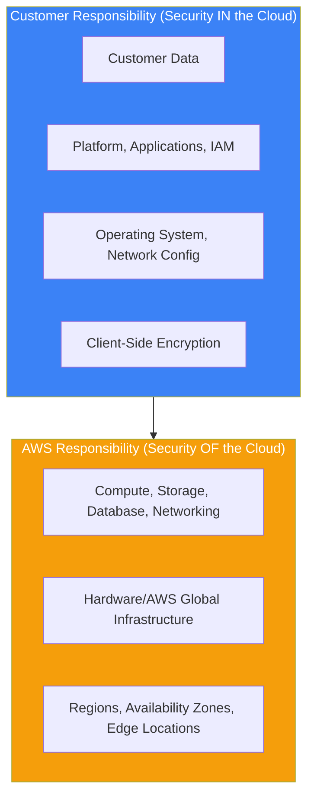
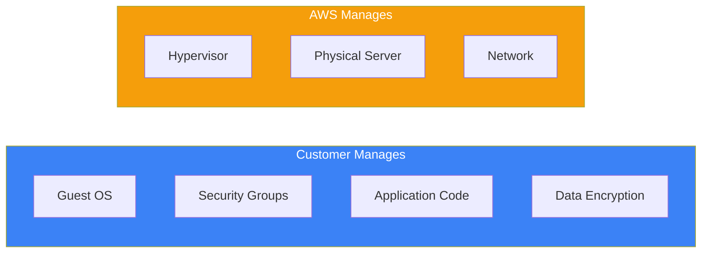
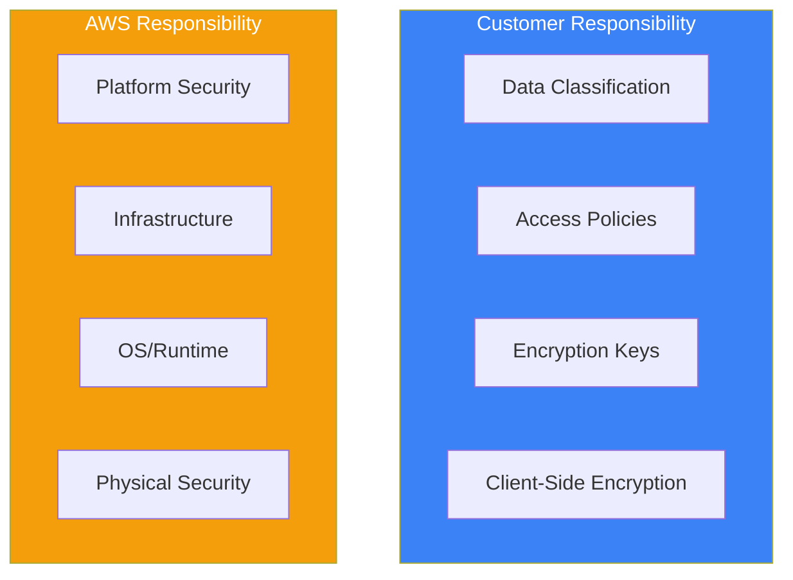
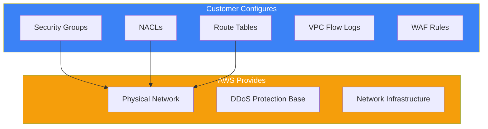
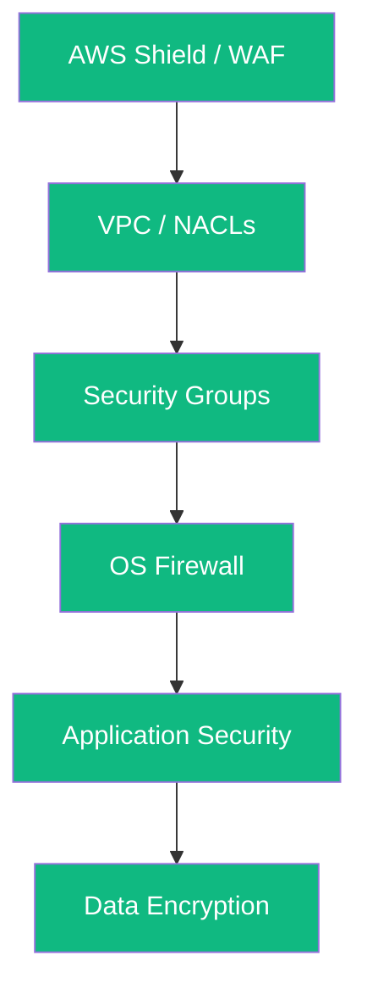

The AWS Shared Responsibility Model is the foundational concept for understanding cloud security. It clearly defines security responsibilities between AWS and the customer.

## Understanding the Model



## AWS Responsibilities

AWS is responsible for protecting the infrastructure that runs all AWS services:

| Component | AWS Responsibility |
|-----------|-------------------|
| Physical Security | Data centers, facilities, environmental controls |
| Hardware | Servers, storage devices, networking equipment |
| Software | Hypervisor, managed services' underlying OS |
| Networking | Physical network infrastructure, DDoS protection |
| Global Infrastructure | Regions, Availability Zones, Edge Locations |

```
AWS manages:
├── Physical data center security
├── Hardware lifecycle management
├── Network infrastructure
├── Hypervisor and virtualization
└── Managed service platforms
    ├── RDS database engine patching
    ├── Lambda runtime maintenance
    └── S3 infrastructure
```

## Customer Responsibilities

Customers are responsible for security configurations and management:

| Component | Customer Responsibility |
|-----------|------------------------|
| Data | Encryption, classification, access controls |
| Applications | Code security, vulnerability management |
| Identity | IAM users, roles, policies, MFA |
| Operating System | Patching, hardening (for EC2) |
| Network | Security groups, NACLs, routing |

## Responsibility by Service Type

### Infrastructure Services (EC2, VPC)



For EC2 instances, customers have significant responsibility:

```bash
# Customer must manage:
# 1. Operating system updates
sudo yum update -y

# 2. Security software
sudo yum install -y amazon-ssm-agent

# 3. Application patching
# 4. Firewall configuration (Security Groups)
# 5. IAM roles for instances
```

### Container Services (RDS, ECS)

For managed container services, AWS takes on more responsibility:

| Responsibility | Owner |
|---------------|-------|
| Database engine patching | AWS |
| Operating system patching | AWS |
| Database configuration | Customer |
| Security groups | Customer |
| Data encryption | Customer |
| Backup strategy | Customer |

```python
# RDS Example - Customer configures security
import boto3

rds = boto3.client('rds')

# Customer responsibility: encryption, security group
response = rds.create_db_instance(
    DBInstanceIdentifier='my-database',
    DBInstanceClass='db.t3.micro',
    Engine='mysql',
    MasterUsername='admin',
    MasterUserPassword='secure-password',
    # Customer enables encryption
    StorageEncrypted=True,
    KmsKeyId='arn:aws:kms:region:account:key/key-id',
    # Customer assigns security group
    VpcSecurityGroupIds=['sg-12345678'],
    # Customer configures backup
    BackupRetentionPeriod=7
)
```

### Abstract Services (S3, Lambda, DynamoDB)

For serverless and abstract services, AWS manages most infrastructure:



```python
# Lambda Example - Minimal customer infrastructure responsibility
import boto3

lambda_client = boto3.client('lambda')

# Customer responsibility: code security, IAM role, environment variables
response = lambda_client.create_function(
    FunctionName='my-function',
    Runtime='python3.12',
    Role='arn:aws:iam::account:role/lambda-role',  # Customer manages
    Handler='index.handler',
    Code={'ZipFile': code_bytes},
    Environment={
        'Variables': {
            # Don't hardcode secrets - use Secrets Manager
            'SECRET_ARN': 'arn:aws:secretsmanager:...'
        }
    },
    # Customer can configure VPC access
    VpcConfig={
        'SubnetIds': ['subnet-123'],
        'SecurityGroupIds': ['sg-123']
    }
)
```

## S3 Security Responsibilities

S3 demonstrates shared responsibility clearly:

| Aspect | AWS Responsibility | Customer Responsibility |
|--------|-------------------|------------------------|
| Infrastructure | Storage durability, availability | - |
| Access Control | - | Bucket policies, ACLs, IAM |
| Encryption | Server-side encryption mechanisms | Enabling encryption, key management |
| Data | - | Classification, lifecycle policies |
| Logging | - | Enabling access logs, CloudTrail |

```json
// Customer-managed S3 bucket policy
{
  "Version": "2012-10-17",
  "Statement": [
    {
      "Sid": "EnforceEncryption",
      "Effect": "Deny",
      "Principal": "*",
      "Action": "s3:PutObject",
      "Resource": "arn:aws:s3:::my-bucket/*",
      "Condition": {
        "StringNotEquals": {
          "s3:x-amz-server-side-encryption": "aws:kms"
        }
      }
    },
    {
      "Sid": "EnforceHTTPS",
      "Effect": "Deny",
      "Principal": "*",
      "Action": "s3:*",
      "Resource": [
        "arn:aws:s3:::my-bucket",
        "arn:aws:s3:::my-bucket/*"
      ],
      "Condition": {
        "Bool": {
          "aws:SecureTransport": "false"
        }
      }
    }
  ]
}
```

## Network Security Responsibilities



### Security Groups (Customer Responsibility)

```python
import boto3

ec2 = boto3.client('ec2')

# Customer creates and manages security groups
response = ec2.create_security_group(
    GroupName='web-server-sg',
    Description='Security group for web servers',
    VpcId='vpc-12345678'
)

security_group_id = response['GroupId']

# Customer defines inbound rules
ec2.authorize_security_group_ingress(
    GroupId=security_group_id,
    IpPermissions=[
        {
            'IpProtocol': 'tcp',
            'FromPort': 443,
            'ToPort': 443,
            'IpRanges': [{'CidrIp': '0.0.0.0/0'}]
        },
        {
            'IpProtocol': 'tcp',
            'FromPort': 22,
            'ToPort': 22,
            # Restrict SSH to known IPs
            'IpRanges': [{'CidrIp': '10.0.0.0/8'}]
        }
    ]
)
```

## Compliance and Auditing

### AWS Compliance Programs

AWS maintains certifications and compliance programs:

- SOC 1, SOC 2, SOC 3
- ISO 27001, 27017, 27018
- PCI DSS Level 1
- HIPAA
- FedRAMP

### Customer Compliance Responsibilities

```python
# Use AWS Config to monitor compliance
import boto3

config = boto3.client('config')

# Customer defines compliance rules
response = config.put_config_rule(
    ConfigRule={
        'ConfigRuleName': 's3-bucket-encryption',
        'Description': 'Ensure S3 buckets are encrypted',
        'Source': {
            'Owner': 'AWS',
            'SourceIdentifier': 'S3_BUCKET_SERVER_SIDE_ENCRYPTION_ENABLED'
        },
        'Scope': {
            'ComplianceResourceTypes': ['AWS::S3::Bucket']
        }
    }
)
```

## Best Practices

### 1. Know Your Responsibilities

```
For each AWS service you use:
├── Identify what AWS manages
├── Identify what you must manage
├── Document security controls
└── Implement monitoring
```

### 2. Enable Security Features

```python
# Enable CloudTrail for auditing (Customer responsibility)
import boto3

cloudtrail = boto3.client('cloudtrail')

response = cloudtrail.create_trail(
    Name='security-audit-trail',
    S3BucketName='my-cloudtrail-logs',
    IsMultiRegionTrail=True,
    EnableLogFileValidation=True,
    KMSKeyId='arn:aws:kms:region:account:key/key-id'
)

cloudtrail.start_logging(Name='security-audit-trail')
```

### 3. Implement Defense in Depth



## Summary

| Service Type | AWS Responsibility | Customer Responsibility |
|--------------|-------------------|------------------------|
| Infrastructure (EC2) | Hardware, hypervisor | OS, apps, data, network config |
| Container (RDS) | OS, engine patching | Data, encryption, access |
| Abstract (Lambda, S3) | Everything infrastructure | Data, access policies, encryption |

Key takeaways:

- AWS secures the cloud infrastructure; you secure what you put in it
- Responsibility varies by service type (IaaS vs PaaS vs SaaS)
- Always enable encryption, logging, and access controls
- Use AWS compliance reports via AWS Artifact
- Implement defense in depth with multiple security layers
- Monitor and audit your security configurations continuously

Understanding the Shared Responsibility Model is essential for the AWS Security Specialty certification and for building secure cloud architectures.

## References

- [AWS Shared Responsibility Model](https://aws.amazon.com/compliance/shared-responsibility-model/)
- [AWS Compliance Programs](https://aws.amazon.com/compliance/programs/)
- Muñoz, Mauricio, et al. *AWS Certified Security Study Guide, 2nd Edition*. Wiley, 2025.
- Book, Adam, and Stuart Scott. *AWS Certified Security – Specialty (SCS-C02) Exam Guide*. Packt, 2024.
