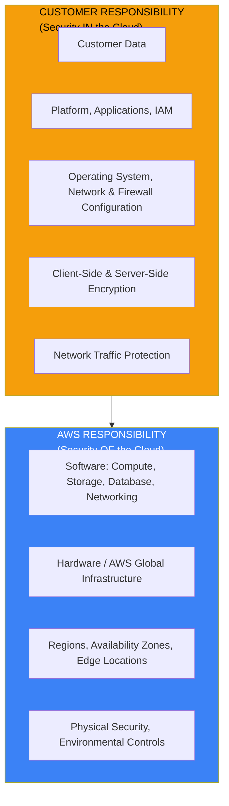
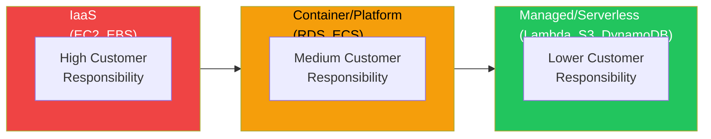
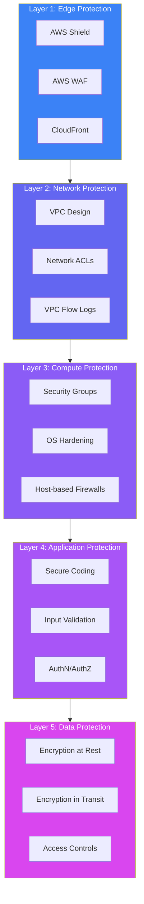

The AWS Shared Responsibility Model is the foundational concept for understanding cloud security. Before diving into any AWS security service or configuration, you must first understand this model—it fundamentally shapes how you approach security in the cloud.

## Why the Shared Responsibility Model Matters

When organizations move to the cloud, a common misconception is that "AWS handles security." This misunderstanding has led to countless data breaches and security incidents. The reality is more nuanced: cloud security is a partnership between AWS and the customer.

Consider this analogy: AWS provides a secure apartment building with locked entrances, security cameras, and fire suppression systems. However, if you leave your apartment door unlocked or give your keys to strangers, the building's security doesn't protect you from break-ins. The building management (AWS) secures the structure; you secure your unit.

This model exists because AWS cannot know your business requirements, compliance needs, or what data you're storing. Only you know which data is sensitive, who should access it, and what regulatory frameworks apply to your organization.

## The Core Concept: Security OF vs. IN the Cloud

The model divides responsibilities into two clear categories:

**Security OF the Cloud** — AWS is responsible for protecting the infrastructure that runs all AWS services. This includes the hardware, software, networking, and facilities.

**Security IN the Cloud** — Customers are responsible for security configurations, data protection, and access management within the services they use.

## What AWS Secures: Security OF the Cloud

AWS invests billions of dollars annually in security for its infrastructure. Understanding what AWS protects helps you focus your security efforts on what matters.

### Physical Security

AWS data centers are among the most secure facilities in the world:

- **Location secrecy**: Data center locations are not publicly disclosed
- **Multi-layer perimeter controls**: Fences, barriers, security guards, video surveillance
- **Biometric access**: Staff require multiple authentication factors
- **Visitor protocols**: Strict escort policies for any authorized visitors
- **Environmental controls**: Fire suppression, climate control, power redundancy

You cannot visit an AWS data center for a security audit. Instead, AWS provides third-party audit reports through AWS Artifact, demonstrating compliance with standards like SOC 2, ISO 27001, and PCI DSS.

### Hardware and Infrastructure

AWS manages the complete hardware lifecycle:

- **Procurement**: Secure supply chain for servers, storage, and networking equipment
- **Deployment**: Hardened configurations before equipment enters service
- **Maintenance**: Patching and updates without customer involvement
- **Decommissioning**: Secure data destruction when hardware is retired

When a storage device reaches end of life, AWS uses techniques that meet NIST 800-88 standards to ensure no customer data can be recovered.

### Network Infrastructure

The AWS global network provides:

- **DDoS protection**: Automatic mitigation at the network edge
- **Private connectivity**: Isolated network paths for customer traffic
- **Encryption in transit**: Data encrypted as it moves between data centers
- **Network monitoring**: Continuous surveillance for threats and anomalies

### Hypervisor and Virtualization

For services like EC2, AWS manages the hypervisor layer:

- **Isolation**: Strict separation between customer virtual machines
- **Security patching**: Regular updates without customer downtime
- **Nitro System**: Custom hardware that provides security at the silicon level

The Nitro System is particularly important—it moves many virtualization functions to dedicated hardware and software, reducing the attack surface and preventing classes of vulnerabilities that affect traditional hypervisors.

## What You Secure: Security IN the Cloud

Your responsibilities vary based on which AWS services you use. Understanding this variation is crucial for allocating security resources effectively.

### The Service Model Spectrum

AWS services fall along a spectrum from Infrastructure as a Service (IaaS) to fully managed services:

| Service Type | Examples | Customer Responsibility Level |
|--------------|----------|------------------------------|
| IaaS | EC2, EBS | High - You manage almost everything above the hypervisor |
| Container/Platform | RDS, ECS, Elastic Beanstalk | Medium - AWS manages OS and platform, you manage data and access |
| Managed/Serverless | Lambda, S3, DynamoDB | Lower - You focus on data and access policies |

This doesn't mean serverless is "more secure"—it means the security model is different. An S3 bucket with a public access policy is still your responsibility, even though AWS manages the underlying infrastructure.

### Infrastructure Services: EC2 Example

When you launch an EC2 instance, you accept significant responsibility:

**Operating System**: You choose the AMI and are responsible for all OS-level security:
- Installing security patches
- Hardening the configuration
- Managing local users and permissions
- Configuring host-based firewalls

**Applications**: Any software you install is your responsibility:
- Secure coding practices
- Application-level authentication
- Vulnerability management
- Dependency updates

**Network Configuration**: You control how traffic reaches your instance:
- Security group rules (instance-level firewall)
- Network ACL rules (subnet-level firewall)
- VPC routing and connectivity

**Data**: Everything you store is your responsibility:
- Encryption at rest (EBS encryption, file-level encryption)
- Encryption in transit (TLS/SSL)
- Access controls and permissions
- Backup and recovery strategies

### Managed Services: RDS Example

With Amazon RDS, the responsibility shifts:

**AWS Manages**:
- Database engine installation
- OS patching and updates
- Hardware failures and replacement
- Automated backups (if enabled)

**You Manage**:
- Database configuration and tuning
- User accounts and permissions
- Security group configuration
- Encryption settings (you must enable it)
- Data classification and handling
- Application-level queries and security

A critical point: even though AWS manages the database engine, a SQL injection vulnerability in your application is still your problem. AWS cannot protect you from poorly written application code.

### Serverless Services: S3 and Lambda

For services like S3 and Lambda, AWS manages nearly all infrastructure:

**AWS Manages**:
- Server provisioning and scaling
- Operating system and runtime
- Availability and durability
- Physical security of data

**You Manage**:
- Access policies (who can access what)
- Data encryption (choosing and managing keys)
- Application code (for Lambda)
- Event configurations and triggers
- Monitoring and logging enablement

### The S3 Security Reality

S3 is an excellent example of shared responsibility in action. AWS provides world-class durability (11 nines) and availability, but the most common S3 security incidents are caused by customers:

- **Overly permissive bucket policies**: Accidentally making data public
- **Disabled encryption**: Not enabling server-side encryption
- **Missing access logging**: No audit trail of who accessed what
- **Uncontrolled cross-account access**: Resource policies that are too broad

AWS provides tools to help (S3 Block Public Access, Access Analyzer), but you must enable and configure them.

## Shared Controls: The Gray Area

Some security controls are shared between AWS and customers:

### Patch Management

- **AWS**: Patches infrastructure, hypervisors, and managed service platforms
- **Customer**: Patches guest operating systems, applications, and self-managed databases

### Configuration Management

- **AWS**: Maintains infrastructure device configurations
- **Customer**: Configures operating systems, applications, databases, and security tools

### Awareness and Training

- **AWS**: Trains AWS employees on security practices
- **Customer**: Trains your employees on secure AWS usage

### Physical and Environmental

- **AWS**: Provides physical and environmental security for data centers
- **Customer**: Provides physical and environmental security for on-premises equipment connecting to AWS

## Common Misconceptions

### "AWS is responsible for my data security"

False. AWS is responsible for the security of the storage infrastructure. You are responsible for what you store and who can access it. If you store unencrypted PII in a public S3 bucket, that's a customer failure, not an AWS failure.

### "Using managed services means I don't have to worry about security"

False. Managed services reduce your operational burden, but you still must configure them securely. An RDS instance with weak database credentials is still vulnerable, regardless of how well AWS manages the underlying infrastructure.

### "AWS compliance certifications cover my workloads"

Partially true. AWS compliance certifications (SOC 2, PCI DSS, HIPAA) cover the AWS infrastructure. However, your workloads inherit only the infrastructure portion of compliance—you must still implement and demonstrate compliance for your applications and data handling practices.

### "I can't audit AWS security"

Mostly false. While you cannot conduct your own physical audit of AWS data centers, AWS provides extensive compliance documentation through AWS Artifact. You can access third-party audit reports, certifications, and attestations that demonstrate AWS's security controls.

## Implementing the Model in Practice

### Step 1: Understand Your Services

For each AWS service you use, document:
- What AWS manages for that service
- What you must manage
- What security controls are available
- What monitoring and logging options exist

### Step 2: Enable Security Features

Many AWS security features are available but not enabled by default:
- S3 Block Public Access (account and bucket level)
- EBS encryption by default
- RDS encryption
- CloudTrail logging
- VPC Flow Logs

### Step 3: Implement Defense in Depth

Security controls should be layered:

### Step 4: Monitor and Audit

Continuous monitoring validates that security controls remain effective:
- **AWS CloudTrail**: Records API calls for auditing
- **AWS Config**: Tracks configuration changes and compliance
- **Amazon GuardDuty**: Detects threats and anomalies
- **AWS Security Hub**: Aggregates security findings

## Compliance Implications

Understanding the shared responsibility model is essential for compliance:

### Your Compliance Responsibilities

| Framework | AWS Responsibility | Your Responsibility |
|-----------|-------------------|---------------------|
| PCI DSS | Physical security, network segmentation | Cardholder data handling, access controls |
| HIPAA | Infrastructure controls | PHI encryption, access logging, BAA |
| SOC 2 | Infrastructure controls | Application controls, access management |
| GDPR | Infrastructure in compliant regions | Data handling, consent, retention |

### Using AWS Artifact

AWS Artifact provides access to AWS compliance reports:
- SOC 1, 2, and 3 reports
- PCI DSS Attestation of Compliance
- ISO certifications
- Other regional and industry certifications

These reports demonstrate that AWS meets its portion of the shared responsibility model. You must still demonstrate how you meet your portion.

## Summary

The AWS Shared Responsibility Model is not just a compliance concept—it's the foundation of practical cloud security:

- **AWS secures the cloud infrastructure**; you secure what you build and store in it
- **Responsibility varies by service type**: IaaS requires more customer effort than managed services
- **Most cloud security incidents** are customer misconfigurations, not AWS failures
- **Compliance is shared**: AWS certifications cover infrastructure; you handle applications and data
- **Security features exist** but often must be explicitly enabled and configured

Understanding this model is the first step toward building secure AWS architectures. Every other AWS security topic—IAM, VPC, encryption, monitoring—builds upon this foundation.

## References

- [AWS Shared Responsibility Model](https://aws.amazon.com/compliance/shared-responsibility-model/)
- [AWS Well-Architected Framework - Security Pillar](https://docs.aws.amazon.com/wellarchitected/latest/security-pillar/welcome.html)
- [AWS Compliance Programs](https://aws.amazon.com/compliance/programs/)
- Crane, Dylan. *AWS Security*. Manning Publications, 2022.
- Muñoz, Mauricio, et al. *Mastering AWS Security, 2nd Edition*. Packt, 2024.
