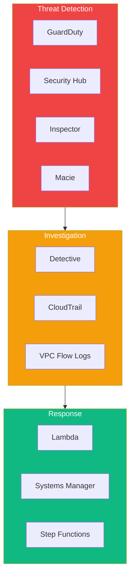
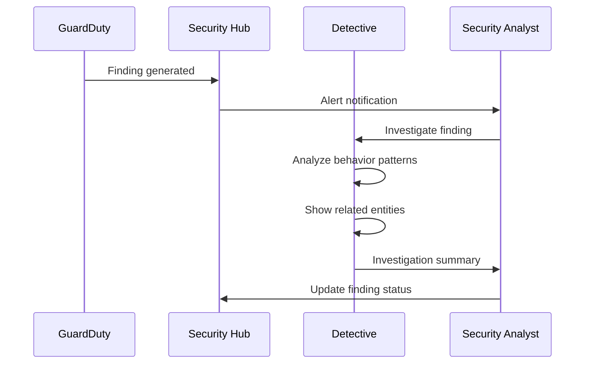
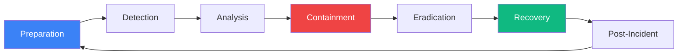

Threat detection and incident response is a critical domain for the AWS Security Specialty certification. Understanding how to detect threats and respond to security incidents is essential for protecting AWS environments.

## Threat Detection Overview



## Amazon GuardDuty

### Enable GuardDuty

```python
import boto3

guardduty = boto3.client('guardduty')

# Create detector
response = guardduty.create_detector(
    Enable=True,
    DataSources={
        'S3Logs': {'Enable': True},
        'Kubernetes': {
            'AuditLogs': {'Enable': True}
        },
        'MalwareProtection': {
            'ScanEc2InstanceWithFindings': {
                'EbsVolumes': {'Enable': True}
            }
        }
    },
    Features=[
        {'Name': 'EKS_AUDIT_LOGS', 'Status': 'ENABLED'},
        {'Name': 'EBS_MALWARE_PROTECTION', 'Status': 'ENABLED'},
        {'Name': 'RDS_LOGIN_EVENTS', 'Status': 'ENABLED'},
        {'Name': 'LAMBDA_NETWORK_LOGS', 'Status': 'ENABLED'}
    ],
    FindingPublishingFrequency='FIFTEEN_MINUTES'
)

detector_id = response['DetectorId']
```

### GuardDuty Finding Types

| Category | Finding Types |
|----------|--------------|
| EC2 | Backdoor, CryptoCurrency, Trojan, UnauthorizedAccess |
| IAM | CredentialAccess, DefenseEvasion, Persistence |
| S3 | Exfiltration, Stealth, Discovery |
| Kubernetes | Execution, Impact, CredentialAccess |
| Malware | Execution, C&C, Dropper |

### Process Findings

```python
import boto3
import json

guardduty = boto3.client('guardduty')

def get_high_severity_findings(detector_id):
    """Get high severity GuardDuty findings"""

    findings = []
    paginator = guardduty.get_paginator('list_findings')

    for page in paginator.paginate(
        DetectorId=detector_id,
        FindingCriteria={
            'Criterion': {
                'severity': {
                    'Gte': 7  # High severity (7-8.9)
                },
                'service.archived': {
                    'Eq': ['false']
                }
            }
        },
        SortCriteria={
            'AttributeName': 'severity',
            'OrderBy': 'DESC'
        }
    ):
        finding_ids = page['FindingIds']

        if finding_ids:
            details = guardduty.get_findings(
                DetectorId=detector_id,
                FindingIds=finding_ids
            )
            findings.extend(details['Findings'])

    return findings


def lambda_handler(event, context):
    """Process GuardDuty findings from EventBridge"""

    finding = event['detail']

    severity = finding['severity']
    finding_type = finding['type']
    resource = finding['resource']

    # High severity - immediate action
    if severity >= 7:
        isolate_resource(resource)
        notify_security_team(finding)
        create_incident_ticket(finding)

    # Medium severity - alert and investigate
    elif severity >= 4:
        notify_security_team(finding)
        schedule_investigation(finding)

    # Low severity - log and monitor
    else:
        log_finding(finding)


def isolate_resource(resource):
    """Isolate compromised resource"""

    ec2 = boto3.client('ec2')

    if resource['resourceType'] == 'Instance':
        instance_id = resource['instanceDetails']['instanceId']

        # Create isolation security group
        isolation_sg = create_isolation_security_group()

        # Replace security groups
        ec2.modify_instance_attribute(
            InstanceId=instance_id,
            Groups=[isolation_sg]
        )

        # Create snapshot for forensics
        volumes = ec2.describe_volumes(
            Filters=[
                {'Name': 'attachment.instance-id', 'Values': [instance_id]}
            ]
        )

        for volume in volumes['Volumes']:
            ec2.create_snapshot(
                VolumeId=volume['VolumeId'],
                Description=f'Forensic snapshot - {instance_id}'
            )
```

### Suppress Findings

```python
# Create filter to suppress known false positives
guardduty.create_filter(
    DetectorId=detector_id,
    Name='suppress-internal-scanners',
    Description='Suppress findings from authorized vulnerability scanners',
    Action='ARCHIVE',
    Rank=1,
    FindingCriteria={
        'Criterion': {
            'service.action.networkConnectionAction.remoteIpDetails.ipAddressV4': {
                'Eq': ['10.0.1.100', '10.0.1.101']  # Scanner IPs
            },
            'type': {
                'Eq': ['Recon:EC2/PortProbeUnprotectedPort']
            }
        }
    }
)
```

## AWS Security Hub

### Enable Security Hub

```python
import boto3

securityhub = boto3.client('securityhub')

# Enable Security Hub
securityhub.enable_security_hub(
    EnableDefaultStandards=True,
    ControlFindingGenerator='SECURITY_CONTROL'
)

# Enable specific standards
securityhub.batch_enable_standards(
    StandardsSubscriptionRequests=[
        {
            'StandardsArn': 'arn:aws:securityhub:::ruleset/cis-aws-foundations-benchmark/v/1.4.0'
        },
        {
            'StandardsArn': 'arn:aws:securityhub:us-east-1::standards/aws-foundational-security-best-practices/v/1.0.0'
        },
        {
            'StandardsArn': 'arn:aws:securityhub:us-east-1::standards/pci-dss/v/3.2.1'
        }
    ]
)
```

### Security Hub Integrations

```python
# Enable integrations
integrations = [
    'arn:aws:securityhub:us-east-1::product/aws/guardduty',
    'arn:aws:securityhub:us-east-1::product/aws/inspector',
    'arn:aws:securityhub:us-east-1::product/aws/macie',
    'arn:aws:securityhub:us-east-1::product/aws/config'
]

for integration in integrations:
    securityhub.enable_import_findings_for_product(
        ProductArn=integration
    )
```

### Process Security Hub Findings

```python
def get_critical_findings():
    """Get critical and high severity findings"""

    findings = []
    paginator = securityhub.get_paginator('get_findings')

    for page in paginator.paginate(
        Filters={
            'SeverityLabel': [
                {'Value': 'CRITICAL', 'Comparison': 'EQUALS'},
                {'Value': 'HIGH', 'Comparison': 'EQUALS'}
            ],
            'WorkflowStatus': [
                {'Value': 'NEW', 'Comparison': 'EQUALS'}
            ],
            'RecordState': [
                {'Value': 'ACTIVE', 'Comparison': 'EQUALS'}
            ]
        },
        SortCriteria=[
            {'Field': 'SeverityNormalized', 'SortOrder': 'desc'}
        ]
    ):
        findings.extend(page['Findings'])

    return findings


def update_finding_workflow(finding_id, status):
    """Update finding workflow status"""

    securityhub.batch_update_findings(
        FindingIdentifiers=[
            {
                'Id': finding_id,
                'ProductArn': finding['ProductArn']
            }
        ],
        Workflow={'Status': status},  # NEW, NOTIFIED, RESOLVED, SUPPRESSED
        Note={
            'Text': f'Status updated to {status}',
            'UpdatedBy': 'security-automation'
        }
    )
```

### Custom Insights

```python
# Create custom insight
securityhub.create_insight(
    Name='Top 10 Resources with Most Findings',
    Filters={
        'SeverityLabel': [
            {'Value': 'CRITICAL', 'Comparison': 'EQUALS'},
            {'Value': 'HIGH', 'Comparison': 'EQUALS'}
        ],
        'WorkflowStatus': [
            {'Value': 'NEW', 'Comparison': 'EQUALS'}
        ]
    },
    GroupByAttribute='ResourceId'
)

# Create insight for failed compliance checks
securityhub.create_insight(
    Name='Failed CIS Benchmark Controls',
    Filters={
        'ComplianceStatus': [
            {'Value': 'FAILED', 'Comparison': 'EQUALS'}
        ],
        'GeneratorId': [
            {'Value': 'cis-aws-foundations-benchmark', 'Comparison': 'PREFIX'}
        ]
    },
    GroupByAttribute='GeneratorId'
)
```

## Amazon Detective

### Enable Detective

```python
import boto3

detective = boto3.client('detective')

# Create behavior graph
response = detective.create_graph(
    Tags={'Environment': 'Production'}
)

graph_arn = response['GraphArn']

# Add member accounts
detective.create_members(
    GraphArn=graph_arn,
    Accounts=[
        {'AccountId': '111122223333', 'EmailAddress': 'security@company.com'},
        {'AccountId': '444455556666', 'EmailAddress': 'security@company.com'}
    ]
)
```

### Investigation Workflow



### Use Detective for Investigation

```python
def investigate_finding(finding):
    """Use Detective to investigate a GuardDuty finding"""

    detective = boto3.client('detective')

    # Get investigation details
    # Detective provides visual analysis in console

    # Use indicators to search
    indicators = detective.list_indicators(
        GraphArn=graph_arn,
        InvestigationId=finding['service']['detectorId'],
        IndicatorType='TTP_OBSERVED'  # Tactics, techniques, procedures
    )

    # Get related entities
    entity_id = finding['resource']['instanceDetails']['instanceId']

    # List investigation for the entity
    investigations = detective.list_investigations(
        GraphArn=graph_arn,
        FilterCriteria={
            'EntityArn': {
                'Value': f'arn:aws:ec2:us-east-1:123456789012:instance/{entity_id}'
            }
        }
    )

    return investigations
```

## Incident Response Plan

### Incident Response Phases



### Automated Incident Response

```python
import boto3
import json

def create_incident_response_automation():
    """Create Step Functions state machine for incident response"""

    sfn = boto3.client('stepfunctions')

    definition = {
        'Comment': 'Incident Response Automation',
        'StartAt': 'ClassifyIncident',
        'States': {
            'ClassifyIncident': {
                'Type': 'Task',
                'Resource': 'arn:aws:lambda:us-east-1:123456789012:function:classify-incident',
                'Next': 'RouteBySeverity'
            },
            'RouteBySeverity': {
                'Type': 'Choice',
                'Choices': [
                    {
                        'Variable': '$.severity',
                        'StringEquals': 'CRITICAL',
                        'Next': 'CriticalResponse'
                    },
                    {
                        'Variable': '$.severity',
                        'StringEquals': 'HIGH',
                        'Next': 'HighResponse'
                    }
                ],
                'Default': 'StandardResponse'
            },
            'CriticalResponse': {
                'Type': 'Parallel',
                'Branches': [
                    {
                        'StartAt': 'IsolateResource',
                        'States': {
                            'IsolateResource': {
                                'Type': 'Task',
                                'Resource': 'arn:aws:lambda:...:function:isolate-resource',
                                'End': True
                            }
                        }
                    },
                    {
                        'StartAt': 'NotifySecurityTeam',
                        'States': {
                            'NotifySecurityTeam': {
                                'Type': 'Task',
                                'Resource': 'arn:aws:lambda:...:function:notify-team',
                                'End': True
                            }
                        }
                    },
                    {
                        'StartAt': 'CreateForensicSnapshot',
                        'States': {
                            'CreateForensicSnapshot': {
                                'Type': 'Task',
                                'Resource': 'arn:aws:lambda:...:function:create-snapshot',
                                'End': True
                            }
                        }
                    }
                ],
                'Next': 'CreateIncidentTicket'
            },
            'HighResponse': {
                'Type': 'Task',
                'Resource': 'arn:aws:lambda:...:function:high-severity-response',
                'Next': 'CreateIncidentTicket'
            },
            'StandardResponse': {
                'Type': 'Task',
                'Resource': 'arn:aws:lambda:...:function:standard-response',
                'End': True
            },
            'CreateIncidentTicket': {
                'Type': 'Task',
                'Resource': 'arn:aws:lambda:...:function:create-ticket',
                'End': True
            }
        }
    }

    sfn.create_state_machine(
        name='incident-response',
        definition=json.dumps(definition),
        roleArn='arn:aws:iam::123456789012:role/step-functions-role'
    )
```

### EC2 Instance Isolation

```python
import boto3

def isolate_ec2_instance(instance_id, vpc_id):
    """Isolate compromised EC2 instance"""

    ec2 = boto3.client('ec2')

    # Create isolation security group (no ingress/egress)
    isolation_sg = ec2.create_security_group(
        GroupName=f'isolation-{instance_id}',
        Description='Isolation security group for incident response',
        VpcId=vpc_id
    )

    sg_id = isolation_sg['GroupId']

    # Remove default egress rule
    ec2.revoke_security_group_egress(
        GroupId=sg_id,
        IpPermissions=[
            {
                'IpProtocol': '-1',
                'IpRanges': [{'CidrIp': '0.0.0.0/0'}]
            }
        ]
    )

    # Get current security groups
    instance = ec2.describe_instances(InstanceIds=[instance_id])
    current_sgs = [sg['GroupId'] for sg in
                   instance['Reservations'][0]['Instances'][0]['SecurityGroups']]

    # Tag instance with original security groups
    ec2.create_tags(
        Resources=[instance_id],
        Tags=[
            {'Key': 'OriginalSecurityGroups', 'Value': ','.join(current_sgs)},
            {'Key': 'IsolatedAt', 'Value': str(datetime.now())},
            {'Key': 'IncidentStatus', 'Value': 'ISOLATED'}
        ]
    )

    # Apply isolation security group
    ec2.modify_instance_attribute(
        InstanceId=instance_id,
        Groups=[sg_id]
    )

    # Disable API termination protection for later cleanup
    ec2.modify_instance_attribute(
        InstanceId=instance_id,
        DisableApiTermination={'Value': False}
    )

    return sg_id
```

### Credential Rotation

```python
import boto3

def rotate_compromised_credentials(user_name):
    """Rotate credentials for compromised IAM user"""

    iam = boto3.client('iam')

    # List and deactivate access keys
    keys = iam.list_access_keys(UserName=user_name)

    for key in keys['AccessKeyMetadata']:
        # Deactivate key
        iam.update_access_key(
            UserName=user_name,
            AccessKeyId=key['AccessKeyId'],
            Status='Inactive'
        )

        # Tag for tracking
        iam.tag_user(
            UserName=user_name,
            Tags=[
                {
                    'Key': f'DeactivatedKey-{key["AccessKeyId"]}',
                    'Value': str(datetime.now())
                }
            ]
        )

    # Delete login profile (console access)
    try:
        iam.delete_login_profile(UserName=user_name)
    except iam.exceptions.NoSuchEntityException:
        pass

    # List and delete MFA devices
    mfa_devices = iam.list_mfa_devices(UserName=user_name)

    for device in mfa_devices['MFADevices']:
        iam.deactivate_mfa_device(
            UserName=user_name,
            SerialNumber=device['SerialNumber']
        )

    # Attach deny-all policy
    deny_policy = {
        'Version': '2012-10-17',
        'Statement': [
            {
                'Effect': 'Deny',
                'Action': '*',
                'Resource': '*'
            }
        ]
    }

    iam.put_user_policy(
        UserName=user_name,
        PolicyName='DenyAll-IncidentResponse',
        PolicyDocument=json.dumps(deny_policy)
    )

    return {'status': 'credentials_rotated', 'user': user_name}
```

## Forensic Analysis

### Create Forensic Snapshot

```python
def create_forensic_snapshot(instance_id):
    """Create forensic snapshots for investigation"""

    ec2 = boto3.client('ec2')

    # Get attached volumes
    instance = ec2.describe_instances(InstanceIds=[instance_id])
    volumes = instance['Reservations'][0]['Instances'][0]['BlockDeviceMappings']

    snapshots = []

    for volume in volumes:
        volume_id = volume['Ebs']['VolumeId']

        snapshot = ec2.create_snapshot(
            VolumeId=volume_id,
            Description=f'Forensic snapshot for incident - {instance_id}',
            TagSpecifications=[
                {
                    'ResourceType': 'snapshot',
                    'Tags': [
                        {'Key': 'Purpose', 'Value': 'Forensics'},
                        {'Key': 'SourceInstance', 'Value': instance_id},
                        {'Key': 'CreatedAt', 'Value': str(datetime.now())}
                    ]
                }
            ]
        )

        snapshots.append(snapshot['SnapshotId'])

    # Copy to forensic account
    for snapshot_id in snapshots:
        ec2.modify_snapshot_attribute(
            SnapshotId=snapshot_id,
            Attribute='createVolumePermission',
            OperationType='add',
            UserIds=['forensic-account-id']
        )

    return snapshots
```

### Memory Acquisition

```python
def acquire_memory(instance_id):
    """Trigger memory acquisition using SSM"""

    ssm = boto3.client('ssm')

    # Run memory acquisition command
    response = ssm.send_command(
        InstanceIds=[instance_id],
        DocumentName='AWS-RunShellScript',
        Parameters={
            'commands': [
                'sudo apt-get install -y lime-forensics',
                'sudo insmod /lib/modules/$(uname -r)/lime.ko "path=/tmp/memory.lime format=lime"',
                'aws s3 cp /tmp/memory.lime s3://forensic-bucket/memory/${INSTANCE_ID}/'
            ]
        }
    )

    return response['Command']['CommandId']
```

## Summary

| Service | Purpose | Key Features |
|---------|---------|--------------|
| GuardDuty | Threat detection | ML-based, continuous monitoring |
| Security Hub | Security posture | Aggregation, standards, insights |
| Detective | Investigation | Behavior analysis, visualization |
| Inspector | Vulnerability scanning | EC2, ECR, Lambda scanning |
| Macie | Data discovery | PII detection, S3 security |

Key takeaways:

- Enable GuardDuty in all accounts and regions
- Aggregate findings in Security Hub for central visibility
- Use Detective for deep investigation of incidents
- Automate incident response with Lambda and Step Functions
- Create forensic snapshots before any remediation
- Isolate compromised resources immediately
- Rotate credentials for compromised accounts
- Document and review all incidents for improvement

Threat detection and incident response is essential for the AWS Security Specialty certification and for maintaining a strong security posture.

## References

- [Amazon GuardDuty User Guide](https://docs.aws.amazon.com/guardduty/latest/ug/)
- [AWS Security Hub User Guide](https://docs.aws.amazon.com/securityhub/latest/userguide/)
- [Amazon Detective User Guide](https://docs.aws.amazon.com/detective/latest/userguide/)
- Muñoz, Mauricio, et al. *AWS Certified Security Study Guide, 2nd Edition*. Wiley, 2025.
- Book, Adam, and Stuart Scott. *AWS Certified Security – Specialty (SCS-C02) Exam Guide*. Packt, 2024.
