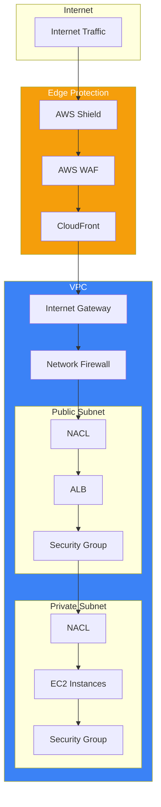
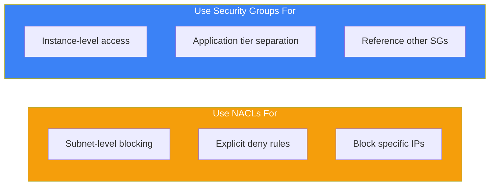
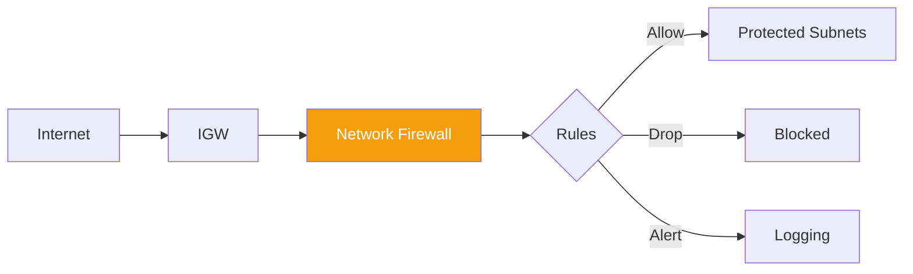
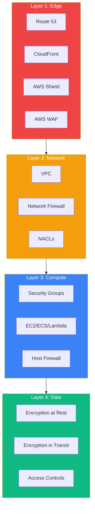

AWS Virtual Private Cloud (VPC) security is a critical domain for the AWS Security Specialty certification. Understanding network security controls helps you build secure, isolated environments.

## VPC Security Overview



## Security Groups vs NACLs

### Comparison

| Feature | Security Groups | NACLs |
|---------|----------------|-------|
| Level | Instance/ENI | Subnet |
| State | Stateful | Stateless |
| Rules | Allow only | Allow and Deny |
| Evaluation | All rules evaluated | Rules in order |
| Default | Deny all inbound | Allow all |
| Association | Multiple per instance | One per subnet |

### Security Groups (Stateful)

```python
import boto3

ec2 = boto3.client('ec2')

# Create security group
response = ec2.create_security_group(
    GroupName='web-server-sg',
    Description='Web server security group',
    VpcId='vpc-12345678'
)

sg_id = response['GroupId']

# Add inbound rules
ec2.authorize_security_group_ingress(
    GroupId=sg_id,
    IpPermissions=[
        {
            'IpProtocol': 'tcp',
            'FromPort': 443,
            'ToPort': 443,
            'IpRanges': [{'CidrIp': '0.0.0.0/0', 'Description': 'HTTPS from anywhere'}]
        },
        {
            'IpProtocol': 'tcp',
            'FromPort': 80,
            'ToPort': 80,
            'IpRanges': [{'CidrIp': '0.0.0.0/0', 'Description': 'HTTP from anywhere'}]
        }
    ]
)

# Security group referencing another security group
ec2.authorize_security_group_ingress(
    GroupId=sg_id,
    IpPermissions=[
        {
            'IpProtocol': 'tcp',
            'FromPort': 3306,
            'ToPort': 3306,
            'UserIdGroupPairs': [
                {
                    'GroupId': 'sg-app-servers',
                    'Description': 'MySQL from app servers'
                }
            ]
        }
    ]
)
```

### Network ACLs (Stateless)

```python
import boto3

ec2 = boto3.client('ec2')

# Create NACL
nacl = ec2.create_network_acl(VpcId='vpc-12345678')
nacl_id = nacl['NetworkAcl']['NetworkAclId']

# Add inbound rules (must specify both directions)
# Rule 100: Allow HTTPS inbound
ec2.create_network_acl_entry(
    NetworkAclId=nacl_id,
    RuleNumber=100,
    Protocol='6',  # TCP
    RuleAction='allow',
    Egress=False,
    CidrBlock='0.0.0.0/0',
    PortRange={'From': 443, 'To': 443}
)

# Rule 200: Allow ephemeral ports for responses
ec2.create_network_acl_entry(
    NetworkAclId=nacl_id,
    RuleNumber=200,
    Protocol='6',
    RuleAction='allow',
    Egress=False,
    CidrBlock='0.0.0.0/0',
    PortRange={'From': 1024, 'To': 65535}
)

# Outbound rules
# Rule 100: Allow HTTPS outbound
ec2.create_network_acl_entry(
    NetworkAclId=nacl_id,
    RuleNumber=100,
    Protocol='6',
    RuleAction='allow',
    Egress=True,
    CidrBlock='0.0.0.0/0',
    PortRange={'From': 443, 'To': 443}
)

# Rule 200: Allow ephemeral ports for responses
ec2.create_network_acl_entry(
    NetworkAclId=nacl_id,
    RuleNumber=200,
    Protocol='6',
    RuleAction='allow',
    Egress=True,
    CidrBlock='0.0.0.0/0',
    PortRange={'From': 1024, 'To': 65535}
)
```

### When to Use Each



## VPC Endpoints

### Gateway Endpoints (S3, DynamoDB)

```python
import boto3

ec2 = boto3.client('ec2')

# Create gateway endpoint for S3
response = ec2.create_vpc_endpoint(
    VpcId='vpc-12345678',
    ServiceName='com.amazonaws.us-east-1.s3',
    VpcEndpointType='Gateway',
    RouteTableIds=['rtb-12345678']
)

endpoint_id = response['VpcEndpoint']['VpcEndpointId']
```

### Gateway Endpoint Policy

```json
{
  "Version": "2012-10-17",
  "Statement": [
    {
      "Sid": "RestrictToSpecificBucket",
      "Effect": "Allow",
      "Principal": "*",
      "Action": [
        "s3:GetObject",
        "s3:PutObject"
      ],
      "Resource": "arn:aws:s3:::my-private-bucket/*"
    },
    {
      "Sid": "DenyOtherBuckets",
      "Effect": "Deny",
      "Principal": "*",
      "Action": "s3:*",
      "Resource": "*",
      "Condition": {
        "StringNotEquals": {
          "s3:ResourceAccount": "123456789012"
        }
      }
    }
  ]
}
```

### Interface Endpoints (PrivateLink)

```python
import boto3

ec2 = boto3.client('ec2')

# Create interface endpoint for Secrets Manager
response = ec2.create_vpc_endpoint(
    VpcId='vpc-12345678',
    ServiceName='com.amazonaws.us-east-1.secretsmanager',
    VpcEndpointType='Interface',
    SubnetIds=['subnet-private-1', 'subnet-private-2'],
    SecurityGroupIds=['sg-endpoint'],
    PrivateDnsEnabled=True
)
```

### Endpoint Security Comparison

| Feature | Gateway Endpoint | Interface Endpoint |
|---------|-----------------|-------------------|
| Services | S3, DynamoDB | Most AWS services |
| Cost | Free | Hourly + data charges |
| DNS | Route table entry | Private DNS |
| Security | Endpoint policy | Security Group + Policy |
| HA | Built-in | Multi-AZ deployment |

## AWS Network Firewall



### Firewall Configuration

```python
import boto3

network_firewall = boto3.client('network-firewall')

# Create stateless rule group
stateless_rules = network_firewall.create_rule_group(
    RuleGroupName='block-bad-ips',
    Type='STATELESS',
    Capacity=100,
    RuleGroup={
        'RulesSource': {
            'StatelessRulesAndCustomActions': {
                'StatelessRules': [
                    {
                        'RuleDefinition': {
                            'MatchAttributes': {
                                'Sources': [
                                    {'AddressDefinition': '192.0.2.0/24'}
                                ]
                            },
                            'Actions': ['aws:drop']
                        },
                        'Priority': 1
                    }
                ]
            }
        }
    }
)

# Create stateful rule group with domain filtering
stateful_rules = network_firewall.create_rule_group(
    RuleGroupName='allow-domains',
    Type='STATEFUL',
    Capacity=100,
    RuleGroup={
        'RulesSource': {
            'RulesSourceList': {
                'Targets': [
                    '.amazonaws.com',
                    '.github.com'
                ],
                'TargetTypes': ['HTTP_HOST', 'TLS_SNI'],
                'GeneratedRulesType': 'ALLOWLIST'
            }
        }
    }
)
```

### Suricata Rules

```python
# Create stateful rule group with Suricata rules
suricata_rules = network_firewall.create_rule_group(
    RuleGroupName='intrusion-detection',
    Type='STATEFUL',
    Capacity=100,
    RuleGroup={
        'RulesSource': {
            'RulesString': '''
# Block SQL injection attempts
drop http any any -> any any (msg:"SQL Injection"; content:"SELECT"; nocase; content:"FROM"; nocase; sid:1000001; rev:1;)

# Alert on suspicious user agents
alert http any any -> any any (msg:"Suspicious UA"; http.user_agent; content:"sqlmap"; nocase; sid:1000002; rev:1;)
'''
        }
    }
)
```

## AWS WAF

### Web ACL Configuration

```python
import boto3

wafv2 = boto3.client('wafv2')

# Create Web ACL
response = wafv2.create_web_acl(
    Name='api-protection',
    Scope='REGIONAL',  # or 'CLOUDFRONT'
    DefaultAction={'Allow': {}},
    Rules=[
        {
            'Name': 'AWS-AWSManagedRulesCommonRuleSet',
            'Priority': 1,
            'Statement': {
                'ManagedRuleGroupStatement': {
                    'VendorName': 'AWS',
                    'Name': 'AWSManagedRulesCommonRuleSet'
                }
            },
            'OverrideAction': {'None': {}},
            'VisibilityConfig': {
                'SampledRequestsEnabled': True,
                'CloudWatchMetricsEnabled': True,
                'MetricName': 'CommonRules'
            }
        },
        {
            'Name': 'AWS-AWSManagedRulesSQLiRuleSet',
            'Priority': 2,
            'Statement': {
                'ManagedRuleGroupStatement': {
                    'VendorName': 'AWS',
                    'Name': 'AWSManagedRulesSQLiRuleSet'
                }
            },
            'OverrideAction': {'None': {}},
            'VisibilityConfig': {
                'SampledRequestsEnabled': True,
                'CloudWatchMetricsEnabled': True,
                'MetricName': 'SQLiRules'
            }
        },
        {
            'Name': 'RateLimit',
            'Priority': 3,
            'Statement': {
                'RateBasedStatement': {
                    'Limit': 2000,
                    'AggregateKeyType': 'IP'
                }
            },
            'Action': {'Block': {}},
            'VisibilityConfig': {
                'SampledRequestsEnabled': True,
                'CloudWatchMetricsEnabled': True,
                'MetricName': 'RateLimit'
            }
        }
    ],
    VisibilityConfig={
        'SampledRequestsEnabled': True,
        'CloudWatchMetricsEnabled': True,
        'MetricName': 'api-protection'
    }
)
```

### Custom Rules

```python
# Geo-blocking rule
geo_rule = {
    'Name': 'GeoBlock',
    'Priority': 0,
    'Statement': {
        'GeoMatchStatement': {
            'CountryCodes': ['RU', 'CN', 'KP']
        }
    },
    'Action': {'Block': {}},
    'VisibilityConfig': {
        'SampledRequestsEnabled': True,
        'CloudWatchMetricsEnabled': True,
        'MetricName': 'GeoBlock'
    }
}

# IP set blocking
ip_set = wafv2.create_ip_set(
    Name='blocked-ips',
    Scope='REGIONAL',
    IPAddressVersion='IPV4',
    Addresses=['192.0.2.0/24', '198.51.100.0/24']
)

ip_block_rule = {
    'Name': 'BlockedIPs',
    'Priority': 1,
    'Statement': {
        'IPSetReferenceStatement': {
            'ARN': ip_set['Summary']['ARN']
        }
    },
    'Action': {'Block': {}},
    'VisibilityConfig': {
        'SampledRequestsEnabled': True,
        'CloudWatchMetricsEnabled': True,
        'MetricName': 'BlockedIPs'
    }
}
```

## AWS Shield

### Shield Standard vs Advanced

| Feature | Standard | Advanced |
|---------|----------|----------|
| Cost | Free | $3,000/month |
| Protection | Layer 3/4 DDoS | Layer 3/4/7 DDoS |
| Response Team | - | 24/7 DRT access |
| Cost Protection | - | DDoS cost protection |
| WAF Integration | - | Free WAF for protected resources |
| Visibility | CloudWatch | Real-time metrics |

### Shield Advanced Protection

```python
import boto3

shield = boto3.client('shield')

# Create protection for resources
shield.create_protection(
    Name='ALB-Protection',
    ResourceArn='arn:aws:elasticloadbalancing:region:account:loadbalancer/app/my-alb/xxx'
)

# Enable proactive engagement
shield.enable_proactive_engagement()

# Associate health check
shield.associate_health_check(
    ProtectionId='protection-id',
    HealthCheckArn='arn:aws:route53:::healthcheck/xxx'
)
```

## VPC Flow Logs

### Enable Flow Logs

```python
import boto3

ec2 = boto3.client('ec2')

# Create flow log to CloudWatch
response = ec2.create_flow_logs(
    ResourceIds=['vpc-12345678'],
    ResourceType='VPC',
    TrafficType='ALL',  # ACCEPT, REJECT, or ALL
    LogDestinationType='cloud-watch-logs',
    LogGroupName='/aws/vpc/flow-logs',
    DeliverLogsPermissionArn='arn:aws:iam::account:role/flow-logs-role',
    MaxAggregationInterval=60,
    LogFormat='${version} ${account-id} ${interface-id} ${srcaddr} ${dstaddr} ${srcport} ${dstport} ${protocol} ${packets} ${bytes} ${start} ${end} ${action} ${log-status} ${vpc-id} ${subnet-id} ${instance-id} ${tcp-flags} ${type} ${pkt-srcaddr} ${pkt-dstaddr}'
)

# Create flow log to S3
response = ec2.create_flow_logs(
    ResourceIds=['vpc-12345678'],
    ResourceType='VPC',
    TrafficType='REJECT',
    LogDestinationType='s3',
    LogDestination='arn:aws:s3:::my-flow-logs-bucket/vpc-logs/'
)
```

### Analyze Flow Logs with Athena

```sql
-- Create table for VPC Flow Logs
CREATE EXTERNAL TABLE vpc_flow_logs (
    version INT,
    account_id STRING,
    interface_id STRING,
    srcaddr STRING,
    dstaddr STRING,
    srcport INT,
    dstport INT,
    protocol INT,
    packets BIGINT,
    bytes BIGINT,
    start_time BIGINT,
    end_time BIGINT,
    action STRING,
    log_status STRING
)
PARTITIONED BY (dt STRING)
ROW FORMAT DELIMITED
FIELDS TERMINATED BY ' '
LOCATION 's3://my-flow-logs-bucket/vpc-logs/';

-- Find rejected traffic
SELECT srcaddr, dstaddr, dstport, COUNT(*) as count
FROM vpc_flow_logs
WHERE action = 'REJECT'
GROUP BY srcaddr, dstaddr, dstport
ORDER BY count DESC
LIMIT 10;

-- Find top talkers
SELECT srcaddr, SUM(bytes) as total_bytes
FROM vpc_flow_logs
WHERE action = 'ACCEPT'
GROUP BY srcaddr
ORDER BY total_bytes DESC
LIMIT 10;
```

## Defense in Depth Architecture



## Best Practices

### 1. Least Privilege Network Access

```python
# ❌ Bad: Allow all traffic
ec2.authorize_security_group_ingress(
    GroupId=sg_id,
    IpPermissions=[{
        'IpProtocol': '-1',
        'IpRanges': [{'CidrIp': '0.0.0.0/0'}]
    }]
)

# ✅ Good: Specific ports and sources
ec2.authorize_security_group_ingress(
    GroupId=sg_id,
    IpPermissions=[{
        'IpProtocol': 'tcp',
        'FromPort': 443,
        'ToPort': 443,
        'UserIdGroupPairs': [{'GroupId': 'sg-alb'}]
    }]
)
```

### 2. Use VPC Endpoints for AWS Services

```python
# Keep traffic within AWS network
endpoints = [
    'com.amazonaws.us-east-1.s3',
    'com.amazonaws.us-east-1.dynamodb',
    'com.amazonaws.us-east-1.secretsmanager',
    'com.amazonaws.us-east-1.kms'
]

for service in endpoints:
    ec2.create_vpc_endpoint(
        VpcId='vpc-12345678',
        ServiceName=service,
        VpcEndpointType='Interface' if 'secretsmanager' in service else 'Gateway'
    )
```

### 3. Enable Flow Logs for All VPCs

```python
# Enable on all VPCs
vpcs = ec2.describe_vpcs()

for vpc in vpcs['Vpcs']:
    ec2.create_flow_logs(
        ResourceIds=[vpc['VpcId']],
        ResourceType='VPC',
        TrafficType='ALL',
        LogDestinationType='s3',
        LogDestination='arn:aws:s3:::central-flow-logs/'
    )
```

## Summary

| Control | Level | Use Case |
|---------|-------|----------|
| Security Groups | Instance | Application-level access control |
| NACLs | Subnet | Subnet-level blocking, explicit deny |
| VPC Endpoints | VPC | Private AWS service access |
| Network Firewall | VPC | Deep packet inspection, IDS/IPS |
| AWS WAF | Application | Layer 7 protection, OWASP rules |
| AWS Shield | Edge | DDoS protection |
| VPC Flow Logs | VPC | Traffic analysis, forensics |

Key takeaways:

- Use Security Groups for stateful, instance-level access control
- Use NACLs for stateless subnet-level blocking
- Implement VPC Endpoints to keep AWS traffic private
- Deploy Network Firewall for advanced inspection
- Enable AWS WAF on all public-facing resources
- Enable VPC Flow Logs for visibility and compliance
- Build defense in depth with multiple layers

VPC security is essential for the AWS Security Specialty exam and for protecting production workloads.

## References

- [VPC Security](https://docs.aws.amazon.com/vpc/latest/userguide/VPC_Security.html)
- [AWS Network Firewall](https://docs.aws.amazon.com/network-firewall/)
- [AWS WAF Developer Guide](https://docs.aws.amazon.com/waf/)
- Muñoz, Mauricio, et al. *AWS Certified Security Study Guide, 2nd Edition*. Wiley, 2025.
- Book, Adam, and Stuart Scott. *AWS Certified Security – Specialty (SCS-C02) Exam Guide*. Packt, 2024.
