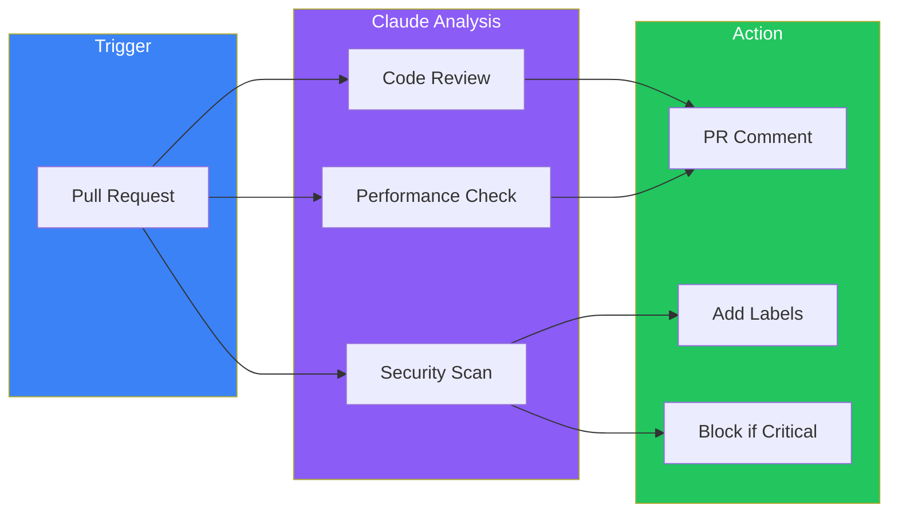
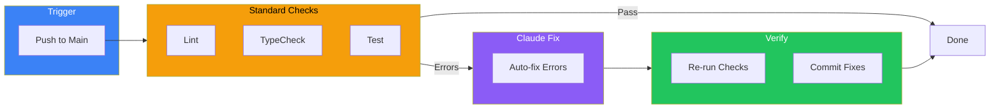

Claude Code isn't just an interactive development tool—it can run programmatically in CI/CD pipelines, enabling AI-powered automation at scale. Using headless mode, you can automate code reviews, fix lint errors, generate documentation, triage issues, and more.

## Understanding Headless Mode

Headless mode runs Claude Code non-interactively using the `-p` (or `--print`) flag. Instead of an interactive session, you pass a prompt directly:

```bash
claude -p "Summarize the changes in this PR"
```

Claude processes the prompt, executes any necessary tools, and returns the result—all without human intervention.

### Basic Usage

```bash
# Simple query
claude -p "What does the auth module do?"

# With tool permissions
claude -p "Fix the lint errors in src/" --allowedTools "Read,Edit,Bash(npm run lint)"

# With output format
claude -p "List all exported functions" --output-format json
```

## Output Formats

Headless mode supports multiple output formats for different automation needs:

### Plain Text (Default)
```bash
claude -p "Summarize the README" --output-format text
```

Returns human-readable text, ideal for display in PR comments.

### JSON with Metadata
```bash
claude -p "Analyze the code" --output-format json
```

Returns structured JSON with the result, session ID, and usage metrics:

```json
{
  "result": "The authentication module uses JWT tokens...",
  "session_id": "abc123",
  "usage": {
    "input_tokens": 1500,
    "output_tokens": 450
  }
}
```

### Structured JSON with Schema
```bash
claude -p "Extract function names from auth.ts" \
  --output-format json \
  --json-schema '{"type":"object","properties":{"functions":{"type":"array","items":{"type":"string"}}}}'
```

Forces output to conform to a specified JSON schema—perfect for parsing in automation scripts.

### Stream JSON
```bash
claude -p "Generate a report" --output-format stream-json
```

Returns newline-delimited JSON for real-time processing.

## Tool Permissions

By default, Claude Code cannot use tools that modify files or run commands. Use `--allowedTools` to grant specific permissions:

```bash
claude -p "Fix TypeScript errors" \
  --allowedTools "Read,Edit,Bash(npm run typecheck)"
```

### Permission Patterns

```bash
# Allow specific tools
--allowedTools "Read,Edit,Write"

# Allow specific bash commands
--allowedTools "Bash(npm run lint),Bash(npm run test)"

# Allow bash with glob patterns
--allowedTools "Bash(git diff:*),Bash(git log:*)"
```

### Safety Considerations

**Be conservative with permissions.** In CI/CD environments:

- Only allow tools absolutely necessary for the task
- Prefer read-only operations when possible
- Avoid unrestricted `Bash` access
- Use specific command patterns, not wildcards

## GitHub Actions Integration

### Automated Code Review

```yaml
name: AI Code Review

on:
  pull_request:
    types: [opened, synchronize]

jobs:
  review:
    runs-on: ubuntu-latest
    steps:
      - uses: actions/checkout@v4
        with:
          fetch-depth: 0

      - name: Install Claude Code
        run: npm install -g @anthropic-ai/claude-code

      - name: Run AI Review
        env:
          ANTHROPIC_API_KEY: ${{ secrets.ANTHROPIC_API_KEY }}
        run: |
          # Get the diff
          git diff origin/main...HEAD > changes.diff

          # Run Claude review
          claude -p "Review this diff for:
          1. Potential bugs
          2. Security vulnerabilities
          3. Performance issues
          4. Code style violations

          Be specific with line numbers and suggestions.

          $(cat changes.diff)" \
            --output-format json > review.json

      - name: Post Review Comment
        uses: actions/github-script@v7
        with:
          script: |
            const review = require('./review.json');
            github.rest.issues.createComment({
              owner: context.repo.owner,
              repo: context.repo.repo,
              issue_number: context.issue.number,
              body: `## AI Code Review\n\n${review.result}`
            });
```

### Automated Lint Fixing

```yaml
name: Auto-fix Lint Errors

on:
  push:
    branches: [main]

jobs:
  lint-fix:
    runs-on: ubuntu-latest
    steps:
      - uses: actions/checkout@v4

      - name: Setup Node
        uses: actions/setup-node@v4
        with:
          node-version: '20'

      - name: Install Dependencies
        run: npm ci

      - name: Install Claude Code
        run: npm install -g @anthropic-ai/claude-code

      - name: Fix Lint Errors
        env:
          ANTHROPIC_API_KEY: ${{ secrets.ANTHROPIC_API_KEY }}
        run: |
          claude -p "Run npm run lint, then fix any errors found.
          After fixing, run lint again to verify all errors are resolved." \
            --allowedTools "Read,Edit,Bash(npm run lint)"

      - name: Commit Fixes
        run: |
          git config user.name "github-actions[bot]"
          git config user.email "github-actions[bot]@users.noreply.github.com"
          git add -A
          git diff --staged --quiet || git commit -m "fix: auto-fix lint errors"
          git push
```

### Issue Triage

```yaml
name: Issue Triage

on:
  issues:
    types: [opened]

jobs:
  triage:
    runs-on: ubuntu-latest
    steps:
      - uses: actions/checkout@v4

      - name: Install Claude Code
        run: npm install -g @anthropic-ai/claude-code

      - name: Analyze Issue
        env:
          ANTHROPIC_API_KEY: ${{ secrets.ANTHROPIC_API_KEY }}
        id: analyze
        run: |
          claude -p "Analyze this GitHub issue and suggest:
          1. Appropriate labels (bug, feature, documentation, etc.)
          2. Priority (high, medium, low)
          3. Which files/areas of the codebase are likely involved

          Issue title: ${{ github.event.issue.title }}
          Issue body: ${{ github.event.issue.body }}" \
            --output-format json \
            --json-schema '{
              "type": "object",
              "properties": {
                "labels": {"type": "array", "items": {"type": "string"}},
                "priority": {"type": "string"},
                "files": {"type": "array", "items": {"type": "string"}}
              }
            }' > analysis.json

      - name: Apply Labels
        uses: actions/github-script@v7
        with:
          script: |
            const analysis = require('./analysis.json');
            await github.rest.issues.addLabels({
              owner: context.repo.owner,
              repo: context.repo.repo,
              issue_number: context.issue.number,
              labels: analysis.structured_output.labels
            });
```

## CI/CD Architecture Patterns

### The Review Pipeline



### The Fix Pipeline



## Session Management

For multi-step workflows, maintain conversation context across commands:

```bash
# First step: analyze
result=$(claude -p "Analyze the test failures in this output: $(npm run test 2>&1)" \
  --output-format json)

session_id=$(echo $result | jq -r '.session_id')

# Second step: fix (continuing conversation)
claude -p "Now fix the issues you identified" \
  --resume "$session_id" \
  --allowedTools "Read,Edit"

# Third step: verify
claude -p "Run the tests again to verify fixes" \
  --resume "$session_id" \
  --allowedTools "Bash(npm run test)"
```

## Custom System Prompts

Customize Claude's behavior for specific CI/CD tasks:

### Append to Default Prompt
```bash
claude -p "Review this code" \
  --append-system-prompt "You are a security-focused code reviewer.
  Prioritize identifying potential security vulnerabilities."
```

### Replace Default Prompt
```bash
claude -p "Analyze this code" \
  --system-prompt "You are a performance optimization expert.
  Focus only on performance-related issues. Ignore style and formatting."
```

## Best Practices

### Keep Jobs Fast

Target 3-5 minute maximum for review jobs:

```yaml
- name: Run AI Review
  timeout-minutes: 5
  run: |
    claude -p "Quick review of critical issues only" \
      --max-output-tokens 1000
```

### Use Quality Gates

Require standard checks after AI modifications:

```yaml
- name: AI Fix
  run: claude -p "Fix errors" --allowedTools "Read,Edit,Bash(npm run fix)"

- name: Verify Build
  run: npm run build

- name: Verify Tests
  run: npm run test

- name: Verify Lint
  run: npm run lint
```

### Handle Failures Gracefully

```yaml
- name: AI Review
  id: review
  continue-on-error: true
  run: claude -p "Review code" --output-format json > review.json

- name: Fallback Comment
  if: steps.review.outcome == 'failure'
  run: echo "AI review unavailable" > review.json
```

### Limit Scope

Don't ask Claude to do too much in one step:

```bash
# Bad: Too broad
claude -p "Review everything and fix all issues"

# Good: Focused
claude -p "Check for SQL injection vulnerabilities in src/api/"
```

### Secure API Keys

Never hardcode API keys. Use secrets management:

```yaml
env:
  ANTHROPIC_API_KEY: ${{ secrets.ANTHROPIC_API_KEY }}
```

## Common Use Cases

| Use Case | Trigger | Permissions Needed |
|----------|---------|-------------------|
| Code review | PR opened | Read only |
| Lint fixing | Push to main | Read, Edit, Bash(lint) |
| Test analysis | Test failure | Read only |
| Documentation | Release tag | Read, Write |
| Issue triage | Issue opened | Read only |
| Dependency updates | Schedule | Read, Edit, Bash |

## Limitations and Considerations

### Authentication

Some environments require interactive login. Ensure your CI environment has proper API key configuration.

### Cost Management

Claude API calls have costs. Implement:
- Token limits per job
- Job frequency limits
- Cost monitoring and alerts

### Determinism

AI outputs can vary between runs. For critical pipelines:
- Use structured output schemas
- Implement validation checks
- Have fallback behavior

## Summary

Headless mode transforms Claude Code into a CI/CD automation tool:

| Component | Purpose | Key Flag |
|-----------|---------|----------|
| `-p` flag | Non-interactive execution | Required |
| `--allowedTools` | Permission control | Safety |
| `--output-format` | Structured output | Integration |
| `--resume` | Multi-step workflows | Context |
| `--json-schema` | Predictable output | Parsing |

Key principles:

- **Be conservative with permissions**: Only grant what's necessary
- **Keep jobs focused**: One task per Claude invocation
- **Verify after changes**: Always run standard checks
- **Handle failures gracefully**: Have fallback behavior
- **Monitor costs**: Track API usage in CI

Claude Code in CI/CD enables intelligent automation that goes beyond static analysis—reviewing code semantically, fixing issues contextually, and triaging with understanding.

## References

- [Claude Code Headless Mode Documentation](https://code.claude.com/docs/en/headless)
- [GitHub Actions Documentation](https://docs.github.com/en/actions)
- [Claude Code Best Practices](https://www.anthropic.com/engineering/claude-code-best-practices)
