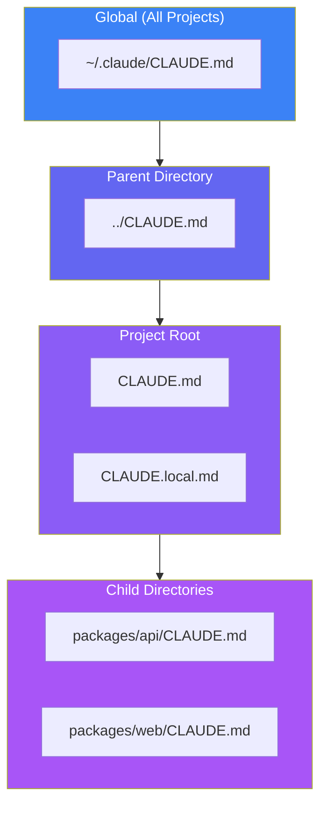
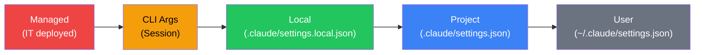

Claude Code becomes dramatically more effective when properly configured. While you can start using it immediately out of the box, taking time to set up CLAUDE.md files and configure settings transforms it from a generic AI assistant into a development partner that truly understands your project.

## Why Configuration Matters

Every development project has unique conventions, tooling, and constraints. Without configuration, Claude Code starts each session with no knowledge of your:

- Project structure and key files
- Code style and naming conventions
- Testing frameworks and commands
- Build and deployment processes
- Team-specific guidelines

By investing in configuration, you eliminate the need to repeatedly explain these details. Claude Code loads your instructions at startup, making every interaction more productive from the first prompt.

## Understanding CLAUDE.md

CLAUDE.md is a special documentation file that Claude Code automatically reads when starting a session. It becomes part of Claude's system prompt, providing persistent context about your project.

### What to Include

Think of CLAUDE.md as documentation that both humans and Claude need to understand quickly:

**Project Context**
```markdown
# Project Overview
This is a Next.js 14 e-commerce platform using the App Router.
Key directories:
- `src/app/` - Routes and pages
- `src/components/` - React components
- `src/lib/` - Utility functions and API clients
```

**Code Style Guidelines**
```markdown
## Code Style
- Use functional components with hooks
- Prefer named exports over default exports
- Use TypeScript strict mode
- 2-space indentation
- No semicolons (Prettier configured)
```

**Common Commands**
```markdown
## Commands
- `npm run dev` - Start development server
- `npm run build` - Production build
- `npm run test` - Run Jest tests
- `npm run lint` - ESLint check
```

**Testing Instructions**
```markdown
## Testing
- Use React Testing Library for component tests
- Mock external API calls with MSW
- Tests live in `__tests__` directories alongside source
- Run `npm run test:coverage` for coverage report
```

**Important Warnings**
```markdown
## Important Notes
- Never commit `.env.local` - contains production secrets
- The `legacy/` directory is deprecated - don't modify
- Always run `npm run typecheck` before committing
```

### File Location Hierarchy

Claude Code supports multiple CLAUDE.md files, allowing you to organize context at different levels:



| Location | Purpose | Shared with Team? |
|----------|---------|-------------------|
| `~/.claude/CLAUDE.md` | Personal preferences across all projects | No |
| `../CLAUDE.md` | Monorepo-level context | Yes |
| `CLAUDE.md` | Project-specific context | Yes (commit to git) |
| `CLAUDE.local.md` | Personal overrides | No (gitignored) |
| `packages/*/CLAUDE.md` | Package-specific context | Yes |

### Updating CLAUDE.md

You can update CLAUDE.md in two ways:

**Manual Editing**: Open the file and add content directly.

**Using the `#` Key**: While in Claude Code, press `#` to give an instruction that Claude automatically adds to CLAUDE.md:

```
# Always use pnpm instead of npm for package management
```

This approach is convenient for capturing decisions as you work, ensuring they persist for future sessions.

## Settings Configuration

Beyond CLAUDE.md, Claude Code uses JSON configuration files for more structured settings.

### Settings Hierarchy



Higher priority settings override lower ones. This allows:
- IT teams to enforce security policies via managed settings
- Developers to override project settings locally
- Teams to share common configurations via project settings

### Core Settings Structure

```json
{
  "permissions": {
    "allow": [],
    "ask": [],
    "deny": []
  },
  "env": {},
  "model": "claude-sonnet-4-5-20250929",
  "hooks": {}
}
```

## Permission Management

Permissions control which tools Claude Code can use. Thoughtful permission configuration balances productivity with safety.

### Permission Rules

**Allow**: Claude can use these tools without asking.
```json
{
  "permissions": {
    "allow": [
      "Bash(npm run lint)",
      "Bash(npm run test:*)",
      "Bash(git diff:*)",
      "Read(src/**)",
      "Edit(src/**)"
    ]
  }
}
```

**Ask**: Claude requests confirmation before using these tools.
```json
{
  "permissions": {
    "ask": [
      "Bash(git push:*)",
      "Bash(npm publish:*)"
    ]
  }
}
```

**Deny**: Claude cannot use these tools, even if requested.
```json
{
  "permissions": {
    "deny": [
      "Read(./.env)",
      "Read(./.env.*)",
      "Read(./secrets/**)",
      "Bash(curl:*)",
      "Bash(rm -rf:*)"
    ]
  }
}
```

### Permission Patterns

Permissions support glob patterns for flexible matching:

| Pattern | Matches |
|---------|---------|
| `Bash(npm run:*)` | Any npm run command |
| `Read(src/**)` | Any file in src recursively |
| `Edit(*.ts)` | Any TypeScript file in current directory |
| `Bash(git diff:*)` | Any git diff command |

### Recommended Security Configuration

```json
{
  "permissions": {
    "allow": [
      "Bash(npm run lint)",
      "Bash(npm run test)",
      "Bash(npm run build)",
      "Bash(git status)",
      "Bash(git diff:*)",
      "Bash(git log:*)",
      "Read(src/**)",
      "Edit(src/**)",
      "Read(tests/**)",
      "Edit(tests/**)"
    ],
    "deny": [
      "Read(.env)",
      "Read(.env.*)",
      "Read(secrets/**)",
      "Read(**/*credentials*)",
      "Bash(curl:*)",
      "Bash(wget:*)",
      "WebFetch"
    ]
  }
}
```

## Environment Variables

Claude Code supports environment variable configuration for consistent session setup:

```json
{
  "env": {
    "NODE_ENV": "development",
    "DEBUG": "true",
    "API_BASE_URL": "http://localhost:3000"
  }
}
```

### Useful Environment Variables

| Variable | Purpose | Example |
|----------|---------|---------|
| `ANTHROPIC_MODEL` | Default model | `claude-sonnet-4-5-20250929` |
| `BASH_DEFAULT_TIMEOUT_MS` | Command timeout | `30000` |
| `MAX_MCP_OUTPUT_TOKENS` | MCP output limit | `25000` |
| `DISABLE_TELEMETRY` | Disable telemetry | `1` |

## Attribution Settings

Control how Claude Code attributes its contributions:

```json
{
  "attribution": {
    "commit": "Co-Authored-By: Claude <noreply@anthropic.com>",
    "pr": "Generated with Claude Code"
  }
}
```

To hide attribution:
```json
{
  "attribution": {
    "commit": "",
    "pr": ""
  }
}
```

## Complete Configuration Example

Here's a comprehensive example combining all elements:

**CLAUDE.md**
```markdown
# E-Commerce Platform

## Overview
Next.js 14 e-commerce platform with TypeScript.

## Key Paths
- `src/app/` - App Router pages
- `src/components/` - React components
- `src/lib/api/` - API client
- `prisma/` - Database schema

## Commands
- `pnpm dev` - Development server (port 3000)
- `pnpm build` - Production build
- `pnpm test` - Run tests
- `pnpm db:push` - Push schema changes

## Code Style
- Functional components with hooks
- Named exports preferred
- Use Zod for validation
- Server Components by default

## Important
- Run `pnpm typecheck` before commits
- Never modify `src/lib/legacy/`
- Mock Stripe in tests using MSW
```

**`.claude/settings.json`**
```json
{
  "permissions": {
    "allow": [
      "Bash(pnpm:*)",
      "Bash(git diff:*)",
      "Bash(git status)",
      "Bash(git log:*)",
      "Read(src/**)",
      "Edit(src/**)",
      "Read(prisma/**)",
      "Edit(prisma/**)"
    ],
    "deny": [
      "Read(.env*)",
      "Read(secrets/**)",
      "Bash(curl:*)",
      "Bash(wget:*)"
    ]
  },
  "env": {
    "NODE_ENV": "development"
  },
  "model": "claude-sonnet-4-5-20250929"
}
```

## Best Practices

### Keep CLAUDE.md Concise

CLAUDE.md becomes part of Claude's prompt, consuming context window space. Focus on information Claude needs frequently:

- Essential commands and paths
- Critical conventions
- Common pitfalls to avoid

Avoid documenting everything—link to external documentation for detailed information.

### Iterate and Refine

Your configuration should evolve. When you find yourself repeatedly explaining something to Claude:

1. Add it to CLAUDE.md with the `#` key
2. Review and refine the instruction
3. Commit changes so the team benefits

### Don't Include Secrets

Never put sensitive information in CLAUDE.md or settings files:

- API keys and tokens
- Database connection strings
- Passwords and credentials
- Security vulnerability details

These files may be committed to version control or become part of prompts.

### Use Local Overrides

For personal preferences that shouldn't affect the team:

- Create `CLAUDE.local.md` for personal instructions
- Use `.claude/settings.local.json` for personal settings
- Add these to `.gitignore`

## Summary

Effective Claude Code configuration transforms the development experience:

| Configuration | Purpose | Location |
|--------------|---------|----------|
| CLAUDE.md | Project context and guidelines | Project root |
| settings.json | Permissions and behavior | `.claude/` directory |
| Environment variables | Runtime configuration | `env` in settings |
| Local overrides | Personal preferences | `.local` variants |

Key principles:

- **Invest upfront**: Good configuration pays dividends across all sessions
- **Keep it focused**: Include only what Claude needs frequently
- **Iterate continuously**: Refine as you discover what works
- **Protect secrets**: Never include sensitive data in configuration files
- **Share with team**: Commit shared configuration to version control

A well-configured Claude Code environment feels like working with a colleague who already understands your project—because it does.

## References

- [Claude Code Settings Documentation](https://code.claude.com/docs/en/settings)
- [Claude Code Best Practices](https://www.anthropic.com/engineering/claude-code-best-practices)
