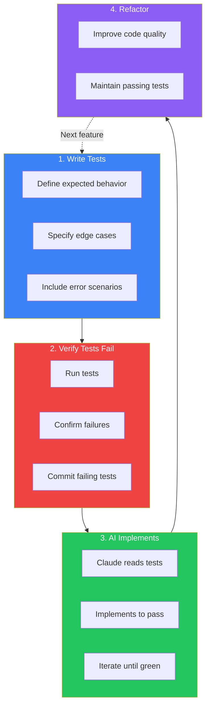

Test-Driven Development (TDD) and Claude Code are a powerful combination. When you write tests first, you create an unambiguous specification that Claude Code can implement against. This approach dramatically reduces misunderstandings and produces higher-quality code on the first attempt.

## Why TDD Works Better with AI

Traditional development with AI often suffers from ambiguity. When you ask Claude Code to "implement a user registration function," many interpretations are possible:

- What validation rules apply?
- How should errors be handled?
- What's the return type?
- Which edge cases matter?

Natural language is imprecise. Tests are precise. When you write tests first:

```typescript
describe('registerUser', () => {
  it('should create a user with valid email and password', async () => {
    const result = await registerUser({
      email: 'test@example.com',
      password: 'SecurePass123!'
    });
    expect(result.success).toBe(true);
    expect(result.user.email).toBe('test@example.com');
  });

  it('should reject passwords shorter than 8 characters', async () => {
    const result = await registerUser({
      email: 'test@example.com',
      password: 'short'
    });
    expect(result.success).toBe(false);
    expect(result.error).toBe('Password must be at least 8 characters');
  });
});
```

There's no ambiguity about what "registerUser" should do. Claude Code has a precise target to implement against.

## The TDD Workflow with Claude Code



### Step 1: Write Tests First

Write comprehensive tests that define the expected behavior:

```
Write tests for a function called calculateShipping that:
- Takes an order object with items and destination
- Returns free shipping for orders over $100
- Returns $5.99 for standard shipping under $100
- Returns $15.99 for express shipping
- Throws an error for empty orders
- Throws an error for invalid destinations

Use Jest and TypeScript. Don't implement the function yet.
```

Claude Code generates tests:

```typescript
// src/__tests__/calculateShipping.test.ts
import { calculateShipping, ShippingType } from '../calculateShipping';

describe('calculateShipping', () => {
  const validDestination = { country: 'US', zipCode: '10001' };

  describe('free shipping', () => {
    it('should return $0 for orders over $100', () => {
      const order = {
        items: [{ price: 150, quantity: 1 }],
        destination: validDestination
      };
      expect(calculateShipping(order, ShippingType.STANDARD)).toBe(0);
    });

    it('should return $0 for orders exactly $100', () => {
      const order = {
        items: [{ price: 100, quantity: 1 }],
        destination: validDestination
      };
      expect(calculateShipping(order, ShippingType.STANDARD)).toBe(0);
    });
  });

  describe('standard shipping', () => {
    it('should return $5.99 for orders under $100', () => {
      const order = {
        items: [{ price: 50, quantity: 1 }],
        destination: validDestination
      };
      expect(calculateShipping(order, ShippingType.STANDARD)).toBe(5.99);
    });
  });

  describe('express shipping', () => {
    it('should return $15.99 for express shipping', () => {
      const order = {
        items: [{ price: 50, quantity: 1 }],
        destination: validDestination
      };
      expect(calculateShipping(order, ShippingType.EXPRESS)).toBe(15.99);
    });

    it('should apply free shipping threshold to express orders', () => {
      const order = {
        items: [{ price: 150, quantity: 1 }],
        destination: validDestination
      };
      expect(calculateShipping(order, ShippingType.EXPRESS)).toBe(0);
    });
  });

  describe('error handling', () => {
    it('should throw an error for empty orders', () => {
      const order = { items: [], destination: validDestination };
      expect(() => calculateShipping(order, ShippingType.STANDARD))
        .toThrow('Order must contain at least one item');
    });

    it('should throw an error for invalid destination', () => {
      const order = {
        items: [{ price: 50, quantity: 1 }],
        destination: { country: '', zipCode: '' }
      };
      expect(() => calculateShipping(order, ShippingType.STANDARD))
        .toThrow('Invalid destination');
    });
  });
});
```

### Step 2: Verify Tests Fail

Before implementation, confirm the tests fail as expected:

```
Run the tests to confirm they fail. We haven't implemented
calculateShipping yet, so all tests should fail.
```

This step validates that:
- Tests are syntactically correct
- Tests would catch a broken implementation
- You're testing the right thing

After confirming failures:

```
Commit the tests with message: "test: add calculateShipping tests"
```

Committing failing tests creates a checkpoint and documents intent.

### Step 3: Let Claude Implement

Now ask Claude Code to implement:

```
Implement the calculateShipping function to pass all tests.
Read the test file first to understand the exact requirements.
```

Claude Code reads the tests and implements:

```typescript
// src/calculateShipping.ts
export enum ShippingType {
  STANDARD = 'STANDARD',
  EXPRESS = 'EXPRESS'
}

interface OrderItem {
  price: number;
  quantity: number;
}

interface Destination {
  country: string;
  zipCode: string;
}

interface Order {
  items: OrderItem[];
  destination: Destination;
}

const FREE_SHIPPING_THRESHOLD = 100;
const STANDARD_SHIPPING_RATE = 5.99;
const EXPRESS_SHIPPING_RATE = 15.99;

export function calculateShipping(
  order: Order,
  shippingType: ShippingType
): number {
  // Validate order
  if (order.items.length === 0) {
    throw new Error('Order must contain at least one item');
  }

  // Validate destination
  if (!order.destination.country || !order.destination.zipCode) {
    throw new Error('Invalid destination');
  }

  // Calculate order total
  const orderTotal = order.items.reduce(
    (sum, item) => sum + item.price * item.quantity,
    0
  );

  // Free shipping for orders at or above threshold
  if (orderTotal >= FREE_SHIPPING_THRESHOLD) {
    return 0;
  }

  // Apply shipping rate based on type
  return shippingType === ShippingType.EXPRESS
    ? EXPRESS_SHIPPING_RATE
    : STANDARD_SHIPPING_RATE;
}
```

### Step 4: Run Tests and Iterate

```
Run the tests and see if they pass.
```

If tests pass, great! If not, Claude Code iterates:

```
Tests for express shipping over $100 are failing.
Fix the implementation to match the test expectations.
```

### Step 5: Refactor with Confidence

Once tests pass, refactor knowing the tests will catch regressions:

```
Refactor calculateShipping to be more readable.
Run tests after each change to ensure they still pass.
```

## Preventing Overfitting

A subtle risk with AI-driven TDD is "overfitting"—where the implementation passes tests but doesn't generalize correctly. For example, Claude might hardcode expected values.

### Use Independent Verification

Anthropic recommends using separate Claude instances for writing and verifying:

```
I've implemented calculateShipping based on the tests.
As a fresh reviewer, examine the implementation critically:
- Does it handle cases not explicitly tested?
- Are there any hardcoded values that suggest overfitting?
- Would this implementation work for real orders?
```

### Add Property-Based Tests

Complement example-based tests with property-based tests:

```typescript
import fc from 'fast-check';

describe('calculateShipping properties', () => {
  it('should never return negative shipping', () => {
    fc.assert(
      fc.property(
        fc.array(fc.record({ price: fc.float({ min: 0 }), quantity: fc.integer({ min: 1 }) })),
        (items) => {
          if (items.length === 0) return true; // Skip empty orders
          const order = { items, destination: { country: 'US', zipCode: '10001' } };
          const shipping = calculateShipping(order, ShippingType.STANDARD);
          return shipping >= 0;
        }
      )
    );
  });

  it('should give free shipping for any order over threshold', () => {
    fc.assert(
      fc.property(
        fc.float({ min: 100.01, max: 10000 }),
        (price) => {
          const order = {
            items: [{ price, quantity: 1 }],
            destination: { country: 'US', zipCode: '10001' }
          };
          return calculateShipping(order, ShippingType.STANDARD) === 0;
        }
      )
    );
  });
});
```

## TDD for Different Scenarios

### API Endpoints

```
Write tests for a POST /api/users endpoint that:
- Creates a user with valid data and returns 201
- Returns 400 for missing required fields
- Returns 409 for duplicate email
- Returns 422 for invalid email format

Use supertest and jest. Don't implement the endpoint yet.
```

### React Components

```
Write tests for a LoginForm component that:
- Renders email and password inputs
- Shows validation errors for invalid inputs
- Disables submit button while loading
- Calls onSubmit with credentials when form is valid
- Displays error message when login fails

Use React Testing Library. Don't implement the component yet.
```

### Database Operations

```
Write tests for a UserRepository class that:
- Creates a user and returns the created record
- Finds a user by email
- Updates user profile fields
- Soft-deletes a user (sets deletedAt)
- Throws NotFoundError for missing users

Use an in-memory SQLite database for tests. Don't implement yet.
```

## Benefits of TDD with Claude Code

### Reduced Ambiguity

Tests eliminate interpretation differences. The function either passes or it doesn't.

### Faster Iterations

When implementation fails tests, Claude Code has specific feedback about what's wrong, not vague descriptions.

### Built-In Documentation

Tests serve as executable documentation of expected behavior.

### Confidence in Changes

Future changes can be made knowing tests will catch regressions.

### Better Code Design

Writing tests first often reveals design issues before implementation begins.

## Common Pitfalls

### Tests That Are Too Implementation-Specific

**Bad**: Testing internal implementation details
```typescript
it('should use the calculateTotal helper function', () => {
  // This couples tests to implementation
});
```

**Good**: Testing observable behavior
```typescript
it('should return the sum of all item prices', () => {
  const total = calculateOrderTotal(items);
  expect(total).toBe(150);
});
```

### Insufficient Edge Cases

Don't just test the happy path:

```
Add tests for edge cases:
- What happens with very large orders?
- What about floating point precision issues?
- What if quantity is zero?
- What about negative prices?
```

### Not Running Tests After Each Change

```
Run the tests now to verify the latest change didn't break anything.
```

Make this a habit after every modification.

## Summary

TDD with Claude Code creates a powerful feedback loop:

| Phase | Action | Benefit |
|-------|--------|---------|
| **Write Tests** | Define expected behavior precisely | Eliminates ambiguity |
| **Verify Failure** | Confirm tests catch problems | Validates test correctness |
| **Implement** | Let Claude implement to pass tests | Precise target for AI |
| **Refactor** | Improve with test safety net | Confident improvements |

Key principles:

- **Tests are specifications**: They define exactly what code should do
- **Commit failing tests**: Create checkpoints before implementation
- **Independent verification**: Use separate reviews to catch overfitting
- **Edge cases matter**: Don't just test the happy path
- **Iterate quickly**: Run tests after every change

TDD transforms Claude Code from a code generator into a specification implementer. When you provide clear tests, Claude Code delivers implementations that work correctly from the start.

## References

- [Claude Code Best Practices](https://www.anthropic.com/engineering/claude-code-best-practices)
- [Test-Driven Development by Example](https://www.oreilly.com/library/view/test-driven-development/0321146530/) - Kent Beck
