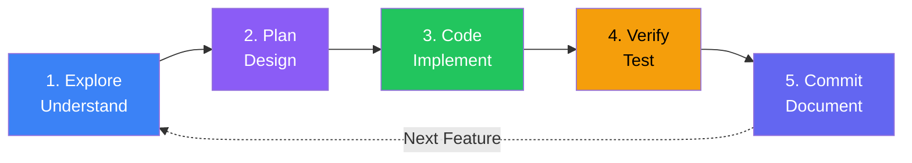

Many developers jump straight into coding with Claude Code, asking it to "implement feature X" without preparation. This approach often leads to misaligned implementations, wasted context, and frustrating back-and-forth corrections. The solution is a structured workflow that leverages Claude Code's strengths at each phase.

## The Problem with "Just Code It"

When you immediately ask Claude Code to implement something:

- Claude may misunderstand the existing codebase structure
- Implementation choices may conflict with established patterns
- You discover issues only after code is written
- Context window fills with implementation details, limiting course correction

The result is often acceptable but suboptimal code that requires significant revision—or worse, code that fundamentally misunderstands the requirements.

## The Explore, Plan, Code, Commit Workflow

Anthropic's recommended workflow breaks development into distinct phases, each optimizing for different goals:



This workflow ensures Claude Code builds understanding before writing code, and validates before committing.

## Phase 1: Explore

The exploration phase builds Claude's understanding of your codebase without making any changes.

### What to Do

Ask Claude Code to read and analyze relevant files:

```
Read the authentication module and explain how user sessions are managed.
Don't write any code yet.
```

```
Look at the API routes in src/app/api/ and describe the patterns used.
I want to understand before making changes.
```

```
Examine the database schema in prisma/schema.prisma and explain
the relationships between User, Order, and Product models.
```

### Why This Matters

Exploration achieves several goals:

1. **Context Building**: Claude reads actual code, not assumptions
2. **Pattern Recognition**: Claude identifies conventions to follow
3. **Dependency Mapping**: Claude understands what connects to what
4. **Risk Identification**: Potential issues surface before coding

### Exploration Prompts

| Goal | Prompt |
|------|--------|
| Understand structure | "Walk me through the directory structure and explain what each major folder contains" |
| Learn patterns | "Show me examples of how error handling is done in this codebase" |
| Find dependencies | "What files would be affected if I change the User model?" |
| Identify conventions | "What naming conventions are used for React components?" |

### Signs of Good Exploration

After exploration, Claude should be able to:
- Reference specific files and line numbers
- Explain existing patterns with examples
- Identify where new code should live
- Anticipate integration points

## Phase 2: Plan

With understanding established, create a concrete implementation plan before writing code.

### What to Do

Ask Claude to create a plan, optionally using extended thinking:

```
Now that you understand the authentication module, create a plan for
adding OAuth2 support for Google login. Think carefully about this.
```

```
Based on your analysis, plan how to add a shopping cart feature.
Consider:
- Where the cart state should live
- How it integrates with the existing product system
- What API endpoints are needed
```

### Document the Plan

For significant features, document the plan as a GitHub issue or markdown file:

```
Create a GitHub issue describing the implementation plan for OAuth2 support.
Include:
- Overview of changes
- Files to create/modify
- Dependencies to add
- Testing approach
```

This creates a reference point you can return to, and helps if context needs to be cleared.

### Plan Structure

A good plan includes:

```markdown
## Overview
Brief description of what we're implementing and why.

## Files to Modify
- `src/lib/auth.ts` - Add OAuth2 provider configuration
- `src/app/api/auth/[...nextauth]/route.ts` - Add Google provider

## Files to Create
- `src/lib/oauth-providers.ts` - OAuth2 provider configurations
- `src/components/GoogleLoginButton.tsx` - Login UI component

## Dependencies
- `next-auth` - Already installed, need to configure
- `@auth/google-provider` - New dependency

## Implementation Steps
1. Configure Google OAuth credentials in environment
2. Add Google provider to NextAuth configuration
3. Create login button component
4. Add callback route handling
5. Update session types for Google profile data

## Testing Approach
- Unit tests for provider configuration
- Integration tests for OAuth flow (using mocked responses)
- E2E test for complete login flow
```

### Plan Review

Before proceeding, review the plan:

- Does it align with your understanding?
- Are the scope and complexity appropriate?
- Are there any missing considerations?

If something seems off, discuss it now—changes are cheap at this stage.

## Phase 3: Code

With exploration complete and plan approved, implementation begins.

### What to Do

Reference the plan and implement incrementally:

```
Following the plan in issue #123, implement step 1:
Configure Google OAuth credentials.
```

```
Now implement step 2: Add Google provider to NextAuth configuration.
Reference the existing auth setup in src/lib/auth.ts.
```

### Implementation Principles

**Follow the Plan**: Resist scope creep. If you discover something that should change the plan, pause implementation and update the plan first.

**Implement Incrementally**: Complete one step, verify it works, then proceed. Don't implement everything at once.

**Preserve Patterns**: Follow conventions discovered during exploration. If the codebase uses named exports, don't introduce default exports.

**Validate Continuously**: After each change, run relevant commands:
```
Run the TypeScript compiler to check for type errors.
```
```
Run the tests related to authentication.
```

### Course Correction

If implementation diverges from expectations:

- **Press Escape** to interrupt Claude mid-response
- **Double-tap Escape** to edit your previous prompt
- Ask Claude to **undo changes** if needed
- Use **/clear** to reset context if deeply off-track

## Phase 4: Verify

Before committing, verify the implementation works correctly.

### What to Do

Run comprehensive checks:

```
Run the full test suite and fix any failures.
```

```
Run the linter and fix any issues.
```

```
Run the TypeScript compiler in strict mode and resolve any errors.
```

### Verification Checklist

| Check | Command Example |
|-------|-----------------|
| Type safety | `npm run typecheck` |
| Linting | `npm run lint` |
| Unit tests | `npm run test` |
| Build | `npm run build` |
| E2E tests | `npm run test:e2e` |

### Manual Verification

For UI changes, verify visually:

```
Start the development server so I can manually test the Google login button.
```

If something doesn't look right, iterate:

```
The login button is misaligned. It should be centered in the header.
Fix the styling.
```

## Phase 5: Commit

With implementation verified, create a well-documented commit.

### What to Do

```
Create a commit for the Google OAuth implementation with a descriptive message.
```

Claude Code excels at commit messages because it understands what changed and why:

```
feat(auth): add Google OAuth2 login support

- Configure Google provider in NextAuth
- Add GoogleLoginButton component with loading states
- Handle OAuth callback and session management
- Add comprehensive test coverage for OAuth flow

Implements #123
```

### Pull Request Creation

For feature branches, create a pull request:

```
Create a pull request for this feature branch.
Include a summary of changes and testing instructions.
```

## Workflow Variations

### Quick Fixes

For simple, well-understood changes, compress the workflow:

```
The login button has a typo - it says "Sing In" instead of "Sign In".
Fix it and commit.
```

Small, obvious fixes don't need extensive exploration or planning.

### Large Features

For complex features, extend the planning phase:

```
This is a large feature. Before we plan implementation,
let's identify risks and unknowns:
- What parts of this are we uncertain about?
- What could go wrong?
- Are there any architectural decisions to make?
```

Create sub-plans for major components and implement them as separate units.

### Refactoring

For refactoring, emphasize the exploration phase:

```
I want to refactor the payment processing module.
First, map all usages of the current implementation.
I need to understand the full impact before changing anything.
```

## Anti-Patterns to Avoid

### Skipping Exploration

**Problem**: Claude makes assumptions about code it hasn't read.

**Solution**: Always have Claude read relevant code before implementing.

### Vague Plans

**Problem**: "Add user authentication" is not a plan.

**Solution**: Plans should be specific enough that any developer could follow them.

### Ignoring Verification

**Problem**: Committing without running tests.

**Solution**: Verification is not optional. Build, lint, and test before every commit.

### Context Overload

**Problem**: Trying to implement too much in one session fills context.

**Solution**: Commit frequently, use `/clear` between major features, reference documented plans.

## Summary

The Explore, Plan, Code, Commit workflow transforms Claude Code from a code generator into a development partner:

| Phase | Goal | Key Actions |
|-------|------|-------------|
| **Explore** | Build understanding | Read code, identify patterns, map dependencies |
| **Plan** | Design solution | Create detailed plan, document in issue/file |
| **Code** | Implement incrementally | Follow plan, preserve patterns, validate continuously |
| **Verify** | Ensure quality | Run tests, lint, typecheck, manual testing |
| **Commit** | Document changes | Create descriptive commits and pull requests |

Key principles:

- **Understanding before implementation**: Exploration prevents misaligned code
- **Plans are cheap, rewrites are expensive**: Invest in planning upfront
- **Incremental implementation**: Complete and verify steps individually
- **Continuous validation**: Catch issues early, not after everything is written
- **Documentation as you go**: Plans and commits create valuable artifacts

This workflow requires discipline but dramatically improves outcomes. The time invested in exploration and planning is recovered many times over through reduced rework and higher-quality implementations.

## References

- [Claude Code Best Practices](https://www.anthropic.com/engineering/claude-code-best-practices)
- [Claude Code Documentation](https://code.claude.com/docs/en/overview)
