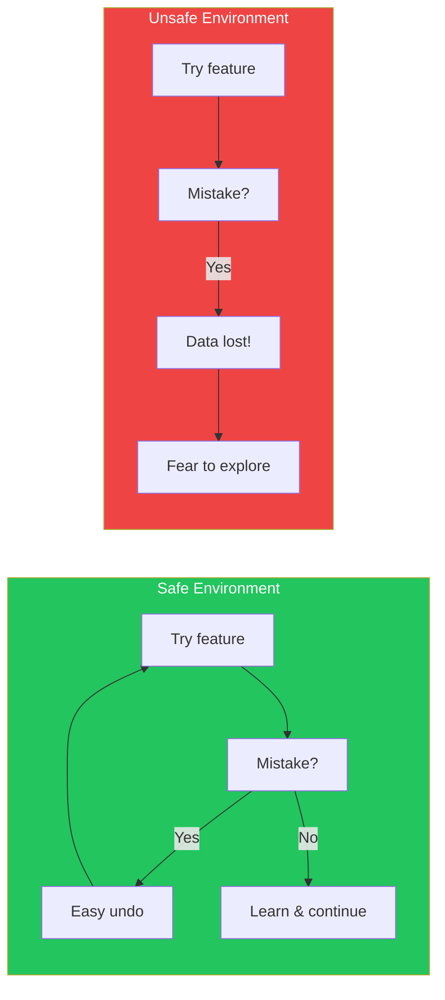
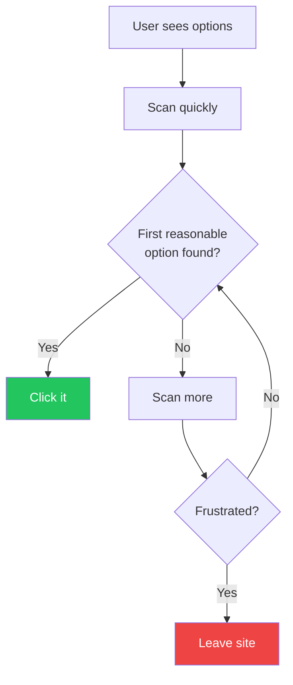
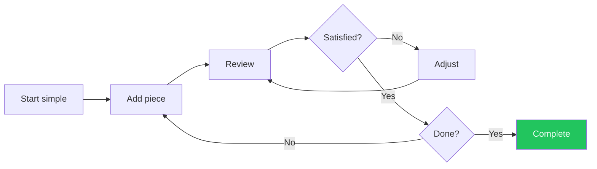

## Introduction

Understanding how users think and behave is fundamental to creating effective interfaces. Users don't approach software as blank slates—they bring expectations, habits, and cognitive limitations that profoundly affect their experience.

This article explores key cognitive and behavioral patterns that influence interface design, based on research from "Designing Interfaces" by Jenifer Tidwell et al.

## Core Cognitive Patterns

### Safe Exploration

Users learn by exploring. They need to feel safe clicking around without fear of irreversible consequences.



**Design implications:**

```tsx
// Enable safe exploration with undo
function DocumentEditor() {
  const [history, setHistory] = useState<string[]>([]);

  const saveToHistory = (content: string) => {
    setHistory(prev => [...prev, content]);
  };

  const undo = () => {
    if (history.length > 1) {
      setHistory(prev => prev.slice(0, -1));
    }
  };

  return (
    <div>
      <Editor onChange={saveToHistory} />
      <Button onClick={undo} disabled={history.length <= 1}>
        Undo
      </Button>
      {/* Clear indication that actions are reversible */}
      <span className="text-gray-500">
        All changes can be undone
      </span>
    </div>
  );
}
```

### Instant Gratification

Users want immediate results. The faster they see value, the more engaged they become.

| Delay | User Perception | Design Response |
|-------|-----------------|-----------------|
| 0-100ms | Instantaneous | Direct manipulation |
| 100-300ms | Slight delay | Show subtle feedback |
| 300ms-1s | Noticeable | Loading indicator |
| 1-10s | Disruptive | Progress bar + message |
| 10s+ | Abandonment risk | Background processing |

```tsx
// Provide instant gratification with optimistic updates
function LikeButton({ postId, initialLiked }) {
  const [liked, setLiked] = useState(initialLiked);
  const [isPending, startTransition] = useTransition();

  const handleLike = () => {
    // Optimistic update - instant feedback
    setLiked(!liked);

    // Actual API call in background
    startTransition(async () => {
      try {
        await toggleLike(postId);
      } catch {
        // Revert on failure
        setLiked(liked);
      }
    });
  };

  return (
    <button onClick={handleLike} className={liked ? 'text-red-500' : ''}>
      {liked ? '❤️' : '🤍'} {isPending && '...'}
    </button>
  );
}
```

### Satisficing

Users don't optimize—they choose the first option that seems good enough. This is a rational strategy given limited time and attention.



**Design implications:**
- Put the most likely choice first
- Make the "best" option visually prominent
- Don't hide important options in dropdowns

```tsx
// Design for satisficing
function PlanSelector({ plans }) {
  // Sort plans with recommended first
  const sortedPlans = [...plans].sort((a, b) =>
    b.isRecommended - a.isRecommended
  );

  return (
    <div className="grid gap-4">
      {sortedPlans.map((plan, index) => (
        <PlanCard
          key={plan.id}
          plan={plan}
          // First (recommended) plan is visually prominent
          variant={index === 0 ? 'featured' : 'default'}
        />
      ))}
    </div>
  );
}
```

### Changes in Midstream

Users frequently change their minds or approach mid-task. Good interfaces accommodate this gracefully.

```tsx
// Support changes in midstream
function CheckoutFlow() {
  const [step, setStep] = useState(1);
  const [data, setData] = useState({});

  return (
    <div>
      {/* Allow jumping back to any completed step */}
      <StepIndicator
        currentStep={step}
        completedSteps={Object.keys(data)}
        onStepClick={(s) => setStep(s)} // Easy to go back
      />

      {/* Preserve data when switching steps */}
      {step === 1 && <ShippingForm data={data.shipping} />}
      {step === 2 && <PaymentForm data={data.payment} />}
      {step === 3 && <ReviewForm data={data} />}

      {/* Always show what's been entered */}
      <aside>
        <h3>Your selections</h3>
        <OrderSummary data={data} editable />
      </aside>
    </div>
  );
}
```

### Deferred Choices

Users want to skip optional decisions and come back later—or never.

```tsx
// Allow deferred choices
function OnboardingFlow() {
  return (
    <div>
      <h2>Customize your experience</h2>

      <PreferenceForm>
        {/* Make optional fields clearly optional */}
        <Field name="theme" label="Theme" optional>
          <Select defaultValue="system">
            <Option value="system">System default</Option>
            <Option value="light">Light</Option>
            <Option value="dark">Dark</Option>
          </Select>
        </Field>

        {/* Always provide a skip option */}
        <div className="flex gap-4">
          <Button type="submit">Save preferences</Button>
          <Button variant="ghost" onClick={skip}>
            Skip for now
          </Button>
        </div>

        {/* Reassure users they can change later */}
        <p className="text-sm text-gray-500">
          You can always change these in Settings
        </p>
      </PreferenceForm>
    </div>
  );
}
```

### Incremental Construction

Users build complex artifacts piece by piece, refining as they go.



**Design implications:**
- Support partial completion
- Show work-in-progress clearly
- Allow saving incomplete work
- Provide preview capabilities

```tsx
// Support incremental construction
function FormBuilder() {
  const [fields, setFields] = useState([]);
  const [isDraft, setIsDraft] = useState(true);

  return (
    <div className="flex">
      {/* Work area */}
      <div className="flex-1">
        <DraftIndicator isDraft={isDraft} />
        <FieldList fields={fields} onReorder={setFields} />
        <AddFieldButton onClick={addField} />
      </div>

      {/* Live preview */}
      <aside className="w-80">
        <h3>Preview</h3>
        <FormPreview fields={fields} />
      </aside>

      {/* Auto-save to support incremental work */}
      <AutoSave data={fields} />
    </div>
  );
}
```

### Habituation

Repeated actions become automatic. Users develop muscle memory for frequently used features.

| Frequency | User State | Design Response |
|-----------|------------|-----------------|
| First use | Learning | Clear labels, guidance |
| Occasional | Recalling | Consistent placement |
| Frequent | Automatic | Keyboard shortcuts |
| Expert | Optimizing | Command palette, macros |

```tsx
// Support habituation with consistent patterns
function ActionBar() {
  return (
    <div className="flex gap-2">
      {/* Primary action always in same position */}
      <Button variant="primary" shortcut="⌘S">
        Save
      </Button>

      {/* Secondary actions follow consistent order */}
      <Button shortcut="⌘Z">Undo</Button>
      <Button shortcut="⌘⇧Z">Redo</Button>

      {/* Show shortcuts to encourage habituation */}
      <Tooltip content="⌘K for command palette">
        <Button>More actions...</Button>
      </Tooltip>
    </div>
  );
}
```

### Spatial Memory

Users remember where things are. Moving UI elements breaks this memory and causes frustration.

```tsx
// Preserve spatial memory
function Dashboard({ widgets }) {
  const [layout, setLayout] = useState(() => {
    // Load saved layout from localStorage
    return localStorage.getItem('dashboard-layout')
      || generateDefaultLayout(widgets);
  });

  // When user rearranges, persist their preference
  const handleLayoutChange = (newLayout) => {
    setLayout(newLayout);
    localStorage.setItem('dashboard-layout', newLayout);
  };

  return (
    <GridLayout
      layout={layout}
      onLayoutChange={handleLayoutChange}
      // Items stay where user put them
      isDraggable
      isResizable
    >
      {widgets.map(widget => (
        <Widget key={widget.id} {...widget} />
      ))}
    </GridLayout>
  );
}
```

### Prospective Memory

Users set intentions to do something later. Help them remember.

```tsx
// Support prospective memory
function ArticleReader({ article }) {
  const [reminders, setReminders] = useState([]);

  return (
    <article>
      {/* Allow users to mark things to return to */}
      <BookmarkButton
        onBookmark={() => addBookmark(article.id)}
      />

      {/* Support "read later" pattern */}
      <Button
        onClick={() => addToReadingList(article.id)}
        variant="ghost"
      >
        📚 Read later
      </Button>

      {/* Allow setting reminders */}
      <ReminderButton
        options={['Tomorrow', 'Next week', 'Custom...']}
        onSet={(time) => setReminder(article.id, time)}
      />

      <Content>{article.body}</Content>
    </article>
  );
}
```

### Streamlined Repetition

When users need to repeat an action many times, make it effortless.

```tsx
// Streamline repetitive actions
function PhotoUploader() {
  return (
    <div>
      {/* Batch operations for repetitive tasks */}
      <BatchActions>
        <Button onClick={selectAll}>Select All</Button>
        <Button onClick={deleteSelected}>Delete Selected</Button>
        <Button onClick={tagSelected}>Tag Selected</Button>
      </BatchActions>

      {/* Drag and drop for easy multi-upload */}
      <DropZone
        multiple
        onDrop={handleFiles}
      >
        Drop photos here or click to browse
      </DropZone>

      {/* Show progress for batch operations */}
      <UploadProgress items={uploadQueue} />

      {/* Remember last used settings */}
      <Settings
        defaultAlbum={lastUsedAlbum}
        defaultPrivacy={lastUsedPrivacy}
      />
    </div>
  );
}
```

## Designing for These Patterns

### Pattern Summary Table

| Pattern | User Need | Design Solution |
|---------|-----------|-----------------|
| Safe Exploration | Try without fear | Undo, confirmation dialogs |
| Instant Gratification | See results now | Optimistic updates, progress |
| Satisficing | Quick, good-enough choices | Prominent recommended options |
| Changes in Midstream | Change direction | Preserve state, easy navigation |
| Deferred Choices | Decide later | Skip options, good defaults |
| Incremental Construction | Build gradually | Autosave, preview, partial state |
| Habituation | Efficiency through repetition | Consistent placement, shortcuts |
| Spatial Memory | Remember locations | Stable layout, user preferences |
| Prospective Memory | Remember intentions | Bookmarks, reminders, lists |
| Streamlined Repetition | Do many quickly | Batch actions, keyboard shortcuts |

### Implementation Checklist

```markdown
## Cognitive Pattern Checklist

### Safe Exploration
- [ ] All destructive actions have undo
- [ ] Confirmation for irreversible actions
- [ ] Clear indication of action consequences

### Instant Gratification
- [ ] Response within 100ms for interactions
- [ ] Loading indicators for >300ms
- [ ] Optimistic updates where appropriate

### Satisficing
- [ ] Best option is visually prominent
- [ ] Important options are not hidden
- [ ] Labels are clear and unambiguous

### Changes in Midstream
- [ ] Easy to go back in flows
- [ ] State is preserved when navigating
- [ ] Side panels show current selections

### Deferred Choices
- [ ] Optional fields are marked
- [ ] Skip buttons available
- [ ] Good defaults provided

### Habituation
- [ ] UI elements in consistent positions
- [ ] Keyboard shortcuts for common actions
- [ ] Actions follow platform conventions

### Spatial Memory
- [ ] Layout persists across sessions
- [ ] Elements don't move unexpectedly
- [ ] User customizations are saved
```

## Conclusion

These cognitive patterns aren't arbitrary preferences—they're fundamental aspects of how humans process information and interact with their environment. By designing for these patterns, you create interfaces that feel natural rather than forced.

The key insight is that users are not machines processing optimal algorithms. They're humans with limited attention, existing habits, and varying levels of patience. Meeting them where they are—rather than where you wish they were—is the foundation of great interface design.

## References

- Tidwell, Jenifer, et al. "Designing Interfaces" (3rd Edition)
- Norman, Don. "The Design of Everyday Things"
- Kahneman, Daniel. "Thinking, Fast and Slow"
- Nielsen Norman Group - Mental Models
