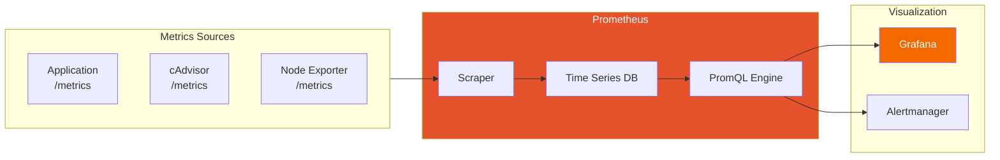
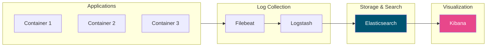

Effective monitoring and logging are essential for running containers in production. This article covers tools and practices for gaining visibility into your containerized applications.

## Why Container Monitoring Matters

Containers are ephemeral and dynamic, making traditional monitoring approaches insufficient:

| Challenge | Traditional Approach | Container Reality |
|-----------|---------------------|-------------------|
| Lifecycle | Long-lived servers | Short-lived containers |
| Scale | Fixed infrastructure | Dynamic scaling |
| Discovery | Static IPs | Dynamic IPs and names |
| Logs | Files on disk | Stdout/stderr streams |

## Docker Native Logging

### Container Logs Basics

```bash
# View container logs
docker logs mycontainer

# Follow logs in real-time
docker logs -f mycontainer

# Show timestamps
docker logs -t mycontainer

# Show last N lines
docker logs --tail 100 mycontainer

# Show logs since time
docker logs --since 2025-01-18T10:00:00 mycontainer
docker logs --since 30m mycontainer
```

### Logging Drivers

Docker supports multiple logging drivers:

```bash
# Check current logging driver
docker info | grep "Logging Driver"

# Run with specific driver
docker run -d --log-driver json-file --log-opt max-size=10m nginx
```

| Driver | Description | Best For |
|--------|-------------|----------|
| `json-file` | Default, JSON format | Development, small deployments |
| `syslog` | Syslog daemon | Traditional Linux logging |
| `journald` | Systemd journal | Systemd-based systems |
| `fluentd` | Fluentd collector | Centralized logging |
| `awslogs` | AWS CloudWatch | AWS deployments |
| `gcplogs` | Google Cloud Logging | GCP deployments |

### Configuring Logging in Docker Compose

```yaml
services:
  app:
    image: myapp
    logging:
      driver: json-file
      options:
        max-size: "10m"
        max-file: "3"
        labels: "app,environment"
        tag: "{{.Name}}/{{.ID}}"

  # Fluentd logging
  api:
    image: myapi
    logging:
      driver: fluentd
      options:
        fluentd-address: localhost:24224
        tag: "docker.{{.Name}}"
```

## Container Metrics with Docker Stats

```bash
# Real-time stats for all containers
docker stats

# Stats for specific containers
docker stats container1 container2

# One-time stats (no streaming)
docker stats --no-stream

# Custom format
docker stats --format "table {{.Name}}\t{{.CPUPerc}}\t{{.MemUsage}}\t{{.NetIO}}"
```

Output:
```
CONTAINER ID   NAME      CPU %     MEM USAGE / LIMIT     MEM %     NET I/O           BLOCK I/O
abc123         web       0.50%     50.5MiB / 512MiB      9.86%     1.2MB / 500kB     0B / 0B
def456         db        2.30%     256MiB / 1GiB         25.00%    500kB / 100kB     10MB / 5MB
```

## cAdvisor for Container Metrics

cAdvisor (Container Advisor) provides detailed resource usage and performance metrics.

### Running cAdvisor

```yaml
# docker-compose.yml
services:
  cadvisor:
    image: gcr.io/cadvisor/cadvisor:latest
    container_name: cadvisor
    ports:
      - "8080:8080"
    volumes:
      - /:/rootfs:ro
      - /var/run:/var/run:ro
      - /sys:/sys:ro
      - /var/lib/docker/:/var/lib/docker:ro
      - /dev/disk/:/dev/disk:ro
    privileged: true
```

Access the UI at `http://localhost:8080` for:
- CPU, memory, network, filesystem metrics
- Per-container resource usage
- Container health information

## Prometheus for Metrics Collection

### Prometheus Architecture



### Prometheus Configuration

```yaml
# prometheus.yml
global:
  scrape_interval: 15s
  evaluation_interval: 15s

alerting:
  alertmanagers:
    - static_configs:
        - targets: ['alertmanager:9093']

scrape_configs:
  # Prometheus itself
  - job_name: 'prometheus'
    static_configs:
      - targets: ['localhost:9090']

  # cAdvisor metrics
  - job_name: 'cadvisor'
    static_configs:
      - targets: ['cadvisor:8080']

  # Application metrics
  - job_name: 'app'
    static_configs:
      - targets: ['app:3000']

  # Docker daemon metrics
  - job_name: 'docker'
    static_configs:
      - targets: ['host.docker.internal:9323']
```

### Docker Compose with Prometheus Stack

```yaml
services:
  prometheus:
    image: prom/prometheus:latest
    ports:
      - "9090:9090"
    volumes:
      - ./prometheus.yml:/etc/prometheus/prometheus.yml
      - prometheus_data:/prometheus
    command:
      - '--config.file=/etc/prometheus/prometheus.yml'
      - '--storage.tsdb.path=/prometheus'

  grafana:
    image: grafana/grafana:latest
    ports:
      - "3000:3000"
    environment:
      GF_SECURITY_ADMIN_PASSWORD: admin
    volumes:
      - grafana_data:/var/lib/grafana

  cadvisor:
    image: gcr.io/cadvisor/cadvisor:latest
    ports:
      - "8080:8080"
    volumes:
      - /:/rootfs:ro
      - /var/run:/var/run:ro
      - /sys:/sys:ro
      - /var/lib/docker/:/var/lib/docker:ro

  alertmanager:
    image: prom/alertmanager:latest
    ports:
      - "9093:9093"
    volumes:
      - ./alertmanager.yml:/etc/alertmanager/alertmanager.yml

volumes:
  prometheus_data:
  grafana_data:
```

## Grafana Dashboards

### Common Container Metrics to Monitor

| Metric | Description | Alert Threshold |
|--------|-------------|-----------------|
| CPU Usage | Container CPU percentage | > 80% |
| Memory Usage | Container memory usage | > 85% |
| Network I/O | Bytes sent/received | Anomaly detection |
| Disk I/O | Read/write operations | Depends on app |
| Container Restarts | Number of restarts | > 3 in 5 minutes |

### Sample PromQL Queries

```promql
# Container CPU usage percentage
sum(rate(container_cpu_usage_seconds_total{name!=""}[5m])) by (name) * 100

# Container memory usage
container_memory_usage_bytes{name!=""} / container_spec_memory_limit_bytes{name!=""} * 100

# Network receive rate
rate(container_network_receive_bytes_total{name!=""}[5m])

# Container restart count
changes(container_start_time_seconds{name!=""}[1h])
```

## ELK Stack for Log Aggregation

### Architecture



### Docker Compose for ELK

```yaml
services:
  elasticsearch:
    image: docker.elastic.co/elasticsearch/elasticsearch:8.11.0
    environment:
      - discovery.type=single-node
      - xpack.security.enabled=false
      - "ES_JAVA_OPTS=-Xms512m -Xmx512m"
    volumes:
      - elasticsearch_data:/usr/share/elasticsearch/data
    ports:
      - "9200:9200"

  logstash:
    image: docker.elastic.co/logstash/logstash:8.11.0
    volumes:
      - ./logstash.conf:/usr/share/logstash/pipeline/logstash.conf
    ports:
      - "5044:5044"
    depends_on:
      - elasticsearch

  kibana:
    image: docker.elastic.co/kibana/kibana:8.11.0
    ports:
      - "5601:5601"
    environment:
      ELASTICSEARCH_HOSTS: http://elasticsearch:9200
    depends_on:
      - elasticsearch

  filebeat:
    image: docker.elastic.co/beats/filebeat:8.11.0
    user: root
    volumes:
      - ./filebeat.yml:/usr/share/filebeat/filebeat.yml:ro
      - /var/lib/docker/containers:/var/lib/docker/containers:ro
      - /var/run/docker.sock:/var/run/docker.sock:ro
    depends_on:
      - logstash

volumes:
  elasticsearch_data:
```

### Filebeat Configuration

```yaml
# filebeat.yml
filebeat.inputs:
  - type: container
    paths:
      - '/var/lib/docker/containers/*/*.log'
    processors:
      - add_docker_metadata:
          host: "unix:///var/run/docker.sock"

output.logstash:
  hosts: ["logstash:5044"]

logging.level: info
```

## Application-Level Logging

### Structured Logging (Node.js)

```javascript
const winston = require('winston');

const logger = winston.createLogger({
  level: 'info',
  format: winston.format.combine(
    winston.format.timestamp(),
    winston.format.json()
  ),
  defaultMeta: { service: 'my-service' },
  transports: [
    new winston.transports.Console()
  ]
});

// Usage
logger.info('User logged in', { userId: '123', action: 'login' });
```

### Structured Logging (Python)

```python
import logging
import json

class JSONFormatter(logging.Formatter):
    def format(self, record):
        log_record = {
            'timestamp': self.formatTime(record),
            'level': record.levelname,
            'message': record.getMessage(),
            'service': 'my-service'
        }
        return json.dumps(log_record)

handler = logging.StreamHandler()
handler.setFormatter(JSONFormatter())
logger = logging.getLogger()
logger.addHandler(handler)
logger.setLevel(logging.INFO)
```

## Health Checks and Alerting

### Container Health Checks

```dockerfile
HEALTHCHECK --interval=30s --timeout=3s --start-period=5s --retries=3 \
  CMD curl -f http://localhost:3000/health || exit 1
```

```yaml
# docker-compose.yml
services:
  app:
    healthcheck:
      test: ["CMD", "curl", "-f", "http://localhost:3000/health"]
      interval: 30s
      timeout: 10s
      retries: 3
      start_period: 40s
```

### Alertmanager Configuration

```yaml
# alertmanager.yml
global:
  smtp_smarthost: 'smtp.gmail.com:587'
  smtp_from: 'alerts@example.com'

route:
  group_by: ['alertname']
  group_wait: 30s
  group_interval: 5m
  repeat_interval: 1h
  receiver: 'email-notifications'

receivers:
  - name: 'email-notifications'
    email_configs:
      - to: 'team@example.com'

  - name: 'slack-notifications'
    slack_configs:
      - api_url: 'https://hooks.slack.com/services/xxx'
        channel: '#alerts'
```

### Alert Rules

```yaml
# alert_rules.yml
groups:
  - name: container_alerts
    rules:
      - alert: ContainerHighCPU
        expr: sum(rate(container_cpu_usage_seconds_total{name!=""}[5m])) by (name) > 0.8
        for: 5m
        labels:
          severity: warning
        annotations:
          summary: "High CPU usage on {{ $labels.name }}"

      - alert: ContainerHighMemory
        expr: container_memory_usage_bytes{name!=""} / container_spec_memory_limit_bytes{name!=""} > 0.85
        for: 5m
        labels:
          severity: warning
        annotations:
          summary: "High memory usage on {{ $labels.name }}"

      - alert: ContainerRestarting
        expr: changes(container_start_time_seconds{name!=""}[15m]) > 3
        labels:
          severity: critical
        annotations:
          summary: "Container {{ $labels.name }} restarting frequently"
```

## Best Practices

### 1. Centralize Logs

```yaml
services:
  app:
    logging:
      driver: fluentd
      options:
        fluentd-address: fluentd:24224
```

### 2. Use Structured Logging

```json
{
  "timestamp": "2025-01-18T10:00:00Z",
  "level": "info",
  "service": "api",
  "message": "Request processed",
  "requestId": "abc123",
  "duration": 45
}
```

### 3. Set Resource Limits with Monitoring

```yaml
services:
  app:
    deploy:
      resources:
        limits:
          memory: 512M
          cpus: '0.5'
```

### 4. Monitor Key Metrics

| Category | Metrics |
|----------|---------|
| Resources | CPU, Memory, Disk, Network |
| Application | Response time, Error rate, Throughput |
| Business | Active users, Transactions, Revenue |

## Summary

| Tool | Purpose | Best For |
|------|---------|----------|
| Docker logs | Basic log viewing | Development |
| cAdvisor | Container metrics | Resource monitoring |
| Prometheus | Metrics collection | Time-series data |
| Grafana | Visualization | Dashboards |
| ELK Stack | Log aggregation | Search and analysis |
| Alertmanager | Alerting | Incident response |

## Key Takeaways

1. **Use centralized logging** - Don't rely on local container logs
2. **Monitor container resources** - CPU, memory, network, disk
3. **Implement health checks** - Detect problems early
4. **Set up alerting** - Get notified before users do
5. **Use structured logging** - JSON format for easy parsing
6. **Retain logs appropriately** - Balance storage costs and debugging needs

## Next Steps

In the next article, we'll explore Docker CI/CD pipelines for automated building, testing, and deployment.

## References

- Docker Deep Dive, 5th Edition - Nigel Poulton
- The Ultimate Docker Container Book, 3rd Edition - Dr. Gabriel N. Schenker
- [Prometheus Documentation](https://prometheus.io/docs/)
- [Grafana Documentation](https://grafana.com/docs/)
