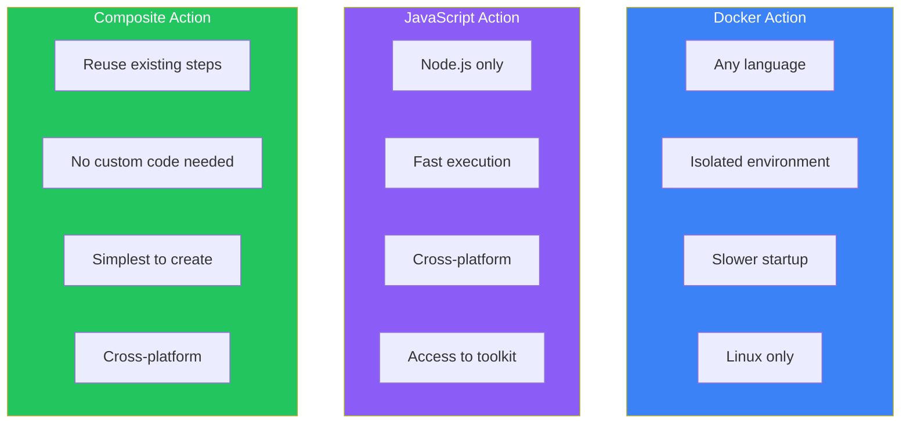
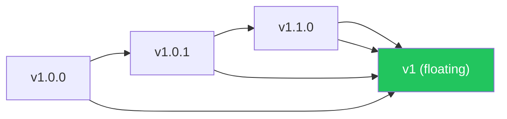

## Introduction

While the GitHub Marketplace offers thousands of pre-built actions, you may need custom functionality specific to your workflow. GitHub Actions supports three types of custom actions:

- **Docker Container Actions**: Run in a Docker container
- **JavaScript Actions**: Run directly on the runner
- **Composite Actions**: Combine multiple steps into one action

This article shows you how to create each type.

## Action Types Comparison



| Type | Best For | Platform | Startup |
|------|----------|----------|---------|
| Docker | Complex dependencies, any language | Linux only | Slower |
| JavaScript | Performance-critical, cross-platform | All | Fast |
| Composite | Bundling existing steps | All | Fast |

## The action.yml File

Every action requires an `action.yml` (or `action.yaml`) metadata file:

```yaml
name: 'My Custom Action'
description: 'A brief description of what this action does'
author: 'Your Name'

branding:
  icon: 'check-circle'
  color: 'green'

inputs:
  my-input:
    description: 'An input parameter'
    required: true
    default: 'default value'

outputs:
  my-output:
    description: 'An output value'

runs:
  # This section varies by action type
  using: 'node20'  # or 'docker' or 'composite'
```

## Docker Container Actions

### When to Use Docker Actions

- You need specific tools or dependencies
- You're using a language other than JavaScript
- You want a fully isolated, reproducible environment

### Creating a Docker Action

**Directory Structure:**

```
my-docker-action/
├── action.yml
├── Dockerfile
├── entrypoint.sh
└── README.md
```

**action.yml:**

```yaml
name: 'Docker Greeting Action'
description: 'Greets someone using a Docker container'
author: 'Your Name'

inputs:
  who-to-greet:
    description: 'Who to greet'
    required: true
    default: 'World'

outputs:
  greeting-time:
    description: 'The time we greeted you'

runs:
  using: 'docker'
  image: 'Dockerfile'
  args:
    - ${{ inputs.who-to-greet }}
```

**Dockerfile:**

```dockerfile
FROM alpine:3.19

RUN apk add --no-cache bash

COPY entrypoint.sh /entrypoint.sh
RUN chmod +x /entrypoint.sh

ENTRYPOINT ["/entrypoint.sh"]
```

**entrypoint.sh:**

```bash
#!/bin/bash

WHO_TO_GREET=$1
GREETING_TIME=$(date -u +"%Y-%m-%dT%H:%M:%SZ")

echo "Hello, $WHO_TO_GREET!"

# Set output using environment file
echo "greeting-time=$GREETING_TIME" >> $GITHUB_OUTPUT
```

### Using the Docker Action

```yaml
- name: Greet someone
  uses: ./my-docker-action
  with:
    who-to-greet: 'GitHub User'

- name: Show greeting time
  run: echo "Greeted at ${{ steps.greet.outputs.greeting-time }}"
```

## JavaScript Actions

### When to Use JavaScript Actions

- You need fast execution
- Cross-platform support is required
- You want to use the GitHub Actions Toolkit

### Creating a JavaScript Action

**Directory Structure:**

```
my-js-action/
├── action.yml
├── index.js
├── package.json
└── node_modules/  (committed or compiled)
```

**action.yml:**

```yaml
name: 'JavaScript Greeting Action'
description: 'Greets someone using JavaScript'

inputs:
  who-to-greet:
    description: 'Who to greet'
    required: true
    default: 'World'

  uppercase:
    description: 'Convert greeting to uppercase'
    required: false
    default: 'false'

outputs:
  greeting-time:
    description: 'The time we greeted you'

runs:
  using: 'node20'
  main: 'dist/index.js'
```

**package.json:**

```json
{
  "name": "my-js-action",
  "version": "1.0.0",
  "main": "index.js",
  "scripts": {
    "build": "ncc build index.js -o dist"
  },
  "dependencies": {
    "@actions/core": "^1.10.0",
    "@actions/github": "^6.0.0"
  },
  "devDependencies": {
    "@vercel/ncc": "^0.38.0"
  }
}
```

**index.js:**

```javascript
const core = require('@actions/core');
const github = require('@actions/github');

async function run() {
  try {
    // Get inputs
    const whoToGreet = core.getInput('who-to-greet', { required: true });
    const uppercase = core.getInput('uppercase') === 'true';

    // Generate greeting
    let greeting = `Hello, ${whoToGreet}!`;
    if (uppercase) {
      greeting = greeting.toUpperCase();
    }

    // Log the greeting
    console.log(greeting);

    // Get current time
    const time = new Date().toISOString();

    // Set outputs
    core.setOutput('greeting-time', time);

    // Access context information
    const payload = github.context.payload;
    console.log(`Event: ${github.context.eventName}`);
    console.log(`Ref: ${github.context.ref}`);

    // Create annotations
    core.notice(`Greeted ${whoToGreet} at ${time}`);

  } catch (error) {
    core.setFailed(error.message);
  }
}

run();
```

### Building the Action

```bash
npm install
npm run build  # Uses @vercel/ncc to bundle
```

### Actions Toolkit Features

| Package | Purpose |
|---------|---------|
| `@actions/core` | Inputs, outputs, logging, secrets |
| `@actions/github` | GitHub API client, context |
| `@actions/exec` | Execute shell commands |
| `@actions/io` | File system operations |
| `@actions/tool-cache` | Download and cache tools |
| `@actions/artifact` | Upload/download artifacts |
| `@actions/cache` | Cache management |

## Composite Actions

### When to Use Composite Actions

- Bundling multiple steps into a reusable unit
- No custom code required
- Simplifying complex workflows

### Creating a Composite Action

**action.yml:**

```yaml
name: 'Setup and Test Node Project'
description: 'Sets up Node.js, installs dependencies, and runs tests'

inputs:
  node-version:
    description: 'Node.js version to use'
    required: false
    default: '20'

  working-directory:
    description: 'Directory containing package.json'
    required: false
    default: '.'

  run-lint:
    description: 'Whether to run linting'
    required: false
    default: 'true'

outputs:
  coverage-percentage:
    description: 'Test coverage percentage'
    value: ${{ steps.coverage.outputs.percentage }}

runs:
  using: 'composite'
  steps:
    - name: Setup Node.js
      uses: actions/setup-node@v4
      with:
        node-version: ${{ inputs.node-version }}
        cache: 'npm'
        cache-dependency-path: ${{ inputs.working-directory }}/package-lock.json

    - name: Install dependencies
      shell: bash
      working-directory: ${{ inputs.working-directory }}
      run: npm ci

    - name: Run linting
      if: inputs.run-lint == 'true'
      shell: bash
      working-directory: ${{ inputs.working-directory }}
      run: npm run lint

    - name: Run tests with coverage
      shell: bash
      working-directory: ${{ inputs.working-directory }}
      run: npm test -- --coverage

    - name: Extract coverage
      id: coverage
      shell: bash
      working-directory: ${{ inputs.working-directory }}
      run: |
        COVERAGE=$(cat coverage/coverage-summary.json | jq '.total.lines.pct')
        echo "percentage=$COVERAGE" >> $GITHUB_OUTPUT
```

### Using the Composite Action

```yaml
jobs:
  test:
    runs-on: ubuntu-latest
    steps:
      - uses: actions/checkout@v4

      - name: Setup and Test
        id: test
        uses: ./my-composite-action
        with:
          node-version: '20'
          run-lint: 'true'

      - name: Report coverage
        run: echo "Coverage: ${{ steps.test.outputs.coverage-percentage }}%"
```

## Publishing Actions

### To a Public Repository

1. Create a public repository for your action
2. Tag releases with semantic versioning:

```bash
git tag -a v1.0.0 -m "Release v1.0.0"
git push origin v1.0.0

# Create major version tag
git tag -fa v1 -m "Update v1 to v1.0.0"
git push origin v1 --force
```

3. Users can reference your action:

```yaml
- uses: owner/action-name@v1
- uses: owner/action-name@v1.0.0
- uses: owner/action-name@main
```

### To GitHub Marketplace

1. Ensure your `action.yml` has `name`, `description`, and `branding`
2. Go to your repository and click "Draft a release"
3. Check "Publish this Action to the GitHub Marketplace"
4. Fill in the release details and publish

### Versioning Best Practices



| Tag | Purpose | Update Frequency |
|-----|---------|------------------|
| `v1.2.3` | Specific version | Never (immutable) |
| `v1.2` | Minor version | On patch releases |
| `v1` | Major version | On minor/patch releases |
| `main` | Latest development | Continuous |

## Local Actions

Store actions in your repository for private use:

```
.github/
├── actions/
│   ├── setup-environment/
│   │   └── action.yml
│   └── deploy/
│       └── action.yml
└── workflows/
    └── ci.yml
```

Reference local actions with relative paths:

```yaml
- uses: ./.github/actions/setup-environment
  with:
    environment: production
```

## Best Practices

### 1. Handle Errors Gracefully

```javascript
// JavaScript
try {
  await doSomething();
} catch (error) {
  core.setFailed(`Action failed: ${error.message}`);
}
```

```bash
# Docker/Bash
set -e  # Exit on error
trap 'echo "Error on line $LINENO"' ERR
```

### 2. Provide Clear Logging

```javascript
core.debug('Detailed debug information');
core.info('General information');
core.warning('Warning message');
core.error('Error message');

// Grouping logs
core.startGroup('Installing dependencies');
// ... installation logs
core.endGroup();
```

### 3. Document Thoroughly

Include in your README:
- What the action does
- All inputs and outputs
- Usage examples
- Requirements and limitations

### 4. Test Your Action

Create a test workflow:

```yaml
name: Test Action

on:
  push:
    paths:
      - 'action.yml'
      - 'src/**'
      - '.github/workflows/test-action.yml'

jobs:
  test:
    runs-on: ubuntu-latest
    steps:
      - uses: actions/checkout@v4

      - name: Run action
        id: test
        uses: ./
        with:
          input-param: 'test-value'

      - name: Verify output
        run: |
          if [ "${{ steps.test.outputs.result }}" != "expected" ]; then
            echo "Test failed!"
            exit 1
          fi
```

## Summary

| Aspect | Docker | JavaScript | Composite |
|--------|--------|------------|-----------|
| Language | Any | Node.js | N/A |
| Speed | Slower | Fast | Fast |
| Platform | Linux | All | All |
| Dependencies | Bundled in image | Bundled in dist | Uses existing actions |
| Best for | Complex envs | Performance | Reusing steps |

Choose the action type based on your needs: Docker for complex environments, JavaScript for performance, and Composite for combining existing actions.

## References

- Manning - GitHub Actions in Action, Chapter 4
- O'Reilly - Learning GitHub Actions, Chapter 11
- Packt - GitHub Actions Cookbook, Chapter 3
- GitHub Docs - Creating Actions
