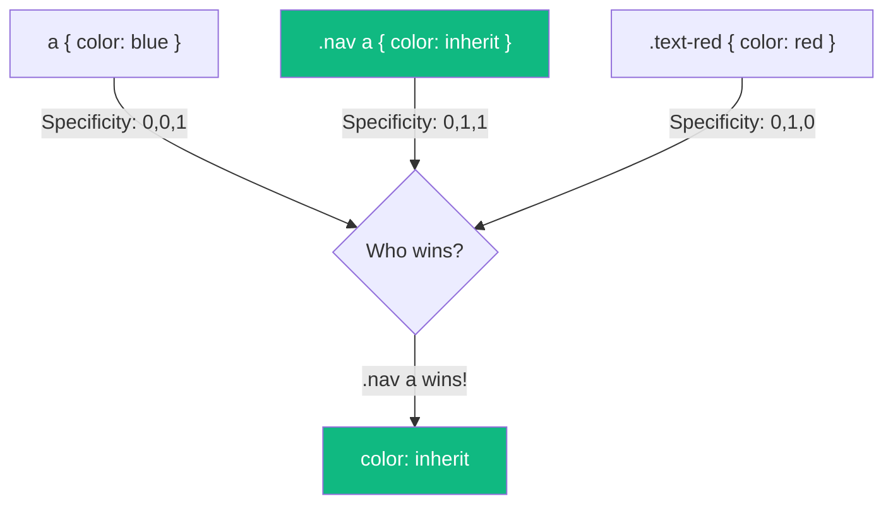
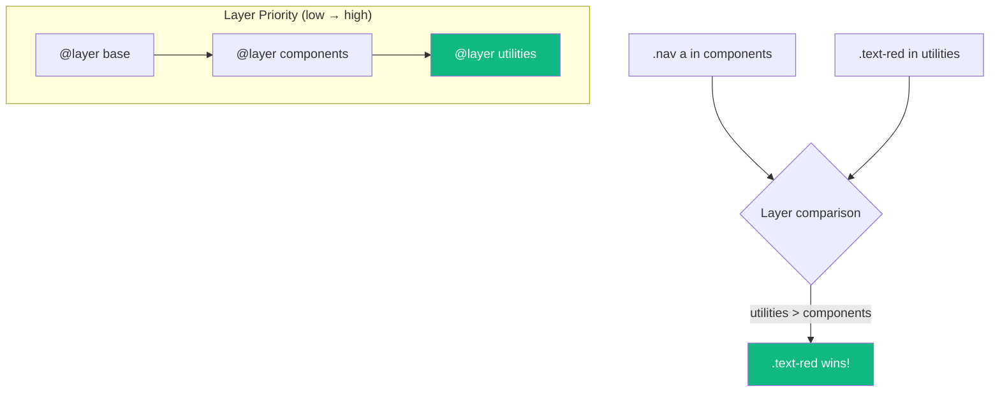

CSS specificity wars have plagued developers for years. You write a simple style, but it doesn't apply because some other rule has higher specificity. You add more selectors, then later have to add even more. Eventually, `!important` starts creeping in.

**CSS Cascade Layers** (`@layer`) solve this by letting you explicitly control which groups of styles take precedence, regardless of selector specificity.

## The Specificity Problem

Consider this common scenario:

```css
/* Base styles */
a {
  color: blue;
}

/* Component styles */
.nav a {
  color: inherit;
}

/* Utility classes */
.text-red {
  color: red;
}
```

What color is a link with class `.text-red` inside `.nav`? It's `inherit`, not `red`, because `.nav a` has higher specificity (0,1,1) than `.text-red` (0,1,0).



Without layers, you'd need to increase specificity or use `!important` — both lead to maintenance nightmares.

## Enter Cascade Layers

Cascade layers let you group styles into named layers with explicit priority:

```css
/* Define layer order (first has lowest priority) */
@layer base, components, utilities;

@layer base {
  a {
    color: blue;
  }
}

@layer components {
  .nav a {
    color: inherit;
  }
}

@layer utilities {
  .text-red {
    color: red;
  }
}
```

Now `.text-red` wins because the `utilities` layer has higher priority than `components`, **regardless of specificity**:



## Defining Layers

### Declaring Layer Order

You can declare all layers upfront to establish their order:

```css
/* Layers listed first have lowest priority */
@layer reset, base, theme, components, utilities;
```

### Creating Layers with Styles

```css
@layer base {
  /* styles here */
}

/* Or inline syntax */
@layer utilities {
  .hidden { display: none; }
  .visible { display: block; }
}
```

### Anonymous Layers

You can create unnamed layers, but they're harder to manage:

```css
@layer {
  /* anonymous layer */
}
```

### Nested Layers

Layers can be nested for more granular control:

```css
@layer components {
  @layer buttons {
    .btn { /* ... */ }
  }

  @layer cards {
    .card { /* ... */ }
  }
}

/* Reference nested layers with dot notation */
@layer components.buttons {
  .btn-primary { /* ... */ }
}
```

## Layer Priority Rules

Understanding layer priority is crucial:

1. **Unlayered styles beat layered styles** — Styles outside any layer have the highest priority
2. **Later layers beat earlier layers** — In `@layer a, b, c`, layer `c` has highest priority
3. **Within a layer, normal specificity rules apply**

```css
@layer base, components;

@layer base {
  .foo { color: blue; }  /* Lower layer */
}

@layer components {
  .foo { color: green; } /* Higher layer - wins! */
}

/* Unlayered style - highest priority */
.foo { color: red; }     /* This wins over both layers! */
```

## The `revert-layer` Keyword

The `revert-layer` keyword rolls back to the value from the previous layer:

```css
@layer base, components, utilities;

@layer base {
  a { color: blue; }
}

@layer components {
  .nav a { color: inherit; }
}

@layer utilities {
  .reset-color {
    color: revert-layer; /* Reverts to components layer's value */
  }
}
```

## Recommended Layer Organization

A typical layer structure for a project:

```css
@layer reset, base, theme, layout, components, utilities;

/* 1. Reset - Normalize browser defaults */
@layer reset {
  *, *::before, *::after {
    box-sizing: border-box;
  }

  body {
    margin: 0;
  }
}

/* 2. Base - Element defaults */
@layer base {
  body {
    font-family: system-ui, sans-serif;
    line-height: 1.5;
  }

  a {
    color: var(--link-color);
  }
}

/* 3. Theme - Design tokens and custom properties */
@layer theme {
  :root {
    --link-color: #0066cc;
    --text-color: #333;
    --bg-color: #fff;
  }
}

/* 4. Layout - Page structure */
@layer layout {
  .container {
    max-width: 1200px;
    margin: 0 auto;
  }

  .grid {
    display: grid;
    gap: 1rem;
  }
}

/* 5. Components - UI components */
@layer components {
  .btn {
    padding: 0.5rem 1rem;
    border-radius: 4px;
  }

  .card {
    padding: 1rem;
    border: 1px solid #eee;
  }
}

/* 6. Utilities - Single-purpose classes (highest priority) */
@layer utilities {
  .hidden { display: none; }
  .text-center { text-align: center; }
  .mt-4 { margin-top: 1rem; }
}
```

## Importing Styles into Layers

You can import external stylesheets directly into layers:

```css
/* Import third-party CSS into a low-priority layer */
@import url("normalize.css") layer(reset);
@import url("bootstrap.css") layer(framework);

/* Your styles in higher-priority layers */
@layer framework, components, utilities;

@layer components {
  /* Override framework styles easily */
  .btn {
    border-radius: 8px;
  }
}
```

This is incredibly powerful for managing third-party CSS — their specificity no longer matters because your layers take precedence.

## Layers and !important

The `!important` flag inverts layer order:

```css
@layer base, components;

@layer base {
  .foo { color: blue !important; }  /* Higher priority with !important */
}

@layer components {
  .foo { color: red !important; }   /* Lower priority with !important */
}
```

With `!important`, earlier layers win. This maintains the CSS principle that `!important` declarations in user stylesheets beat author stylesheets.

## Browser Support

Cascade layers have excellent support:

- Chrome 99+
- Firefox 97+
- Safari 15.4+
- Edge 99+

For older browsers, you can use `@supports`:

```css
@supports at-rule(@layer) {
  @layer base, components;

  @layer base {
    /* layered styles */
  }
}

/* Fallback for browsers without layer support */
@supports not at-rule(@layer) {
  /* traditional cascade-based styles */
}
```

## Practical Tips

### 1. Always Declare Layer Order First

```css
/* Good - explicit order */
@layer reset, base, components, utilities;

/* Then define layers in any order */
@layer utilities { /* ... */ }
@layer base { /* ... */ }
```

### 2. Keep Utilities in the Highest Layer

Utility classes should always win:

```css
@layer components, utilities;

@layer utilities {
  .sr-only { /* screen reader only - should always apply */ }
  .hidden { display: none !important; }
}
```

### 3. Use Layers for Third-Party CSS

```css
@import "vendor.css" layer(vendor);

@layer vendor, custom;

@layer custom {
  /* Your overrides always win */
}
```

## Summary

- Cascade layers (`@layer`) let you control style priority independent of specificity
- Later layers have higher priority than earlier layers
- Unlayered styles beat all layered styles
- Use `revert-layer` to fall back to previous layer values
- `!important` inverts layer priority
- Import third-party CSS into low-priority layers for easy overriding
- Well-supported in modern browsers (2022+)

Cascade layers bring sanity to CSS architecture. By explicitly declaring layer priority, you eliminate specificity wars and make your stylesheets more predictable and maintainable.

## References

- [MDN: @layer](https://developer.mozilla.org/en-US/docs/Web/CSS/@layer)
- Grant, Keith. *CSS in Depth*, 2nd Edition. Manning Publications, 2024.
- [CSS Cascading and Inheritance Level 5](https://www.w3.org/TR/css-cascade-5/)
