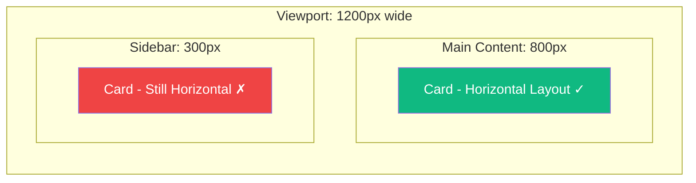
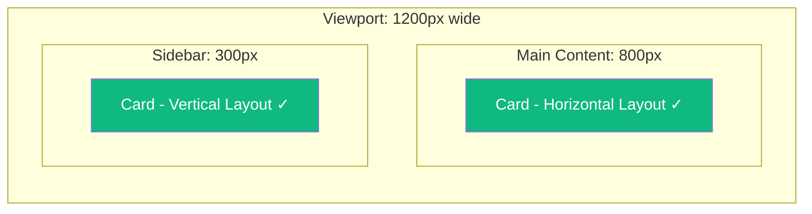

For years, responsive web design has relied on **media queries** to adapt layouts based on the viewport size. But there's always been a fundamental problem: what if you want a component to respond to *its container's* size, not the window's?

Enter **CSS Container Queries** — one of the most requested CSS features that finally allows us to build truly reusable, responsive components.

## The Problem with Media Queries

Consider a card component that you want to use in different contexts:

```css
/* Media query approach - viewport dependent */
@media (min-width: 768px) {
  .card {
    display: flex;
    flex-direction: row;
  }
}
```

This works when the card takes up most of the viewport. But what happens when you place the same card in a narrow sidebar? The media query still fires based on the **viewport width**, not the space available to the card.



The card in the sidebar is forced into a horizontal layout that doesn't fit its container, even though the viewport is wide.

## Enter Container Queries

Container queries solve this by letting you style elements based on their **container's size**, not the viewport:

```css
/* Define a container */
.card-container {
  container-type: inline-size;
}

/* Query the container's size */
@container (min-width: 400px) {
  .card {
    display: flex;
    flex-direction: row;
  }
}
```

Now the card responds to its actual available space:



## Setting Up Containers

### The `container-type` Property

To use container queries, you first need to define which element acts as a container:

```css
.container {
  container-type: inline-size;
}
```

The `container-type` property accepts these values:

| Value | Description |
|-------|-------------|
| `normal` | Default. Not a query container |
| `inline-size` | Enables queries on inline axis (width in horizontal writing) |
| `size` | Enables queries on both inline and block axes |

Most commonly, you'll use `inline-size` since width-based queries are the most useful for responsive layouts.

### Naming Containers

When you have nested containers, you can name them to target specific ones:

```css
.sidebar {
  container-type: inline-size;
  container-name: sidebar;
}

.main-content {
  container-type: inline-size;
  container-name: main;
}

/* Target specific container */
@container sidebar (min-width: 300px) {
  .widget {
    /* styles for sidebar context */
  }
}

@container main (min-width: 600px) {
  .widget {
    /* styles for main content context */
  }
}
```

### The Shorthand

You can combine `container-type` and `container-name` with the `container` shorthand:

```css
.sidebar {
  container: sidebar / inline-size;
  /* equivalent to:
     container-name: sidebar;
     container-type: inline-size;
  */
}
```

## Writing Container Queries

Container queries use the `@container` at-rule with a syntax similar to media queries:

```css
/* Basic width query */
@container (min-width: 400px) {
  .card { /* ... */ }
}

/* Named container query */
@container sidebar (min-width: 300px) {
  .widget { /* ... */ }
}

/* Range syntax (modern browsers) */
@container (300px <= width <= 600px) {
  .card { /* ... */ }
}

/* Combining conditions */
@container (min-width: 400px) and (max-width: 800px) {
  .card { /* ... */ }
}
```

## Container Query Units

CSS also provides container-relative units, similar to viewport units:

| Unit | Description |
|------|-------------|
| `cqw` | 1% of container's width |
| `cqh` | 1% of container's height |
| `cqi` | 1% of container's inline size |
| `cqb` | 1% of container's block size |
| `cqmin` | Smaller of `cqi` or `cqb` |
| `cqmax` | Larger of `cqi` or `cqb` |

These are useful for fluid typography within containers:

```css
.card-container {
  container-type: inline-size;
}

.card-title {
  /* Font size scales with container width */
  font-size: clamp(1rem, 4cqi, 2rem);
}
```

## Practical Example: Responsive Card Component

Let's build a real-world responsive card:

```css
/* Container setup */
.card-wrapper {
  container-type: inline-size;
}

/* Base card styles (mobile-first) */
.card {
  display: grid;
  gap: 1rem;
  padding: 1rem;
  border-radius: 8px;
  background: white;
  box-shadow: 0 2px 4px rgba(0, 0, 0, 0.1);
}

.card-image {
  aspect-ratio: 16 / 9;
  object-fit: cover;
  border-radius: 4px;
}

.card-title {
  font-size: clamp(1rem, 3cqi, 1.5rem);
}

/* Medium container: side-by-side layout */
@container (min-width: 400px) {
  .card {
    grid-template-columns: 150px 1fr;
    align-items: start;
  }

  .card-image {
    aspect-ratio: 1;
  }
}

/* Large container: enhanced layout */
@container (min-width: 600px) {
  .card {
    grid-template-columns: 200px 1fr;
    padding: 1.5rem;
    gap: 1.5rem;
  }
}
```

```html
<div class="card-wrapper">
  <article class="card">
    
    <div class="card-content">
      <h2 class="card-title">Card Title</h2>
      <p>Card description...</p>
    </div>
  </article>
</div>
```

## Style Queries (Experimental)

Container queries can also query **custom property values**, not just size:

```css
.card-wrapper {
  container-type: inline-size;
  --theme: light;
}

/* Style query based on custom property */
@container style(--theme: dark) {
  .card {
    background: #1a1a1a;
    color: white;
  }
}
```

This is still experimental but opens up powerful theming possibilities.

## Browser Support

Container queries have excellent browser support as of 2024:

- Chrome 105+
- Firefox 110+
- Safari 16+
- Edge 105+

For older browsers, you can use a progressive enhancement approach:

```css
/* Fallback for browsers without container query support */
.card {
  display: block;
}

/* Enhanced layout for supporting browsers */
@supports (container-type: inline-size) {
  .card-wrapper {
    container-type: inline-size;
  }

  @container (min-width: 400px) {
    .card {
      display: flex;
    }
  }
}
```

## Best Practices

1. **Don't make everything a container** — Only use container queries where you actually need component-level responsiveness

2. **Be mindful of containment** — `container-type: inline-size` creates layout containment, which can affect how children are sized

3. **Combine with media queries** — Use media queries for page-level layout, container queries for component-level adaptations

4. **Use meaningful container names** — When nesting containers, names make your code more maintainable

5. **Start mobile-first** — Write base styles for small containers, then add complexity with `min-width` queries

## Summary

- Container queries let you style elements based on their container's size, not the viewport
- Use `container-type: inline-size` to define a query container
- Use `@container` rules to write size-based style changes
- Container query units (`cqw`, `cqi`, etc.) enable fluid sizing within containers
- Style queries can match custom property values (experimental)
- Container queries are well-supported in modern browsers

Container queries are a game-changer for component-based design. They let you build truly portable, reusable components that adapt to their context, making design systems more robust and easier to maintain.

## References

- [MDN: CSS Container Queries](https://developer.mozilla.org/en-US/docs/Web/CSS/CSS_containment/Container_queries)
- Grant, Keith. *CSS in Depth*, 2nd Edition. Manning Publications, 2024.
- Attardi, Joe. *Modern CSS*. Apress, 2025.
