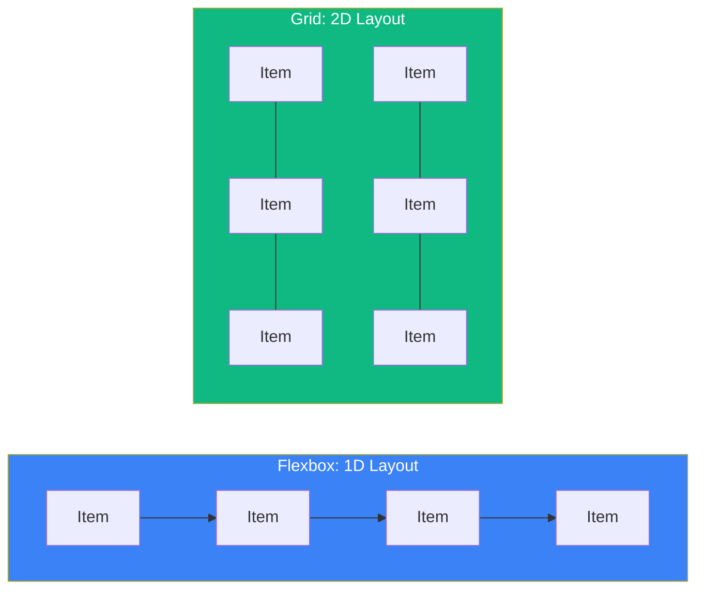
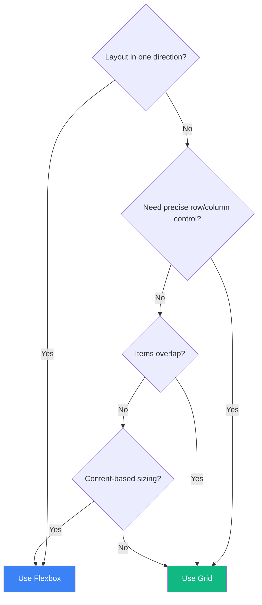

CSS Grid and Flexbox are both powerful layout systems, and choosing between them often confuses developers. The good news is they're not competitors — they're complementary tools designed for different use cases.

## The Core Difference

The fundamental distinction is simple:

- **Flexbox** is for **one-dimensional** layouts (row OR column)
- **Grid** is for **two-dimensional** layouts (rows AND columns)



But this rule alone doesn't tell the whole story. Let's dive deeper.

## When to Use Flexbox

### 1. Navigation Menus

Flexbox excels at distributing items along a single axis:

```css
.nav {
  display: flex;
  gap: 1rem;
  justify-content: space-between;
}

.nav-item {
  flex: 0 0 auto; /* Don't grow or shrink */
}
```

### 2. Centering Content

Nothing beats Flexbox for centering:

```css
.centered {
  display: flex;
  justify-content: center; /* Horizontal */
  align-items: center;     /* Vertical */
  min-height: 100vh;
}
```

### 3. Items with Unknown or Dynamic Sizes

When items should size based on their content:

```css
.tags {
  display: flex;
  flex-wrap: wrap;
  gap: 0.5rem;
}

.tag {
  /* Each tag sizes to fit its content */
  padding: 0.25rem 0.75rem;
}
```

### 4. Distributing Space Among Items

When you want items to grow or shrink proportionally:

```css
.split-view {
  display: flex;
}

.sidebar {
  flex: 0 0 250px; /* Fixed width */
}

.main {
  flex: 1;         /* Takes remaining space */
}
```

### 5. Reordering Items

Flexbox makes reordering easy:

```css
.card-footer {
  display: flex;
}

.card-footer .primary-action {
  order: 2; /* Moves to the end */
}
```

## When to Use Grid

### 1. Page Layouts

Grid is perfect for overall page structure:

```css
.page {
  display: grid;
  grid-template-areas:
    "header header"
    "sidebar main"
    "footer footer";
  grid-template-columns: 250px 1fr;
  grid-template-rows: auto 1fr auto;
  min-height: 100vh;
}

.header { grid-area: header; }
.sidebar { grid-area: sidebar; }
.main { grid-area: main; }
.footer { grid-area: footer; }
```

### 2. Card Grids

When you need items in rows AND columns:

```css
.card-grid {
  display: grid;
  grid-template-columns: repeat(auto-fill, minmax(300px, 1fr));
  gap: 1.5rem;
}
```

### 3. Overlapping Elements

Grid allows items to occupy the same cells:

```css
.hero {
  display: grid;
  place-items: center;
}

.hero > * {
  grid-area: 1 / 1; /* All children in same cell */
}

.hero-image {
  width: 100%;
}

.hero-content {
  z-index: 1; /* On top of image */
  color: white;
}
```

### 4. Complex Alignments

When items need precise placement:

```css
.dashboard {
  display: grid;
  grid-template-columns: repeat(4, 1fr);
  grid-template-rows: repeat(3, 200px);
  gap: 1rem;
}

.widget-large {
  grid-column: span 2;
  grid-row: span 2;
}

.widget-wide {
  grid-column: span 2;
}
```

### 5. Form Layouts

Grid aligns labels and inputs beautifully:

```css
.form {
  display: grid;
  grid-template-columns: auto 1fr;
  gap: 1rem;
  align-items: center;
}

/* Labels in first column, inputs in second */
```

## Decision Framework

Use this flowchart to decide:



## Using Both Together

The best layouts often combine both. Grid for the overall structure, Flexbox for component details:

```css
/* Grid for page layout */
.page {
  display: grid;
  grid-template-columns: 250px 1fr;
  grid-template-rows: auto 1fr auto;
}

/* Flexbox for header content */
.header {
  display: flex;
  justify-content: space-between;
  align-items: center;
  padding: 1rem;
}

/* Flexbox for navigation */
.nav {
  display: flex;
  gap: 1rem;
}

/* Grid for main content cards */
.content {
  display: grid;
  grid-template-columns: repeat(auto-fill, minmax(280px, 1fr));
  gap: 1rem;
  padding: 1rem;
}

/* Flexbox inside each card */
.card {
  display: flex;
  flex-direction: column;
}

.card-footer {
  margin-top: auto; /* Pushes to bottom */
  display: flex;
  justify-content: space-between;
}
```

## Common Patterns

### Holy Grail Layout (Grid)

```css
.holy-grail {
  display: grid;
  grid-template:
    "header header header" auto
    "nav main aside" 1fr
    "footer footer footer" auto
    / 200px 1fr 200px;
  min-height: 100vh;
}
```

### Equal Height Cards (Grid)

```css
.card-row {
  display: grid;
  grid-template-columns: repeat(3, 1fr);
  gap: 1rem;
}
/* All cards are equal height automatically */
```

### Flexible Card Content (Flexbox)

```css
.card {
  display: flex;
  flex-direction: column;
  height: 100%;
}

.card-body {
  flex: 1; /* Grows to fill space */
}

.card-footer {
  margin-top: auto; /* Always at bottom */
}
```

### Responsive Sidebar (Both)

```css
.layout {
  display: grid;
  grid-template-columns: 1fr;
}

@media (min-width: 768px) {
  .layout {
    grid-template-columns: 250px 1fr;
  }
}

.sidebar-nav {
  display: flex;
  flex-direction: column;
  gap: 0.5rem;
}
```

## Performance Considerations

Both Grid and Flexbox are highly optimized in modern browsers. However:

- **Flexbox** can be slightly faster for simple, one-dimensional layouts
- **Grid** handles complex layouts more efficiently than nested Flexbox
- Avoid deeply nested flex containers; use Grid for complex structures

## Summary Table

| Use Case | Flexbox | Grid |
|----------|---------|------|
| Navigation bars | ✓ | |
| Centering content | ✓ | ✓ |
| Card grids | | ✓ |
| Form layouts | | ✓ |
| Page layouts | | ✓ |
| Space distribution | ✓ | |
| Unknown item sizes | ✓ | |
| Overlapping items | | ✓ |
| Vertical centering | ✓ | ✓ |
| Reordering items | ✓ | |

## Summary

- **Flexbox**: One-dimensional, content-out approach
- **Grid**: Two-dimensional, layout-in approach
- Use Flexbox for components that flow in one direction
- Use Grid for structured layouts with rows and columns
- Combine both: Grid for structure, Flexbox for details
- Don't force one tool to do the other's job

The best CSS layouts leverage both systems where they shine. Grid and Flexbox aren't competitors — they're partners in creating flexible, maintainable layouts.

## References

- [MDN: CSS Grid Layout](https://developer.mozilla.org/en-US/docs/Web/CSS/CSS_grid_layout)
- [MDN: CSS Flexible Box Layout](https://developer.mozilla.org/en-US/docs/Web/CSS/CSS_flexible_box_layout)
- Grant, Keith. *CSS in Depth*, 2nd Edition. Manning Publications, 2024.
- Attardi, Joe. *Modern CSS*. Apress, 2025.
