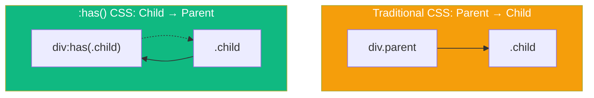

For decades, CSS developers have wished for a "parent selector" — a way to style an element based on what it contains. Traditional CSS selectors only work downward: you can select children based on their parents, but never the other way around.

The **`:has()` pseudo-class** changes everything. It's often called "the CSS feature we've been waiting 20 years for."

## What is :has()?

The `:has()` pseudo-class selects an element if it contains at least one element matching the specified selector:

```css
/* Select any <a> that contains an  */
a:has(img) {
  display: block;
  border: none;
}

/* Select any <form> that contains an invalid input */
form:has(input:invalid) {
  border: 2px solid red;
}
```



## Basic Syntax

The `:has()` selector takes a relative selector list as its argument:

```css
/* Element contains another element */
parent:has(child) { }

/* Element contains element with specific class */
div:has(.highlight) { }

/* Element contains element in specific state */
form:has(input:focus) { }

/* Multiple conditions (OR logic) */
article:has(img, video) { }
```

## Real-World Use Cases

### 1. Styling Forms Based on Validation State

One of the most practical uses is form validation feedback:

```css
/* Highlight the entire form when any field is invalid */
form:has(:invalid) {
  background-color: #fff5f5;
  border-left: 4px solid #e53e3e;
}

/* Style form when all required fields are valid */
form:has(:required:valid):not(:has(:required:invalid)) {
  background-color: #f0fff4;
  border-left: 4px solid #38a169;
}

/* Enable submit button only when form is valid */
form:has(:invalid) button[type="submit"] {
  opacity: 0.5;
  pointer-events: none;
}
```

### 2. Card Layouts with Optional Elements

Style cards differently based on their content:

```css
/* Cards with images get different layout */
.card:has(img) {
  grid-template-rows: 200px 1fr;
}

.card:not(:has(img)) {
  grid-template-rows: 1fr;
  padding-top: 2rem;
}

/* Featured cards (with .featured class inside) */
.card:has(.featured) {
  border: 2px solid gold;
  box-shadow: 0 4px 12px rgba(255, 215, 0, 0.3);
}
```

### 3. Navigation with Active States

Highlight parent navigation items when a child link is active:

```css
/* Style nav item when it contains the current page link */
nav li:has(a[aria-current="page"]) {
  background-color: #edf2f7;
  border-radius: 4px;
}

/* Style dropdown parent when a child is selected */
.dropdown:has(.selected) > .dropdown-toggle {
  font-weight: bold;
  color: #2b6cb0;
}
```

### 4. Quantity Queries

Apply styles based on the number of children:

```css
/* Grid with many items uses different layout */
.gallery:has(> :nth-child(6)) {
  grid-template-columns: repeat(3, 1fr);
}

/* Grid with few items */
.gallery:not(:has(> :nth-child(6))) {
  grid-template-columns: repeat(2, 1fr);
}

/* List with only one item */
ul:has(> li:only-child) {
  list-style: none;
  padding-left: 0;
}
```

### 5. Sibling Selection Enhancement

`:has()` can also work with sibling combinators:

```css
/* Style a heading that is followed by a subheading */
h1:has(+ .subheading) {
  margin-bottom: 0.25rem;
}

/* Style label when its associated input is focused */
label:has(+ input:focus) {
  color: #3182ce;
  font-weight: bold;
}

/* Style input's container when input has content */
.input-group:has(input:not(:placeholder-shown)) label {
  transform: translateY(-100%);
  font-size: 0.75rem;
}
```

## Combining :has() with Other Selectors

### With :not()

```css
/* Paragraphs not followed by another paragraph */
p:not(:has(+ p)) {
  margin-bottom: 2rem;
}

/* Sections without any headings */
section:not(:has(h1, h2, h3)) {
  padding-top: 1rem;
}
```

### With :is() and :where()

```css
/* Articles containing any media element */
article:has(:is(img, video, iframe, canvas)) {
  container-type: inline-size;
}

/* Headers with any interactive child */
header:has(:where(button, a, input)) {
  position: sticky;
  top: 0;
}
```

## Performance Considerations

`:has()` can be computationally expensive because it requires the browser to look at descendants to determine if an ancestor matches. Here are some tips:

```css
/* AVOID: Very broad selectors */
:has(.some-class) { } /* Checks entire document */

/* BETTER: Scope to specific elements */
.container:has(.some-class) { }

/* AVOID: Deep descendant checks */
main:has(div div div .deep-element) { }

/* BETTER: Direct child or shallow checks */
main:has(> section > .element) { }
```

## Browser Support

`:has()` has excellent modern browser support:

- Chrome 105+
- Firefox 121+
- Safari 15.4+
- Edge 105+

For older browsers, use feature detection:

```css
/* Fallback styles */
.card {
  border: 1px solid #ccc;
}

/* Enhanced styles for browsers with :has() support */
@supports selector(:has(*)) {
  .card:has(.featured) {
    border: 2px solid gold;
  }
}
```

## Common Patterns

### Figure with Caption Styling

```css
/* Figures with captions get margin adjustment */
figure:has(figcaption) {
  margin-bottom: 2rem;
}

figure:has(figcaption) img {
  margin-bottom: 0.5rem;
}

/* Figures without captions */
figure:not(:has(figcaption)) {
  margin-bottom: 1rem;
}
```

### Form Field Focus States

```css
/* Float label pattern */
.field {
  position: relative;
}

.field label {
  position: absolute;
  top: 50%;
  transform: translateY(-50%);
  transition: all 0.2s;
}

.field:has(input:focus) label,
.field:has(input:not(:placeholder-shown)) label {
  top: 0;
  font-size: 0.75rem;
  color: #3182ce;
}
```

### Dark Mode Based on Content

```css
/* Auto dark mode for code blocks */
.content:has(pre code) {
  --bg-color: #1a202c;
  --text-color: #e2e8f0;
}
```

## Summary

- `:has()` selects elements based on their descendants (the "parent selector")
- Use it for form validation, conditional layouts, and dynamic styling
- Combine with `:not()`, `:is()`, and `:where()` for powerful selections
- Be mindful of performance with very broad selectors
- Well-supported in modern browsers (2024+)

The `:has()` selector fundamentally changes what's possible with CSS. Patterns that previously required JavaScript—like styling a form based on its validity or a card based on its content—are now pure CSS. It's a powerful tool that belongs in every CSS developer's toolkit.

## References

- [MDN: :has() pseudo-class](https://developer.mozilla.org/en-US/docs/Web/CSS/:has)
- Grant, Keith. *CSS in Depth*, 2nd Edition. Manning Publications, 2024.
- Attardi, Joe. *Modern CSS*. Apress, 2025.
