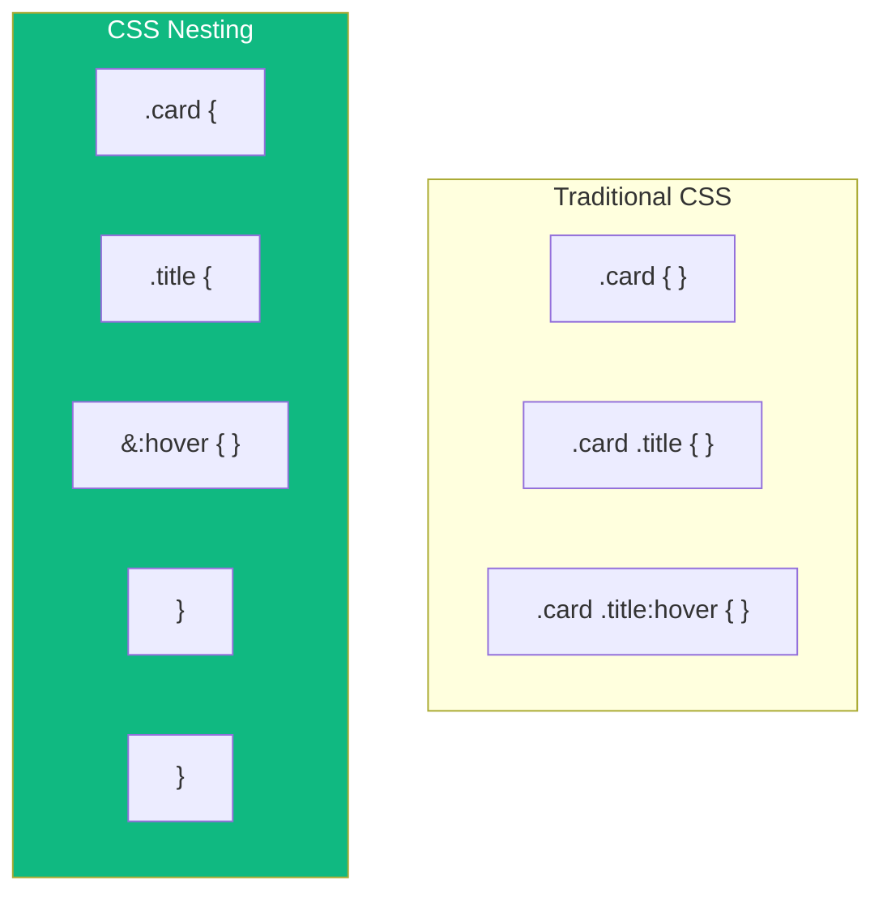

For years, one of the main reasons developers used CSS preprocessors like Sass or Less was **nesting**. Writing nested selectors feels natural and keeps related styles together. Now, native CSS supports nesting, and you can use it without any build tools.

## What is CSS Nesting?

CSS nesting allows you to write child selectors inside their parent selectors:

```css
/* Traditional CSS */
.card {
  padding: 1rem;
}
.card .title {
  font-size: 1.5rem;
}
.card .title:hover {
  color: blue;
}

/* With CSS Nesting */
.card {
  padding: 1rem;

  .title {
    font-size: 1.5rem;

    &:hover {
      color: blue;
    }
  }
}
```

The nested version is more readable and clearly shows the relationship between selectors.



## The Nesting Selector (&)

The `&` character represents the parent selector. It's required in some cases and optional in others.

### When & is Required

You need `&` when adding pseudo-classes or pseudo-elements:

```css
.button {
  background: blue;

  /* Pseudo-classes need & */
  &:hover {
    background: darkblue;
  }

  &:focus {
    outline: 2px solid orange;
  }

  /* Pseudo-elements need & */
  &::before {
    content: "→ ";
  }

  /* Combining with other selectors */
  &.primary {
    background: green;
  }
}
```

### When & is Optional

For descendant selectors (selecting children), `&` is optional:

```css
.card {
  /* These are equivalent */
  .title { font-weight: bold; }
  & .title { font-weight: bold; }
}
```

Both compile to `.card .title { font-weight: bold; }`.

### Placing & After the Nested Selector

You can place `&` after another selector to reverse the relationship:

```css
.title {
  font-size: 1rem;

  /* When .title is inside .hero */
  .hero & {
    font-size: 2rem;
  }
}
```

This compiles to:
```css
.title { font-size: 1rem; }
.hero .title { font-size: 2rem; }
```

## Nesting Multiple Selectors

### Selector Lists

You can nest multiple selectors at once:

```css
.card {
  h1, h2, h3 {
    margin-top: 0;
  }

  &:hover, &:focus {
    box-shadow: 0 4px 8px rgba(0, 0, 0, 0.1);
  }
}
```

### Compound Selectors

When combining selectors, use `&`:

```css
.button {
  /* .button.primary */
  &.primary {
    background: blue;
  }

  /* .button.secondary */
  &.secondary {
    background: gray;
  }

  /* .button[disabled] */
  &[disabled] {
    opacity: 0.5;
  }
}
```

## Nesting At-Rules

One powerful feature is nesting at-rules like `@media` inside selectors:

```css
.sidebar {
  width: 100%;

  @media (min-width: 768px) {
    width: 300px;
  }

  @media (min-width: 1024px) {
    width: 400px;
  }
}
```

This compiles to:
```css
.sidebar { width: 100%; }
@media (min-width: 768px) { .sidebar { width: 300px; } }
@media (min-width: 1024px) { .sidebar { width: 400px; } }
```

This keeps all styles for a component together, rather than scattering them across multiple media query blocks.

### Nesting Container Queries

The same works with container queries:

```css
.card {
  display: block;

  @container (min-width: 400px) {
    display: flex;
  }
}
```

### Nesting @supports

```css
.grid {
  display: flex;
  flex-wrap: wrap;

  @supports (display: grid) {
    display: grid;
    grid-template-columns: repeat(3, 1fr);
  }
}
```

## Deep Nesting: Use with Caution

While nesting is powerful, avoid going too deep:

```css
/* Avoid: Too deeply nested */
.page {
  .header {
    .nav {
      .menu {
        .item {
          .link {
            color: blue;
          }
        }
      }
    }
  }
}
```

This creates overly specific selectors that are hard to override. Keep nesting to 2-3 levels maximum:

```css
/* Better: Flatter structure */
.nav-menu {
  display: flex;

  .item {
    padding: 0.5rem;
  }

  .link {
    color: blue;

    &:hover {
      color: darkblue;
    }
  }
}
```

## Comparing with Sass Nesting

If you're familiar with Sass, CSS nesting is very similar:

| Feature | Sass | CSS Nesting |
|---------|------|-------------|
| Descendant nesting | `.parent { .child { } }` | `.parent { .child { } }` |
| Pseudo-classes | `&:hover { }` | `&:hover { }` |
| Compound selectors | `&.class { }` | `&.class { }` |
| Parent reference after | `.context & { }` | `.context & { }` |
| Nested media queries | `@media { }` | `@media { }` |
| Property nesting | `font: { size: 1rem; }` | Not supported |
| String interpolation | `#{$var}` | Not supported |

The main differences are that CSS nesting doesn't support property nesting or variable interpolation in selectors.

## Practical Example: Component Styling

Here's a complete component styled with nesting:

```css
.card {
  background: white;
  border-radius: 8px;
  box-shadow: 0 2px 4px rgba(0, 0, 0, 0.1);
  overflow: hidden;

  /* Image area */
  .image {
    aspect-ratio: 16 / 9;
    object-fit: cover;
  }

  /* Content area */
  .content {
    padding: 1rem;
  }

  /* Title styling */
  .title {
    margin: 0 0 0.5rem;
    font-size: 1.25rem;

    &:hover {
      color: var(--primary-color);
    }
  }

  /* Description */
  .description {
    color: #666;
    line-height: 1.6;
  }

  /* Footer with actions */
  .footer {
    display: flex;
    justify-content: space-between;
    padding: 1rem;
    border-top: 1px solid #eee;
  }

  /* Interactive states */
  &:hover {
    box-shadow: 0 4px 12px rgba(0, 0, 0, 0.15);
  }

  /* Variants */
  &.featured {
    border: 2px solid gold;
  }

  /* Responsive adjustments */
  @media (min-width: 768px) {
    display: grid;
    grid-template-columns: 200px 1fr;

    .image {
      aspect-ratio: 1;
    }
  }
}
```

## Browser Support

CSS nesting is well-supported in modern browsers:

- Chrome 120+
- Firefox 117+
- Safari 17.2+
- Edge 120+

For older browsers, consider using a build tool like PostCSS with the nesting plugin, or continue using Sass.

```css
/* Feature detection */
@supports selector(&) {
  .card {
    .title {
      /* Nested styles */
    }
  }
}
```

## Best Practices

1. **Limit nesting depth** — Keep nesting to 2-3 levels maximum to avoid specificity issues

2. **Use & explicitly for clarity** — Even when optional, `&` can make relationships clearer

3. **Group related styles** — Put pseudo-classes and media queries near the properties they modify

4. **Don't nest everything** — Independent components should have their own top-level selectors

5. **Consider output CSS** — Remember that nesting expands to full selectors; deeply nested rules create long, specific selectors

## Summary

- CSS nesting lets you write child selectors inside parent selectors
- The `&` nesting selector references the parent
- At-rules like `@media` can be nested inside selectors
- Keep nesting shallow (2-3 levels) to avoid specificity issues
- Syntax is similar to Sass, making migration straightforward
- Well-supported in modern browsers (2024+)

Native CSS nesting eliminates one of the biggest reasons to use preprocessors. It makes stylesheets more organized and maintainable while keeping everything in standard CSS.

## References

- [MDN: CSS nesting](https://developer.mozilla.org/en-US/docs/Web/CSS/CSS_nesting)
- Grant, Keith. *CSS in Depth*, 2nd Edition. Manning Publications, 2024.
- [CSS Nesting Module](https://www.w3.org/TR/css-nesting-1/)
