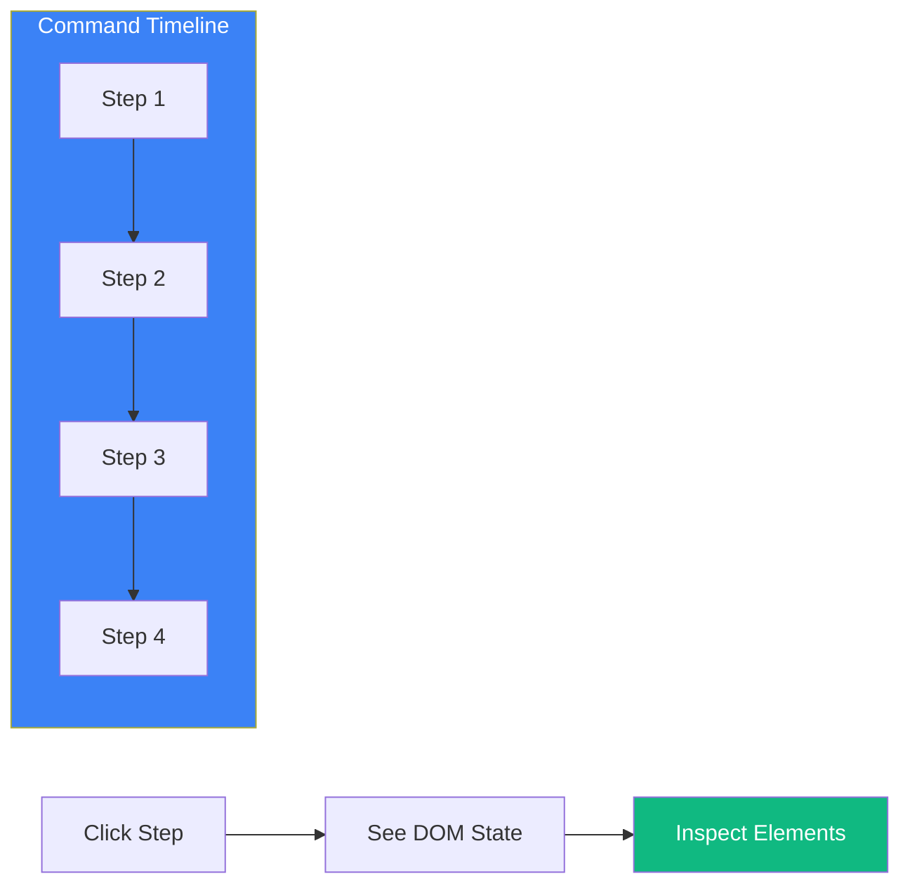

Cypress provides exceptional debugging capabilities that set it apart from other testing frameworks. Understanding these tools will help you quickly identify and fix failing tests.

## Time Travel Debugging



### How Time Travel Works

When you run tests in the Cypress Test Runner, each command creates a snapshot of the DOM at that moment. You can hover over or click any command to see exactly what the page looked like at that step.

```javascript
// Each of these commands creates a snapshot
cy.visit('/login');                    // Snapshot 1
cy.get('[data-testid="email"]')        // Snapshot 2
  .type('user@example.com');           // Snapshot 3
cy.get('[data-testid="submit"]')       // Snapshot 4
  .click();                            // Snapshot 5
cy.url()                               // Snapshot 6
  .should('include', '/dashboard');    // Snapshot 7
```

### Before/After States

For commands that modify the DOM, Cypress shows both "before" and "after" states:

- Hover over command → See "after" state
- Pin command → Toggle between "before" and "after"

## The Command Log

### Reading the Command Log

```javascript
// The command log shows:
// - Command name (GET, CLICK, TYPE)
// - Selector or value used
// - Yielded subject
// - Assertions made
// - Time taken

cy.get('[data-testid="users"]')    // GET [data-testid="users"]
  .find('.user')                    // FIND .user
  .should('have.length', 5)         // ASSERT expected 5 got 5
  .first()                          // FIRST
  .click();                         // CLICK
```

### Command Log States

| State | Color | Meaning |
|-------|-------|---------|
| Pending | Gray | Command is queued |
| Running | Blue | Command is executing |
| Passed | Green | Command succeeded |
| Failed | Red | Command or assertion failed |

## Using cy.pause()

Pause test execution to inspect the current state:

```javascript
it('debugs step by step', () => {
  cy.visit('/dashboard');

  cy.pause(); // Test pauses here - inspect the DOM

  cy.get('[data-testid="sidebar"]').click();

  cy.pause(); // Pause again to check sidebar state

  cy.get('[data-testid="menu-item"]').should('be.visible');
});
```

When paused, you can:
- Inspect elements in the DOM
- Check network requests
- Use browser DevTools
- Step forward one command at a time

## Using cy.debug()

Insert a debugger statement that triggers browser DevTools:

```javascript
it('uses browser debugger', () => {
  cy.visit('/users');

  cy.get('[data-testid="user-list"]')
    .debug()  // Opens DevTools debugger
    .find('.user')
    .should('have.length.gt', 0);
});
```

The `.debug()` command:
- Logs the current subject to console
- Triggers the browser's debugger
- Allows inspection of the yielded value

## Console Logging

### Using cy.log()

Add custom messages to the command log:

```javascript
it('logs progress', () => {
  cy.log('Starting user creation test');

  cy.visit('/users/new');
  cy.log('Filling out form');

  cy.get('[data-testid="name"]').type('John');
  cy.get('[data-testid="email"]').type('john@example.com');

  cy.log('Submitting form');
  cy.get('[data-testid="submit"]').click();

  cy.log('Verifying user was created');
  cy.url().should('include', '/users/');
});
```

### Using console.log with .then()

```javascript
cy.get('[data-testid="user-id"]')
  .invoke('text')
  .then((text) => {
    console.log('User ID:', text);
    // Continue with test
  });

// Or log the subject directly
cy.get('.item')
  .then(($el) => {
    console.log('Element:', $el);
    console.log('Text:', $el.text());
    console.log('Classes:', $el.attr('class'));
  });
```

## Inspecting Network Requests

### Viewing in DevTools

```javascript
it('inspects API calls', () => {
  // Open DevTools Network tab before running

  cy.intercept('GET', '/api/users').as('getUsers');

  cy.visit('/users');

  cy.wait('@getUsers').then((interception) => {
    console.log('Request:', interception.request);
    console.log('Response:', interception.response);
  });
});
```

### Debugging Intercepts

```javascript
cy.intercept('POST', '/api/users', (req) => {
  console.log('Request body:', req.body);
  console.log('Request headers:', req.headers);

  req.continue((res) => {
    console.log('Response status:', res.statusCode);
    console.log('Response body:', res.body);
  });
}).as('createUser');
```

## Common Debugging Scenarios

### Element Not Found

```javascript
// Problem: cy.get() fails to find element
cy.get('[data-testid="submit"]'); // Error: Timed out

// Debug steps:
// 1. Check if element exists
cy.get('body').then(($body) => {
  console.log('Submit button exists:', $body.find('[data-testid="submit"]').length > 0);
});

// 2. Check for typos in selector
cy.get('[data-testid]').then(($els) => {
  $els.each((i, el) => {
    console.log('Found testid:', el.getAttribute('data-testid'));
  });
});

// 3. Wait for async content
cy.get('[data-testid="submit"]', { timeout: 10000 });
```

### Assertion Failures

```javascript
// Problem: should() assertion fails
cy.get('.count').should('have.text', '5'); // Error: expected "3" to equal "5"

// Debug: Log the actual value
cy.get('.count')
  .invoke('text')
  .then((text) => {
    console.log('Actual text:', text);
    console.log('Text length:', text.length);
    console.log('Trimmed:', text.trim());
  });
```

### Timing Issues

```javascript
// Problem: Element appears briefly then disappears
cy.get('[data-testid="toast"]').should('be.visible'); // Fails

// Debug: Add longer timeout and log state
cy.get('[data-testid="toast"]', { timeout: 10000 })
  .should(($el) => {
    console.log('Toast visible:', $el.is(':visible'));
    console.log('Toast text:', $el.text());
  });

// Or use cy.pause() to catch the moment
cy.pause();
cy.get('[data-testid="toast"]').should('be.visible');
```

## Screenshots and Videos

### Automatic Screenshots on Failure

```javascript
// cypress.config.js
module.exports = defineConfig({
  e2e: {
    screenshotOnRunFailure: true,
    screenshotsFolder: 'cypress/screenshots',
  },
});
```

### Manual Screenshots

```javascript
it('takes screenshots for debugging', () => {
  cy.visit('/dashboard');
  cy.screenshot('dashboard-loaded');

  cy.get('[data-testid="sidebar"]').click();
  cy.screenshot('sidebar-opened');

  // Screenshots saved to cypress/screenshots/
});
```

### Video Recording

```javascript
// cypress.config.js
module.exports = defineConfig({
  e2e: {
    video: true,
    videoCompression: 32,
    videosFolder: 'cypress/videos',
  },
});
```

## Debugging Test Isolation

### Identifying State Leakage

```javascript
describe('Tests with shared state issues', () => {
  it('first test modifies state', () => {
    cy.visit('/');
    localStorage.setItem('user', 'admin');
    // Test passes
  });

  it('second test expects clean state', () => {
    cy.visit('/');
    // Fails because localStorage has 'user' from previous test
    cy.get('[data-testid="login-button"]').should('exist');
  });
});

// Fix: Reset state in beforeEach
describe('Tests with proper isolation', () => {
  beforeEach(() => {
    cy.clearLocalStorage();
    cy.clearCookies();
  });

  it('first test', () => {
    // ...
  });

  it('second test has clean state', () => {
    // ...
  });
});
```

## Debugging in CI

### Adding Debug Information

```javascript
// cypress/support/e2e.js
Cypress.on('fail', (error, runnable) => {
  console.log('Test failed:', runnable.title);
  console.log('Error:', error.message);
  console.log('Stack:', error.stack);

  // Log additional context
  cy.url().then((url) => console.log('URL at failure:', url));

  throw error; // Re-throw to fail the test
});
```

### Environment-Specific Debugging

```javascript
// Add more logging in CI
if (Cypress.env('CI')) {
  Cypress.on('command:start', ({ name, args }) => {
    console.log(`Command: ${name}`, args);
  });
}
```

## Best Practices

### 1. Use Descriptive Logs

```javascript
it('creates a new order', () => {
  cy.log('**Step 1: Navigate to products**');
  cy.visit('/products');

  cy.log('**Step 2: Add item to cart**');
  cy.get('[data-testid="product-1"]').click();
  cy.get('[data-testid="add-to-cart"]').click();

  cy.log('**Step 3: Checkout**');
  cy.get('[data-testid="checkout"]').click();

  cy.log('**Step 4: Verify order created**');
  cy.url().should('include', '/orders/');
});
```

### 2. Debug One Thing at a Time

```javascript
// Instead of one long test
it('complex flow', () => {
  // 50 lines of code
});

// Break into smaller, focused tests
it('adds item to cart', () => { /* ... */ });
it('proceeds to checkout', () => { /* ... */ });
it('completes payment', () => { /* ... */ });
```

### 3. Use Conditional Debugging

```javascript
// Only debug in interactive mode
if (Cypress.config('isInteractive')) {
  cy.pause();
}

// Only log in development
if (Cypress.env('DEBUG')) {
  cy.log('Debug info:', someValue);
}
```

## Summary

| Tool | Purpose |
|------|---------|
| Time Travel | View DOM at each step |
| Command Log | See command execution flow |
| `cy.pause()` | Stop test for manual inspection |
| `cy.debug()` | Open browser debugger |
| `cy.log()` | Add custom messages to log |
| `.then()` + `console.log` | Log values to console |
| Screenshots | Capture visual state |
| Videos | Record full test run |

Key takeaways:

- Use Time Travel to see the DOM state at each command
- Click commands in the Command Log to pin and inspect
- Use `cy.pause()` to stop and manually inspect the page
- Use `cy.debug()` to open browser DevTools at a specific point
- Log values with `.then()` and `console.log()` for debugging
- Take screenshots at key points for visual debugging
- Enable video recording for CI debugging
- Isolate tests properly to avoid state leakage issues

Cypress's debugging tools make it much easier to understand why tests fail and fix issues quickly.

## References

- [Cypress Debugging Guide](https://docs.cypress.io/guides/guides/debugging)
- [Cypress Test Runner](https://docs.cypress.io/guides/core-concepts/cypress-app)
- Mwaura, Waweru. *End-to-End Web Testing with Cypress*. Packt, 2021.
