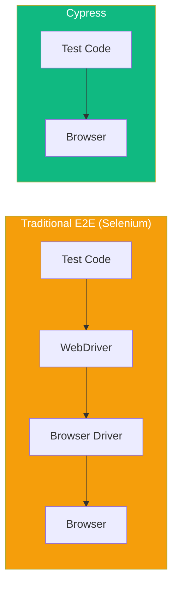

Cypress is a modern end-to-end testing framework built specifically for web applications. Unlike Selenium, Cypress runs directly in the browser, giving you faster tests and better debugging capabilities.

## Why Cypress?



Cypress advantages:
- **Runs in the browser** - No WebDriver, direct access to DOM
- **Time travel** - See snapshots of each test step
- **Automatic waiting** - No need for explicit waits
- **Real-time reloads** - Tests re-run on file save
- **Built-in debugging** - Pause, inspect, and step through tests

## Installation

### Create a New Project

```bash
mkdir cypress-demo && cd cypress-demo
npm init -y
npm install cypress --save-dev
```

### Open Cypress

```bash
npx cypress open
```

This opens Cypress Launchpad where you can:
1. Choose E2E Testing or Component Testing
2. Select a browser
3. Create your first spec file

### Project Structure

After initialization, Cypress creates:

```
cypress/
├── e2e/              # Test files
├── fixtures/         # Test data (JSON files)
├── support/
│   ├── commands.js   # Custom commands
│   └── e2e.js        # Support file (runs before tests)
└── cypress.config.js # Configuration
```

## Configuration

```javascript
// cypress.config.js
const { defineConfig } = require('cypress');

module.exports = defineConfig({
  e2e: {
    baseUrl: 'http://localhost:3000',
    viewportWidth: 1280,
    viewportHeight: 720,
    defaultCommandTimeout: 10000,
    video: false,
    screenshotOnRunFailure: true,
  },
});
```

## Test Structure

### Basic Test File

```javascript
// cypress/e2e/homepage.cy.js
describe('Homepage', () => {
  beforeEach(() => {
    cy.visit('/');
  });

  it('displays the welcome message', () => {
    cy.contains('Welcome').should('be.visible');
  });

  it('has a working navigation', () => {
    cy.get('nav').find('a').should('have.length.at.least', 3);
  });
});
```

### Test Organization

```javascript
describe('Feature', () => {
  // Runs once before all tests
  before(() => {
    // Setup: seed database, login, etc.
  });

  // Runs before each test
  beforeEach(() => {
    cy.visit('/');
  });

  // Runs after each test
  afterEach(() => {
    // Cleanup if needed
  });

  // Runs once after all tests
  after(() => {
    // Final cleanup
  });

  it('test case 1', () => {
    // Test code
  });

  it('test case 2', () => {
    // Test code
  });

  // Group related tests
  context('when user is logged in', () => {
    beforeEach(() => {
      cy.login();
    });

    it('shows dashboard', () => {
      // Test code
    });
  });
});
```

## Core Commands

### Navigation

```javascript
// Visit a URL
cy.visit('/');
cy.visit('https://example.com');
cy.visit('/login', {
  timeout: 30000,
  onBeforeLoad: (win) => {
    // Modify window before page loads
  },
});

// Go back/forward
cy.go('back');
cy.go('forward');
cy.go(-1); // Back
cy.go(1);  // Forward

// Reload page
cy.reload();
cy.reload(true); // Hard reload (clear cache)
```

### Selecting Elements

```javascript
// By selector
cy.get('.button');
cy.get('#email');
cy.get('[data-testid="submit"]');
cy.get('input[type="email"]');

// By content
cy.contains('Submit');
cy.contains('button', 'Submit'); // Button containing "Submit"
cy.contains('.form', 'Email');   // Element with class .form containing "Email"

// Finding within elements
cy.get('.form').find('input');
cy.get('.list').children();
cy.get('.item').parent();
cy.get('.item').siblings();
cy.get('.active').first();
cy.get('.item').last();
cy.get('.item').eq(2); // Third item (0-indexed)
```

### Actions

```javascript
// Click
cy.get('button').click();
cy.get('button').dblclick();
cy.get('button').rightclick();
cy.get('.item').click({ force: true }); // Force click hidden element

// Type
cy.get('input').type('Hello');
cy.get('input').type('Hello{enter}'); // Type and press Enter
cy.get('input').type('{selectall}{backspace}'); // Clear input
cy.get('input').clear(); // Clear input field
cy.get('input').clear().type('New value');

// Special keys
cy.get('input').type('{enter}');
cy.get('input').type('{esc}');
cy.get('input').type('{ctrl+a}');
cy.get('input').type('{shift+tab}');

// Form controls
cy.get('select').select('option-value');
cy.get('select').select(['option1', 'option2']); // Multi-select
cy.get('[type="checkbox"]').check();
cy.get('[type="checkbox"]').uncheck();
cy.get('[type="radio"]').check('value');

// Other actions
cy.get('.item').trigger('mouseover');
cy.get('.slider').trigger('mousedown');
cy.get('input').focus();
cy.get('input').blur();
cy.scrollTo('bottom');
cy.get('.container').scrollTo(0, 500);
```

## Assertions

### Implicit Assertions (should)

```javascript
// Visibility
cy.get('.button').should('be.visible');
cy.get('.modal').should('not.be.visible');
cy.get('.toast').should('exist');
cy.get('.error').should('not.exist');

// Content
cy.get('h1').should('have.text', 'Welcome');
cy.get('p').should('contain', 'Hello');
cy.get('p').should('include.text', 'world');

// Attributes
cy.get('input').should('have.value', 'test@example.com');
cy.get('button').should('have.attr', 'disabled');
cy.get('a').should('have.attr', 'href', '/about');
cy.get('.active').should('have.class', 'selected');

// State
cy.get('button').should('be.enabled');
cy.get('input').should('be.disabled');
cy.get('[type="checkbox"]').should('be.checked');
cy.get('[type="checkbox"]').should('not.be.checked');
cy.get('input').should('be.focused');

// Length
cy.get('.items').should('have.length', 5);
cy.get('.items').should('have.length.gt', 3);
cy.get('.items').should('have.length.at.least', 2);

// CSS
cy.get('.box').should('have.css', 'background-color', 'rgb(255, 0, 0)');

// Chaining assertions
cy.get('input')
  .should('be.visible')
  .and('have.value', '')
  .and('have.attr', 'placeholder', 'Enter email');
```

### Explicit Assertions (expect)

```javascript
cy.get('.items').then(($items) => {
  expect($items).to.have.length(5);
  expect($items.first()).to.contain('First item');
});

cy.url().then((url) => {
  expect(url).to.include('/dashboard');
});
```

## Working with the DOM

### Getting Element Properties

```javascript
// Get text
cy.get('h1').invoke('text').then((text) => {
  expect(text).to.equal('Welcome');
});

// Get attribute
cy.get('a').invoke('attr', 'href').then((href) => {
  expect(href).to.include('/about');
});

// Get value
cy.get('input').invoke('val').should('eq', 'test');

// Get CSS property
cy.get('.box').invoke('css', 'width').then((width) => {
  expect(parseInt(width)).to.be.greaterThan(100);
});
```

### Window and Document

```javascript
// Access window
cy.window().then((win) => {
  expect(win.localStorage.getItem('token')).to.exist;
});

// Access document
cy.document().then((doc) => {
  expect(doc.contentType).to.eq('text/html');
});

// Get title
cy.title().should('include', 'My App');

// Get URL
cy.url().should('include', '/dashboard');
cy.location('pathname').should('eq', '/dashboard');
cy.location('search').should('include', '?page=1');
```

## Practical Example: Login Test

```javascript
// cypress/e2e/login.cy.js
describe('Login', () => {
  beforeEach(() => {
    cy.visit('/login');
  });

  it('logs in with valid credentials', () => {
    cy.get('[data-testid="email"]').type('user@example.com');
    cy.get('[data-testid="password"]').type('password123');
    cy.get('[data-testid="submit"]').click();

    // Should redirect to dashboard
    cy.url().should('include', '/dashboard');
    cy.get('[data-testid="welcome"]').should('contain', 'Welcome back');
  });

  it('shows error for invalid credentials', () => {
    cy.get('[data-testid="email"]').type('user@example.com');
    cy.get('[data-testid="password"]').type('wrongpassword');
    cy.get('[data-testid="submit"]').click();

    // Should stay on login page with error
    cy.url().should('include', '/login');
    cy.get('[data-testid="error"]')
      .should('be.visible')
      .and('contain', 'Invalid credentials');
  });

  it('validates required fields', () => {
    cy.get('[data-testid="submit"]').click();

    cy.get('[data-testid="email-error"]')
      .should('be.visible')
      .and('contain', 'Email is required');
  });
});
```

## Running Tests

### Command Line

```bash
# Open Cypress GUI
npx cypress open

# Run all tests headlessly
npx cypress run

# Run specific spec file
npx cypress run --spec "cypress/e2e/login.cy.js"

# Run in specific browser
npx cypress run --browser chrome
npx cypress run --browser firefox

# Run with headed browser
npx cypress run --headed
```

### Package.json Scripts

```json
{
  "scripts": {
    "cy:open": "cypress open",
    "cy:run": "cypress run",
    "cy:run:chrome": "cypress run --browser chrome",
    "test:e2e": "start-server-and-test start http://localhost:3000 cy:run"
  }
}
```

## Summary

| Concept | Description |
|---------|-------------|
| `cy.visit()` | Navigate to a URL |
| `cy.get()` | Select elements by selector |
| `cy.contains()` | Select elements by text content |
| `cy.click()` | Click an element |
| `cy.type()` | Type into an input |
| `.should()` | Assert element state |
| `describe/it` | Organize tests |

Key takeaways:

- Cypress runs directly in the browser for faster, more reliable tests
- Use `cy.get()` for selectors, `cy.contains()` for text content
- Chain commands with `.should()` for assertions
- Cypress automatically waits for elements and assertions
- Use `beforeEach` to set up test state
- Run tests with `npx cypress open` (GUI) or `npx cypress run` (CLI)

Cypress makes E2E testing approachable with its intuitive API and excellent developer experience.

## References

- [Cypress Documentation](https://docs.cypress.io/)
- [Cypress Best Practices](https://docs.cypress.io/guides/references/best-practices)
- Mwaura, Waweru. *End-to-End Web Testing with Cypress*. Packt, 2021.
