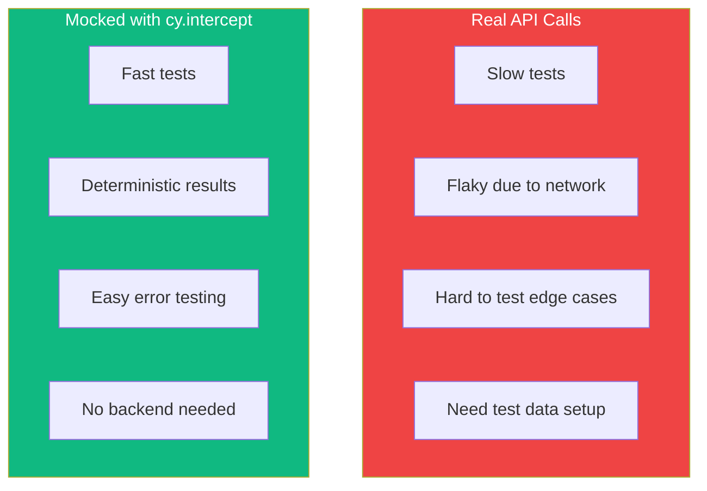

`cy.intercept()` is one of Cypress's most powerful features, allowing you to intercept and control network requests. This enables faster tests, deterministic responses, and testing edge cases that are hard to reproduce with real APIs.

## Why Mock Network Requests?



## Basic cy.intercept Usage

### Intercepting GET Requests

```javascript
// Intercept and stub response
cy.intercept('GET', '/api/users', {
  body: [
    { id: 1, name: 'Alice' },
    { id: 2, name: 'Bob' },
  ],
});

cy.visit('/users');
cy.get('.user').should('have.length', 2);
```

### URL Pattern Matching

```javascript
// Exact URL
cy.intercept('GET', '/api/users');

// Glob pattern
cy.intercept('GET', '/api/users/*');
cy.intercept('GET', '/api/*/comments');
cy.intercept('GET', '**/users');

// Regex pattern
cy.intercept('GET', /\/api\/users\/\d+/);

// With query params (glob)
cy.intercept('GET', '/api/users?page=*');
```

### Method Shortcuts

```javascript
// Explicit method
cy.intercept('GET', '/api/users', { body: [] });
cy.intercept('POST', '/api/users', { statusCode: 201 });
cy.intercept('PUT', '/api/users/*', { statusCode: 200 });
cy.intercept('DELETE', '/api/users/*', { statusCode: 204 });

// Any method
cy.intercept('/api/users'); // Matches all methods
```

## Stubbing Responses

### Static Response

```javascript
// Return JSON body
cy.intercept('GET', '/api/users', {
  body: [{ id: 1, name: 'Alice' }],
});

// Full response object
cy.intercept('GET', '/api/users', {
  statusCode: 200,
  body: [{ id: 1, name: 'Alice' }],
  headers: {
    'Content-Type': 'application/json',
    'X-Custom-Header': 'value',
  },
});
```

### Using Fixtures

```javascript
// cypress/fixtures/users.json
// [{ "id": 1, "name": "Alice" }, { "id": 2, "name": "Bob" }]

// Load fixture as response
cy.intercept('GET', '/api/users', { fixture: 'users.json' });

// With status code
cy.intercept('GET', '/api/users', {
  statusCode: 200,
  fixture: 'users.json',
});

// Nested fixtures
cy.intercept('GET', '/api/users', { fixture: 'api/users/list.json' });
```

### Dynamic Response with Route Handler

```javascript
// Modify response dynamically
cy.intercept('GET', '/api/users', (req) => {
  req.reply({
    statusCode: 200,
    body: [{ id: 1, name: 'Dynamic User' }],
  });
});

// Access request data
cy.intercept('POST', '/api/users', (req) => {
  const { name, email } = req.body;

  req.reply({
    statusCode: 201,
    body: { id: Date.now(), name, email },
  });
});

// Conditional response
cy.intercept('GET', '/api/users/*', (req) => {
  const userId = req.url.split('/').pop();

  if (userId === '999') {
    req.reply({ statusCode: 404, body: { error: 'Not found' } });
  } else {
    req.reply({ body: { id: userId, name: 'User ' + userId } });
  }
});
```

## Waiting for Requests

### Using Aliases

```javascript
// Create alias
cy.intercept('GET', '/api/users').as('getUsers');

cy.visit('/users');

// Wait for request
cy.wait('@getUsers');

// Assert after loading
cy.get('.user').should('have.length', 2);
```

### Accessing Request/Response Data

```javascript
cy.intercept('POST', '/api/users').as('createUser');

cy.get('[data-testid="name"]').type('John');
cy.get('[data-testid="submit"]').click();

cy.wait('@createUser').then((interception) => {
  // Access request
  expect(interception.request.body).to.have.property('name', 'John');
  expect(interception.request.headers).to.have.property('authorization');

  // Access response
  expect(interception.response.statusCode).to.equal(201);
  expect(interception.response.body).to.have.property('id');
});
```

### Wait with Assertions

```javascript
cy.intercept('GET', '/api/users').as('getUsers');

cy.visit('/users');

// Wait and assert in one step
cy.wait('@getUsers').its('response.statusCode').should('eq', 200);

// Multiple assertions
cy.wait('@getUsers').should((interception) => {
  expect(interception.response.body).to.have.length.greaterThan(0);
  expect(interception.response.headers['content-type']).to.include('application/json');
});
```

### Waiting Multiple Times

```javascript
cy.intercept('GET', '/api/items/*').as('getItem');

// Pagination - wait for each page request
cy.wait('@getItem');
cy.get('.next-page').click();
cy.wait('@getItem');
cy.get('.next-page').click();
cy.wait('@getItem');

// Or wait for specific count
cy.intercept('POST', '/api/analytics').as('analytics');
cy.wait(['@analytics', '@analytics', '@analytics']); // Wait for 3 calls
```

## Error Testing

### Network Errors

```javascript
// Simulate network failure
cy.intercept('GET', '/api/users', { forceNetworkError: true });

cy.visit('/users');
cy.get('[data-testid="error"]').should('contain', 'Network error');
```

### HTTP Error Responses

```javascript
// 404 Not Found
cy.intercept('GET', '/api/users/999', {
  statusCode: 404,
  body: { error: 'User not found' },
});

// 500 Server Error
cy.intercept('GET', '/api/users', {
  statusCode: 500,
  body: { error: 'Internal server error' },
});

// 401 Unauthorized
cy.intercept('GET', '/api/users', {
  statusCode: 401,
  body: { error: 'Unauthorized' },
});

// 422 Validation Error
cy.intercept('POST', '/api/users', {
  statusCode: 422,
  body: {
    errors: {
      email: ['Email is already taken'],
      name: ['Name is required'],
    },
  },
});
```

### Testing Error UI

```javascript
describe('Error handling', () => {
  it('shows error message on 500', () => {
    cy.intercept('GET', '/api/users', {
      statusCode: 500,
      body: { error: 'Server error' },
    });

    cy.visit('/users');

    cy.get('[data-testid="error-message"]')
      .should('be.visible')
      .and('contain', 'Something went wrong');

    cy.get('[data-testid="retry-button"]').should('be.visible');
  });

  it('shows not found page for 404', () => {
    cy.intercept('GET', '/api/users/999', { statusCode: 404 });

    cy.visit('/users/999');

    cy.get('[data-testid="not-found"]').should('be.visible');
  });
});
```

## Delaying Responses

### Simulating Slow Networks

```javascript
// Delay response by 2 seconds
cy.intercept('GET', '/api/users', {
  body: [{ id: 1, name: 'Alice' }],
  delay: 2000,
});

// Test loading state
cy.visit('/users');
cy.get('[data-testid="loading"]').should('be.visible');
cy.get('[data-testid="loading"]').should('not.exist');
cy.get('.user').should('have.length', 1);
```

### Testing Loading States

```javascript
it('shows loading spinner while fetching', () => {
  cy.intercept('GET', '/api/users', {
    body: [],
    delay: 1000,
  });

  cy.visit('/users');

  // Loading visible initially
  cy.get('[data-testid="spinner"]').should('be.visible');

  // Loading disappears after data loads
  cy.get('[data-testid="spinner"]').should('not.exist');
  cy.get('[data-testid="empty-state"]').should('be.visible');
});
```

## Request Modification

### Modifying Outgoing Requests

```javascript
cy.intercept('GET', '/api/users', (req) => {
  // Add header
  req.headers['X-Custom-Header'] = 'test-value';

  // Continue to actual server (no stub)
  req.continue();
});

// Modify query params
cy.intercept('GET', '/api/users*', (req) => {
  req.url = req.url + '&limit=100';
  req.continue();
});
```

### Modifying Responses

```javascript
cy.intercept('GET', '/api/users', (req) => {
  req.continue((res) => {
    // Modify response body
    res.body = res.body.map((user) => ({
      ...user,
      name: user.name.toUpperCase(),
    }));

    // Modify headers
    res.headers['X-Modified'] = 'true';
  });
});
```

## Spying on Requests

### Spy Without Stubbing

```javascript
// Watch requests without modifying them
cy.intercept('POST', '/api/analytics').as('analytics');

cy.visit('/');
cy.get('button').click();

cy.wait('@analytics').then((interception) => {
  expect(interception.request.body).to.deep.include({
    event: 'button_click',
  });
});
```

### Assert Request Body

```javascript
cy.intercept('POST', '/api/users').as('createUser');

cy.get('[data-testid="name"]').type('John Doe');
cy.get('[data-testid="email"]').type('john@example.com');
cy.get('[data-testid="submit"]').click();

cy.wait('@createUser').its('request.body').should('deep.equal', {
  name: 'John Doe',
  email: 'john@example.com',
});
```

## Testing Patterns

### Authentication Flow

```javascript
describe('Authentication', () => {
  it('logs in and stores token', () => {
    cy.intercept('POST', '/api/login', {
      body: { token: 'fake-jwt-token', user: { id: 1, name: 'John' } },
    }).as('login');

    cy.visit('/login');
    cy.get('[data-testid="email"]').type('john@example.com');
    cy.get('[data-testid="password"]').type('password');
    cy.get('[data-testid="submit"]').click();

    cy.wait('@login');
    cy.url().should('include', '/dashboard');
  });

  it('sends token with authenticated requests', () => {
    cy.window().then((win) => {
      win.localStorage.setItem('token', 'fake-jwt-token');
    });

    cy.intercept('GET', '/api/profile', (req) => {
      expect(req.headers).to.have.property('authorization', 'Bearer fake-jwt-token');
      req.reply({ body: { id: 1, name: 'John' } });
    }).as('getProfile');

    cy.visit('/profile');
    cy.wait('@getProfile');
  });
});
```

### Pagination

```javascript
describe('Pagination', () => {
  it('loads more items on scroll', () => {
    cy.intercept('GET', '/api/items?page=1', {
      fixture: 'items-page1.json',
    }).as('page1');

    cy.intercept('GET', '/api/items?page=2', {
      fixture: 'items-page2.json',
    }).as('page2');

    cy.visit('/items');
    cy.wait('@page1');
    cy.get('.item').should('have.length', 10);

    cy.scrollTo('bottom');
    cy.wait('@page2');
    cy.get('.item').should('have.length', 20);
  });
});
```

## Summary

| Feature | Usage |
|---------|-------|
| `cy.intercept(method, url)` | Intercept requests |
| `{ body, statusCode }` | Stub response |
| `{ fixture: 'file.json' }` | Response from fixture |
| `{ delay: 1000 }` | Simulate slow network |
| `{ forceNetworkError: true }` | Simulate network failure |
| `.as('alias')` | Create alias for waiting |
| `cy.wait('@alias')` | Wait for request |
| `req.continue()` | Pass through to server |

Key takeaways:

- Use `cy.intercept()` to control network requests in tests
- Stub responses for faster, deterministic tests
- Use fixtures for complex response data
- Test error states with different status codes
- Use aliases and `cy.wait()` to synchronize with requests
- Delay responses to test loading states
- Spy on requests without stubbing to verify request data

Network mocking with `cy.intercept()` makes your tests faster, more reliable, and able to cover edge cases that would be difficult with real API calls.

## References

- [Cypress cy.intercept Documentation](https://docs.cypress.io/api/commands/intercept)
- [Cypress Network Requests Guide](https://docs.cypress.io/guides/guides/network-requests)
- Mwaura, Waweru. *End-to-End Web Testing with Cypress*. Packt, 2021.
