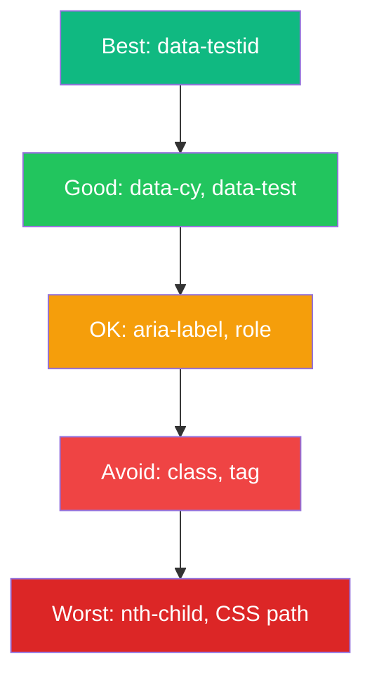
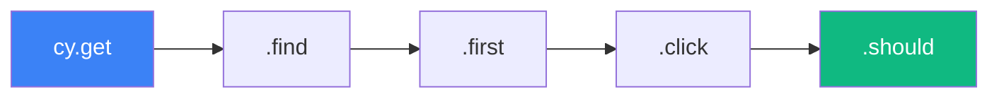

Selecting elements correctly is fundamental to writing reliable Cypress tests. This guide covers selector strategies, command chaining, and creating custom commands for reusable test logic.

## Selector Strategy

### Selector Priority

Choose selectors based on resilience to change:



| Selector Type | Example | Resilience |
|---------------|---------|------------|
| `data-testid` | `[data-testid="submit"]` | High |
| `data-cy` | `[data-cy="login-button"]` | High |
| Role + name | `button` with text | Medium |
| Class | `.submit-btn` | Low |
| Tag + index | `button:first` | Very Low |

### Recommended Selectors

```javascript
// Best: Test-specific attributes
cy.get('[data-testid="submit-button"]');
cy.get('[data-cy="login-form"]');
cy.get('[data-test="user-name"]');

// Good: Semantic selectors
cy.contains('button', 'Submit');
cy.get('input[name="email"]');
cy.get('input[type="submit"]');

// Avoid: Brittle selectors
cy.get('.btn-primary'); // Class may change
cy.get('div > div > button'); // Structure may change
cy.get(':nth-child(3)'); // Order may change
```

### Adding Test Attributes

Add `data-testid` or `data-cy` attributes to your components:

```jsx
// React component
function LoginForm() {
  return (
    <form data-testid="login-form">
      <input data-testid="email-input" type="email" />
      <input data-testid="password-input" type="password" />
      <button data-testid="submit-button">Login</button>
    </form>
  );
}
```

## Core Selector Commands

### cy.get()

Select elements by CSS selector:

```javascript
// By ID
cy.get('#email');

// By class
cy.get('.form-control');

// By attribute
cy.get('[data-testid="submit"]');
cy.get('[name="email"]');
cy.get('[type="checkbox"]');

// By tag
cy.get('button');
cy.get('input');

// Combined selectors
cy.get('input[type="email"]');
cy.get('button.primary[disabled]');
cy.get('[data-testid="item"]:first');
cy.get('[data-testid="item"]:last');
cy.get('[data-testid="item"]:eq(2)'); // Third item
```

### cy.contains()

Select elements by text content:

```javascript
// Find element containing text
cy.contains('Submit');
cy.contains('Welcome back');

// Find specific element type containing text
cy.contains('button', 'Submit');
cy.contains('a', 'Learn more');
cy.contains('h1', 'Dashboard');

// Find within a container
cy.contains('.sidebar', 'Settings');

// With regex
cy.contains(/welcome/i); // Case-insensitive
cy.contains(/item \d+/); // Pattern matching
```

### cy.find()

Find elements within a parent:

```javascript
// Find child elements
cy.get('.user-card').find('.username');
cy.get('form').find('input');
cy.get('[data-testid="nav"]').find('a');

// Chain multiple finds
cy.get('.page')
  .find('.content')
  .find('.article')
  .find('h2');
```

### Traversing the DOM

```javascript
// Parent/child relationships
cy.get('.child').parent();
cy.get('.parent').children();
cy.get('.item').siblings();

// First/last/index
cy.get('.items').first();
cy.get('.items').last();
cy.get('.items').eq(2); // Third item (0-indexed)

// Filtering
cy.get('button').filter('.primary');
cy.get('.item').filter(':visible');
cy.get('input').not('[disabled]');

// Closest ancestor
cy.get('.nested-element').closest('.container');

// Next/previous siblings
cy.get('.current').next();
cy.get('.current').prev();
cy.get('.current').nextAll();
cy.get('.current').prevAll();
```

## Command Chaining

Cypress commands are chainable, with each command yielding a subject to the next:



### Basic Chaining

```javascript
cy.get('[data-testid="form"]')
  .find('input[name="email"]')
  .type('user@example.com')
  .should('have.value', 'user@example.com');

cy.get('.nav')
  .contains('Settings')
  .click()
  .url()
  .should('include', '/settings');
```

### Subject Management

```javascript
// Commands yield new subjects
cy.get('form')           // yields <form>
  .find('input')         // yields <input> (changes subject)
  .type('hello')         // yields <input>
  .should('have.value', 'hello');

// Some commands yield the same subject
cy.get('input')
  .type('hello')         // yields same <input>
  .clear()               // yields same <input>
  .type('world');        // yields same <input>

// .within() scopes commands to an element
cy.get('[data-testid="user-card"]').within(() => {
  cy.get('.name').should('contain', 'John');
  cy.get('.email').should('contain', 'john@example.com');
  cy.get('button').click();
});
```

### Retry-ability

Cypress automatically retries commands until they pass or timeout:

```javascript
// This will retry until element is visible or timeout
cy.get('[data-testid="toast"]').should('be.visible');

// Retries the whole chain
cy.get('.items')
  .find('.item')
  .should('have.length', 5);
```

## Using .within() for Scoped Queries

```javascript
// All queries scoped to the form
cy.get('[data-testid="registration-form"]').within(() => {
  cy.get('[name="firstName"]').type('John');
  cy.get('[name="lastName"]').type('Doe');
  cy.get('[name="email"]').type('john@example.com');
  cy.get('[type="submit"]').click();
});

// Testing multiple cards
cy.get('[data-testid="user-card"]').each(($card) => {
  cy.wrap($card).within(() => {
    cy.get('.name').should('exist');
    cy.get('.avatar').should('be.visible');
  });
});
```

## Using .each() for Iteration

```javascript
// Iterate over elements
cy.get('[data-testid="item"]').each(($item, index) => {
  cy.wrap($item).should('contain', `Item ${index + 1}`);
});

// Perform actions on each element
cy.get('.checkbox').each(($checkbox) => {
  cy.wrap($checkbox).check();
});

// Complex iteration
cy.get('.product-card').each(($card) => {
  cy.wrap($card).within(() => {
    cy.get('.price')
      .invoke('text')
      .then((price) => {
        const numPrice = parseFloat(price.replace('$', ''));
        expect(numPrice).to.be.greaterThan(0);
      });
  });
});
```

## Custom Commands

### Creating Custom Commands

```javascript
// cypress/support/commands.js

// Simple command
Cypress.Commands.add('login', (email, password) => {
  cy.visit('/login');
  cy.get('[data-testid="email"]').type(email);
  cy.get('[data-testid="password"]').type(password);
  cy.get('[data-testid="submit"]').click();
  cy.url().should('include', '/dashboard');
});

// Command with options
Cypress.Commands.add('login', (email, password, options = {}) => {
  const { redirect = '/dashboard' } = options;

  cy.visit('/login');
  cy.get('[data-testid="email"]').type(email);
  cy.get('[data-testid="password"]').type(password);
  cy.get('[data-testid="submit"]').click();

  if (redirect) {
    cy.url().should('include', redirect);
  }
});

// Child command (chains off a subject)
Cypress.Commands.add('shouldBeVisible', { prevSubject: true }, (subject) => {
  cy.wrap(subject).should('be.visible');
  return cy.wrap(subject);
});

// Dual command (works with or without subject)
Cypress.Commands.add('clickIfVisible', { prevSubject: 'optional' }, (subject, selector) => {
  if (subject) {
    cy.wrap(subject).find(selector).click();
  } else {
    cy.get(selector).click();
  }
});
```

### Using Custom Commands

```javascript
// cypress/e2e/dashboard.cy.js
describe('Dashboard', () => {
  beforeEach(() => {
    cy.login('user@example.com', 'password123');
  });

  it('shows user profile', () => {
    cy.get('[data-testid="profile"]')
      .shouldBeVisible()
      .and('contain', 'user@example.com');
  });
});
```

### Common Custom Commands

```javascript
// cypress/support/commands.js

// Login via API (faster than UI)
Cypress.Commands.add('loginByApi', (email, password) => {
  cy.request('POST', '/api/login', { email, password })
    .then((response) => {
      window.localStorage.setItem('token', response.body.token);
    });
});

// Drag and drop
Cypress.Commands.add('dragTo', { prevSubject: true }, (subject, targetSelector) => {
  cy.wrap(subject).trigger('dragstart');
  cy.get(targetSelector).trigger('drop');
  cy.wrap(subject).trigger('dragend');
});

// Get by test ID
Cypress.Commands.add('getByTestId', (testId) => {
  return cy.get(`[data-testid="${testId}"]`);
});

// Assert toast message
Cypress.Commands.add('shouldShowToast', (message) => {
  cy.get('[data-testid="toast"]')
    .should('be.visible')
    .and('contain', message);
});

// Fill form fields
Cypress.Commands.add('fillForm', (formData) => {
  Object.entries(formData).forEach(([name, value]) => {
    cy.get(`[name="${name}"]`).clear().type(value);
  });
});

// Usage
cy.fillForm({
  firstName: 'John',
  lastName: 'Doe',
  email: 'john@example.com',
});
```

### TypeScript Support

```typescript
// cypress/support/index.d.ts
declare namespace Cypress {
  interface Chainable {
    login(email: string, password: string): Chainable<void>;
    getByTestId(testId: string): Chainable<JQuery<HTMLElement>>;
    shouldShowToast(message: string): Chainable<void>;
    fillForm(formData: Record<string, string>): Chainable<void>;
  }
}
```

## Best Practices

### 1. Use Specific Selectors

```javascript
// Bad: Too generic
cy.get('button').click();

// Good: Specific
cy.get('[data-testid="submit-button"]').click();
cy.contains('button', 'Submit').click();
```

### 2. Avoid Conditional Logic When Possible

```javascript
// Bad: Conditional based on element existence
cy.get('body').then(($body) => {
  if ($body.find('.modal').length) {
    cy.get('.modal .close').click();
  }
});

// Better: Control state in test setup
beforeEach(() => {
  cy.clearCookies();
  cy.visit('/');
});
```

### 3. Keep Commands DRY with Custom Commands

```javascript
// Instead of repeating this everywhere
cy.get('[data-testid="email"]').type('user@example.com');
cy.get('[data-testid="password"]').type('password');
cy.get('[data-testid="submit"]').click();

// Create a custom command
cy.login('user@example.com', 'password');
```

### 4. Use Aliases for Repeated Selections

```javascript
// Bad: Repeated selection
cy.get('[data-testid="user-list"]').should('be.visible');
cy.get('[data-testid="user-list"]').find('.user').should('have.length', 5);
cy.get('[data-testid="user-list"]').find('.user').first().click();

// Good: Use alias
cy.get('[data-testid="user-list"]').as('userList');
cy.get('@userList').should('be.visible');
cy.get('@userList').find('.user').should('have.length', 5);
cy.get('@userList').find('.user').first().click();
```

## Summary

| Command | Purpose |
|---------|---------|
| `cy.get()` | Select by CSS selector |
| `cy.contains()` | Select by text content |
| `.find()` | Find within element |
| `.within()` | Scope queries to element |
| `.each()` | Iterate over elements |
| `.first()/.last()/.eq()` | Select by position |
| `Cypress.Commands.add()` | Create custom command |

Key takeaways:

- Use `data-testid` or `data-cy` attributes for reliable selectors
- Chain commands for cleaner, more readable tests
- Use `.within()` to scope queries to a container
- Create custom commands for reusable test logic
- Cypress automatically retries commands until they pass
- Avoid brittle selectors like classes or complex CSS paths

Good selector strategy and custom commands make tests maintainable and resilient to UI changes.

## References

- [Cypress Selectors Best Practices](https://docs.cypress.io/guides/references/best-practices#Selecting-Elements)
- [Cypress Custom Commands](https://docs.cypress.io/api/cypress-api/custom-commands)
- Mwaura, Waweru. *End-to-End Web Testing with Cypress*. Packt, 2021.
