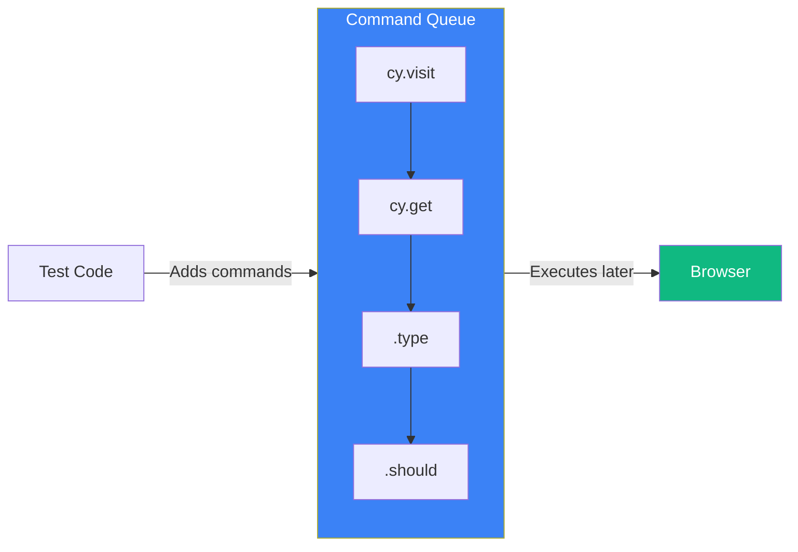
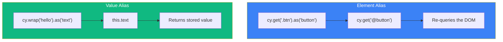

Cypress commands are asynchronous and run in a queue, which means you can't simply assign their results to variables like in synchronous code. Understanding closures and aliases is essential for managing data flow in your tests.

## The Asynchronous Nature of Cypress



### Why Variables Don't Work Directly

```javascript
// This WON'T work as expected
let username;
cy.get('[data-testid="username"]').invoke('text').then((text) => {
  username = text;
});
console.log(username); // undefined - commands haven't run yet!

// The .then() callback runs AFTER cy.get() completes
cy.get('[data-testid="username"]').invoke('text').then((text) => {
  console.log(text); // This works - inside the callback
});
```

## Using Closures with .then()

### Basic Pattern

```javascript
cy.get('[data-testid="user-id"]')
  .invoke('text')
  .then((userId) => {
    // userId is available here
    cy.visit(`/users/${userId}`);
    cy.get('[data-testid="profile"]').should('contain', userId);
  });
```

### Chaining Multiple Values

```javascript
cy.get('[data-testid="first-name"]')
  .invoke('text')
  .then((firstName) => {
    cy.get('[data-testid="last-name"]')
      .invoke('text')
      .then((lastName) => {
        const fullName = `${firstName} ${lastName}`;
        cy.get('[data-testid="greeting"]').should('contain', fullName);
      });
  });
```

### Avoiding Callback Hell

```javascript
// Better: Use aliases instead of nested callbacks
cy.get('[data-testid="first-name"]').invoke('text').as('firstName');
cy.get('[data-testid="last-name"]').invoke('text').as('lastName');

cy.then(function () {
  const fullName = `${this.firstName} ${this.lastName}`;
  cy.get('[data-testid="greeting"]').should('contain', fullName);
});
```

## Aliases with .as()

### Creating Aliases

```javascript
// Alias an element
cy.get('[data-testid="submit-button"]').as('submitBtn');

// Alias a value
cy.get('[data-testid="user-id"]').invoke('text').as('userId');

// Alias an intercept
cy.intercept('GET', '/api/users').as('getUsers');

// Alias a fixture
cy.fixture('users.json').as('usersData');
```

### Using Aliases

```javascript
// Reference with @ prefix using cy.get()
cy.get('@submitBtn').click();
cy.get('@submitBtn').should('be.disabled');

// Reference with this.* in function callbacks
cy.then(function () {
  expect(this.userId).to.equal('123');
});

// Wait for aliased intercepts
cy.wait('@getUsers').its('response.statusCode').should('eq', 200);
```

### Element vs Value Aliases



```javascript
// Element alias - re-queries each time
cy.get('[data-testid="counter"]').as('counter');
cy.get('@counter').should('have.text', '0');
cy.get('[data-testid="increment"]').click();
cy.get('@counter').should('have.text', '1'); // Re-queries, gets updated element

// Value alias - stores the value
cy.get('[data-testid="counter"]').invoke('text').as('initialCount');
cy.get('[data-testid="increment"]').click();
cy.then(function () {
  // this.initialCount is still '0' - it was captured before the click
  expect(this.initialCount).to.equal('0');
});
```

## Sharing Data Between Hooks and Tests

### Using this Context

```javascript
describe('User Profile', () => {
  beforeEach(function () {
    // Create aliases in beforeEach
    cy.fixture('user.json').as('userData');
    cy.intercept('GET', '/api/profile', { fixture: 'user.json' }).as('getProfile');
  });

  it('displays user information', function () {
    // Access aliases via this.*
    cy.visit('/profile');
    cy.wait('@getProfile');

    cy.get('[data-testid="name"]').should('contain', this.userData.name);
    cy.get('[data-testid="email"]').should('contain', this.userData.email);
  });

  it('can update user information', function () {
    cy.visit('/profile');
    cy.wait('@getProfile');

    // Use fixture data for assertions
    cy.get('[data-testid="name-input"]').should('have.value', this.userData.name);
  });
});
```

### Arrow Functions vs Regular Functions

```javascript
// Arrow functions do NOT have their own `this`
beforeEach(() => {
  cy.fixture('user.json').as('userData');
});

it('fails to access this.userData', () => {
  // this.userData is undefined - arrow function doesn't bind this
  console.log(this.userData); // undefined
});

// Regular functions DO have their own `this`
it('can access this.userData', function () {
  // this.userData works - regular function binds this to test context
  expect(this.userData.name).to.equal('John');
});
```

### Using Closure Variables

```javascript
describe('Data sharing with closures', () => {
  let testUser;

  before(() => {
    cy.fixture('user.json').then((user) => {
      testUser = user;
    });
  });

  it('uses the test user', () => {
    // testUser is available after before() completes
    cy.visit('/profile');
    cy.get('[data-testid="name"]').type(testUser.name);
  });
});
```

## Working with API Responses

### Capturing Response Data

```javascript
cy.intercept('POST', '/api/users').as('createUser');

cy.get('[data-testid="name"]').type('John Doe');
cy.get('[data-testid="submit"]').click();

cy.wait('@createUser').then((interception) => {
  const userId = interception.response.body.id;

  // Use the response data
  cy.visit(`/users/${userId}`);
  cy.get('[data-testid="user-name"]').should('contain', 'John Doe');
});
```

### Aliasing Response Data

```javascript
cy.intercept('GET', '/api/users').as('getUsers');

cy.visit('/users');

cy.wait('@getUsers')
  .its('response.body')
  .as('users');

cy.then(function () {
  expect(this.users).to.have.length.greaterThan(0);

  // Use the first user's data
  cy.get('[data-testid="user-card"]')
    .first()
    .should('contain', this.users[0].name);
});
```

## Environment Variables

### Accessing Cypress Environment Variables

```javascript
// cypress.config.js
module.exports = defineConfig({
  env: {
    apiUrl: 'http://localhost:3000/api',
    username: 'testuser',
    password: 'testpass',
  },
});

// In tests
const apiUrl = Cypress.env('apiUrl');
const username = Cypress.env('username');

cy.request(`${apiUrl}/users`);
cy.get('[data-testid="username"]').type(username);
```

### Setting Environment Variables

```javascript
// From command line
// npx cypress run --env apiUrl=http://api.example.com

// From cypress.config.js
module.exports = defineConfig({
  env: {
    apiUrl: 'http://localhost:3000/api',
  },
});

// From cypress.env.json (not committed to git)
// {
//   "username": "admin",
//   "password": "secret"
// }

// Programmatically in tests
Cypress.env('newVar', 'value');
```

## Common Patterns

### Storing and Reusing Test Data

```javascript
describe('Order workflow', () => {
  let orderId;

  it('creates an order', () => {
    cy.intercept('POST', '/api/orders').as('createOrder');

    cy.get('[data-testid="product"]').first().click();
    cy.get('[data-testid="add-to-cart"]').click();
    cy.get('[data-testid="checkout"]').click();

    cy.wait('@createOrder').then((interception) => {
      orderId = interception.response.body.id;
      cy.wrap(orderId).as('orderId');
    });

    cy.get('@orderId').then((id) => {
      cy.url().should('include', `/orders/${id}`);
    });
  });

  it('views the created order', () => {
    // orderId is available from previous test (use with caution)
    cy.visit(`/orders/${orderId}`);
    cy.get('[data-testid="order-status"]').should('contain', 'Pending');
  });
});
```

### Dynamic Test Data

```javascript
describe('Form validation', () => {
  const testCases = [
    { email: 'invalid', expected: 'Invalid email format' },
    { email: 'test@', expected: 'Invalid email format' },
    { email: 'test@example.com', expected: null },
  ];

  testCases.forEach(({ email, expected }) => {
    it(`validates email: ${email}`, () => {
      cy.visit('/signup');
      cy.get('[data-testid="email"]').type(email);
      cy.get('[data-testid="submit"]').click();

      if (expected) {
        cy.get('[data-testid="error"]').should('contain', expected);
      } else {
        cy.get('[data-testid="error"]').should('not.exist');
      }
    });
  });
});
```

### Wrapped Values with cy.wrap()

```javascript
// Wrap a value to use Cypress commands on it
const myObject = { name: 'John', age: 30 };

cy.wrap(myObject)
  .its('name')
  .should('eq', 'John');

cy.wrap(myObject)
  .its('age')
  .should('be.greaterThan', 18);

// Wrap a promise
cy.wrap(fetch('/api/status').then((r) => r.json()))
  .its('status')
  .should('eq', 'ok');
```

## Best Practices

### 1. Prefer Aliases Over Variables

```javascript
// Avoid: Mutable outer variables
let userId;
cy.get('#user-id').invoke('text').then((text) => {
  userId = text;
});

// Prefer: Aliases
cy.get('#user-id').invoke('text').as('userId');
cy.then(function () {
  cy.visit(`/users/${this.userId}`);
});
```

### 2. Use Regular Functions for this Access

```javascript
// Must use function() not () => for this.* access
it('uses aliased data', function () {
  cy.get('[data-testid="id"]').invoke('text').as('itemId');

  cy.then(function () {
    expect(this.itemId).to.exist;
  });
});
```

### 3. Reset State in beforeEach

```javascript
describe('Tests', function () {
  beforeEach(function () {
    // Aliases are cleared between tests
    // Re-create them in beforeEach
    cy.fixture('testData.json').as('testData');
    cy.intercept('GET', '/api/data').as('getData');
  });
});
```

## Summary

| Concept | Usage |
|---------|-------|
| `.then()` | Access yielded values in callback |
| `.as('name')` | Create named alias |
| `cy.get('@name')` | Reference element alias |
| `this.name` | Access value alias in function |
| `cy.wrap()` | Wrap value for Cypress commands |
| `Cypress.env()` | Access environment variables |

Key takeaways:

- Cypress commands are asynchronous; use `.then()` or aliases to access values
- Use `.as()` to create aliases for elements, values, and intercepts
- Element aliases re-query the DOM; value aliases store captured values
- Use regular functions (not arrow functions) to access `this.*` aliases
- Share data between hooks and tests using fixtures and aliases
- Use `cy.wrap()` to make JavaScript values work with Cypress commands
- Prefer aliases over closure variables for cleaner, more maintainable tests

Understanding data flow in Cypress helps write more reliable tests and avoid common pitfalls with asynchronous code.

## References

- [Cypress Variables and Aliases](https://docs.cypress.io/guides/core-concepts/variables-and-aliases)
- [Cypress Closures](https://docs.cypress.io/guides/core-concepts/variables-and-aliases#Closures)
- Mwaura, Waweru. *End-to-End Web Testing with Cypress*. Packt, 2021.
