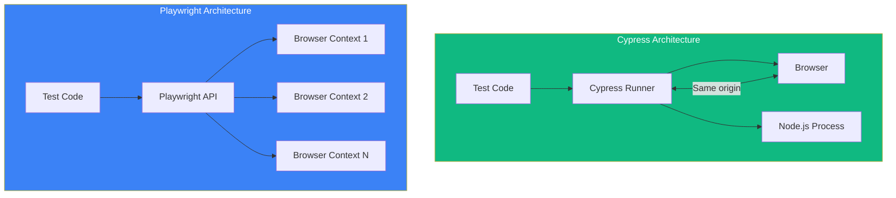

Both Cypress and Playwright are modern E2E testing frameworks that have largely replaced Selenium for web testing. Understanding their differences will help you choose the right tool for your project.

## Architecture Comparison



| Aspect | Cypress | Playwright |
|--------|---------|------------|
| Execution | Runs inside browser | Controls browser externally |
| Language | JavaScript/TypeScript | JS/TS, Python, .NET, Java |
| Multi-tab | Limited support | Full support |
| iframes | Requires workarounds | Native support |
| Network layer | Application level | Browser level |

## Browser Support

### Cypress

```javascript
// cypress.config.js
module.exports = defineConfig({
  e2e: {
    // Supported browsers
    // Chrome, Chromium, Edge, Electron, Firefox
    // Safari/WebKit not supported
  },
});

// Run with specific browser
// npx cypress run --browser chrome
// npx cypress run --browser firefox
```

### Playwright

```javascript
// playwright.config.js
export default defineConfig({
  projects: [
    { name: 'chromium', use: { ...devices['Desktop Chrome'] } },
    { name: 'firefox', use: { ...devices['Desktop Firefox'] } },
    { name: 'webkit', use: { ...devices['Desktop Safari'] } },
    { name: 'Mobile Chrome', use: { ...devices['Pixel 5'] } },
    { name: 'Mobile Safari', use: { ...devices['iPhone 12'] } },
  ],
});
```

| Browser | Cypress | Playwright |
|---------|---------|------------|
| Chrome/Chromium | Yes | Yes |
| Firefox | Yes | Yes |
| Edge | Yes | Yes |
| Safari/WebKit | No | Yes |
| Mobile browsers | No | Yes (emulation) |

## Syntax Comparison

### Basic Test Structure

**Cypress:**
```javascript
describe('Login', () => {
  beforeEach(() => {
    cy.visit('/login');
  });

  it('logs in successfully', () => {
    cy.get('[data-testid="email"]').type('user@example.com');
    cy.get('[data-testid="password"]').type('password');
    cy.get('[data-testid="submit"]').click();
    cy.url().should('include', '/dashboard');
  });
});
```

**Playwright:**
```javascript
import { test, expect } from '@playwright/test';

test.describe('Login', () => {
  test.beforeEach(async ({ page }) => {
    await page.goto('/login');
  });

  test('logs in successfully', async ({ page }) => {
    await page.getByTestId('email').fill('user@example.com');
    await page.getByTestId('password').fill('password');
    await page.getByTestId('submit').click();
    await expect(page).toHaveURL(/dashboard/);
  });
});
```

### Selecting Elements

**Cypress:**
```javascript
// CSS selectors
cy.get('[data-testid="submit"]');
cy.get('.btn-primary');
cy.get('#email');

// Text content
cy.contains('Submit');
cy.contains('button', 'Submit');

// Chaining
cy.get('.form').find('input').first();
```

**Playwright:**
```javascript
// Built-in locators (recommended)
await page.getByTestId('submit');
await page.getByRole('button', { name: 'Submit' });
await page.getByLabel('Email');
await page.getByPlaceholder('Enter email');
await page.getByText('Welcome');

// CSS selectors
await page.locator('.btn-primary');
await page.locator('#email');

// Chaining
await page.locator('.form').locator('input').first();
```

### Assertions

**Cypress:**
```javascript
// Implicit assertions with should()
cy.get('.title').should('be.visible');
cy.get('.title').should('have.text', 'Welcome');
cy.get('.items').should('have.length', 5);
cy.url().should('include', '/dashboard');

// Explicit assertions
cy.get('.count').invoke('text').then((text) => {
  expect(parseInt(text)).to.be.greaterThan(0);
});
```

**Playwright:**
```javascript
// Expect assertions
await expect(page.locator('.title')).toBeVisible();
await expect(page.locator('.title')).toHaveText('Welcome');
await expect(page.locator('.items')).toHaveCount(5);
await expect(page).toHaveURL(/dashboard/);

// Soft assertions (continue on failure)
await expect.soft(page.locator('.title')).toBeVisible();
```

## Network Handling

### API Mocking

**Cypress:**
```javascript
cy.intercept('GET', '/api/users', {
  body: [{ id: 1, name: 'John' }],
}).as('getUsers');

cy.visit('/users');
cy.wait('@getUsers');

cy.intercept('GET', '/api/users', (req) => {
  req.reply((res) => {
    res.body.push({ id: 2, name: 'Jane' });
  });
});
```

**Playwright:**
```javascript
await page.route('/api/users', async (route) => {
  await route.fulfill({
    body: JSON.stringify([{ id: 1, name: 'John' }]),
  });
});

await page.goto('/users');

// Modify response
await page.route('/api/users', async (route) => {
  const response = await route.fetch();
  const json = await response.json();
  json.push({ id: 2, name: 'Jane' });
  await route.fulfill({ json });
});
```

### Waiting for Requests

**Cypress:**
```javascript
cy.intercept('POST', '/api/users').as('createUser');
cy.get('[data-testid="submit"]').click();
cy.wait('@createUser').its('response.statusCode').should('eq', 201);
```

**Playwright:**
```javascript
const responsePromise = page.waitForResponse('/api/users');
await page.getByTestId('submit').click();
const response = await responsePromise;
expect(response.status()).toBe(201);
```

## Multi-Tab and Multi-Context

### Cypress (Limited)

```javascript
// Cypress runs in single tab
// For new tabs, use cy.origin() for cross-origin
cy.origin('https://other-domain.com', () => {
  cy.visit('/');
  cy.get('.content').should('exist');
});

// Or stub window.open
cy.window().then((win) => {
  cy.stub(win, 'open').as('windowOpen');
});
cy.get('a[target="_blank"]').click();
cy.get('@windowOpen').should('be.called');
```

### Playwright (Full Support)

```javascript
// Multiple tabs
const [newPage] = await Promise.all([
  context.waitForEvent('page'),
  page.click('a[target="_blank"]'),
]);
await newPage.waitForLoadState();
await expect(newPage).toHaveTitle('New Page');

// Multiple browser contexts (isolated sessions)
const context1 = await browser.newContext();
const context2 = await browser.newContext();
const page1 = await context1.newPage();
const page2 = await context2.newPage();

// Test multi-user scenarios
await page1.goto('/chat');
await page2.goto('/chat');
await page1.getByRole('textbox').fill('Hello from User 1');
await expect(page2.locator('.message')).toContainText('Hello from User 1');
```

## Parallel Execution

### Cypress

```javascript
// cypress.config.js
module.exports = defineConfig({
  e2e: {
    // Parallel execution requires Cypress Cloud (paid)
    // Or use third-party tools like sorry-cypress
  },
});

// Command line
// npx cypress run --record --parallel
```

### Playwright

```javascript
// playwright.config.js
export default defineConfig({
  // Built-in parallelization (free)
  workers: process.env.CI ? 2 : undefined,
  fullyParallel: true,
});

// Shard across machines
// npx playwright test --shard=1/3
// npx playwright test --shard=2/3
// npx playwright test --shard=3/3
```

## Developer Experience

### Test Generation

**Cypress:**
```bash
# Cypress Studio (experimental)
# Enable in cypress.config.js
experimentalStudio: true
# Then use "Add Commands to Test" in Test Runner
```

**Playwright:**
```bash
# Built-in codegen
npx playwright codegen example.com
# Records actions and generates test code
```

### Debugging

**Cypress:**
- Time Travel in Test Runner
- DOM snapshots at each step
- `cy.pause()` and `cy.debug()`
- Console logging with `.then()`

**Playwright:**
- Trace Viewer with timeline
- Video recording
- `await page.pause()` for debugging
- VS Code extension with live debugging

### Reporting

**Cypress:**
```javascript
// Built-in reporters
// npx cypress run --reporter spec
// npx cypress run --reporter junit

// Dashboard reporting (paid Cypress Cloud)
```

**Playwright:**
```javascript
// playwright.config.js
export default defineConfig({
  reporter: [
    ['html'],           // HTML report
    ['json', { outputFile: 'results.json' }],
    ['junit', { outputFile: 'results.xml' }],
  ],
});

// npx playwright show-report
```

## Performance Comparison

| Metric | Cypress | Playwright |
|--------|---------|------------|
| Startup time | Slower | Faster |
| Test execution | Moderate | Very fast |
| Parallel (free) | No | Yes |
| Memory usage | Higher | Lower |
| CI integration | Good | Excellent |

## When to Choose Cypress

Cypress is a good choice when:

- **Team familiarity**: Your team knows jQuery-like syntax
- **Simple E2E tests**: Testing single-page applications
- **Visual debugging**: Need time travel debugging
- **Component testing**: Want to test React/Vue/Angular components
- **Ecosystem**: Need plugins from Cypress ecosystem

```javascript
// Cypress excels at component testing
import { mount } from 'cypress/react';
import Button from './Button';

it('renders button', () => {
  mount(<Button>Click me</Button>);
  cy.get('button').should('have.text', 'Click me');
});
```

## When to Choose Playwright

Playwright is a good choice when:

- **Cross-browser testing**: Need Safari/WebKit support
- **Multi-tab scenarios**: Testing complex workflows
- **API testing**: Need robust request handling
- **Mobile testing**: Need mobile browser emulation
- **Performance**: Need fast parallel execution
- **Multi-language**: Team uses Python, .NET, or Java

```javascript
// Playwright excels at complex scenarios
test('multi-user chat', async ({ browser }) => {
  const user1Context = await browser.newContext();
  const user2Context = await browser.newContext();

  const user1Page = await user1Context.newPage();
  const user2Page = await user2Context.newPage();

  await user1Page.goto('/chat/room-1');
  await user2Page.goto('/chat/room-1');

  await user1Page.getByRole('textbox').fill('Hello!');
  await user1Page.getByRole('button', { name: 'Send' }).click();

  await expect(user2Page.locator('.message').last()).toHaveText('Hello!');
});
```

## Migration Considerations

### From Cypress to Playwright

```javascript
// Cypress
cy.get('[data-testid="email"]').type('user@example.com');
cy.get('[data-testid="submit"]').click();
cy.url().should('include', '/dashboard');

// Playwright equivalent
await page.getByTestId('email').fill('user@example.com');
await page.getByTestId('submit').click();
await expect(page).toHaveURL(/dashboard/);
```

### From Playwright to Cypress

```javascript
// Playwright
await page.getByRole('button', { name: 'Submit' }).click();
await expect(page.locator('.success')).toBeVisible();

// Cypress equivalent
cy.contains('button', 'Submit').click();
cy.get('.success').should('be.visible');
```

## Summary

| Feature | Cypress | Playwright |
|---------|---------|------------|
| Learning curve | Easier | Moderate |
| Safari support | No | Yes |
| Multi-tab | Limited | Full |
| Parallel (free) | No | Yes |
| Component testing | Yes | Experimental |
| API mocking | Excellent | Excellent |
| Mobile emulation | No | Yes |
| Test generation | Limited | Built-in |
| Languages | JS/TS | Multi-language |
| Pricing | Free + paid cloud | Free |

Key takeaways:

- **Cypress** is excellent for simple to moderate E2E testing with great debugging
- **Playwright** is better for complex scenarios, cross-browser testing, and performance
- Both frameworks have excellent documentation and active communities
- Consider your team's needs: browser support, parallel execution, and test complexity
- Migration between frameworks is possible but requires effort
- For new projects, evaluate both with a proof of concept

The best framework depends on your specific requirements. Many teams successfully use both - Cypress for component testing and Playwright for E2E testing.

## References

- [Cypress Documentation](https://docs.cypress.io/)
- [Playwright Documentation](https://playwright.dev/)
- [Cypress vs Playwright Comparison](https://www.browserstack.com/guide/cypress-vs-playwright)
- Mwaura, Waweru. *End-to-End Web Testing with Cypress*. Packt, 2021.
