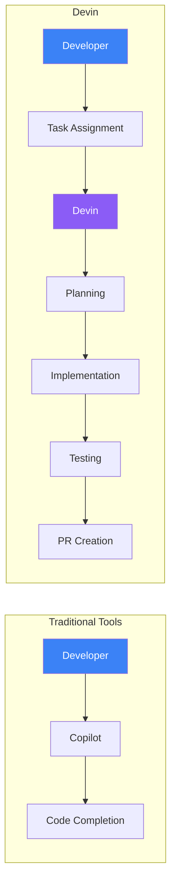
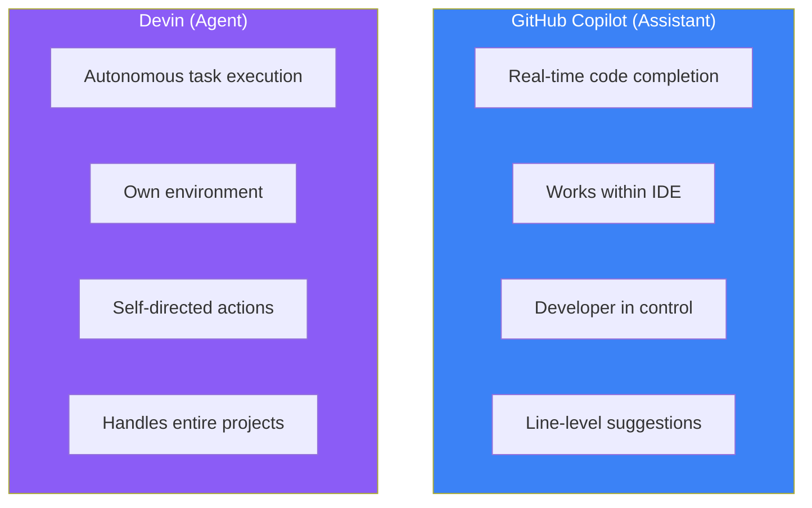
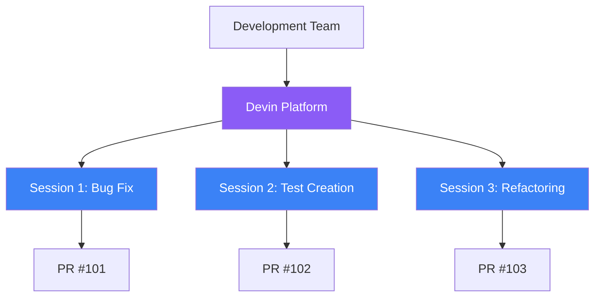
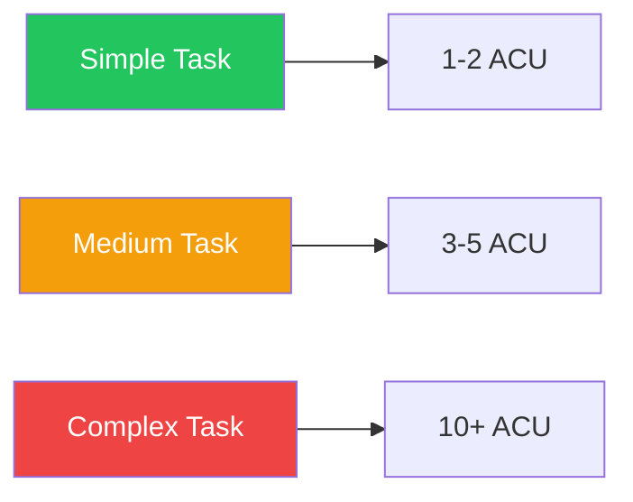

Imagine giving instructions in natural language and having an AI write code, test it, and even create pull requests for you. This is Devin—the "world's first autonomous AI software engineer" developed by Cognition AI, bringing a new paradigm to software development.

## What is Devin?

Devin is not a code completion tool. It's an **AI agent that autonomously executes software development tasks**. While traditional AI coding tools act as "assistants," Devin functions more like a "junior engineer" on your team.



### Key Characteristics

Devin operates within a sandboxed computing environment that includes:

- **Shell**: Command execution
- **Code Editor**: File editing
- **Browser**: Documentation lookup, error investigation

This enables Devin to autonomously write code, execute it, check for errors, and fix them—just like a human engineer would.

## The Fundamental Difference from Copilot

GitHub Copilot and Devin are both AI-powered development tools, but their roles are fundamentally different.



### Comparison Table

| Aspect | GitHub Copilot | Devin |
|--------|---------------|-------|
| **Role** | Coding assistant | Autonomous engineer |
| **Environment** | Within IDE | Own cloud environment |
| **Input** | Code context | Natural language task description |
| **Output** | Code completions/suggestions | PRs, commits, deployments |
| **Control** | Developer always in control | Makes autonomous decisions |
| **Best for** | Daily coding acceleration | Delegating routine tasks |

### How They Actually Work

**Copilot**:
```
Developer: [Starts writing code]
Copilot: [Suggests next line]
Developer: [Accepts or modifies suggestion]
Developer: [Runs tests]
Developer: [Fixes errors]
```

**Devin**:
```
Developer: Implement user authentication. Use JWT
          with refresh token support.

Devin: [Analyzes codebase]
       [Creates implementation plan]
       [Implements code]
       [Runs tests]
       [Auto-fixes errors]
       [Creates PR]

Developer: [Reviews and merges PR]
```

## Key Features

### 1. Agent-Native IDE

Devin operates in a dedicated cloud-based IDE. You can run multiple Devin sessions in parallel, each working on independent tasks.



### 2. Interactive Planning

When you start a task, Devin first analyzes the codebase and proposes an implementation plan. You can review and modify this plan before execution begins.

```
Devin: I've analyzed the codebase. Here's my plan:

1. Create JWT utilities in src/auth/jwt.ts
2. Add auth middleware in src/middleware/auth.ts
3. Implement login/refresh endpoints in src/routes/auth.ts
4. Add tests in tests/auth.test.ts

Should I proceed with this plan?
```

### 3. Devin Wiki

Automatically indexes your repositories and generates architecture diagrams and documentation. Useful for onboarding new team members and understanding legacy code.

### 4. Devin Search

Ask questions about your codebase in natural language:

```
Question: Where are authentication errors handled?

Answer: Authentication errors are handled in these locations:
- src/middleware/errorHandler.ts:45 - AuthenticationError class
- src/routes/auth.ts:78 - Login failure handling
[Links to source code]
```

### 5. Team Integration

Integrates with Slack, Microsoft Teams, and Jira:

- **Slack**: Mention `@Devin` to assign tasks
- **Jira**: Add `devin` label to tickets for automatic handling
- **GitHub**: Request additional changes via PR comments

## Pricing Plans

With Devin 2.0 (released April 2025), pricing was significantly reduced.

| Plan | Monthly | ACUs | Additional ACUs | Target |
|------|---------|------|-----------------|--------|
| **Core** | $20 | 9 | $2.25/ACU | Individual developers, trials |
| **Team** | $500 | 250 | $2/ACU | Teams, production use |
| **Enterprise** | Custom | Custom | Negotiable | Large enterprises, VPC support |

### What Are ACUs (Agent Compute Units)?

ACUs measure Devin's workload. Consumption varies based on task complexity and execution time.



### Which Plan Should You Choose?

| Scenario | Recommended Plan |
|----------|-----------------|
| Want to try Devin | Core |
| A few small tasks per week | Core |
| Regular task delegation | Team |
| Multiple people sharing Devin | Team |
| Security/compliance requirements | Enterprise |

## What Devin Does Well and Struggles With

### Strengths

- **Code migrations**: Framework and library upgrades
- **Security fixes**: Vulnerability detection and patching
- **Unit test creation**: Improving test coverage
- **Small feature additions**: Features with clear specifications
- **Bug fixes**: Bugs with clear reproduction steps

### Limitations

- **Ambiguous requirements**: "Make it more user-friendly"
- **Architecture design**: System-wide design decisions
- **Performance optimization**: Cases requiring deep analysis
- **Creative UI/UX**: Cases requiring design judgment

## Summary

| Aspect | Description |
|--------|-------------|
| **What is Devin** | Autonomous AI software engineer |
| **Difference from Copilot** | Assistant vs. Agent |
| **Key Features** | Autonomous execution, planning, Wiki, Search |
| **Pricing** | Starting at $20/month |
| **Best Use Cases** | Routine tasks, migrations, testing |

Think of Devin as a "junior engineer." It works excellently with clear instructions but requires human supervision for ambiguous tasks or situations needing advanced judgment. In the next article, we'll look at Devin's benchmark performance and real-world success rates.

## References

- [Cognition - Introducing Devin](https://cognition.ai/blog/introducing-devin)
- [Devin Official Documentation](https://docs.devin.ai/)
- [Cognition - Devin 2.0](https://cognition.ai/blog/devin-2)
- [Devin Pricing](https://devin.ai/pricing/)
