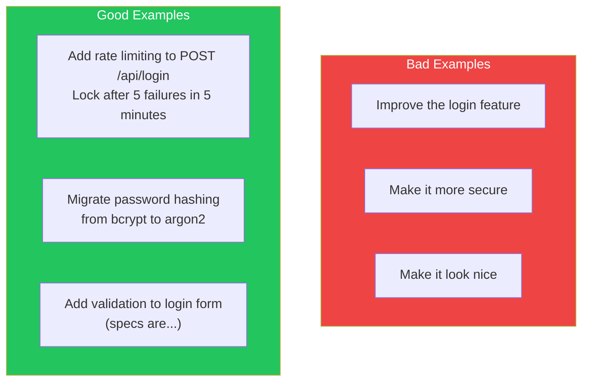
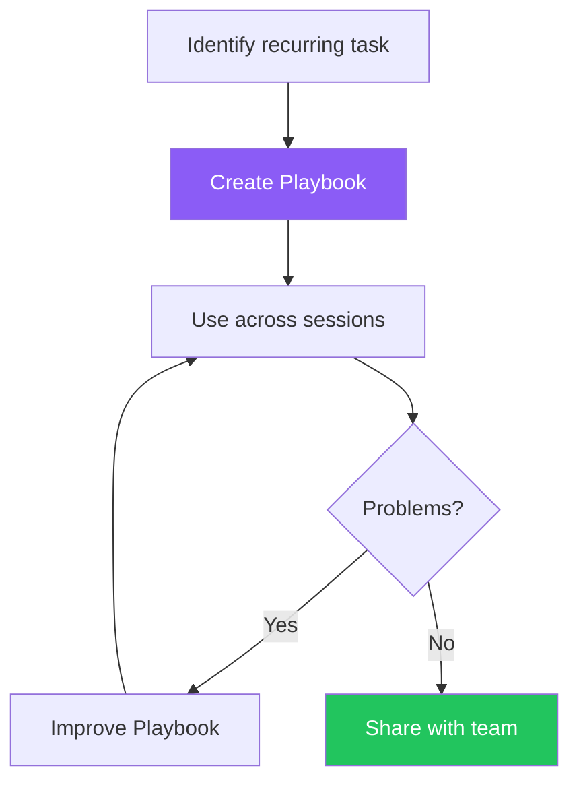
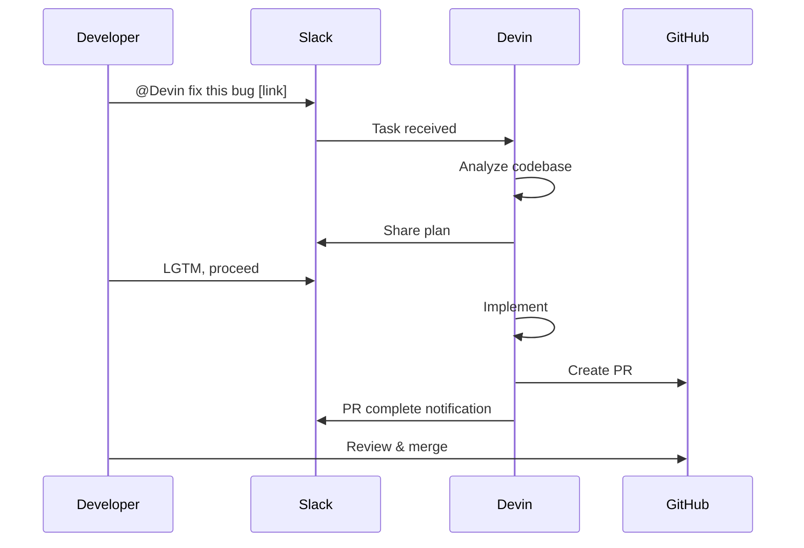
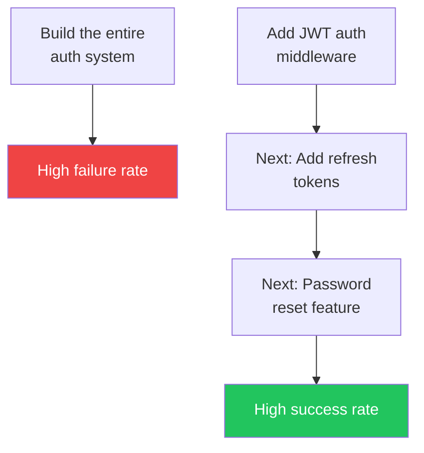
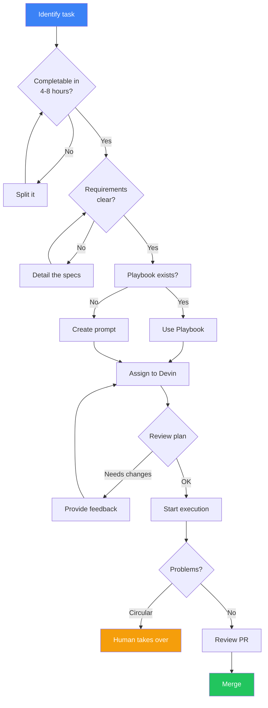

Devin is a powerful tool, but using it incorrectly wastes time and ACUs. In Answer.AI's evaluation, only 3 out of 20 tasks succeeded (15%). However, with the right approach, Devin can become a valuable team asset. This article provides practical guidance for effective Devin utilization.

## Setup Procedure

### 1. Account Creation

Visit [app.devin.ai](https://app.devin.ai) and click "Get Started."


The setup wizard asks about:
- Yourself (job title, etc.)
- Your company/organization
- Team name (solo use is fine)

### 2. Plan Selection

| Plan | Monthly | ACUs | Recommended For |
|------|---------|------|-----------------|
| Core | $20 | 9 | Trials, personal projects |
| Team | $500 | 250 | Team use, production |

### 3. Repository Connection

Connect your GitHub account and grant Devin access. Devin can then create PRs for connected repositories.

### 4. Integration Setup (Optional)

For team use, configure these integrations:

- **Slack**: Mention `@Devin` to assign tasks
- **Jira**: `devin` label triggers automatic task start
- **Linear**: Webhook integration for automation

## Writing Effective Prompts

### Core Principle: Be Specific and Clear

Instructing Devin is like handing a spec document to a junior engineer colleague. Vague instructions produce vague results.



### Prompt Template

Effective prompts include these elements:

```
## Task
[What you want done in 1-2 sentences]

## Context
- Target files/directories: [paths]
- Related existing code: [description]
- Tech stack: [frameworks, libraries]

## Requirements
1. [Specific requirement 1]
2. [Specific requirement 2]
3. [Specific requirement 3]

## Success Criteria
- [What defines completion]
- [Expected test results]

## Out of Scope
- [What NOT to do]
```

### Example: Good Prompt

```
## Task
Add refresh token functionality to user authentication API

## Context
- Target: src/api/auth.ts, src/middleware/jwt.ts
- Currently access token only (1-hour expiry)
- Express + TypeScript, using jsonwebtoken library

## Requirements
1. Generate refresh token (7-day expiry)
2. Add POST /api/auth/refresh endpoint
3. Store refresh token in DB (use existing User model)
4. Add tests following existing test patterns

## Success Criteria
- npm test passes all tests
- Can verify with Postman

## Out of Scope
- Frontend changes
- Modifications to existing login flow
```

### Use the Prompt Analyzer

Devin has an "Analyze prompt" feature. Click the pen icon next to the send button to get improvement suggestions for your prompt.

## Leveraging Playbooks

### What Are Playbooks?

Playbooks are templates for recurring tasks. Creating a Playbook improves quality and efficiency when delegating the same type of task repeatedly.



### Creating Playbooks

1. **From web app**: Click "Create a new Playbook"
2. **From file**: Drag and drop a `.devin.md` file

### Playbook Example: Adding Unit Tests

```markdown
# Unit Test Playbook

## Purpose
Add unit tests to specified files

## Procedure
1. Analyze target file and identify functions to test
2. Check existing test patterns (tests/ directory)
3. Create test file following same patterns
4. Implement tests including edge cases
5. Run npm test to verify

## Success Criteria
- Coverage above 80%
- Existing tests still pass
- Test names are clear and readable

## Notes
- Minimize mocking
- Test behavior, not implementation details
- Use AAA (Arrange-Act-Assert) pattern
```

### Playbook vs Knowledge

| Use Case | Playbook | Knowledge |
|----------|----------|-----------|
| Steps for specific tasks | ○ | × |
| Organization coding standards | × | ○ |
| Reusable workflows | ○ | × |
| Project-wide information | × | ○ |
| Best practices | △ | ○ |

**Knowledge** is for general information automatically referenced in all sessions (style guides, architecture). **Playbooks** are for specific task procedures.

## Integration Workflows

### Slack Integration



### Jira Integration

1. **Setup**: Devin → Team → Integrations → Jira
2. **Create bot account**: `devin-bot@yourcompany.com`
3. **Add label to ticket**: `devin`

```
Ticket: PROJ-123 Add CAPTCHA to login page

[Add devin label]

↓ Devin comments

"I've analyzed the codebase. Here's my plan:
1. Add reCAPTCHA to src/components/Login.tsx
2. Verify token in src/api/auth.ts
3. Add RECAPTCHA_SECRET_KEY env variable

Start session? (yes/no)"
```

## Common Failure Patterns and How to Avoid Them

### Failure Pattern 1: Vague Instructions

```
❌ Bad: "Improve performance"

✅ Good: "Improve /api/users response time.
The query currently takes 2 seconds. Reduce to
under 500ms by fixing the N+1 problem."
```

### Failure Pattern 2: Scope Too Large



**Break down large tasks**: Split into units completable in 4-8 hours.

### Failure Pattern 3: Engaging with Circular Behavior

```
Warning signs:
- Feel like "it's ignoring my instructions"
- Keeps proposing the same solutions
- No progress for hours
```

**Solution**: Cut losses early. Have a human take over or redefine the task. Save your ACUs.

### Failure Pattern 4: Requesting Impossible Tasks

In Answer.AI's evaluation, Devin spent over a day on an **impossible task** (features that Railway's limitations didn't support), "hallucinating" non-existent features.

**Solution**: Verify technical feasibility before assigning tasks.

### Failure Pattern 5: Tasks Requiring Existing Codebase Understanding

Devin excels at new code generation but struggles with complex existing codebase integration.

```
Strengths:
- Adding new endpoints
- Standalone utility functions
- Migration scripts

Weaknesses:
- Fixing complex legacy code
- Understanding implicit patterns
- Multi-component coordination
```

## Effective Workflow

### Recommended Flow



### Leveraging Parallel Execution

Devin 2.0 supports multiple parallel sessions.

```
Session 1: Add tests to src/api/users
Session 2: Add tests to src/api/orders
Session 3: Add tests to src/api/products

→ 3 PRs created in parallel
```

Running the same Playbook across multiple sessions helps quickly identify issues.

## Checkpoints and Snapshots

### Checkpoint Restoration

If Devin goes off track, scrub the timeline and click the "restore checkpoint" icon to return to a previous state.

### Using Snapshots

Snapshots are environment save points. Save a state with repositories cloned and environment set up for faster session starts next time.

**Shortcuts**: Save Snapshot + Playbook combinations to your homepage. Recommended: create one shortcut per repository.

## Summary

| Point | Recommended Action |
|-------|-------------------|
| Prompts | Be specific, clarify success criteria |
| Task size | Split into 4-8 hour completable units |
| Playbooks | Template recurring tasks |
| On failure | Cut early, have human take over |
| Parallel execution | Run independent tasks simultaneously |
| Integrations | Incorporate into workflow via Slack/Jira |

Devin is an "excellent but inexperienced junior engineer." With clear instructions and appropriate supervision, it can significantly boost team productivity.

## References

- [Devin Docs - Instructing Devin Effectively](https://docs.devin.ai/essential-guidelines/instructing-devin-effectively)
- [Coding Agents 101](https://devin.ai/agents101)
- [Creating Playbooks](https://docs.devin.ai/product-guides/creating-playbooks)
- [Answer.AI - Thoughts on a Month with Devin](https://www.answer.ai/posts/2025-01-08-devin.html)
