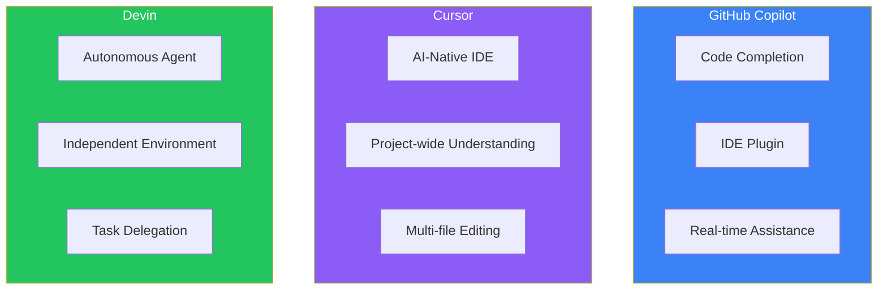
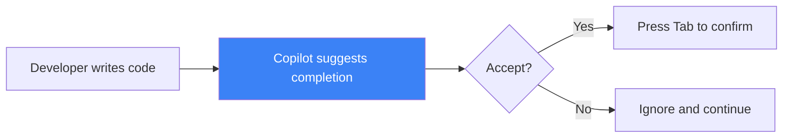
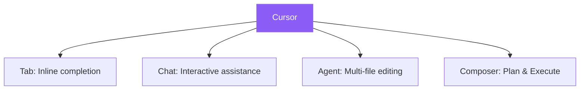
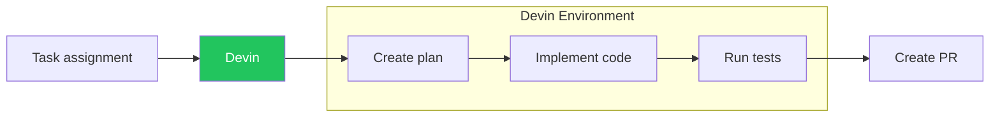
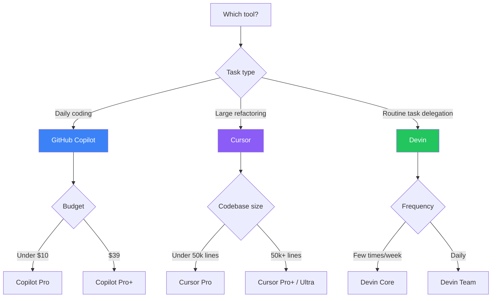
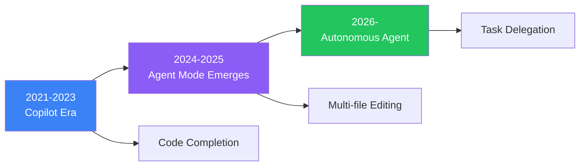

In 2026, AI coding tools have become essential for developers. About 85% of developers regularly use AI tools, and the market exceeds $2 billion. This article thoroughly compares three representative tools—Devin, GitHub Copilot, and Cursor—and explains when to use each.

## Tool Classification: Three Paradigms



| Category | Tool | Role |
|----------|------|------|
| **Copilot-type** | GitHub Copilot | Suggests completions alongside developer |
| **AI-Native IDE** | Cursor | Editor integrated with AI |
| **Autonomous Agent** | Devin | Executes tasks independently |

## Detailed Overview

### GitHub Copilot

A code completion tool jointly developed by GitHub and OpenAI. Since its 2021 launch, it has reigned as the industry standard.



**Features**:
- **Instant completion**: Real-time suggestions while typing
- **Wide IDE support**: VS Code, JetBrains, Visual Studio, Neovim, Xcode
- **Agent Mode**: Understands project-wide context, multi-file changes
- **Model selection**: Multiple models including Claude, GPT, Gemini

**Pricing Plans (2026)**:

| Plan | Monthly | Premium Requests | Features |
|------|---------|------------------|----------|
| Free | $0 | 50 | Basic features |
| Pro | $10 | 300 | For individuals |
| **Pro+** | $39 | 1,500 | All model access |
| Business | $19/user | - | For organizations |
| Enterprise | $39/user | - | Advanced security |

**Ideal Use Cases**:
- Accelerating daily coding tasks
- Integration with GitHub workflows
- Maintaining existing IDE environment

### Cursor

An "AI-Native IDE" that forks VS Code and builds AI into its core. The editor itself is designed for AI interaction.



**Features**:
- **Project-wide understanding**: Uses entire repository as context
- **Agent Mode**: Plans and executes changes across multiple files
- **Model freedom**: Freely switch between GPT, Claude, Gemini, xAI
- **VS Code compatible**: Use existing extensions, themes, keybindings

**Pricing Plans (August 2025 revision)**:

| Plan | Monthly | Content |
|------|---------|---------|
| Hobby | $0 | Limited Tab/Agent |
| **Pro** | $20 | Unlimited Tab + $20 Agent credit |
| Pro Plus | ~$60 | $70 Agent credit |
| Ultra | $200 | 20x Pro usage |
| Teams | $40/user | SSO, admin features |

**Usage Estimates** (Pro $20 credit):
- Claude Sonnet: ~225 requests
- GPT-5: ~500 requests
- Gemini: ~550 requests

**Ideal Use Cases**:
- Large-scale refactoring (50,000+ lines of code)
- Frequent multi-file editing
- Flexible AI model switching

### Devin

An autonomous AI software engineer developed by Cognition AI. Given a task, it independently plans, implements, tests, and creates PRs in its own environment.



**Features**:
- **Fully autonomous**: Works in independent sandbox environment
- **Parallel execution**: Run multiple Devin sessions simultaneously
- **Integrations**: Slack, Jira, Linear
- **Devin Wiki/Search**: Automatic code documentation and search

**Pricing Plans (2026)**:

| Plan | Monthly | ACUs | Additional ACU |
|------|---------|------|----------------|
| **Core** | $20 | 9 | $2.25 |
| Team | $500 | 250 | $2 |
| Enterprise | Custom | Custom | Negotiable |

**Ideal Use Cases**:
- Code migrations (framework updates, etc.)
- Bulk security vulnerability fixes
- Large volumes of similar tasks (test additions, etc.)
- When developers want to focus on review

## Comprehensive Comparison

| Aspect | GitHub Copilot | Cursor | Devin |
|--------|---------------|--------|-------|
| **Type** | IDE Plugin | AI-Native IDE | Autonomous Agent |
| **Environment** | Within existing IDE | Dedicated IDE | Cloud environment |
| **Minimum Monthly** | $0 (free tier) | $0 (limited) | $20 |
| **Recommended Monthly** | $10-39 | $20-60 | $500 |
| **Real-time completion** | ◎ | ◎ | × |
| **Multi-file editing** | ○ (Agent Mode) | ◎ | ◎ |
| **Autonomous execution** | △ | ○ | ◎ |
| **Parallel tasks** | × | ○ | ◎ |
| **Learning curve** | Low | Medium | Medium-High |
| **Large codebases** | △ | ◎ | ○ |

## Usage Guide

### Scenario-based Recommendations



### Recommended Combinations

Many teams use multiple tools together:

**Pattern 1: Copilot + Cursor**
```
Daily work → Copilot (fast completion)
Large changes → Cursor (Agent Mode)
```

**Pattern 2: Copilot + Devin**
```
Interactive work → Copilot
Batch tasks → Devin (parallel execution)
```

**Pattern 3: Use all three**
```
Coding → Copilot
Refactoring → Cursor
Migrations → Devin
```

### Team Size Recommendations

| Team Size | Recommended Setup | Monthly Estimate |
|-----------|------------------|------------------|
| Individual | Copilot Pro | $10 |
| Individual (power user) | Cursor Pro | $20 |
| Small team (3-5) | Copilot Business | $57-95 |
| Medium team (10) | Copilot + Devin Team | $690 |
| Large team | Enterprise setup | Quote required |

## 2026 Market Trends

### From Copilot to Agent



AI coding tools are evolving from simple completion to autonomous agents:

1. **Completion (Autocomplete)**: Suggests next line
2. **Conversation (Chat)**: Answers questions
3. **Editing (Agent)**: Modifies multiple files
4. **Delegation (Autonomous)**: Executes tasks independently

### Notable Trends

1. **MCP (Model Context Protocol) Adoption**
   - Improved interoperability between tools
   - Agents rendering interactive UIs

2. **Multi-platform Deployment**
   - Support for Terminal, IDE, Web, Desktop
   - Cursor leading this trend

3. **Rise of Specialized Small Models**
   - Fine-tuning for specific languages/frameworks
   - Combination with open-source frameworks (Continue, Aider)

### Cognition + Windsurf

In January 2026, Cognition acquired Windsurf (Agentic IDE). This means:

- Devin's autonomy + Windsurf's IDE experience
- Integrated "Agent + IDE" platform

Direct competition with Cursor may intensify.

## Summary

| Tool | In One Sentence | Best For |
|------|-----------------|----------|
| **GitHub Copilot** | Industry-standard completion tool | Accelerating daily coding |
| **Cursor** | AI-native IDE | Large-scale refactoring |
| **Devin** | Autonomous junior engineer | Delegating routine tasks |

In 2026, AI coding tools are about "how to combine" rather than "which one." Find the optimal combination for your workflow.

## References

- [GitHub Copilot Plans & Pricing](https://github.com/features/copilot/plans)
- [Cursor Pricing](https://cursor.com/pricing)
- [Devin Pricing](https://devin.ai/pricing/)
- [DigitalOcean - GitHub Copilot vs Cursor 2026](https://www.digitalocean.com/resources/articles/github-copilot-vs-cursor)
- [CB Insights - Coding AI Market Share 2025](https://www.cbinsights.com/research/report/coding-ai-market-share-2025/)
- [Cognition - Windsurf Acquisition](https://cognition.ai/blog/windsurf)
