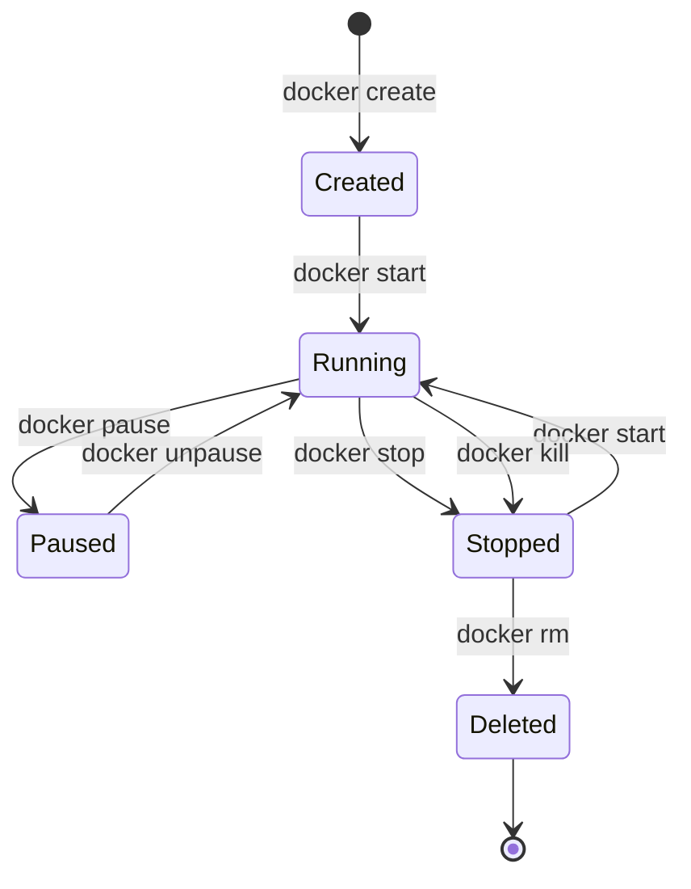

Now that you understand images, it's time to work with containers. In this article, we'll cover all the essential operations for running and managing Docker containers.

## Running Your First Container

The `docker run` command creates and starts a new container from an image:

```bash
# Basic syntax
docker run [OPTIONS] IMAGE [COMMAND] [ARG...]

# Run nginx
docker run nginx

# Run with a custom command
docker run alpine echo "Hello, Docker!"
```

### Common Run Options

| Option | Description | Example |
|--------|-------------|---------|
| `-d` | Run in detached mode (background) | `docker run -d nginx` |
| `-p` | Map ports (host:container) | `docker run -p 8080:80 nginx` |
| `--name` | Assign a name | `docker run --name web nginx` |
| `-e` | Set environment variables | `docker run -e DEBUG=true app` |
| `-v` | Mount volumes | `docker run -v /data:/app/data app` |
| `--rm` | Remove container when it exits | `docker run --rm alpine echo "hi"` |
| `-it` | Interactive with TTY | `docker run -it alpine sh` |

### Practical Examples

```bash
# Run a web server in the background, accessible on port 8080
docker run -d -p 8080:80 --name my-nginx nginx

# Run an interactive shell
docker run -it --name my-alpine alpine sh

# Run with environment variables
docker run -d -e MYSQL_ROOT_PASSWORD=secret --name my-mysql mysql:8

# Run with automatic cleanup
docker run --rm alpine cat /etc/os-release
```

## Container Lifecycle

Understanding the container lifecycle is essential for effective management:



### Lifecycle Commands

```bash
# Create without starting
docker create --name my-container nginx

# Start a created or stopped container
docker start my-container

# Stop a running container (graceful)
docker stop my-container

# Kill a container (immediate)
docker kill my-container

# Restart a container
docker restart my-container

# Pause/unpause
docker pause my-container
docker unpause my-container

# Remove a stopped container
docker rm my-container

# Force remove a running container
docker rm -f my-container
```

## Listing Containers

### View Running Containers

```bash
# List running containers
docker ps

# Output:
CONTAINER ID   IMAGE   COMMAND                  CREATED          STATUS          PORTS                  NAMES
abc123def456   nginx   "/docker-entrypoint.…"   10 minutes ago   Up 10 minutes   0.0.0.0:8080->80/tcp   my-nginx
```

### View All Containers

```bash
# List all containers (including stopped)
docker ps -a

# Show only container IDs
docker ps -q

# Show latest created container
docker ps -l

# Filter containers
docker ps -f "status=exited"
docker ps -f "name=my-"

# Custom format output
docker ps --format "table {{.Names}}\t{{.Status}}\t{{.Ports}}"
```

### Understanding Status

| Status | Description |
|--------|-------------|
| `Created` | Container created but never started |
| `Up X minutes` | Container is running |
| `Exited (0)` | Container stopped successfully |
| `Exited (1)` | Container stopped with error |
| `Paused` | Container is paused |
| `Restarting` | Container is restarting |

## Container Logs

Logs are essential for debugging and monitoring:

```bash
# View all logs
docker logs my-nginx

# Follow logs in real-time
docker logs -f my-nginx

# Show last N lines
docker logs --tail 100 my-nginx

# Show logs with timestamps
docker logs -t my-nginx

# Show logs since a specific time
docker logs --since 2025-01-18T10:00:00 my-nginx
docker logs --since 30m my-nginx

# Combine options
docker logs -f --tail 50 -t my-nginx
```

### Logging Drivers

Docker supports different logging drivers:

```bash
# Run with a specific logging driver
docker run -d --log-driver json-file --log-opt max-size=10m nginx

# Check the logging driver
docker inspect --format='{{.HostConfig.LogConfig.Type}}' my-nginx
```

| Driver | Description |
|--------|-------------|
| `json-file` | Default, stores logs as JSON |
| `syslog` | Writes to syslog |
| `journald` | Writes to systemd journal |
| `fluentd` | Sends to Fluentd |
| `awslogs` | Sends to AWS CloudWatch |
| `none` | Disables logging |

## Executing Commands in Containers

The `docker exec` command runs commands in a running container:

```bash
# Execute a single command
docker exec my-nginx cat /etc/nginx/nginx.conf

# Start an interactive shell
docker exec -it my-nginx bash
docker exec -it my-nginx sh  # For Alpine-based images

# Execute as a specific user
docker exec -u root my-nginx whoami

# Set environment variables for the command
docker exec -e MY_VAR=value my-nginx env

# Set working directory
docker exec -w /var/log my-nginx ls
```

### Common Use Cases

```bash
# Check process list
docker exec my-nginx ps aux

# View environment variables
docker exec my-nginx env

# Debug network issues
docker exec my-nginx curl localhost

# Access database CLI
docker exec -it my-mysql mysql -u root -p

# Install debugging tools (temporary)
docker exec my-nginx apt-get update && apt-get install -y curl
```

## Inspecting Containers

Get detailed information about containers:

```bash
# Full inspection (JSON output)
docker inspect my-nginx

# Get specific fields
docker inspect --format='{{.State.Status}}' my-nginx
docker inspect --format='{{.NetworkSettings.IPAddress}}' my-nginx
docker inspect --format='{{range .NetworkSettings.Networks}}{{.IPAddress}}{{end}}' my-nginx

# Get environment variables
docker inspect --format='{{json .Config.Env}}' my-nginx | jq

# Get mounted volumes
docker inspect --format='{{json .Mounts}}' my-nginx | jq
```

### Useful Inspect Queries

| Query | Output |
|-------|--------|
| `{{.State.Status}}` | Running status |
| `{{.State.StartedAt}}` | Start time |
| `{{.NetworkSettings.IPAddress}}` | Container IP |
| `{{.Config.Env}}` | Environment variables |
| `{{.HostConfig.Memory}}` | Memory limit |
| `{{.Mounts}}` | Volume mounts |

## Viewing Container Processes

```bash
# View processes inside a container
docker top my-nginx

# Output:
UID    PID    PPID   C   STIME   TTY   TIME      CMD
root   1234   1233   0   10:00   ?     00:00:00  nginx: master process
nginx  1235   1234   0   10:00   ?     00:00:00  nginx: worker process
```

## Resource Usage Statistics

```bash
# View real-time resource usage
docker stats

# View stats for specific containers
docker stats my-nginx my-mysql

# View stats without streaming
docker stats --no-stream

# Custom format
docker stats --format "table {{.Name}}\t{{.CPUPerc}}\t{{.MemUsage}}"
```

```
CONTAINER ID   NAME       CPU %     MEM USAGE / LIMIT     MEM %     NET I/O          BLOCK I/O
abc123def456   my-nginx   0.00%     2.5MiB / 7.77GiB      0.03%     1.2kB / 1.1kB    0B / 0B
```

## Copying Files

Copy files between containers and the host:

```bash
# Copy from container to host
docker cp my-nginx:/etc/nginx/nginx.conf ./nginx.conf

# Copy from host to container
docker cp ./custom.conf my-nginx:/etc/nginx/conf.d/

# Copy entire directories
docker cp my-nginx:/var/log/nginx/ ./logs/

# Copy to/from stopped containers (works too!)
docker cp stopped-container:/data ./backup/
```

## Container Restart Policies

Configure automatic restart behavior:

```bash
# Always restart
docker run -d --restart always nginx

# Restart on failure only
docker run -d --restart on-failure nginx

# Restart on failure with max attempts
docker run -d --restart on-failure:5 nginx

# Restart unless manually stopped
docker run -d --restart unless-stopped nginx
```

| Policy | Description |
|--------|-------------|
| `no` | Never restart (default) |
| `always` | Always restart |
| `on-failure` | Restart only on non-zero exit |
| `on-failure:N` | Restart on failure, max N times |
| `unless-stopped` | Like always, but respects manual stops |

### Update Restart Policy

```bash
# Update policy for existing container
docker update --restart unless-stopped my-nginx
```

## Attaching to Containers

```bash
# Attach to a running container's main process
docker attach my-nginx

# Detach without stopping: Ctrl+P, Ctrl+Q
```

**Note**: `attach` connects to the main process (PID 1). Use `exec` for a new shell.

## Renaming Containers

```bash
docker rename old-name new-name
```

## Bulk Operations

```bash
# Stop all running containers
docker stop $(docker ps -q)

# Remove all stopped containers
docker rm $(docker ps -aq -f "status=exited")

# Remove all containers (careful!)
docker rm -f $(docker ps -aq)

# System prune (remove unused data)
docker system prune

# Remove everything unused
docker system prune -a --volumes
```

## Debugging with Docker Debug

For minimal images without shells:

```bash
# Start a debug session (Docker Desktop feature)
docker debug my-nginx

# Or use a debug container
docker run -it --rm --pid=container:my-nginx \
  --net=container:my-nginx \
  nicolaka/netshoot
```

## Best Practices

### 1. Always Name Your Containers

```bash
# Good
docker run -d --name redis-cache redis

# Avoid auto-generated names
docker run -d redis  # Gets random name like "eager_pike"
```

### 2. Use Restart Policies in Production

```bash
docker run -d --restart unless-stopped --name web nginx
```

### 3. Set Resource Limits

```bash
docker run -d \
  --memory=512m \
  --cpus=0.5 \
  --name limited-app \
  myapp
```

### 4. Clean Up Regularly

```bash
# Remove exited containers
docker container prune

# Remove with confirmation
docker container prune -f
```

## Quick Reference Table

| Operation | Command |
|-----------|---------|
| Run container | `docker run -d --name NAME IMAGE` |
| List running | `docker ps` |
| List all | `docker ps -a` |
| Stop container | `docker stop NAME` |
| Start container | `docker start NAME` |
| Restart | `docker restart NAME` |
| View logs | `docker logs -f NAME` |
| Execute command | `docker exec -it NAME sh` |
| Inspect | `docker inspect NAME` |
| View stats | `docker stats NAME` |
| Copy files | `docker cp NAME:/path ./local` |
| Remove | `docker rm NAME` |

## Key Takeaways

1. **`-d` for background** - Run containers detached for services
2. **`-it` for interactive** - Use for shells and debugging
3. **`--rm` for temporary** - Auto-cleanup for one-off commands
4. **Use `exec`, not `attach`** - `exec` starts a new process, `attach` connects to PID 1
5. **Set restart policies** - Ensure services recover from failures
6. **Monitor with logs and stats** - Essential for debugging and performance

## Next Steps

In the next article, we'll learn how to create custom images using Dockerfiles - defining your own containers from scratch.

## References

- Docker Deep Dive, 5th Edition - Nigel Poulton
- The Ultimate Docker Container Book, 3rd Edition - Dr. Gabriel N. Schenker
- [Docker CLI Reference](https://docs.docker.com/engine/reference/commandline/docker/)
