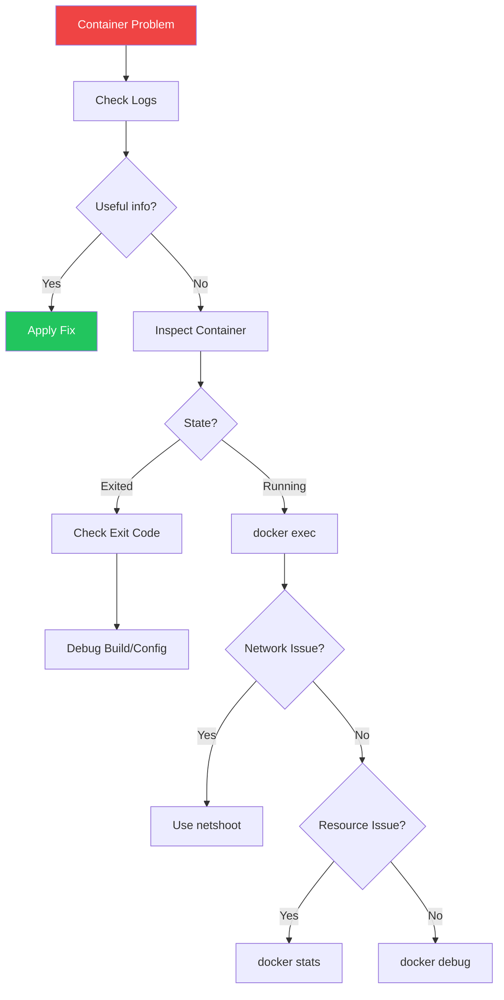

When containers misbehave, knowing how to debug them is essential. This article covers techniques for diagnosing and fixing common Docker issues.

## Container Logs

Logs are your first line of defense in debugging.

### Basic Log Commands

```bash
# View all logs
docker logs container_name

# Follow logs in real-time
docker logs -f container_name

# Show last N lines
docker logs --tail 100 container_name

# Show logs with timestamps
docker logs -t container_name

# Show logs since a specific time
docker logs --since "2025-01-18T10:00:00" container_name
docker logs --since 30m container_name  # Last 30 minutes

# Show logs until a specific time
docker logs --until "2025-01-18T11:00:00" container_name
```

### Docker Compose Logs

```bash
# All services
docker compose logs

# Specific service
docker compose logs api

# Follow with tail
docker compose logs -f --tail 50 api db
```

### Log Drivers

```bash
# Check log driver
docker inspect --format='{{.HostConfig.LogConfig.Type}}' container_name

# Run with specific driver
docker run -d \
  --log-driver json-file \
  --log-opt max-size=10m \
  --log-opt max-file=3 \
  nginx
```

## Executing Commands in Containers

### docker exec

```bash
# Interactive shell
docker exec -it container_name bash
docker exec -it container_name sh  # For Alpine

# Run a single command
docker exec container_name cat /etc/hosts

# Run as different user
docker exec -u root container_name whoami

# With environment variables
docker exec -e DEBUG=true container_name env
```

### Useful Debug Commands

```bash
# Check process list
docker exec container_name ps aux

# View environment
docker exec container_name env

# Check disk usage
docker exec container_name df -h

# View network config
docker exec container_name ip addr
docker exec container_name cat /etc/resolv.conf

# Test connectivity
docker exec container_name ping -c 3 other_container
docker exec container_name curl -v http://api:3000/health
```

## Inspecting Containers

### docker inspect

```bash
# Full container details
docker inspect container_name

# Get specific fields
docker inspect --format='{{.State.Status}}' container_name
docker inspect --format='{{.State.ExitCode}}' container_name
docker inspect --format='{{.NetworkSettings.IPAddress}}' container_name
docker inspect --format='{{json .Config.Env}}' container_name | jq
docker inspect --format='{{json .Mounts}}' container_name | jq
```

### Container State

```bash
# Check why container stopped
docker inspect --format='{{.State.Status}}' container_name
docker inspect --format='{{.State.ExitCode}}' container_name
docker inspect --format='{{.State.Error}}' container_name
docker inspect --format='{{.State.OOMKilled}}' container_name
```

| Exit Code | Meaning |
|-----------|---------|
| 0 | Success |
| 1 | General error |
| 126 | Command not executable |
| 127 | Command not found |
| 137 | Killed (OOM or SIGKILL) |
| 139 | Segmentation fault |
| 143 | Terminated (SIGTERM) |

## Network Troubleshooting

### Using nicolaka/netshoot

The netshoot container is invaluable for network debugging:

```bash
# Debug in same network namespace
docker run -it --rm \
  --network container:target_container \
  nicolaka/netshoot

# Inside netshoot:
ip addr
ping other_container
nslookup api
curl http://api:3000/health
tcpdump -i eth0
traceroute google.com
```

### Common Network Issues

```bash
# Check network connectivity
docker exec container_name ping -c 3 db

# DNS resolution
docker exec container_name nslookup api
docker exec container_name cat /etc/resolv.conf

# Port listening
docker exec container_name netstat -tlnp
docker exec container_name ss -tlnp

# Check published ports
docker port container_name
```

### Network Inspection

```bash
# List networks
docker network ls

# Inspect network
docker network inspect bridge

# Find container IPs on network
docker network inspect mynetwork -f '{{range .Containers}}{{.Name}}: {{.IPv4Address}}{{"\n"}}{{end}}'
```

## Debugging Build Issues

### Build with Verbose Output

```bash
# Standard build
docker build -t myapp .

# With progress output
docker build --progress=plain -t myapp .

# Without cache
docker build --no-cache -t myapp .

# Stop at specific stage
docker build --target builder -t myapp:builder .
```

### Debug Failed Builds

```bash
# Build and keep intermediate containers
docker build -t myapp . 2>&1 | tee build.log

# Run the last successful layer
docker run -it <last-successful-image-id> sh
```

### BuildKit Debugging

```bash
# Enable BuildKit debug
BUILDKIT_PROGRESS=plain docker build -t myapp .

# Export build cache for inspection
docker build --build-arg BUILDKIT_INLINE_CACHE=1 -t myapp .
```

## Docker Debug (Docker Desktop)

Docker Desktop includes a built-in debug feature:

```bash
# Start debug session
docker debug container_name

# Debug with specific shell
docker debug --shell bash container_name

# Debug stopped container
docker debug --init container_name
```

## Debugging Slim/Distroless Images

For minimal images without shells:

```bash
# Copy tools in temporarily
docker cp /usr/local/bin/curl container_name:/tmp/

# Use debug container
docker run -it --rm \
  --pid=container:target \
  --net=container:target \
  busybox

# Docker debug for slim images
docker debug target_container
```

## Resource Issues

### Memory Problems

```bash
# Check memory usage
docker stats container_name

# Check if OOM killed
docker inspect --format='{{.State.OOMKilled}}' container_name

# View container events
docker events --filter container=container_name
```

### CPU Issues

```bash
# Real-time stats
docker stats --format "table {{.Name}}\t{{.CPUPerc}}\t{{.MemUsage}}"

# Check CPU limits
docker inspect --format='{{.HostConfig.NanoCpus}}' container_name
```

## Common Problems and Solutions

### Container Exits Immediately

```bash
# Check exit code
docker inspect --format='{{.State.ExitCode}}' container_name

# Check logs
docker logs container_name

# Common causes:
# - Missing CMD/ENTRYPOINT
# - App crashes on startup
# - Configuration errors

# Run interactively to debug
docker run -it --rm myimage sh
```

### Cannot Connect to Container

```bash
# Check if container is running
docker ps -a

# Check port mapping
docker port container_name

# Check network
docker network inspect bridge

# Test from another container
docker run --rm --network mynetwork alpine ping target_container
```

### Container is Slow

```bash
# Check resource usage
docker stats container_name

# Check disk I/O
docker exec container_name iostat

# Check for CPU throttling
cat /sys/fs/cgroup/cpu/docker/<container-id>/cpu.stat
```

### Volume Permission Issues

```bash
# Check file ownership
docker exec container_name ls -la /data

# Check running user
docker exec container_name id

# Fix permissions
docker exec -u root container_name chown -R 1000:1000 /data
```

## Debugging Workflow



## Debug Checklist

| Step | Command |
|------|---------|
| 1. Check status | `docker ps -a` |
| 2. View logs | `docker logs -f container` |
| 3. Check exit code | `docker inspect --format='{{.State.ExitCode}}'` |
| 4. Interactive shell | `docker exec -it container sh` |
| 5. Check resources | `docker stats` |
| 6. Network debug | `docker run --network container:X netshoot` |
| 7. Inspect details | `docker inspect container` |

## Key Takeaways

1. **Start with logs** - Most issues are visible in logs
2. **Use docker exec** - Interactive debugging in running containers
3. **Know exit codes** - They tell you what went wrong
4. **netshoot for networking** - Essential for network debugging
5. **docker debug for slim images** - When there's no shell
6. **Check resources** - Memory and CPU issues are common

## Next Steps

In the next article, we'll cover Docker monitoring and logging for production environments.

## References

- Docker Deep Dive, 5th Edition - Nigel Poulton
- [Docker Debugging Documentation](https://docs.docker.com/engine/reference/commandline/debug/)
