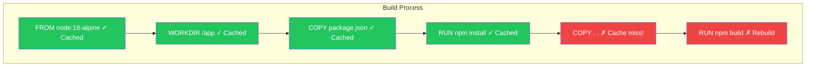

Building efficient Docker images is crucial for fast deployments, reduced storage costs, and improved security. This article covers optimization techniques beyond multi-stage builds.

## Why Optimize Docker Images?

| Benefit | Impact |
|---------|--------|
| Faster builds | Better developer experience |
| Faster pulls | Quicker deployments |
| Reduced storage | Lower cloud costs |
| Smaller attack surface | Better security |
| Less bandwidth | Faster CI/CD |

## Layer Caching Strategy

Docker caches each layer. Understanding this is key to fast builds.

### How Caching Works



**Rule:** When a layer changes, all subsequent layers are rebuilt.

### Optimizing Layer Order

```dockerfile
# BAD - any source change rebuilds dependencies
FROM node:18-alpine
WORKDIR /app
COPY . .
RUN npm install
RUN npm run build

# GOOD - dependencies cached unless package.json changes
FROM node:18-alpine
WORKDIR /app
COPY package*.json ./
RUN npm install
COPY . .
RUN npm run build
```

### Separate Runtime and Dev Dependencies

```dockerfile
# Install all deps for build
FROM node:18-alpine AS builder
WORKDIR /app
COPY package*.json ./
RUN npm ci
COPY . .
RUN npm run build

# Install only production deps
FROM node:18-alpine AS production
WORKDIR /app
COPY package*.json ./
RUN npm ci --only=production
COPY --from=builder /app/dist ./dist
```

## .dockerignore

The `.dockerignore` file excludes files from the build context, making builds faster and images smaller.

### Essential .dockerignore

```
# Dependencies (installed in container)
node_modules
vendor/
venv/

# Build outputs (recreated in container)
dist/
build/
*.pyc
__pycache__

# Development files
.git
.gitignore
.env
.env.*
*.md
README*
LICENSE

# IDE and editor files
.idea/
.vscode/
*.swp
*.swo

# Test and coverage
coverage/
.nyc_output/
*.test.js
*.spec.js

# Docker files (not needed in image)
Dockerfile*
docker-compose*
.dockerignore

# CI/CD
.github/
.gitlab-ci.yml
Jenkinsfile

# Logs
*.log
npm-debug.log
```

### Impact of .dockerignore

```bash
# Without .dockerignore
$ docker build -t myapp .
Sending build context to Docker daemon  500MB

# With .dockerignore
$ docker build -t myapp .
Sending build context to Docker daemon  5MB
```

## Choosing Base Images

### Alpine vs Debian/Ubuntu

| Aspect | Alpine | Debian/Ubuntu |
|--------|--------|---------------|
| Size | ~5MB | ~100-200MB |
| Package manager | apk | apt |
| C library | musl | glibc |
| Compatibility | May have issues | Most compatible |
| Security updates | Fast | Regular |

```dockerfile
# Debian-based (larger but compatible)
FROM node:18
# ~1GB

# Alpine-based (smaller)
FROM node:18-alpine
# ~150MB

# Distroless (minimal)
FROM gcr.io/distroless/nodejs18
# ~100MB

# Scratch (empty, for static binaries)
FROM scratch
# 0MB base
```

### When to Use Each

| Use Case | Recommended Base |
|----------|------------------|
| General applications | Alpine variants |
| Python with C extensions | Slim (Debian-based) |
| Static Go/Rust binaries | Scratch or distroless |
| Maximum compatibility | Standard Debian/Ubuntu |
| Maximum security | Distroless |

## Reducing Layer Size

### Combine RUN Commands

```dockerfile
# BAD - 3 layers, cache not cleaned
RUN apt-get update
RUN apt-get install -y curl wget
RUN rm -rf /var/lib/apt/lists/*

# GOOD - 1 layer, cache cleaned
RUN apt-get update && \
    apt-get install -y --no-install-recommends \
        curl \
        wget && \
    rm -rf /var/lib/apt/lists/*
```

### Use --no-install-recommends

```dockerfile
# Installs recommended packages too (~50% more)
RUN apt-get install -y python3

# Installs only what's needed
RUN apt-get install -y --no-install-recommends python3
```

### Clean Up in Same Layer

```dockerfile
# BAD - cleanup creates new layer, doesn't reduce size
RUN apt-get update && apt-get install -y build-essential
RUN rm -rf /var/lib/apt/lists/*

# GOOD - cleanup in same layer reduces size
RUN apt-get update && \
    apt-get install -y --no-install-recommends build-essential && \
    rm -rf /var/lib/apt/lists/*
```

## Language-Specific Optimizations

### Node.js

```dockerfile
FROM node:18-alpine

# Use npm ci instead of npm install (faster, reproducible)
COPY package*.json ./
RUN npm ci --only=production

# Don't copy package-lock.json to final image if not needed
COPY --from=builder /app/dist ./dist
```

### Python

```dockerfile
FROM python:3.11-slim

# Prevent .pyc files and enable unbuffered output
ENV PYTHONDONTWRITEBYTECODE=1
ENV PYTHONUNBUFFERED=1

# Use pip with no cache
RUN pip install --no-cache-dir -r requirements.txt

# Or use wheels for faster installs
COPY --from=builder /wheels /wheels
RUN pip install --no-cache-dir /wheels/*
```

### Go

```dockerfile
FROM golang:1.21-alpine AS builder

# Disable CGO for static binary
ENV CGO_ENABLED=0

# Build with optimizations
RUN go build -ldflags="-w -s" -o /app/main .

# Use scratch for minimal image
FROM scratch
COPY --from=builder /app/main /main
```

### Java

```dockerfile
# Use JRE, not JDK for runtime
FROM eclipse-temurin:17-jre-alpine

# Use jlink to create custom minimal JRE (advanced)
FROM eclipse-temurin:17-jdk-alpine AS builder
RUN jlink --add-modules java.base,java.logging \
    --strip-debug --no-man-pages --no-header-files \
    --compress=2 --output /javaruntime

FROM alpine:3.19
COPY --from=builder /javaruntime /opt/java
```

## Build Arguments for Flexibility

```dockerfile
ARG BASE_IMAGE=node:18-alpine
FROM ${BASE_IMAGE}

ARG NODE_ENV=production
ENV NODE_ENV=${NODE_ENV}

# Conditional installs based on build arg
ARG INSTALL_DEV_DEPS=false
RUN if [ "$INSTALL_DEV_DEPS" = "true" ]; then \
        npm install; \
    else \
        npm ci --only=production; \
    fi
```

```bash
# Production build
docker build -t myapp:prod .

# Development build
docker build --build-arg INSTALL_DEV_DEPS=true -t myapp:dev .
```

## Image Scanning and Analysis

### Docker Scout

```bash
# Scan for vulnerabilities
docker scout cves myimage:latest

# Quick overview
docker scout quickview myimage:latest

# Recommendations
docker scout recommendations myimage:latest
```

### Dive - Explore Layers

```bash
# Install dive
brew install dive

# Analyze image layers
dive myimage:latest
```

Dive shows:
- Each layer's size and contents
- Wasted space from deleted files
- Optimization suggestions

### Trivy

```bash
# Scan for vulnerabilities
trivy image myimage:latest

# Scan with severity filter
trivy image --severity HIGH,CRITICAL myimage:latest
```

## BuildKit Features

Enable BuildKit for faster builds:

```bash
# Enable BuildKit
export DOCKER_BUILDKIT=1

# Or in docker-compose
COMPOSE_DOCKER_CLI_BUILD=1 DOCKER_BUILDKIT=1 docker-compose build
```

### Cache Mounts

```dockerfile
# syntax=docker/dockerfile:1.4
FROM node:18-alpine

# Cache npm packages across builds
RUN --mount=type=cache,target=/root/.npm \
    npm ci --only=production

# Cache apt packages
RUN --mount=type=cache,target=/var/cache/apt \
    apt-get update && apt-get install -y curl
```

### Secret Mounts

```dockerfile
# syntax=docker/dockerfile:1.4
FROM node:18-alpine

# Use secret without leaving it in image
RUN --mount=type=secret,id=npmrc,target=/root/.npmrc \
    npm install
```

```bash
docker build --secret id=npmrc,src=.npmrc -t myapp .
```

## Optimization Checklist

| Category | Check |
|----------|-------|
| Base image | Using minimal base (alpine/distroless)? |
| .dockerignore | Excluding node_modules, .git, etc.? |
| Layer order | Dependencies before source code? |
| RUN commands | Combined and cleaned up? |
| Multi-stage | Build tools excluded from final image? |
| Dependencies | Production only in final image? |
| User | Running as non-root? |
| Scanning | No critical vulnerabilities? |

## Size Comparison Example

```dockerfile
# Unoptimized: ~1.5GB
FROM node:18
COPY . .
RUN npm install
CMD ["node", "server.js"]

# Optimized: ~150MB
FROM node:18-alpine AS builder
WORKDIR /app
COPY package*.json ./
RUN npm ci
COPY . .
RUN npm run build

FROM node:18-alpine
WORKDIR /app
COPY --from=builder /app/dist ./dist
COPY --from=builder /app/node_modules ./node_modules
USER node
CMD ["node", "dist/server.js"]
```

**Result: 90% size reduction!**

## Key Takeaways

1. **Layer order matters** - Put rarely changing instructions first
2. **Use .dockerignore** - Smaller context = faster builds
3. **Choose appropriate base images** - Alpine for most, distroless for security
4. **Combine and clean RUN commands** - Reduce layer count and size
5. **Use BuildKit** - Modern features for caching and secrets
6. **Scan regularly** - Find and fix vulnerabilities

## Next Steps

In the next article, we'll cover Docker security best practices for production environments.

## References

- Docker Deep Dive, 5th Edition - Nigel Poulton
- Docker in Action, 2nd Edition - Jeffrey Nickoloff
- [Best practices for writing Dockerfiles](https://docs.docker.com/develop/develop-images/dockerfile_best-practices/)
