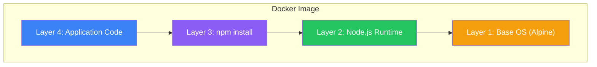

Docker images are the foundation of containerization. In this article, we'll explore what images are, how they work under the hood, and best practices for managing them.

## What is a Docker Image?

A Docker image is a read-only package containing everything needed to run an application:

- Application code and binaries
- Runtime environment (Node.js, Python, Java, etc.)
- System libraries and dependencies
- Environment variables and configuration
- Metadata (commands to run, exposed ports, etc.)

Think of an image as a stopped container. When you start a container, Docker takes the image and adds a writable layer on top.

## The Layered Filesystem

One of Docker's most powerful features is its layered architecture. Every image is composed of multiple stacked layers:



### How Layers Work

Each layer represents a set of filesystem changes:

| Dockerfile Instruction | Creates Layer? | Description |
|----------------------|----------------|-------------|
| `FROM` | Yes | Base image layer |
| `RUN` | Yes | Executes commands, captures changes |
| `COPY`/`ADD` | Yes | Adds files to the image |
| `ENV` | No | Sets environment variables (metadata) |
| `EXPOSE` | No | Documents ports (metadata) |
| `CMD`/`ENTRYPOINT` | No | Sets default command (metadata) |

### Layer Sharing

Layers are shared between images, saving disk space and download time:

```bash
# Both images share the same base layers
docker pull node:18-alpine    # Downloads Alpine + Node.js layers
docker pull node:20-alpine    # Reuses Alpine layer, downloads only Node.js 20
```

```
Image A (node:18-alpine)    Image B (node:20-alpine)
┌─────────────────────┐    ┌─────────────────────┐
│ Node.js 18 (unique) │    │ Node.js 20 (unique) │
├─────────────────────┤    ├─────────────────────┤
│                     │    │                     │
│   Alpine (shared)   │◄───│   Alpine (shared)   │
│                     │    │                     │
└─────────────────────┘    └─────────────────────┘
```

## Pulling Images

### Basic Pull Command

```bash
# Pull the latest nginx image
docker pull nginx

# Pull a specific version
docker pull nginx:1.25

# Pull from a specific registry
docker pull gcr.io/google-containers/nginx:latest
```

### Pull Output Explained

```bash
$ docker pull redis:7
7: Pulling from library/redis
a2abf6c4d29d: Pull complete     # Layer 1
c7a4e4382001: Pull complete     # Layer 2
4044b9ba67c9: Pull complete     # Layer 3
...
Digest: sha256:e50c7e23f79...   # Unique content hash
Status: Downloaded newer image for redis:7
```

Each line represents a layer being downloaded. If a layer already exists locally, it shows "Already exists" instead of downloading again.

## Image Naming and Tagging

Understanding image naming is crucial for working with Docker effectively.

### Image Name Structure

```
[registry/][repository/]name[:tag][@digest]
```

| Component | Example | Description |
|-----------|---------|-------------|
| Registry | `docker.io`, `gcr.io` | Where the image is stored |
| Repository | `library`, `myorg` | Namespace/organization |
| Name | `nginx`, `redis` | Image name |
| Tag | `latest`, `1.25`, `alpine` | Version identifier |
| Digest | `sha256:abc123...` | Immutable content hash |

### Examples

```bash
# Official image (Docker Hub)
nginx:latest
# Equivalent to: docker.io/library/nginx:latest

# User/organization image
mycompany/myapp:v1.2.3

# Private registry
gcr.io/my-project/myapp:latest

# With digest (immutable reference)
nginx@sha256:e50c7e23f79...
```

### Tagging Best Practices

| Pattern | Example | Use Case |
|---------|---------|----------|
| Semantic versioning | `v1.2.3` | Production releases |
| Git SHA | `abc1234` | CI/CD builds |
| Date-based | `2025-01-18` | Nightly builds |
| Environment | `staging`, `prod` | Deployment targets |

```bash
# Tag an existing image
docker tag myapp:latest myapp:v1.0.0
docker tag myapp:latest myregistry.com/myapp:v1.0.0
```

## Working with Registries

### Docker Hub

Docker Hub is the default public registry:

```bash
# Login to Docker Hub
docker login

# Push an image
docker push username/myapp:v1.0.0

# Pull an image
docker pull username/myapp:v1.0.0
```

### Private Registries

```bash
# Amazon ECR
aws ecr get-login-password | docker login --username AWS --password-stdin 123456789.dkr.ecr.us-east-1.amazonaws.com

# Google Container Registry
gcloud auth configure-docker
docker push gcr.io/my-project/myapp:latest

# Azure Container Registry
az acr login --name myregistry
docker push myregistry.azurecr.io/myapp:latest
```

### Registry Comparison

| Registry | Best For | Features |
|----------|----------|----------|
| Docker Hub | Public images, small teams | Free public repos, automated builds |
| Amazon ECR | AWS deployments | IAM integration, vulnerability scanning |
| Google GCR | GCP deployments | Artifact Registry, Cloud Build integration |
| Azure ACR | Azure deployments | AAD integration, geo-replication |
| GitHub GHCR | Open source projects | GitHub Actions integration |

## Listing and Inspecting Images

### List Local Images

```bash
# List all images
docker images

# Output:
REPOSITORY    TAG       IMAGE ID       CREATED        SIZE
nginx         latest    a6bd71f48f68   2 days ago     187MB
redis         7         e50c7e23f79d   1 week ago     138MB
node          18        8f3d3c9c2d21   2 weeks ago    1.1GB

# Filter images
docker images nginx
docker images --filter "dangling=true"

# Show image sizes
docker images --format "{{.Repository}}:{{.Tag}} - {{.Size}}"
```

### Inspect Image Details

```bash
# Get detailed information
docker inspect nginx:latest

# Get specific fields
docker inspect --format='{{.Config.Env}}' nginx:latest
docker inspect --format='{{.Config.ExposedPorts}}' nginx:latest

# View layer history
docker history nginx:latest
```

```bash
$ docker history nginx:latest
IMAGE          CREATED       CREATED BY                                      SIZE
a6bd71f48f68   2 days ago    CMD ["nginx" "-g" "daemon off;"]               0B
<missing>      2 days ago    EXPOSE map[80/tcp:{}]                          0B
<missing>      2 days ago    STOPSIGNAL SIGQUIT                             0B
<missing>      2 days ago    RUN /bin/sh -c set -x ...                      62MB
...
```

## Pulling by Digest

Tags are mutable - the same tag can point to different images over time. For immutable references, use digests:

```bash
# Get the digest
docker inspect --format='{{index .RepoDigests 0}}' nginx:latest
# Output: nginx@sha256:e50c7e23f79d6...

# Pull by digest (always gets the exact same image)
docker pull nginx@sha256:e50c7e23f79d6...
```

### When to Use Digests

| Scenario | Use Tag | Use Digest |
|----------|---------|------------|
| Development | ✅ | |
| CI/CD pipelines | | ✅ |
| Production deployments | | ✅ |
| Documentation/tutorials | ✅ | |

## Multi-Architecture Images

Modern images support multiple CPU architectures through manifests:

```bash
# View supported architectures
docker manifest inspect nginx:latest
```

```json
{
  "manifests": [
    {
      "platform": { "architecture": "amd64", "os": "linux" }
    },
    {
      "platform": { "architecture": "arm64", "os": "linux" }
    },
    {
      "platform": { "architecture": "arm", "os": "linux", "variant": "v7" }
    }
  ]
}
```

Docker automatically pulls the correct architecture for your system.

## Removing Images

```bash
# Remove a specific image
docker rmi nginx:latest

# Remove by image ID
docker rmi a6bd71f48f68

# Force remove (even if containers exist)
docker rmi -f nginx:latest

# Remove all unused images
docker image prune

# Remove all images (careful!)
docker rmi $(docker images -q)
```

### Dangling Images

Dangling images are layers with no tags, often created during builds:

```bash
# List dangling images
docker images --filter "dangling=true"

# Remove dangling images
docker image prune

# Remove all unused images (not just dangling)
docker image prune -a
```

## Image Best Practices

### 1. Use Specific Tags

```bash
# Bad - unpredictable
FROM node:latest

# Good - reproducible
FROM node:18.19.0-alpine
```

### 2. Prefer Alpine-Based Images

```bash
# Regular image (~1GB)
FROM node:18

# Alpine variant (~150MB)
FROM node:18-alpine
```

### 3. Scan for Vulnerabilities

```bash
# Using Docker Scout
docker scout cves nginx:latest

# Using Trivy
trivy image nginx:latest
```

### 4. Use .dockerignore

```
# .dockerignore
node_modules
.git
*.md
Dockerfile
.dockerignore
```

## Summary Table

| Concept | Description |
|---------|-------------|
| Image | Read-only template for creating containers |
| Layer | Single filesystem change in an image |
| Tag | Human-readable version identifier |
| Digest | Immutable content-based identifier |
| Registry | Service for storing and distributing images |
| Manifest | Metadata describing image layers and platforms |

## Key Commands Reference

```bash
# Pull and push
docker pull image:tag
docker push image:tag

# List and inspect
docker images
docker inspect image:tag
docker history image:tag

# Tag and remove
docker tag source:tag target:tag
docker rmi image:tag
docker image prune
```

## Key Takeaways

1. **Images are layered** - Each instruction creates a cacheable layer
2. **Layers are shared** - Multiple images can share base layers
3. **Tags are mutable** - Use digests for immutable references
4. **Choose the right base image** - Alpine images are smaller but may need extra work
5. **Clean up regularly** - Unused images consume disk space

## Next Steps

In the next article, we'll learn Docker container operations - running, stopping, inspecting, and managing containers effectively.

## References

- Docker Deep Dive, 5th Edition - Nigel Poulton
- Docker: Up & Running, 3rd Edition - Sean P. Kane & Karl Matthias
- [Docker Official Documentation - Images](https://docs.docker.com/engine/reference/commandline/images/)
