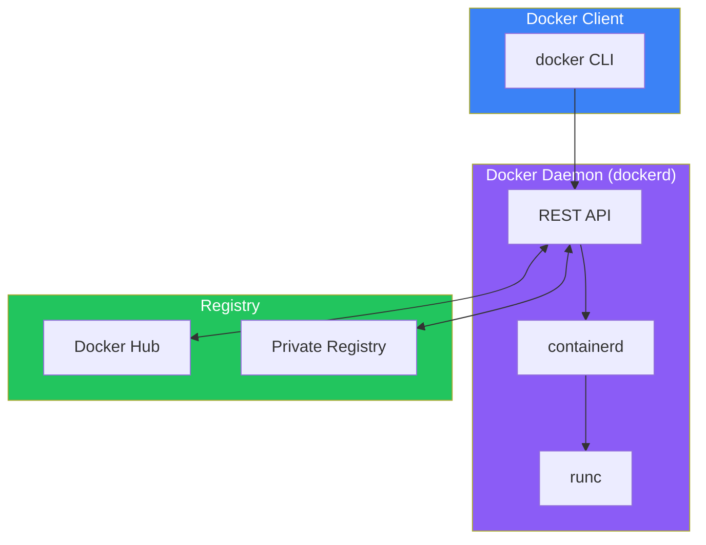
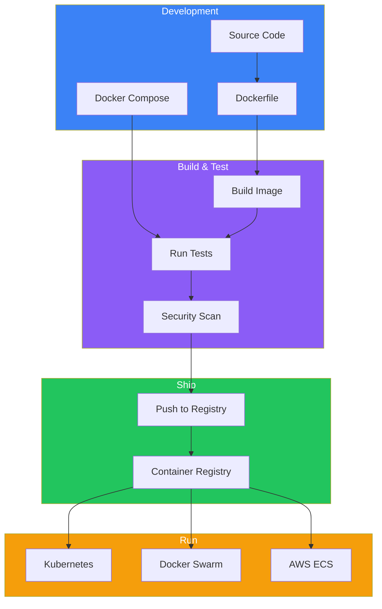

Containers have revolutionized how we build, ship, and run applications. In this article, we'll explore what containers are, why they matter, and how Docker became the de facto standard for containerization.

## The Problem: Traditional Server Utilization

Before containers, running applications meant dealing with significant infrastructure challenges:

### One Application Per Server

In the past, businesses followed a simple but wasteful pattern:
1. New application needed → Buy a new server
2. Estimate performance requirements (usually overestimated)
3. Result: Servers running at 5-10% capacity

This approach led to massive waste in data centers - unused CPU, memory, and storage sitting idle while costing money in power, cooling, and maintenance.

### The Rise of Virtual Machines

VMware and hypervisors solved part of this problem by allowing multiple VMs on a single physical server:

```
┌─────────────────────────────────────────────────┐
│              Physical Server                     │
├─────────────────────────────────────────────────┤
│                 Hypervisor                       │
├───────────┬───────────┬───────────┬─────────────┤
│    VM1    │    VM2    │    VM3    │    VM4      │
│  ┌─────┐  │  ┌─────┐  │  ┌─────┐  │  ┌─────┐    │
│  │ App │  │  │ App │  │  │ App │  │  │ App │    │
│  ├─────┤  │  ├─────┤  │  ├─────┤  │  ├─────┤    │
│  │ OS  │  │  │ OS  │  │  │ OS  │  │  │ OS  │    │
│  └─────┘  │  └─────┘  │  └─────┘  │  └─────┘    │
└───────────┴───────────┴───────────┴─────────────┘
```

VMs improved server utilization but introduced new problems:
- Each VM requires its own OS (resource overhead)
- VMs take minutes to boot
- OS licensing costs multiply
- Large disk footprints

## Enter Containers

Containers take a different approach - instead of virtualizing hardware, they virtualize the operating system:

```
┌─────────────────────────────────────────────────┐
│              Physical Server                     │
├─────────────────────────────────────────────────┤
│              Host Operating System               │
├─────────────────────────────────────────────────┤
│              Container Runtime                   │
├───────────┬───────────┬───────────┬─────────────┤
│  Container│  Container│  Container│  Container  │
│  ┌─────┐  │  ┌─────┐  │  ┌─────┐  │  ┌─────┐    │
│  │ App │  │  │ App │  │  │ App │  │  │ App │    │
│  └─────┘  │  └─────┘  │  └─────┘  │  └─────┘    │
└───────────┴───────────┴───────────┴─────────────┘
```

### Key Benefits

| Aspect | VMs | Containers |
|--------|-----|------------|
| Boot time | Minutes | Seconds |
| Size | GBs | MBs |
| OS overhead | Full OS per VM | Shared kernel |
| Isolation | Hardware-level | Process-level |
| Density | ~10-20 per host | ~100+ per host |

## What is Docker?

Docker is a platform that makes it easy to build, ship, and run containers. While container technology existed before Docker (LXC, Solaris Zones, BSD Jails), Docker made it accessible and practical.

### Docker's Core Innovation

Docker simplified containerization through:

1. **Simple CLI**: Easy-to-use commands (`docker run`, `docker build`)
2. **Dockerfile**: Declarative way to define container images
3. **Docker Hub**: Public registry for sharing images
4. **Layered filesystem**: Efficient storage and distribution

## Docker Architecture

Docker uses a client-server architecture with several key components:



### Key Components

| Component | Description |
|-----------|-------------|
| Docker Client | CLI tool that sends commands to the daemon |
| Docker Daemon | Background service managing containers |
| containerd | Industry-standard container runtime |
| runc | Low-level container runtime (OCI compliant) |
| Registry | Storage and distribution of images |

## Core Concepts

### Images

An image is a read-only template containing everything needed to run an application:
- Application code
- Runtime (Node.js, Python, Java, etc.)
- Libraries and dependencies
- Environment variables
- Configuration files

```bash
# Pull an image from Docker Hub
docker pull nginx:latest

# List local images
docker images
```

### Containers

A container is a running instance of an image. You can run multiple containers from the same image:

```bash
# Run a container
docker run -d -p 80:80 nginx

# List running containers
docker ps
```

### Registries

Registries store and distribute images. Docker Hub is the default public registry, but you can also use:
- Amazon ECR
- Google Container Registry
- Azure Container Registry
- Private registries

## How Containers Work (Linux)

Containers leverage several Linux kernel features:

### Namespaces

Namespaces provide isolation by giving each container its own view of:

| Namespace | Isolates |
|-----------|----------|
| PID | Process IDs |
| NET | Network interfaces |
| MNT | Mount points |
| UTS | Hostname |
| IPC | Inter-process communication |
| USER | User and group IDs |

### Control Groups (cgroups)

Cgroups limit and account for resource usage:
- CPU time
- Memory
- Disk I/O
- Network bandwidth

### Union Filesystem

Allows multiple filesystems to be layered, enabling efficient image storage and sharing.

## Installing Docker

### Docker Desktop (Mac/Windows)

1. Download Docker Desktop from [docker.com](https://www.docker.com/products/docker-desktop)
2. Run the installer
3. Start Docker Desktop
4. Verify installation:

```bash
docker version
docker run hello-world
```

### Linux Installation

```bash
# Ubuntu/Debian
sudo apt-get update
sudo apt-get install docker-ce docker-ce-cli containerd.io

# Add your user to the docker group
sudo usermod -aG docker $USER

# Verify
docker run hello-world
```

## Your First Container

Let's run a simple web server:

```bash
# Run nginx in detached mode, mapping port 8080 to 80
docker run -d -p 8080:80 --name my-nginx nginx

# Check it's running
docker ps

# View logs
docker logs my-nginx

# Stop the container
docker stop my-nginx

# Remove the container
docker rm my-nginx
```

## Docker in the Ecosystem

Docker fits into the broader container ecosystem:



## Summary

| Concept | Description |
|---------|-------------|
| Container | Isolated process with its own filesystem, network, and resources |
| Image | Read-only template used to create containers |
| Docker Engine | Platform for building and running containers |
| Registry | Service for storing and distributing images |
| Namespaces | Kernel feature providing process isolation |
| Cgroups | Kernel feature for resource limits |

## Key Takeaways

1. **Containers are not VMs** - They share the host kernel and are much lighter
2. **Docker simplified containerization** - Making it accessible to developers
3. **Images are immutable** - Containers are created from images
4. **Isolation comes from the kernel** - Namespaces and cgroups provide security
5. **Containers are portable** - Run the same container anywhere Docker runs

## Next Steps

In the next article, we'll dive deeper into Docker images - understanding layers, tags, and how to work with registries effectively.

## References

- Docker Deep Dive, 5th Edition - Nigel Poulton
- The Ultimate Docker Container Book, 3rd Edition - Dr. Gabriel N. Schenker
- [Docker Official Documentation](https://docs.docker.com/)
