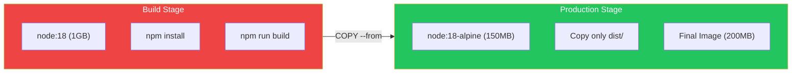

Multi-stage builds are a powerful Dockerfile feature that allows you to create lean production images by separating build-time dependencies from runtime requirements. This article shows you how to dramatically reduce image sizes while maintaining clean, maintainable Dockerfiles.

## The Problem with Single-Stage Builds

Traditional single-stage builds include everything in the final image:

```dockerfile
# Single-stage build - BAD
FROM node:18

WORKDIR /app
COPY package*.json ./
RUN npm install
COPY . .
RUN npm run build

# Final image includes:
# - Node.js runtime (~1GB)
# - All dev dependencies
# - Source code
# - Build tools
# Result: 1.5GB+ image
```

This approach results in:
- Large image sizes (GB instead of MB)
- Security risks from unnecessary tools
- Slower deployments
- Wasted storage and bandwidth

## Multi-Stage Build Basics

Multi-stage builds use multiple `FROM` statements, with each starting a new build stage:

```dockerfile
# Stage 1: Build
FROM node:18 AS builder
WORKDIR /app
COPY package*.json ./
RUN npm install
COPY . .
RUN npm run build

# Stage 2: Production
FROM node:18-alpine
WORKDIR /app
COPY --from=builder /app/dist ./dist
COPY --from=builder /app/node_modules ./node_modules
CMD ["node", "dist/server.js"]
```



## Key Concepts

### Named Stages

```dockerfile
# Name stages for clarity
FROM node:18 AS builder
# ...

FROM nginx:alpine AS production
COPY --from=builder /app/dist /usr/share/nginx/html
```

### Copying from Stages

```dockerfile
# Copy from named stage
COPY --from=builder /app/dist ./dist

# Copy from stage by index (0-based)
COPY --from=0 /app/dist ./dist

# Copy from external image
COPY --from=nginx:alpine /etc/nginx/nginx.conf /etc/nginx/
```

### Building Specific Stages

```bash
# Build only up to a specific stage
docker build --target builder -t myapp:builder .

# Useful for:
# - Testing build stage
# - Creating development images
# - CI/CD pipelines
```

## Practical Examples

### Node.js Application

```dockerfile
# Stage 1: Dependencies
FROM node:18-alpine AS deps
WORKDIR /app
COPY package*.json ./
RUN npm ci --only=production

# Stage 2: Build
FROM node:18-alpine AS builder
WORKDIR /app
COPY package*.json ./
RUN npm ci
COPY . .
RUN npm run build

# Stage 3: Production
FROM node:18-alpine AS production
WORKDIR /app

# Create non-root user
RUN addgroup -S nodejs && adduser -S nodejs -G nodejs

# Copy only what's needed
COPY --from=deps /app/node_modules ./node_modules
COPY --from=builder /app/dist ./dist
COPY --from=builder /app/package.json ./

USER nodejs
EXPOSE 3000
CMD ["node", "dist/server.js"]
```

### Go Application

Go is ideal for multi-stage builds - compile to a static binary:

```dockerfile
# Stage 1: Build
FROM golang:1.21-alpine AS builder
WORKDIR /app

# Download dependencies
COPY go.mod go.sum ./
RUN go mod download

# Build static binary
COPY . .
RUN CGO_ENABLED=0 GOOS=linux go build -a -installsuffix cgo -o main .

# Stage 2: Production (scratch = empty image)
FROM scratch
COPY --from=builder /app/main /main
COPY --from=builder /etc/ssl/certs/ca-certificates.crt /etc/ssl/certs/
ENTRYPOINT ["/main"]
```

Result: ~10MB image instead of ~1GB!

### Python Application

```dockerfile
# Stage 1: Build wheels
FROM python:3.11-slim AS builder
WORKDIR /app

RUN apt-get update && apt-get install -y --no-install-recommends \
    gcc \
    libpq-dev \
    && rm -rf /var/lib/apt/lists/*

COPY requirements.txt .
RUN pip wheel --no-cache-dir --wheel-dir /wheels -r requirements.txt

# Stage 2: Production
FROM python:3.11-slim AS production
WORKDIR /app

# Install only runtime dependencies
RUN apt-get update && apt-get install -y --no-install-recommends \
    libpq5 \
    && rm -rf /var/lib/apt/lists/*

# Copy pre-built wheels
COPY --from=builder /wheels /wheels
RUN pip install --no-cache-dir /wheels/*

# Copy application
COPY . .

RUN useradd --create-home appuser
USER appuser

EXPOSE 8000
CMD ["gunicorn", "--bind", "0.0.0.0:8000", "app:app"]
```

### React/Frontend Application

```dockerfile
# Stage 1: Build
FROM node:18-alpine AS builder
WORKDIR /app

COPY package*.json ./
RUN npm ci

COPY . .
RUN npm run build

# Stage 2: Serve with nginx
FROM nginx:alpine AS production

# Copy built assets
COPY --from=builder /app/build /usr/share/nginx/html

# Copy nginx configuration
COPY nginx.conf /etc/nginx/conf.d/default.conf

EXPOSE 80
CMD ["nginx", "-g", "daemon off;"]
```

Result: ~25MB image (nginx + static files) instead of ~1GB (node + node_modules)!

### Java/Spring Boot Application

```dockerfile
# Stage 1: Build with Maven
FROM maven:3.9-eclipse-temurin-17 AS builder
WORKDIR /app

# Cache dependencies
COPY pom.xml .
RUN mvn dependency:go-offline

# Build application
COPY src ./src
RUN mvn package -DskipTests

# Stage 2: Production
FROM eclipse-temurin:17-jre-alpine AS production
WORKDIR /app

# Copy only the JAR
COPY --from=builder /app/target/*.jar app.jar

RUN addgroup -S spring && adduser -S spring -G spring
USER spring

EXPOSE 8080
ENTRYPOINT ["java", "-jar", "app.jar"]
```

## Advanced Patterns

### Development vs Production

```dockerfile
# Base stage
FROM node:18-alpine AS base
WORKDIR /app
COPY package*.json ./

# Development stage
FROM base AS development
RUN npm install
COPY . .
CMD ["npm", "run", "dev"]

# Build stage
FROM base AS builder
RUN npm ci
COPY . .
RUN npm run build

# Production stage
FROM node:18-alpine AS production
WORKDIR /app
COPY --from=builder /app/dist ./dist
COPY --from=builder /app/node_modules ./node_modules
CMD ["node", "dist/server.js"]
```

```bash
# Build development image
docker build --target development -t myapp:dev .

# Build production image
docker build --target production -t myapp:prod .
```

### Testing Stage

```dockerfile
FROM node:18-alpine AS base
WORKDIR /app
COPY package*.json ./
RUN npm ci
COPY . .

FROM base AS test
RUN npm run test

FROM base AS builder
RUN npm run build

FROM node:18-alpine AS production
COPY --from=builder /app/dist ./dist
CMD ["node", "dist/server.js"]
```

```bash
# Run tests in CI
docker build --target test -t myapp:test .
docker run --rm myapp:test
```

### Parallel Builds

```dockerfile
# These stages can build in parallel
FROM node:18-alpine AS frontend-builder
WORKDIR /frontend
COPY frontend/package*.json ./
RUN npm ci
COPY frontend/ .
RUN npm run build

FROM golang:1.21-alpine AS backend-builder
WORKDIR /backend
COPY backend/go.* ./
RUN go mod download
COPY backend/ .
RUN go build -o server .

# Final stage combines both
FROM alpine:3.19 AS production
COPY --from=frontend-builder /frontend/dist /app/public
COPY --from=backend-builder /backend/server /app/server
CMD ["/app/server"]
```

## Size Comparison

| Application | Single-Stage | Multi-Stage | Reduction |
|-------------|-------------|-------------|-----------|
| Node.js API | 1.2 GB | 150 MB | 87% |
| Go API | 800 MB | 10 MB | 99% |
| React App | 1.1 GB | 25 MB | 98% |
| Python API | 900 MB | 200 MB | 78% |
| Java/Spring | 700 MB | 250 MB | 64% |

## Best Practices

### 1. Order Stages by Frequency of Change

```dockerfile
# Dependencies change less often - cached
FROM node:18-alpine AS deps
COPY package*.json ./
RUN npm ci

# Source code changes more often
FROM deps AS builder
COPY . .
RUN npm run build
```

### 2. Use Alpine or Distroless Base Images

```dockerfile
# Instead of
FROM node:18  # 1GB

# Use
FROM node:18-alpine  # 150MB

# Or for Go
FROM gcr.io/distroless/static  # 2MB
```

### 3. Don't Copy Unnecessary Files

```dockerfile
# Copy only what's needed
COPY --from=builder /app/dist ./dist
COPY --from=builder /app/package.json ./

# NOT everything
# COPY --from=builder /app .
```

### 4. Use .dockerignore

```
# .dockerignore
node_modules
npm-debug.log
.git
.gitignore
README.md
.env
coverage/
.nyc_output/
```

### 5. Leverage Build Cache

```dockerfile
# Copy dependency files first
COPY package*.json ./
RUN npm ci

# Then copy source (cache broken here if deps unchanged)
COPY . .
RUN npm run build
```

## Docker Compose Integration

```yaml
services:
  app:
    build:
      context: .
      target: production  # Specify target stage

  app-dev:
    build:
      context: .
      target: development
    volumes:
      - .:/app
    command: npm run dev
```

## Summary

| Concept | Description |
|---------|-------------|
| Multi-stage | Multiple FROM statements in one Dockerfile |
| Named stages | `AS stagename` for clarity |
| COPY --from | Copy files from previous stages |
| --target | Build specific stage only |
| Build cache | Order stages by change frequency |

## Key Takeaways

1. **Separate build and runtime** - Don't ship build tools
2. **Use minimal base images** - Alpine, distroless, or scratch
3. **Copy only artifacts** - Not source code or dev dependencies
4. **Name your stages** - Makes Dockerfiles readable
5. **Leverage caching** - Order by change frequency
6. **Test in CI** - Use `--target test` stage

## Next Steps

In the next article, we'll explore more Docker image optimization techniques beyond multi-stage builds.

## References

- Docker Deep Dive, 5th Edition - Nigel Poulton
- Docker in Action, 2nd Edition - Jeffrey Nickoloff
- [Docker Multi-stage Builds](https://docs.docker.com/build/building/multi-stage/)
